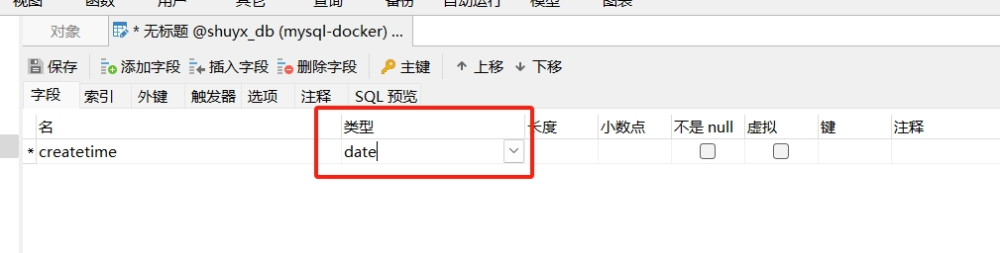
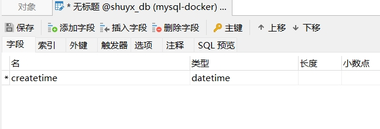
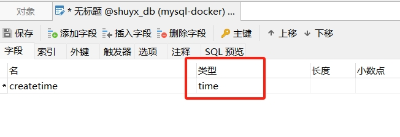
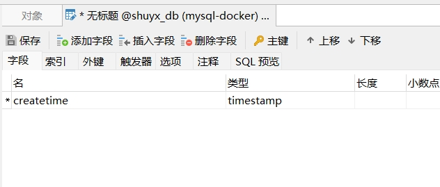

[toc]

# Java与Mysql中的时间类型对应

## Mysql中的时间类型

- date：用于存储日期值（年、月、日），格式为'YYYY-MM-DD'。
- datetime：用于同时存储日期和时间值，格式为'YYYY-MM-DD HH:MM:SS'。
- time：用于存储时间值（小时、分钟、秒），格式为'HH:MM:SS'。
- timestamp：用于同时存储日期和时间值，格式为'YYYY-MM-DD HH:MM:SS'。但比datetime类型支持更广泛的时间范围。例如支持时区。

> date 类型



date 是一种日期类型的数据类型。它采用格式为 'YYYY-MM-DD' 的字符串表示方式。其中 YYYY 表示四位数的年份，MM 表示两位数的月份，DD 表示两位数的日期。

注意：插入日期时，必须使用正确的格式。并且该日期必须是有效的。否则，将会抛出错误或者导致不可预期的结果。另外date类型的有效值从'1000-01-01' 到 '9999-12-31'。

> datetime 类型



datetime 类型是一种日期时间类型的数据类型，用于同时存储日期和时间值。

它采用格式为 'YYYY-MM-DD HH:MM:SS' 的字符串表示方式，其中 YYYY 表示四位数的年份，MM 表示两位数的月份，DD 表示两位数的日期，HH 表示小时，MM 表示分钟，SS 表示秒。

datetime 类型的有效期：1000-01-01 00:00:00' 到 '9999-12-31 23:59:59

> time类型



time 是一种时间类型的数据类型，用于存储时间值（小时、分钟、秒）。

它采用格式为 'HH:MM:SS' 的字符串表示方式，其中 HH 表示两位数的小时，MM 表示两位数的分钟，SS 表示两位数的秒。

> timestamp 类型



timestamp 是一种日期时间类型的数据类型，用于存储日期和时间值。

它采用格式为 'YYYY-MM-DD HH:MM:SS' 的字符串表示方式，其中 YYYY 表示四位数的年份，MM 表示两位数的月份，DD 表示两位数的日期，HH 表示小时，MM 表示分钟，SS 表示秒。

另外 timestamp 数据类型还支持自动更新功能，可以在插入或更新记录时自动设置为当前时间戳。


## Java中的时间类型

在 Java 中，可以使用不同的类来映射数据库中的日期时间类型。以下是一些常见的数据类型和它们对应的 Java 类型：

- mysql数据库：date类型  =》 对应 java中的 java.util.Date;
- mysql数据库：time类型  =》 对应 java中的 java.sql.Time;
- mysql数据库：datetime类型  =》 对应 java中的 java.util.Date;


## 后端Date类型返回给前端变为时间戳的解决方法

当java实体类中有一个birthday属性是java.util.Date类型的时候。

前端发送"YYYY-MM-DD"格式的日期字符串，是可以被birthday属性接收的。并且数据库中存储的值也是"YYYY-MM-DD"格式的日期。

但是后端返回给前端数据的时候，"YYYY-MM-DD"格式的birthday属性值会变成'YYYY-MM-DD HH:MM:SS'格式的字符串。

> 解决方法

给该属性加上@JsonFormat注解。并设置格式为"yyyy-MM-dd"。

这时后端传输给前端的时候，生日会直接变成yyyy-MM-dd这种格式

```java
import java.util.Date;
import com.fasterxml.jackson.annotation.JsonFormat;

public class UserEntity implements Serializable {
    private static final long serialVersionUID = 1L;
    //....
    @JsonFormat(pattern = "yyyy-MM-dd")
    private Date birthday;                //生日
}
```

## 后端拿到的时间数据和数据库中的时间数据相差8个小时

后端返回的时间数据和数据库中的时间数据相差8个小时的原因有几个。
1. 默认使用 UTC 时区。Java 中的日期和时间默认使用 UTC（协调世界时）进行存储和处理。
2. Spring Jackson 序列化和反序列化时区问题。Spring 在将日期和时间转换为 JSON 或从 JSON 转换回来时，默认使用的时区可能与你期望的时不匹配。

> 解决方案：配置 Spring 使用正确的时区

添加如下配置，告诉 Spring 在序列化或反序列化日期和时间时始终使用 GMT+8 时区。

```
spring:
  jackson:
    time-zone: GMT+8
```