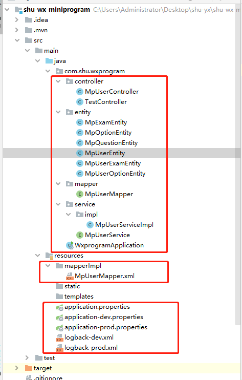

[toc]

### 1. SpringBoot中日志的使用？

市面上常见的日志框架有很多，比如：JCL、SLF4J、Jboss-logging、jUL、log4j、log4j2、logback等等。

<font color="red">通常情况下，日志是由一个抽象层 + 实现层的组合来搭建的。这样可以方便随时替换不同的实现层日志框架，而不影响项目整体代码的改动。</font>

<font color="blue">并且开发的时候，日志记录方法的调用，不应该来直接调用日志的实现类，而是调用日志抽象层里面的方法。这样可以实现业务代码与日志实现层的解耦</font>


|  抽象层   | 实现层  |
|  ----  | ----  |
| JCL、SLF4J、jboss-logging  | jul、log4j、log4j2、logback |


**SpringBoot选择的是SLF4J+Logback的组合。由于Hibernate Mybatis这些框架有自己的日志框架使用。所有我们需要统一进行日志管理。即排除掉其他日志框架，只使用SLF4J+Logback的组合。**

重点👇(在springboot中)

1. 配置文件只需要配置实现层日志框架,即logback的配置,抽象层不需要配置。
2. 与上述相反 , 在调用API时,调用的则是抽象层slf4j的API。


#### 1.Springboot统一日志管理

统一日志管理只使用SLF4J+Logback日志组合,排除到其他日志框架。

```xml
<!--spring框架使用的是commons-logging-->
<dependency>
    <groupId>org.springframework</groupId>
    <artifactId>spring-core</artifactId>
    <exclusions>
        <exclusion>
            <groupId>commons-logging</groupId>
            <artifactId>commons-logging</artifactId>
        </exclusion>
    </exclusions>
</dependency>
```

<font color="red">PS:SpringBoot自带的spring-boot-starter-web,spring-boot-starter-test这两个依赖，包含了SLF4J和Logback依赖包。无需额外导入</font>


#### 2.日志默认配置-在application.properties中配置

日志输出格式：
```js
%d表示日期时间，
%thread表示线程名，
%-5level：级别从左显示5个字符宽度
%logger{50} 表示logger名字最长50个字符，否则按照句点分割。
%msg：日志消息，
%n是换行符

//标准日志输出格式
%d{yyyy-MM-dd HH:mm:ss.SSS} [%thread] %-5level %logger{50} - %msg%n
```

SpringBoot修改日志的默认配置

1. `logging.file.name` 和 `logging.file.path`不能同时生效,二者只可以存在一个。
2. `logging.file.name` 可以指定路径和log文件的名字
3. `logging.file.path` 只可以只当log的路径, 不能指定log的名字, 文件名称默认为spring.log

```properties
# 默认在当前项目下生成springboot.log日志
# 指定日志文件的完整的路径；
logging.file.name=C:\Users\Administrator\Desktop\springboot.log

# 在当前磁盘的根路径下创建spring文件夹和里面的log文件夹；使用 spring.log 作为默认文件
logging.file.path=/spring/log

# 在控制台输出的日志的格式
logging.pattern.console=%d{yyyy-MM-dd HH:mm:ss} [%thread] %-5level %logger{100} - %msg%n

# 在文件中日志输出的格式
logging.pattern.file=%d{yyyy-MM-dd HH:mm:ss} === [%thread] === %-5level === %logger{100} ==== %msg%n
```


#### 3.自定义配置logback日志

SpringBoot默认的配置文件是application.properties文件。你可以自定义配置文件。

```properties
# 自定义配置文件位置
logging.config = classpath:logback-spring.xml
```

在resource目录下创建一个logback-spring.xml文件。
```xml
<?xml version="1.0" encoding="UTF-8"?>
<configuration debug="false">
    <!--自定义logback配置文件-->

    <!--控制台日志-->
    <appender name="STDOUT" class="ch.qos.logback.core.ConsoleAppender">
        <!--打印格式-->
        <encoder class="ch.qos.logback.classic.encoder.PatternLayoutEncoder">
            <pattern>%d{yyyy-MM-dd HH:mm:ss.SSS} [%thread] %-5level %logger{100} - %msg%n</pattern>
        </encoder>
    </appender>

    <!--文件日志-->
    <appender name="FILE" class="ch.qos.logback.core.rolling.RollingFileAppender">
        <!--按分钟输出日志文件-->
        <rollingPolicy class="ch.qos.logback.core.rolling.TimeBasedRollingPolicy">
            <FileNamePattern>C:\\Users\\Administrator\\Desktop\\TestWeb.log.%d{yyyy-MM-dd-HH-mm}.log</FileNamePattern>
        </rollingPolicy>
        <!--打印格式-->
        <encoder class="ch.qos.logback.classic.encoder.PatternLayoutEncoder">
            <pattern>%d{yyyy-MM-dd HH:mm:ss.SSS} [%thread] %-5level %logger{100} - %msg%n</pattern>
        </encoder>
    </appender>


    <!-- 日志输出级别 TRACE < DEBUG < INFO < WARN < ERROR < FATA-->
    <root level="INFO">
        <!--加载配置项-->
        <appender-ref ref="STDOUT" />
        <appender-ref ref="FILE"/>
    </root>
</configuration>
```

#### 4.使用日志

```java
import org.slf4j.Logger;
import org.slf4j.LoggerFactory;
import org.springframework.web.bind.annotation.RequestMapping;
import org.springframework.web.bind.annotation.RestController;

@RestController
@RequestMapping("test")
public class testController {
    //创建日志类
    private static final Logger logger = LoggerFactory.getLogger(testController.class);

    @RequestMapping("/demo1")
    public String test(){
        System.out.println("测试成功");
        //输出日志
        logger.info("这是在方法里边");
        return "Test is success !!!";
    }
}
```


### 2. SpringBoot与Mybtis的整合

#### 1. 依赖导入和配置

pom.xml
```xml
<dependency>
    <groupId>org.mybatis.spring.boot</groupId>
    <artifactId>mybatis-spring-boot-starter</artifactId>
    <version>2.1.4</version>
</dependency>
<dependency>
    <groupId>mysql</groupId>
    <artifactId>mysql-connector-java</artifactId>
</dependency>
```

application.properties

```properties
#数据库配置
spring.datasource.driver-class-name=com.mysql.cj.jdbc.Driver
spring.datasource.url=jdbc:mysql://localhost:3306/shu_wx_miniprogram?useUnicode=true&characterEncoding=utf-8&useSSL=true&serverTimezone=UTC
spring.datasource.username=root
spring.datasource.password=root

# mybatis配置
# 指定mapper映射文件位置
mybatis.mapper-locations=classpath:mapperImpl/*.xml
```

#### 2.创建entity,mapper,service,controller层



1. 创建实体类

MpUserEntity.java
```java
public class MpUserEntity implements Serializable {
    //实现serializable接口。
    private static final long serialVersionUID = 1L;

    //用户id
    private Integer id;
    //微信昵称
    private String name;
    //电话
    private String phone;
    //密码
    private String password;
    //头像
    private String headUrl;
    //年龄
    private Integer age;
    //性别
    private Integer gender;
    //住址
    private String address;
    //邮箱
    private String email;
    //登录次数
    private Integer loginCount;
    //最后登录时间
    private Date lastLoginTime;
    //是否是管理员 1是 0不是
    private Integer isAdmin;
    //微信小程序的openid
    private String openId;
    //微信小程序的unionId
    private String unionId;

    public Integer getId() {
        return id;
    }

    ...

}

```

2. 创建mapper层

**创建mapper映射类 MpUserMapper.java，若想该接口被springboot管理，则需要在工程启动类中添加@MaperScan注解。**

工程启动类
```java
@SpringBootApplication
@MapperScan("com.shu.wxprogram.mapper")
// com.shu.wxprogram.mapper 为mapper类所在位置
public class WxprogramApplication {

    public static void main(String[] args) {
        SpringApplication.run(WxprogramApplication.class, args);
    }
}
```

```java
@Repository
public interface MpUserMapper {
    //查询全部
    public List<MpUserEntity> findAll();
    //查询
    public MpUserEntity findOne(Integer id);
    //添加数据
    public Integer addMpUser(MpUserEntity entity);
    //删除数据
    public Integer deleteMpUser(Integer id);
    //修改数据
    public Integer upDateMpUser(MpUserEntity entity);
}
```

**对于IDEA系列编辑器，XML文件是不能放在java文件夹中的，IDEA默认不会编译源码文件夹中的XML文件，可以将配置文件放在resource文件夹中。**

**在resources目录下新建mapperImpl目录，该文件存放建mapper映射文件。并且配置一处地方，让该映射文件被springboot管理。**

application.properties
```properties
# 指定mapper映射文件位置
mybatis.mapper-locations=classpath:mapperImpl/*.xml
```

MpUserMapper.xml
```xml
<?xml version="1.0" encoding="UTF-8" ?>
<!DOCTYPE mapper
        PUBLIC "-//mybatis.org//DTD Mapper 3.0//EN"
        "http://mybatis.org/dtd/mybatis-3-mapper.dtd">
<mapper namespace="com.shu.wxprogram.mapper.MpUserMapper">
    <!--类与表的映射1-->
    <resultMap type="com.shu.wxprogram.entity.MpUserEntity" id="oneResultMap">
        <!-- id 标签指的是该列为主键列，result标签代表普通列-->
        <id property="id" column="id"/>
        <result property="name" column="name"/>
        <result property="phone" column="phone"/>
        <result property="password" column="password"/>
        <result property="headUrl" column="head_url"/>
        <result property="age" column="age"/>
        <result property="gender" column="gender"/>
        <result property="address" column="address"/>
        <result property="email" column="email"/>
        <result property="loginCount" column="login_count"/>
        <result property="lastLoginTime" column="last_login_time"/>
        <result property="isAdmin" column="is_admin"/>
        <result property="openId" column="wx_openid"/>
        <result property="unionId" column="wx_unionid"/>
    </resultMap>

    <select id="findAll" resultMap="oneResultMap">
        select * from mp_user
    </select>

    <select id="findOne" resultMap="oneResultMap">
        select * from mp_user where id = #{id}
    </select>

    <!--动态插入数据-->
    <insert id="addMpUser" parameterType="com.shu.wxprogram.entity.MpUserEntity">
        insert into mp_user
        <trim prefix="(" suffix=")" suffixOverrides="," >
            <if test='name != null'>name,</if>
            <if test='phone != null'>phone,</if>
            <if test='password != null'>password,</if>
            <if test='headUrl != null'>headUrl,</if>
            <if test='age != null'>age,</if>
            <if test='gender != null'>gender,</if>
            <if test='address != null'>address,</if>
            <if test='email != null'>email,</if>
            <if test='loginCount != null'>loginCount,</if>
            <if test='lastLoginTime != null'>lastLoginTime,</if>
            <if test='isAdmin != null'>isAdmin,</if>
            <if test='openId != null'>openId,</if>
            <if test='unionId != null'>unionId,</if>
        </trim>
        <trim prefix="values (" suffix=")" suffixOverrides="," >
            <if test='name != null'>#{name},</if>
            <if test='phone != null'>#{phone},</if>
            <if test='password != null'>#{password},</if>
            <if test='headUrl != null'>#{headUrl},</if>
            <if test='age != null'>#{age},</if>
            <if test='gender != null'>#{gender},</if>
            <if test='address != null'>#{address},</if>
            <if test='email != null'>#{email},</if>
            <if test='loginCount != null'>#{loginCount},</if>
            <if test='lastLoginTime != null'>#{lastLoginTime},</if>
            <if test='isAdmin != null'>#{isAdmin},</if>
            <if test='openId != null'>#{openId},</if>
            <if test='unionId != null'>#{unionId},</if>
        </trim>
    </insert>
</mapper>

```

3. service层

创建MpUserService接口及其实现类

MpUserService.java
```java
public interface MpUserService {
    //查询全部
    public List<MpUserEntity> findAll();
    //查询
    public MpUserEntity findOne(Integer id);
    //添加数据
    public Integer addMpUser(MpUserEntity entity);
    //删除数据
    public Integer deleteMpUser(Integer id);
    //修改数据
    public Integer upDateMpUser(MpUserEntity entity);
}
```

MpUserServiceImpl.java
```java
@Service
public class MpUserServiceImpl implements MpUserService {
    @Autowired
    private MpUserMapper mapper;

    @Override
    public List<MpUserEntity> findAll() {
        return mapper.findAll();
    }

    @Override
    public MpUserEntity findOne(Integer id) {
        return mapper.findOne(id);
    }

    @Override
    public Integer addMpUser(MpUserEntity entity) {
        return mapper.addMpUser(entity);
    }

    @Override
    public Integer deleteMpUser(Integer id) {
        return mapper.deleteMpUser(id);
    }

    @Override
    public Integer upDateMpUser(MpUserEntity entity) {
        return mapper.upDateMpUser(entity);
    }
}
```

4. controller层

MpUserController.java
```java
@RestController
@RequestMapping("/mpUser")
public class MpUserController {
    //日志
    private static final Logger logger = LoggerFactory.getLogger(MpUserController.class);

    @Autowired
    private MpUserService mpUserService;

    @GetMapping("/find/{id}")
    public void find(@PathVariable("id") Integer id){
        logger.info("id="+id);
        MpUserEntity one = mpUserService.findOne(id);
        System.out.println("one = "+one.toString());
    }
}

```

<h3>运行工程，并且使用postman调接口测试</h3>


### 3. SpringBoot配置自定义拦截器

> 1.编写自定义拦截器

```java
/**
 * 自定义拦截器
 */
public class MyInterceptor implements HandlerInterceptor {
    //log
    private static final Logger logger = LoggerFactory.getLogger(MyInterceptor.class);

    /**
     * 拦截器 在控制器执行之前执行 （Controller方法调用之前）
     * @param request
     * @param response
     * @param handler
     * @return
     * @throws Exception
     */
    @Override
    public boolean preHandle(HttpServletRequest request, HttpServletResponse response, Object handler) throws Exception {
        //拦截代码
        return true;
    }

    /**
     * 拦截器 在控制器执行之后执行 （Controller方法调用之后）
     * @param request
     * @param response
     * @param handler
     * @param modelAndView
     * @throws Exception
     */
    @Override
    public void postHandle(HttpServletRequest request, HttpServletResponse response, Object handler, ModelAndView modelAndView) throws Exception {
    }

    /**
     * 最后执行 在请求结束之后、也就是视图被渲染之后进行调用（主要是用于进行资源清理工作）
     * @param request
     * @param response
     * @param handler
     * @param ex
     * @throws Exception
     */
    @Override
    public void afterCompletion(HttpServletRequest request, HttpServletResponse response, Object handler, Exception ex) throws Exception {
    }

}
```

> 2.编写拦截器配置类

```java
/**
 * 拦截器配置注册
 */
@Configuration
public class InterceptorConfig implements WebMvcConfigurer {

    /**
     * @Function: 将自定义拦截器注册到配置中，并附带拦截规则
     * @author: YangXueFeng
     * @Date: 2019/4/14 13:10
     */
    public void addInterceptors(InterceptorRegistry registry){
        registry.addInterceptor(
                //拦截规则
                new MyInterceptor()).addPathPatterns("/**")
                //排除规则
                .excludePathPatterns("/login","/register","/static");
    }
}
```

> 3.以上就完成了自定义拦截器实现


### 4. SpringBoot配置自定义异常

> 1.编写自定义异常类

```java
/**
 * 自定义异常
 */
public class MyException extends RuntimeException {

    private int code;  //状态码
    private String message;  //异常信息

    public MyException() {}

    public MyException(int code, String message) {
        this.code = code;
        this.message = message;
    }

    public int getCode() {
        return code;
    }

    @Override
    public String getMessage() {
        return message;
    }
}
```

> 2.编写异常处理器

```java
/**
 * 自定义异常处理类
 * 用于统一管理,处理自定义异常
 */
@ControllerAdvice
public class MyExceptionHandler {
    //日志
    private static final Logger logger = LoggerFactory.getLogger(MyExceptionHandler.class);

    /**
     * 自定义异常发生时，
     * 调用该方法，处理并返回异常信息
     * @param e
     * @return
     */
    @ExceptionHandler(value = MyException.class)
    @ResponseBody
    public Object exceptionHandler(MyException e) {
        logger.error("MyExceptionHandler code:{}, message:{}",e.getCode(),e.getMessage());
        return new ReturnUtil().fail(e.getCode(),e.getMessage());
    }
}
```

### 4. SpringBoot创建统一结果对象

统一结果对象用于统一处理接口返回结果。包含两个部分，结果编码枚举类，结果工具类。

结果编码枚举类：对异常和错误进行统一描述。

结果工具类：对接口响应的数据进行统一管理。


结果编码枚举类
```java
/**
 * 结果代码枚举类
 */
public enum ResultCodeEnum {
    /* 成功状态码 */
    HTTP_REQUEST_SUCCESS(200, "请求成功"),
    /* 失败状态码 */
    HTTP_REQUEST_ERROR(500, "请求错误"),

    /* 参数错误：10001-19999 */
    PARAM_IS_INVALID(10001, "参数无效"),
    PARAM_IS_BLANK(10002, "参数为空"),
    PARAM_IS_MISS(10003, "参数缺失"),

    /* 用户错误：20001-29999*/
    USER_NOT_LOGIN(20001, "用户未登录"),
    USER_LOGIN_ERROR(20002, "用户登录失败，账号不存在或密码错误"),
    USER_REGISTER_ERROR(20003, "用户注册失败"),
    USER_ACCOUNT_FORBIDDEN(20004, "账号已被禁用"),
    USER_NOT_EXIST(20005, "用户不存在"),

    /* token错误：30001-39999 */
    TOKEN_IS_ERROR(30001, "token错误"),

    /* 系统错误：40001-49999 */
    SYSTEM_INNER_ERROR(40001, "系统繁忙，请稍后重试"),

    /* 数据错误：50001-599999 */
    DATA_IS_MISS(50001, "数据缺失"),
    DATA_IS_WRONG(50002, "数据有误"),
    DATA_IS_EXISTED(50003, "数据已存在"),

    /* 接口错误：60001-69999 */
    INTERFACE_INNER_INVOKE_ERROR(60001, "内部系统接口调用异常"),
    INTERFACE_OUTTER_INVOKE_ERROR(60002, "外部系统接口调用异常"),
    INTERFACE_FORBID_VISIT(60003, "该接口禁止访问"),
    INTERFACE_ADDRESS_INVALID(60004, "接口地址无效"),
    INTERFACE_REQUEST_TIMEOUT(60005, "接口请求超时"),
    INTERFACE_EXCEED_LOAD(60006, "接口负载过高"),

    /* 权限错误：70001-79999 */
    PERMISSION_NO_ACCESS(70001, "无访问权限"),

    /*业务错误：80001-89999*/
    BUSINESS_IS_WRONG(80001,"该业务功能出现问题");

    private int code;
    private String message;

    private ResultCodeEnum() {}
    private ResultCodeEnum(int code, String message) {
        this.code = code;
        this.message = message;
    }

    public int getCode() {
        return code;
    }
    public String getMessage() {
        return message;
    }

}
```

结果工具类
```java

/**
 * 统一结果对象工具类
 * @param
 */
public class ReturnUtil {
    //成功
    public static String success(){
        JSONObject json = new JSONObject();
        json.put("message",ResultCodeEnum.HTTP_REQUEST_SUCCESS.getMessage());
        json.put("code",ResultCodeEnum.HTTP_REQUEST_SUCCESS.getCode());
        return json.toString();
    }

    //成功，JSONObject数据
    public static String success(JSONObject json){
        JSONObject jsonObject = new JSONObject();
        jsonObject.put("data",json);
        jsonObject.put("message",ResultCodeEnum.HTTP_REQUEST_SUCCESS.getMessage());
        jsonObject.put("code",ResultCodeEnum.HTTP_REQUEST_SUCCESS.getCode());
        return jsonObject.toString();
    }

    //成功，JSONArray数据
    public static String success(JSONArray jsonArray){
        JSONObject json = new JSONObject();
        json.put("data",jsonArray);
        json.put("message",ResultCodeEnum.HTTP_REQUEST_SUCCESS.getMessage());
        json.put("code",ResultCodeEnum.HTTP_REQUEST_SUCCESS.getCode());
        return json.toString();
    }

    //失败
    public static String fail(){
        JSONObject json = new JSONObject();
        json.put("message",ResultCodeEnum.HTTP_REQUEST_ERROR.getMessage());
        json.put("code",ResultCodeEnum.HTTP_REQUEST_ERROR.getCode());
        return json.toString();
    }

    //失败
    public static String fail(int code,String message){
        JSONObject json = new JSONObject();
        json.put("message",message);
        json.put("code",code);
        return json.toString();
    }
}
```