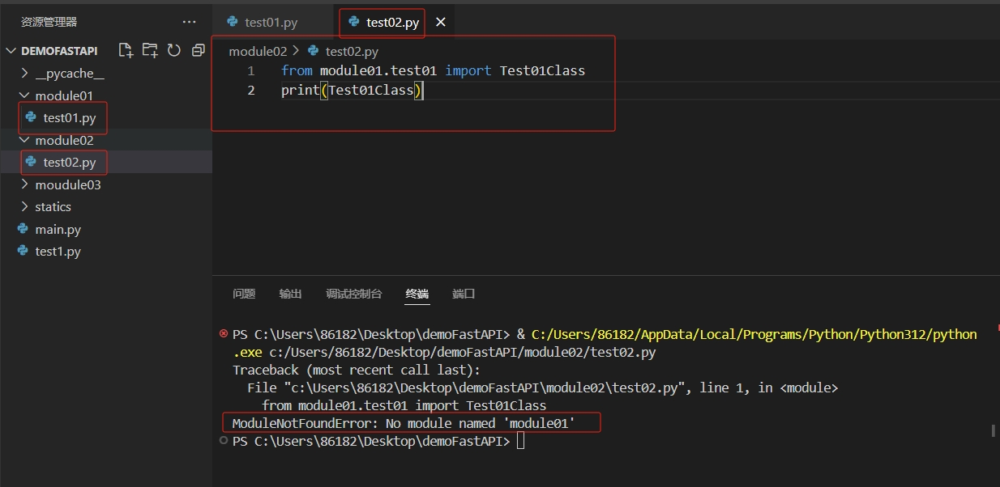
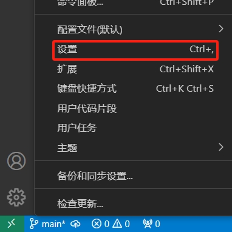
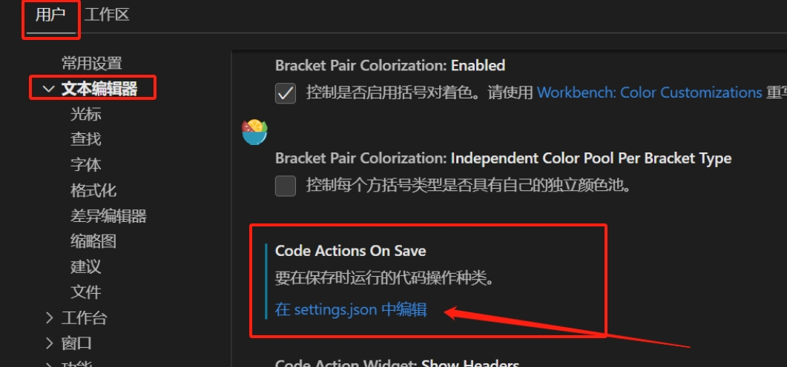

[toc]

# vscode导包报错显示："ModuleNotFoundError: No module xxx"

当我用python写工程中的一处代码之后。运行的时候总是提示
`ModuleNotFoundError: No module named xxx`

## 问题描述

当时的工程目录结构如下所示
```
project
|----module01
|------test01.py
|----module02
|------test02.py
```

test02.py的代码如下：

```py
# 导入test01.py中的 Test01Class 类
from module01.test01 import Test01Class
# 打印Test01Class 类信息
print(Test01Class)
```

问题描述： 如果在test02.py中导入test01.py中的类或方法或变量。那么vscode会提示找不到模块module01。但是实际上是存在模块module01的。

问题截图如下



## 问题分析

终端报错：ModuleNotFoundError: No module named xxx。

是因为vscode是通过python解释器来运行代码的。就算vscode能找到本地其他文件，但是python解释器没有找到本地其他文件。

在test02.py文件中打印python解释器的搜索路径。

```py
import sys
# 查看环境变量
for a_path in sys.path:
    print(a_path)

# 打印结果如下：
c:\Users\86182\Desktop\project\module02
C:\Users\86182\AppData\Local\Programs\Python\Python312\python312.zip
C:\Users\86182\AppData\Local\Programs\Python\Python312\DLLs
C:\Users\86182\AppData\Local\Programs\Python\Python312\Lib
C:\Users\86182\AppData\Local\Programs\Python\Python312
C:\Users\86182\AppData\Local\Programs\Python\Python312\Lib\site-packages

```

可以发现python解释器找不到 project/module01/test01.py文件。因此python解释器才会报ModuleNotFoundError: No module named xxx。错误


## 解决方法

在vscode的setting.json里面设置自动将pyton工程的根目录添加到环境变量。从而让python解释器能找到该工程下的所有文件。

1. 点击左下角齿轮，打开设置。



2. 编辑setting.json



添加一行代码
```js
"terminal.integrated.env.windows": {
    "PYTHONPATH": "${workspaceFolder};${env:PYTHONPATH}"
},
```

表示把当前工程的根目录路径，也添加到python解释器的路径。

之后再次执行test02.py文件的代码。你会发现python解释器的路径多了一条当前工程的根路径。

```py
import sys
# 查看环境变量
for a_path in sys.path:
    print(a_path)

# 打印结果如下：
c:\Users\86182\Desktop\project\module02
# 这一条是新增的，是当前工程的根路径
C:\Users\86182\Desktop\project
C:\Users\86182\AppData\Local\Programs\Python\Python312\python312.zip
C:\Users\86182\AppData\Local\Programs\Python\Python312\DLLs
C:\Users\86182\AppData\Local\Programs\Python\Python312\Lib
C:\Users\86182\AppData\Local\Programs\Python\Python312
C:\Users\86182\AppData\Local\Programs\Python\Python312\Lib\site-packages
```


## 总结

对于这种问题，可能会发生在python中，也有可能会发生在js中。因为这两种都是解释型语言。


