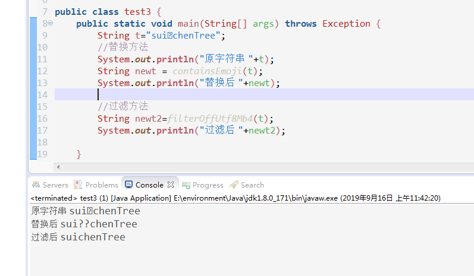
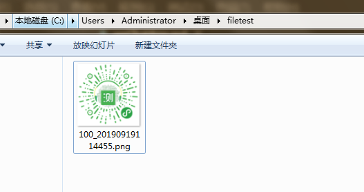

# 微信小程序相关的业务问题

## 1. java对于微信昵称中的特殊字符(emoji符号等)的处理

现在，许多微信用户的昵称有特殊符号。例如emoji表情符号等。若想把微信昵称存储在数据库中。大致有两种方法。一是修改数据库配置，使其能够存储特殊字符。二是对微信昵称进行处理后，再存储在数据库中。

> 方法1.对数据库配置进行修改

大多数特殊字符都是4 字节长度的 UTF-8 字符。要在 Mysql 中保存 4 字节长度的 UTF-8 字符，需要使用 utf8mb4 字符集，但只有 5.5.3 版本以后的才支持。

1. 修改database,table,column字符集。设置为utf8mb4_unicode_ci
2. 修改mysql配置文件my.cnf（window为my.ini）

```
[client]
default-character-set = utf8mb4
[mysql]
default-character-set = utf8mb4
[mysqld]
character-set-client-handshake = FALSE
character-set-server = utf8mb4
collation-server = utf8mb4_unicode_ci
init_connect=‘SET NAMES utf8mb4‘
```
3. 确保mysql connection版本高于5.1.13
4. 修改项目的数据库配置文件


> 方法2.若数据库版本过低，则以代码的形式处理特殊字符

```java
public class test3 {
	public static void main(String[] args) throws Exception {
		String t="sui😄chenTree";
        //替换方法
		System.out.println("原字符串 "+t);
		String newt = containsEmoji(t);
		System.out.println("替换后 "+newt);
		
        //过滤方法
        String newt2=filterOffUtf8Mb4(t);
        System.out.println("过滤后 "+newt2);

	}
	
	/**
     * 过滤掉超过3个字节的UTF8字符（特殊符号占用的字节超过3个）
     * @param text
     * @return
     * @throws UnsupportedEncodingException
     */
    public static String filterOffUtf8Mb4(String text) throws UnsupportedEncodingException {
	    if(text!=null&&!(text.equals(""))){
	    	 byte[] bytes = text.getBytes("utf-8");
	         ByteBuffer buffer = ByteBuffer.allocate(bytes.length);
	         int i = 0;
	         while (i < bytes.length) {
	             short b = bytes[i];
	             if (b > 0) {
	                 buffer.put(bytes[i++]);
	                 continue;
	             }
	             b += 256; // 去掉符号位
	             if (((b >> 5) ^ 0x6) == 0) {
	                 buffer.put(bytes, i, 2);
	                 i += 2;
	             } else if (((b >> 4) ^ 0xE) == 0) {
	                 buffer.put(bytes, i, 3);
	                 i += 3;
	             } else if (((b >> 3) ^ 0x1E) == 0) {
	                 i += 4;
	             } else if (((b >> 2) ^ 0x3E) == 0) {
	                 i += 5;
	             } else if (((b >> 1) ^ 0x7E) == 0) {
	                 i += 6;
	             } else {
	                 buffer.put(bytes[i++]);
	             }
	         }
	         buffer.flip();
	         return new String(buffer.array(), "utf-8");
	    }else{
	    	return "";
	    }
    }
	
    /**
     * 检测字符串是否有emoji字符,有就用？替换。
     */
    public static String containsEmoji(String text) {
    	StringBuilder sBuilder=new StringBuilder(text);
    	for(int i=0;i<sBuilder.length();i++){
    		if(!notisEmojiCharacter(sBuilder.charAt(i))){
    			sBuilder.setCharAt(i,'?');
    		}
    	}
    	return sBuilder.toString();
    }
    
    /**
     * 非emoji表情字符判断,true表示不是特殊字符。false表示是特殊字符
     * @param codePoint
     * @return
     */
    public static boolean notisEmojiCharacter(char codePoint) {
        return (codePoint == 0x0) || 
                (codePoint == 0x9) ||                            
                (codePoint == 0xA) ||
                (codePoint == 0xD) ||
                ((codePoint >= 0x20) && (codePoint <= 0xD7FF)) ||
                ((codePoint >= 0xE000) && (codePoint <= 0xFFFD)) ||
                ((codePoint >= 0x10000) && (codePoint <= 0x10FFFF));
    }
}


```



---

## 2.轻量级工具包emoji-java处理emoji表情字符

轻量级工具包emoji-java的github地址:https://github.com/vdurmont/emoji-java

1. 导入依赖

```
<dependency>
  <groupId>com.vdurmont</groupId>
  <artifactId>emoji-java</artifactId>
  <version>5.1.1</version>
</dependency>
```

2. 把emoji表情转换成对应别名字符

>EmojiParser.parseToAliases(str);  //将字符串中的emoji表情转换为特定的字符。不影响非emoji表情字符。

```java
public static void main(String[] args) throws Exception {
		    String str="sui😄chenTree";
	        System.out.println("转换前："+str);
	        System.out.println("转换后："+EmojiParser.parseToAliases(str));
}
```

运行结果：
```
转换前：sui😄chenTree
转换后：sui:smile:chenTree
```

3. 把emoji表情转换成对应html格式字符

>EmojiParser.parseToHtmlDecimal(str)； 直接转换
EmojiParser.parseToHtmlHexadecimal(str); 直接转换（十六进制）

```java
public static void main(String[] args) throws Exception {
		    String str="sui😄chenTree";
	        System.out.println("转换前："+str);
	        System.out.println("把emoji表情转换为html字符：");
	        System.out.println(EmojiParser.parseToHtmlDecimal(str));
	        System.out.println("把emoji表情转换为html字符(16进制)：");
	        System.out.println(EmojiParser.parseToHtmlHexadecimal(str));
	
}
```

运行结果：
```
转换前：sui😄chenTree
把emoji表情转换为html字符：
sui&#128516;chenTree
把emoji表情转换为html字符(16进制)：
sui&#x1f604;chenTree
```

4. 把转换后的emoji表情还原

>EmojiParser.parseToUnicode(str); //把字符串还原为Unicode编码格式

```java
public static void main(String[] args) throws Exception {
		    String str="sui😄chenTree";
		    System.out.println("转换：");
	        String s = EmojiParser.parseToHtmlDecimal(str);
	        System.out.println(s);
	        System.out.println("还原：");
	        System.out.println(EmojiParser.parseToUnicode(s));
}
```

运行结果
```
转换：
sui&#128516;chenTree
还原：
sui😄chenTree
```

---

## 3.创建微信小程序码,并在其中添加自定义数据。

PS：创建的微信小程序码图片的文件名是“用户的userId+时间撮”。(例如：100_20190919111825.png)

流程：
1. 用小程序的appid和secret。调微信接口换取小程序accesstoken
2. 用小程序accesstoken。调微信接口换取小程序码图片数据。
3. 查询文件下载地址是否存在相同前缀的图片。有则删除。

```java
public class filetest {

	public static void main(String[] args) {
		createQRcodeImg(100,"1111111");
	}

	//获取当前日期时间的时间撮
	public static String time(){
		SimpleDateFormat df = new SimpleDateFormat("yyyyMMddhhmmss");
		System.out.println("当前日期时间撮为:"+df.format(new Date()));
		return df.format(new Date());
	} 

/**
* 根据小程序的appid和secret来获取微信小程序accesstoken
*/
public static String getAccessToken(){
	System.out.println("getAccessToken方法----------开始获取accesstoken");
	//小程序的appid
	String appid="xxxxxxxxxxxxxxxx";
	//小程序的secret
	String secret="xxxxxxxxxxxxxxxxxxxxxxxxxxxxxx";
	try{
		URL url = new URL("https://api.weixin.qq.com/cgi-bin/token?grant_type=client_credential&appid="+appid+"&secret="+secret);
		HttpURLConnection httpURLConnection = (HttpURLConnection) url.openConnection();
		httpURLConnection.setRequestMethod("GET");// get提交模式
		httpURLConnection.connect();    
		BufferedReader reader = new BufferedReader(new InputStreamReader(httpURLConnection.getInputStream()));
		String line;
		StringBuffer buffer = new StringBuffer();
		while ((line = reader.readLine()) != null) {
			buffer.append(line);
		}
		reader.close();
		httpURLConnection.disconnect();
		System.out.println("微信接口返回的数据: "+buffer.toString());
		//读取微信接口返回的数据
		JSONObject jsonObject=new JSONObject(buffer.toString());
		String accessToken=jsonObject.getString("access_token");
		System.out.println("getAccessToken方法----------成功获取accesstoken");
		return accessToken;
	}catch(Exception exception){
		System.out.println("获取accesstoken方法异常");
		return null;
	}
}
	

/**
* 该方法的作用就是创建小程序的二维码，并在其中携带参数(用户的邀请码信息)
* PS:二维码的名称为用户的userId+当前时间撮
*/
public static void createQRcodeImg(Integer userId,String inviteCode){
		String accesstoken=getAccessToken();
		//为该用户创建一个二维码图片
		try
		{
			URL url = new URL("https://api.weixin.qq.com/wxa/getwxacodeunlimit?access_token="+accesstoken);
			HttpURLConnection httpURLConnection = (HttpURLConnection) url.openConnection();
			httpURLConnection.setRequestMethod("POST");// 提交模式
			// 发送POST请求必须设置如下两行
			httpURLConnection.setDoOutput(true);
			httpURLConnection.setDoInput(true);
			// 获取URLConnection对象对应的输出流
			PrintWriter printWriter = new PrintWriter(httpURLConnection.getOutputStream());
			JSONObject paramJson = new JSONObject();
			System.out.println("要给二维码传入的scene值为 code="+inviteCode);
			paramJson.put("scene","qrcode="+inviteCode);
			paramJson.put("page", "pages/index/index");
			paramJson.put("width", 430);
			paramJson.put("auto_color", true);
			printWriter.write(paramJson.toString());
			
			// flush输出流的缓冲
			printWriter.flush();
			//开始获取数据
			BufferedInputStream bis = new BufferedInputStream(httpURLConnection.getInputStream());
			//找出目录中是否有同前缀，后缀的图片文件。并记录数量
			File file = new File("C:/Users/Administrator/Desktop/filetest/");
			//查询同前缀名文件并删除
			imgDelete(file, userId);
			
			String osPath="C:\\Users\\Administrator\\Desktop\\filetest\\"+userId+"_"+time()+".png";
			File osFile = new File(osPath);
			OutputStream os = new FileOutputStream(osFile);
			int len;
			byte[] arr = new byte[1024];
			while ((len = bis.read()) != -1)
			{	
				os.write(len);
				os.flush();
			}
			os.close();
			System.out.println("创建新图片成功");
		}
		catch (Exception e)
		{
			e.printStackTrace();
			System.out.println("创建图片异常");
		}
	
}

/**
* 查询目录中是否有相同前缀名的文件。若有则删除。
* @param file
* @param userId
* @return
*/
public static void imgDelete(File file,Integer userId){
	int imgCount=0;
	//遍历该目录
	File[] tempFile = file.listFiles();
	for(int i = 0; i < tempFile.length; i++){
		if(tempFile[i].getName().startsWith(userId.toString())){
				imgCount++;
				System.out.println("该目录下相同前缀的文件有："+tempFile[i].getName());
		}
	}
	System.out.println("当前该同名前缀文件的数量为 "+imgCount);
	if(imgCount>0){
		//表示该目录中有相同前缀的图片。先删除原先的图片。在创建新图片
		for(int i = 0; i < tempFile.length; i++){
			//寻找前缀为userId的图片
			if(tempFile[i].getName().startsWith(userId.toString())){
				System.out.println("正在删除前缀为"+userId+"的文件");
				tempFile[i].delete();
			}
		}
	}
}

    //根据userId,找出目录中以userId为前缀的图片名称
	public static String getQRCodeimgPath(Integer userId){
		String targetPath="C:/Users/Administrator/Desktop/filetest/";
		File file=new File(targetPath);
		//list()方法返回该目录下所有文件和目录的名称
		String[] listFiles = file.list();
		for(int i=0;i<listFiles.length;i++){
			if(listFiles[i].startsWith(userId.toString())){
				System.out.println(listFiles[i]);
				System.out.println("https://api.chiltoon.com/statics/qr_code/"+listFiles[i]);
				return "https://api.chiltoon.com/statics/qr_code/"+listFiles[i];
			}
		}
		return "";
	}

}

```




```js
//在微信小程序的onLaunch和onShow方法参数中可获取场景值
App({
    onLaunch: function (options) {
        console.log("[onLaunch] 本次场景值:", options.scene)
    },
    onShow: function (options) {
        console.log("[onShow] 本次场景值:", options.scene)
    }
})
```

---

## 4.创建微信公众号的二维码，并添加自定义信息

<font color="red">PS:若要读取微信公众号二维码中的信息。需要在微信公众平台开通服务器配置。</font>

流程：
1. 用微信公众号的appid和secret。调微信接口换取微信公众号accesstoken
2. 用微信公众号的accesstoken。调微信接口获取微信公众号的ticket
3. 用微信公众号的ticket，调微信接口。换取微信公众二维码图片数据。

```java
public class UrlUtil {
	public static void main(String[] args) {
		createWXCode();
	}
	
	/**
	 * 根据微信公众号的appid,secret
	 * 获取微信公众号的accesstoken
	 */
	public static String getAccessToken(){
		System.out.println("getAccessToken方法----------开始获取accesstoken");
		//微信公众号的appid
		String appid="xxxxxxxxxxxxxxxxxxx";
		//微信公众号的secret
		String secret="xxxxxxxxxxxxxxxxxxxxxxxxxxxxxxxx";
		try{
			URL url = new URL("https://api.weixin.qq.com/cgi-bin/token?grant_type=client_credential&appid="+appid+"&secret="+secret);
	        HttpURLConnection httpURLConnection = (HttpURLConnection) url.openConnection();
	        httpURLConnection.setRequestMethod("GET");
	        httpURLConnection.connect();    
			BufferedReader reader = new BufferedReader(new InputStreamReader(httpURLConnection.getInputStream()));
			String line;
			StringBuffer buffer = new StringBuffer();
			while ((line = reader.readLine()) != null) {
				buffer.append(line);
			}
			reader.close();
			httpURLConnection.disconnect();
			System.out.println("getAccessToken方法调用微信接口返回的数据: "+buffer.toString());
			
			JSONObject jsonObject=new JSONObject(buffer.toString());
			String accessToken=jsonObject.getString("access_token");
			System.out.println("getAccessToken方法----------成功获取accesstoken");
			return accessToken;
		}catch(Exception exception){
			System.out.println("获取accesstoken方法异常");
			return null;
		}
	}
	
	/**
	 * 根据微信公众号的accesstoken获取微信公众号的ticket
	 * **/
	public static String getTicket(){
		String accessToken = getAccessToken();
		try{
			URL url = new URL("https://api.weixin.qq.com/cgi-bin/qrcode/create?access_token="+accessToken);
	        HttpURLConnection httpURLConnection = (HttpURLConnection) url.openConnection();
	        httpURLConnection.setRequestMethod("POST");
	        // 发送POST请求必须设置如下两行
            httpURLConnection.setDoOutput(true);
            httpURLConnection.setDoInput(true);
            
            PrintWriter printWriter = new PrintWriter(httpURLConnection.getOutputStream());
            //发送的json字符串格式是{"action_name": "QR_LIMIT_STR_SCENE", "action_info": {"scene": {"scene_str": "test"}}}
            JSONObject paramJson = new JSONObject();
            JSONObject middle=new JSONObject();
            JSONObject small=new JSONObject();
            //给微信公众号的二维码传入自定义数据
            small.put("scene_str", "这是开发者自定义数据");
            middle.put("scene",small);
            paramJson.put("action_info", middle);
            paramJson.put("action_name","QR_LIMIT_STR_SCENE");
            System.out.println("getTicket方法发送给微信接口的json数据："+paramJson.toString());
            //把json数据写进请求中
            printWriter.write(paramJson.toString());
            // flush输出流的缓冲
            printWriter.flush();
            //连接请求
	        httpURLConnection.connect();    
			BufferedReader reader = new BufferedReader(new InputStreamReader(httpURLConnection.getInputStream()));
			String line;
			StringBuffer buffer = new StringBuffer();
			while ((line = reader.readLine()) != null) {
				buffer.append(line);
			}
			reader.close();
			httpURLConnection.disconnect();
			System.out.println("getTicket方法调用微信接口返回的数据是: "+buffer.toString());
			
			JSONObject jsonObject=new JSONObject(buffer.toString());
			String ticket=jsonObject.getString("ticket");
			System.out.println("getTicket方法----------成功获取ticket。 ticket = "+ticket);
			return ticket;
		}catch(Exception exception){
			System.out.println("获取getTicket方法异常");
			return null;
		}
	}
	
	/*
	 * 根据微信公众号的ticket创建微信公众号的二维码
	 * */
	public static void createWXCode(){
		String ticket = getTicket();
		try{
			URL url = new URL("https://mp.weixin.qq.com/cgi-bin/showqrcode?ticket="+ticket);
            HttpURLConnection httpURLConnection = (HttpURLConnection) url.openConnection();
            httpURLConnection.setRequestMethod("GET");// 提交模式
			//开始获取数据
            BufferedInputStream bis = new BufferedInputStream(httpURLConnection.getInputStream());
    		//文件路径
    		String osPath="C:\\Users\\Administrator\\Desktop\\WXCODE.png";
    		// 判断文件夹内是否存在相同名字的二维码
    		File osFile = new File(osPath);
    		if (osFile.exists()) {
    			System.out.println("该二维码图片之前存在，现在删除并重新创建。");
    			osFile.delete();
    		}
            OutputStream os = new FileOutputStream(osFile);
            int len;
            byte[] arr = new byte[1024];
            while ((len = bis.read()) != -1)
            {	
                os.write(len);
                os.flush();
            }
            os.close();
            System.out.println("创建图片成功");
		}catch(Exception exception){
			System.out.println("创建图片异常");
		}
	}
}

```


---

## 5.微信文本内容审核接口（禁止在小程序中发布违法违规内容） 

[微信官方文档-文本审核内容](https://developers.weixin.qq.com/miniprogram/dev/api-backend/open-api/sec-check/security.msgSecCheck.html)


1.先根据小程序的appid,secret 获取小程序的accesstoken
2.再把accesstoken当作参数，调用文本内容审核接口

```java

    /**
	 * 获取小程序的accesstoken
	 */
	public String getAccessToken(){
		System.out.println("getAccessToken方法----------开始获取accesstoken");
		//小程序的appid
		String appid="xxxxxxxxxx";
		//小程序的secret
		String secret="xxxxxxxxxxxxxxxxxxxxx";
		
		try{
			URL url = new URL("https://api.weixin.qq.com/cgi-bin/token?grant_type=client_credential&appid="+appid+"&secret="+secret);
	        HttpURLConnection httpURLConnection = (HttpURLConnection) url.openConnection();
	        httpURLConnection.setRequestMethod("GET");// get提交模式
	        httpURLConnection.connect();    
			BufferedReader reader = new BufferedReader(new InputStreamReader(httpURLConnection.getInputStream()));
			String line;
			StringBuffer buffer = new StringBuffer();
			while ((line = reader.readLine()) != null) {
				buffer.append(line);
			}
			reader.close();
			httpURLConnection.disconnect();
			System.out.println("调用微信接口返回的数据: "+buffer.toString());
			
			JSONObject jsonObject=new JSONObject(buffer.toString());
			String accessToken=jsonObject.getString("access_token");
			System.out.println("getAccessToken方法----------成功获取accesstoken");
			return accessToken;
			
		}catch(Exception exception){
			System.out.println("获取accesstoken方法异常");
			return null;
		}
	}
	
	/**
	 * 文本内容审核方法
	 * @param str
	 * @param request
	 * @param response
	 * @throws Exception
	 */
	public static void checkText(String str) throws Exception{
		System.out.println("文本内容审核方法checkText, 参数 str="+str);
		//获取accessToken
		String accessToken = getAccessToken();
		
		// 获得Http客户端
		CloseableHttpClient httpClient = HttpClientBuilder.create().build();
		// 创建Post请求
		HttpPost hPost=new HttpPost("https://api.weixin.qq.com/wxa/msg_sec_check?access_token="+accessToken);
		hPost.setHeader("Content-Type", "application/json;charset=utf8");
		//请求参数
		JSONObject jsonObject=new JSONObject();
		jsonObject.put("content", str);
		//将其转换为entit字符串
		StringEntity entity = new StringEntity(jsonObject.toString(), "UTF-8");
		hPost.setEntity(entity);
		
		// 由客户端执行(发送)Post请求
		CloseableHttpResponse res= httpClient.execute(hPost);
		// 从响应模型中获取响应实体
		HttpEntity responseEntity = res.getEntity();
 
		if (responseEntity != null) {
			String resStr = EntityUtils.toString(responseEntity);
			System.out.println("文本审核api响应内容为:" + resStr);
			//将响应内容转换为json
			JSONObject jsonObject2=new JSONObject(resStr);
			if(jsonObject2.get("errcode").equals(0)){
				//0表示文本正常
				System.out.println("内容正常");
			}else{
				System.out.println("内容含有有害信息");
			}
		}
		
	}


```


## 6.企业付款到零钱（可用于小程序中的提现功能）

[微信官方文档-企业付款到零钱](https://pay.weixin.qq.com/wiki/doc/api/tools/mch_pay.php?chapter=14_1)

```java
package com.chiltoon.cms.api.front;
import java.io.File;
import java.io.PrintWriter;
import java.net.HttpURLConnection;
import java.net.MalformedURLException;
import java.net.URL;
import java.net.URLConnection;
import java.sql.Timestamp;
import java.util.HashMap;
import java.util.Iterator;
import java.util.Map;

import javax.servlet.http.HttpServletRequest;
import javax.servlet.http.HttpServletResponse;

import org.apache.commons.lang.RandomStringUtils;
import org.apache.commons.lang.StringUtils;
import org.json.JSONObject;
import org.springframework.beans.factory.annotation.Autowired;
import org.springframework.stereotype.Controller;
import org.springframework.web.bind.annotation.RequestMapping;

import com.chiltoon.cms.api.ApiResponse;
import com.chiltoon.cms.api.Constants;
import com.chiltoon.cms.api.ResponseCode;
import com.chiltoon.cms.entity.assist.CmsConfigContentCharge;
import com.chiltoon.cms.entity.exam.MpUserEdu;
import com.chiltoon.cms.manager.assist.CmsConfigContentChargeMng;
import com.chiltoon.cms.manager.exam.MpUserEduMng;
import com.chiltoon.common.pay.weixin.WXPayUtil;
import com.chiltoon.common.util.Num62;
import com.chiltoon.common.util.PayUtil;
import com.chiltoon.common.web.ClientCustomSSL;
import com.chiltoon.common.web.RequestUtils;
import com.chiltoon.common.web.ResponseUtils;
import com.chiltoon.core.entity.CmsUser;
import com.chiltoon.core.manager.CmsUserMng;
import com.chiltoon.shu.entity.UserCashOut;
import com.chiltoon.shu.manager.UserCashOutMng;

@Controller
public class ShuCashOutApiAct {
	
	@Autowired
	private UserCashOutMng userCashOutMng;
	@Autowired
	private CmsUserMng cmsUserMng;
	@Autowired
	private CmsConfigContentChargeMng configContentChargeMng;
	@Autowired
	private MpUserEduMng mpUserEduMng;
	
	private static final String TRANSFERS_PAY = "https://api.mch.weixin.qq.com/mmpaymkttransfers/promotion/transfers"; // 微信企业付款接口
    private static final String TRANSFERS_PAY_QUERY = "https://api.mch.weixin.qq.com/mmpaymkttransfers/gettransferinfo"; // 微信企业付款查询接口
	
	
	/**
	 * 企业付款到用户零钱
	 * @param request
	 * @param response
	 * @param openId
	 * @throws Exception 
	 */
	@RequestMapping("xxxxx")
	public void weixinPayToUser(HttpServletRequest request, HttpServletResponse response,String openId) throws Exception{
		System.out.println("xxxxx,企业付款接口。参数：openId = "+openId);
		JSONObject jsonObject=new JSONObject();
		CmsUser user=null;
		String body = null;
		String message = null;
		String code = null;
		
		if(StringUtils.isNotEmpty(openId)){
			System.out.println("参数齐全");
			//查询用户
			user = cmsUserMng.findByWxtoken(openId);
			if (user == null) {
				user = cmsUserMng.findByWxopen(openId);
			}
			if(user!=null){
				//先查询该用户的教育金数额
				MpUserEdu mpUserEdu = mpUserEduMng.findByUserId(user.getId());
				Double payAmount = mpUserEdu.getEducationAmount();
				System.out.println("该用户真实的openId和当前的教育金金额, openId = "+openId+", payAmount ="+payAmount+", 现在开始提现。");
				
				if(payAmount!=null&&payAmount>0){
					System.out.println("该用户教育金金额>0,可以提现。");
					//pkc证书在项目中的地址
					String pkc_file_path = request.getSession().getServletContext().getRealPath("/")+"WEB-INF/apiclient_cert.p12";
					//获取项目中的pkc证书
					File pkcFile = new File(pkc_file_path);
					//随机创建商户订单号
					String orderNumber = System.currentTimeMillis() + RandomStringUtils.random(5, Num62.N10_CHARS);
					//从数据库中获取基本信息(如appid等)
					CmsConfigContentCharge config = configContentChargeMng.getDefault();
					//存储请求信息
					Map<String, String> paramMap = new HashMap<String, String>();
					// 公众账号appid[必填]
					paramMap.put("mch_appid","xxxxx");
					// 微信支付分配的商户号 [必填]
					paramMap.put("mchid", config.getWeixinAccount());
					// 随机字符串，不长于32位。 [必填]
					paramMap.put("nonce_str",RandomStringUtils.random(16, Num62.N62_CHARS));
					// 商户订单号,需保持唯一性[必填]
					paramMap.put("partner_trade_no",orderNumber);
					// 商户appid下，某用户的openid[必填]
					paramMap.put("openid",openId);
					// 校验用户姓名选项
					paramMap.put("check_name", "NO_CHECK");
					// 企业付款金额，金额必须为整数 单位为分 [必填]
					paramMap.put("amount", changeY2F(payAmount));
					System.out.println("该用户的提现金额是:"+payAmount+"元");
					// 企业付款描述信息 [必填]
					paramMap.put("desc", "xxxxxx");
					// 调用接口的机器Ip地址[必填]
					paramMap.put("spbill_create_ip","xxxxxx");
					
					if (StringUtils.isNotBlank(config.getTransferApiPassword())) {
						// 根据微信签名规则，生成签名
						paramMap.put("sign", createSign(paramMap, config.getTransferApiPassword()));
					}
					//将map对象转换为xml格式
					String xmlWeChat = WXPayUtil.mapToXml(paramMap);
					System.out.println("将参数转换为xml, xmlWeChat = "+xmlWeChat);
					//返回的结果
					String resXml ="";
					try {
						resXml = ClientCustomSSL.getInSsl(TRANSFERS_PAY, pkcFile, config.getWeixinAccount(),xmlWeChat,"application/xml");
					} catch (Exception e1) {
						System.out.println("企业付款到零钱异常");
						e1.printStackTrace();
					}
					System.out.println("遍历微信企业付款的回调结果(xml格式) resXml = "+resXml);
					//把xml转换为map格式
					Map<String,String> returnMap =PayUtil.parseXMLToMap(resXml);
					System.out.println("遍历微信企业付款的回调结果(map格式) returnMap = "+returnMap.toString());
					//遍历map集合
					Iterator<String> it = returnMap.keySet().iterator();  //map.keySet()得到的是set集合，可以使用迭代器遍历
					while(it.hasNext()){
						String key = it.next();
						System.out.println("key值："+key+" value值："+returnMap.get(key));
					}
					
					if (returnMap.get("return_code").equals("SUCCESS")) {
						System.out.println("企业付款到用户零钱的接口调用成功-----------");
						if(returnMap.get("result_code").equals("SUCCESS")){
							// 提现成功,清除用户的教育金金额
							System.out.println("userId = "+user.getId()+" 的用户提现成功.现在清空该用户的教育金金额。");
							mpUserEdu.setEducationAmount(0.0);
							mpUserEduMng.update(mpUserEdu);
							
							System.out.println("这次提现的商户订单号： partner_trade_no ="+returnMap.get("partner_trade_no"));
							System.out.println("这次提现的微信付款单号: payment_no ="+returnMap.get("payment_no"));
							System.out.println("这次提现的付款成功时间：payment_time ="+returnMap.get("payment_time"));
							
							//在用户提现表中创建一条记录
							UserCashOut uCashOut = new UserCashOut();
							uCashOut.setCashOutAmount(payAmount);
							Timestamp payment_time = Timestamp.valueOf(returnMap.get("payment_time")); //将字符串转为Timestamp类型
							uCashOut.setCreateTime(payment_time);
							uCashOut.setOrderNumber(returnMap.get("partner_trade_no"));
							uCashOut.setWeixinOrderNumber(returnMap.get("payment_no"));
							uCashOut.setUserId(user.getId());
							UserCashOut save = userCashOutMng.save(uCashOut);
							//返回信息给前台
							jsonObject.put("结果代码result_code", returnMap.get("result_code"));
							jsonObject.put("商户订单号partner_trade_no", returnMap.get("partner_trade_no"));
							jsonObject.put("微信付款单号payment_no", returnMap.get("payment_no"));
							jsonObject.put("付款成功时间payment_time", returnMap.get("payment_time"));
							jsonObject.put("txInfo","提现成功");
							jsonObject.put("tx_IsSuccess","1");
							body=jsonObject.toString();
							message = Constants.API_MESSAGE_SUCCESS;
							code = ResponseCode.API_CODE_CALL_SUCCESS;
						}else{
							System.out.println("由于某些原因导致提现失败--------");
							System.out.println("错误代码 err_code = "+returnMap.get("returnMap"));
							System.out.println("错误代码描述 err_code_des = "+returnMap.get("err_code_des"));
							//返回信息给前台
							jsonObject.put("结果代码result_code", returnMap.get("result_code"));
							jsonObject.put("错误代码err_code", returnMap.get("returnMap"));
							jsonObject.put("错误代码描述err_code_des", returnMap.get("err_code_des"));
							jsonObject.put("txInfo", "接口调用成功，但是由于某些原因导致提现失败");
							jsonObject.put("tx_IsSuccess", "0");
							body=jsonObject.toString();
							message = Constants.API_MESSAGE_SUCCESS;
							code = ResponseCode.API_CODE_CALL_SUCCESS;
						}
					}else{
						System.out.println("企业付款到用户零钱的接口调用失败-----------");
						jsonObject.put("txInfo", "企业付款到用户零钱的接口调用失败");
						jsonObject.put("tx_IsSuccess", "0");
						body=jsonObject.toString();
						message = Constants.API_MESSAGE_SUCCESS;
						code = ResponseCode.API_CODE_CALL_SUCCESS;
					}
				}else{
					System.out.println("该用户没有教育金金额或者教育金金额=0");
					jsonObject.put("txInfo", "该用户没有教育金金额或者教育金金额=0");
					jsonObject.put("tx_IsSuccess", "-1");
					body=jsonObject.toString();
					message = Constants.API_MESSAGE_SUCCESS;
					code = ResponseCode.API_CODE_CALL_SUCCESS;
				}
			}else{
				System.out.println("用户不存在");
				jsonObject.put("txInfo", "用户不存在");
				jsonObject.put("tx_IsSuccess", "0");
				body=jsonObject.toString();
				message = Constants.API_MESSAGE_USER_NOT_FOUND;
				code = ResponseCode.API_CODE_USER_NOT_FOUND;
			}
		}else{
			System.out.println("参数缺失");
			jsonObject.put("txInfo", "参数缺失");
			jsonObject.put("tx_IsSuccess", "0");
			body=jsonObject.toString();
			message = Constants.API_MESSAGE_PARAM_REQUIRED;
			code = ResponseCode.API_CODE_PARAM_REQUIRED;
		}
		ApiResponse apiResponse = new ApiResponse(request, body, message, code);
		ResponseUtils.renderApiJson(response, request, apiResponse);
	}
	
	/**
	 * (暂未写完，尚未使用)查询企业付款的订单信息
	 * @param weixinPayOrderNumber 微信企业付款的单号
	 * @throws Exception 
	 */
	@RequestMapping("xxxxxx")
	public void weixinPayQuery(String weixinPayOrderNumber,HttpServletRequest request, HttpServletResponse response) throws Exception{
		//从数据库中获取基本信息(如appid等)
		CmsConfigContentCharge config = configContentChargeMng.getDefault();
		//存储请求信息
		Map<String, String> paramMap = new HashMap<String, String>();
		// 公众账号appid[必填]
		paramMap.put("appid","xxxxxxxxx");
		// 微信支付分配的商户号 [必填]
		paramMap.put("mch_id", config.getWeixinAccount());
		// 随机字符串，不长于32位。 [必填]
		paramMap.put("nonce_str",RandomStringUtils.random(16, Num62.N62_CHARS));
		// 商户订单号,需保持唯一性[必填]
		paramMap.put("partner_trade_no",weixinPayOrderNumber);
		// 根据微信签名规则，生成签名
		paramMap.put("sign", createSign(paramMap, config.getTransferApiPassword()));
		//把参数转换为xml格式
		String xmlWeChat2 = WXPayUtil.mapToXml(paramMap);
		System.out.println("将参数转换为xml, xmlWeChat2 = "+xmlWeChat2);
        //请求微信接口
		String resXml = "";
		try {
			//pkc证书在项目中的地址
			String pkc_file_path = request.getSession().getServletContext().getRealPath("/")+"WEB-INF/apiclient_cert.p12";
			//获取项目中的pkc证书
			File pkcFile = new File(pkc_file_path);
			resXml = ClientCustomSSL.getInSsl(TRANSFERS_PAY_QUERY, pkcFile, config.getWeixinAccount(),xmlWeChat2,"application/xml");
		} catch (Exception e1) {
			System.out.println("企业付款到零钱异常");
			e1.printStackTrace();
		}
		
		//打印请求接口返回的信息
		System.out.println("请求接口返回的信息 resxml = "+resXml);
		//将xml信息转换为map
		Map<String,String> returnMap =PayUtil.parseXMLToMap(resXml);
		System.out.println("遍历微信企业付款的回调结果(map格式) returnMap = "+returnMap.toString());
		//遍历map集合
		Iterator<String> it = returnMap.keySet().iterator();  //map.keySet()得到的是set集合，可以使用迭代器遍历
		while(it.hasNext()){
			String key = it.next();
			System.out.println("key值："+key+" value值："+returnMap.get(key));
		}
		
		if(returnMap.get("return_code").equals("SUCCESS")){
			System.out.println("企业微信付款查询接口调用成功");
			if(returnMap.get("result_code").equals("SUCCESS")){
				System.out.println("企业付款查询业务结果成功");
				System.out.println("商户单号 partner_trade_no ="+returnMap.get("partner_trade_no"));
				System.out.println("商户号的 appid ="+returnMap.get("appid"));
				System.out.println("商户号 mch_id ="+returnMap.get("mch_id"));
				System.out.println("付款单号 detail_id ="+returnMap.get("detail_id"));
				//转账状态 status = SUCCESS:转账成功,FAILED:转账失败,PROCESSING:处理中
				System.out.println("转账状态 status ="+returnMap.get("status"));
				System.out.println("收款用户 openid ="+returnMap.get("openid"));
				System.out.println("付款金额 payment_amount  ="+returnMap.get("payment_amount"));
				System.out.println("商户号的 appid ="+returnMap.get("appid"));
				System.out.println("商户号 mch_id ="+returnMap.get("mch_id"));
			}else{
				System.out.println("某些原因导致企业付款查询业务结果失败");
			}
		}else{
			System.out.println("企业微信付款查询接口调用失败");
		}
		
	}
	
	
	
	/**
	 * 元转换为分
	 * @param amount
	 */
	public static String changeY2F(Double amount){    
	        String currency =  amount.toString();  
	        int index = currency.indexOf(".");    
	        int length = currency.length();    
	        Long amLong = 0l;    
	        if(index == -1){    
	            amLong = Long.valueOf(currency+"00");    
	        }else if(length - index >= 3){    
	            amLong = Long.valueOf((currency.substring(0, index+3)).replace(".", ""));    
	        }else if(length - index == 2){    
	            amLong = Long.valueOf((currency.substring(0, index+2)).replace(".", "")+0);    
	        }else{    
	            amLong = Long.valueOf((currency.substring(0, index+1)).replace(".", "")+"00");    
	        }    
	        return amLong.toString();    
	}

	/**
	* 创建微信支付签名sign
	* @param characterEncoding
	* @param param
	* @param key
	* @return
	*/
	@SuppressWarnings("unchecked")
	public static String createSign(Map<String, String> param,String key){
		//签名步骤一：按字典排序参数
		List list=new ArrayList(param.keySet());
		Object[] ary =list.toArray();
		Arrays.sort(ary);
		list=Arrays.asList(ary);
		String str="";
		for(int i=0;i<list.size();i++){
			str+=list.get(i)+"="+param.get(list.get(i)+"")+"&";
		}
		//签名步骤二：加上key
		str+="key="+key;
		System.out.println("签名MD5之前："+str);
		//步骤三：加密并大写
		str=PayUtil.MD5Encode(str,"utf-8").toUpperCase();
		return str;
	}
	
}

```


