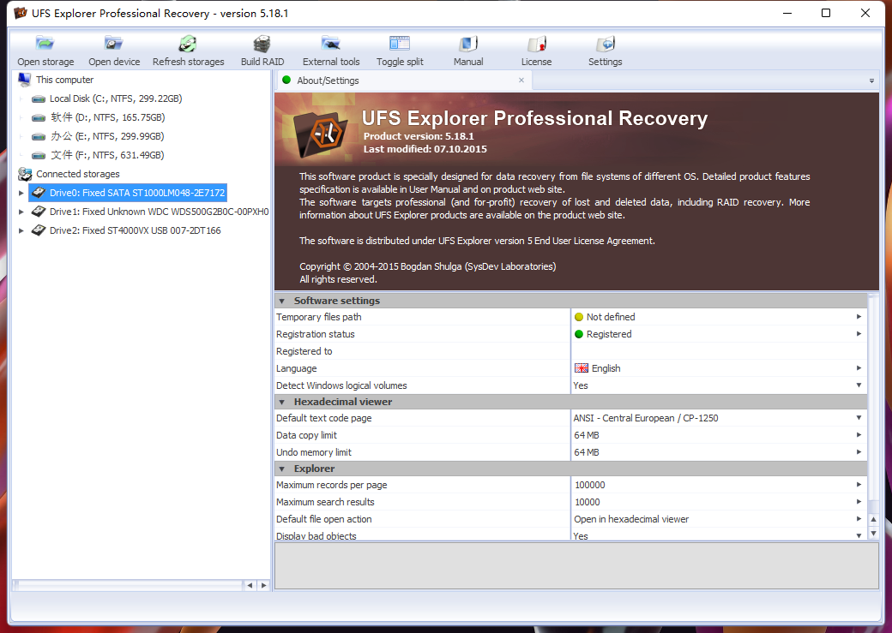
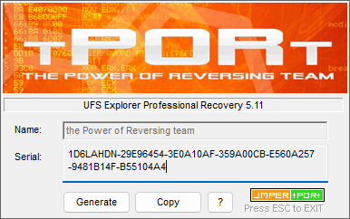
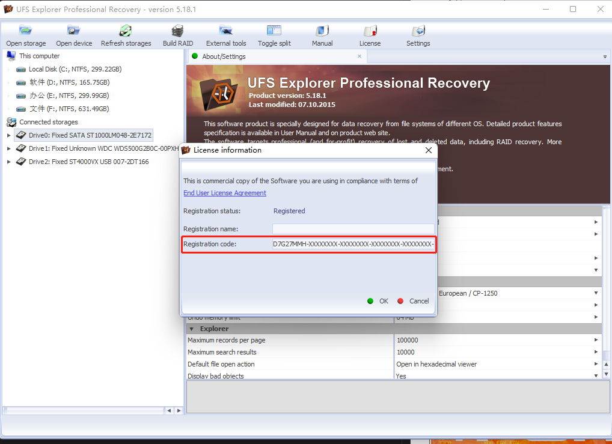
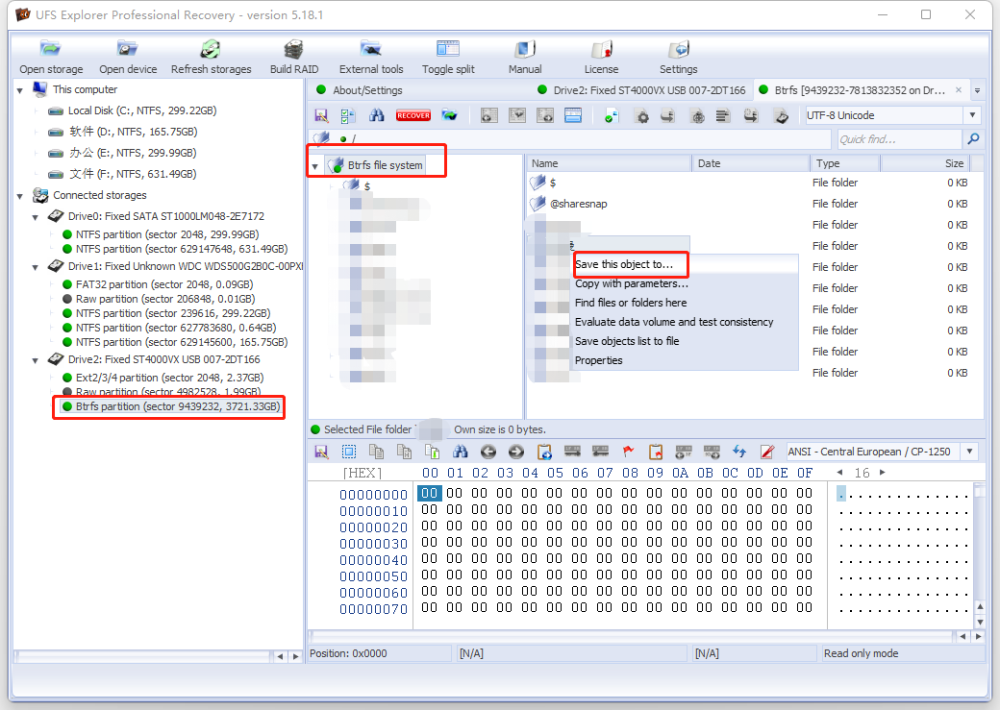

# window系统读取群晖的拆机硬盘

## 使用场景：

当群晖NAS系统出现问题或者不想使用群晖NAS系统后。如何在windows系统环境下把群晖NAS系统中的存储的数据迁移出来？

群晖nas系统的存储方式： 群晖nas的硬盘分区用的是Btrfs分区格式。在windows环境下是无法读取硬盘中的数据的，无法识别。

## 解决方法

### ① 解决方法1： 已使用

使用UFS_Explorer_Professional_Recovery 数据恢复软件

只有注册后的该软件才能迁移大容量文件数据。

1. 安装UFS_Explorer_Professional_Recovery 数据恢复软件

软件运行截图

2. 使用该软件的注册机进行破解

将注册机中的序列码复制到下图位置中，点击ok。就能破解

3. 将群晖的拆机硬盘通过硬盘盒子的方式。连接到windows主电脑中。

4. 运行该软件，在软件中找到群晖拆机硬盘。点击硬盘中可以显示其中的数据。

上图可以看到该软件成功读取了群晖的btrfs分区硬盘数据。并且可以将硬盘中的文件迁移到主电脑中。

### ① 解决方法2： 未使用

将Ubuntu的iso文件制作为启动U盘。用这个启动U盘来试运行Ubuntu系统。接入群晖拆机硬盘到主电脑上，然后在ubuntu系统下读取群晖拆机硬盘数据。

[参考链接](https://www.chiphell.com/thread-708972-1-1.html)