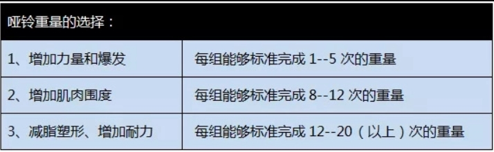

[TOC]

##  健身笔记

经过从年初到现在，接近半年的减肥。目前我的体重已经从99kg到82kg。具体的减肥记录可以通过在华为运动健康上查看。

减肥期间主要目标是减脂，而不是增肌。切记减脂和增肌不可兼得

特此记录下自己的减肥经历，以及总结的减肥诀窍。

减肥经历：
1. 最开始的一个月左右，以走路的方式，进行锻炼。每天下班后，在家走上5-10公里左右的路。最开始走路时可以发现自己始终保持高心率。随后可以发现自己走完路，心率不会有太大的变化。此时需要改变自己的运行方式。
2. 之后，除了每天保持走路外，还增加了跳绳。跳绳次数从最开始的1000下就气喘吁吁到3000下气喘吁吁。在此期间，跳绳和走路时合理分配的。跳绳多就走路少，走路多就跳绳少。直到完全开始跳绳，不走路了。
3. 之后由于每天3000下跳绳，导致脚踝处疼痛。需要减少跳绳的运动量，又开始走路+1000下跳绳。几次跳绳发现，每天1000下跳绳不会导致脚踝处疼痛。
4. 当你的体重下降到一定程度，可以开始进行慢跑了。具体运动方式可以随意搭配。PS:慢跑方法网上百度。

减肥期间的饮食：
* 首先禁止吃三餐之外的零食

* 建议晚餐只吃一点点少量水果。早中餐正常吃。原因：早餐时间为8点左右，中餐时间为12点。早中餐就只有4个小时，其他20小时身体都处于消耗状态。

## 早中晚餐怎么吃？

#### 早餐

早餐不适合吃油脂多的食物,不适合吃含盐量高的食物。

一要挑粗粮，早餐时要尽量提供丰富的营养，食物也最好多样化，其中不可却的食物就是粗粮。只吃大米和白面营养是不太够的，所以不妨换一些粗粮，例如杂粮粥、燕麦片等都是不错的选择，这些膳食纤维既健康有可以达到饱腹感。

二要挑蛋白质，在吃早餐的时候要选择高蛋白低脂肪的食物，例如水煮蛋、茶叶蛋等，这些食物既含有优质蛋白，同时还可以增加我们的饱腹感，让我们不至于11点就感觉到肚子饿，非常有利于减肥人士。

三要挑果蔬，早餐要吃新鲜的蔬菜、水果，特别是深颜色的蔬菜水果营养会更丰富。做的时候用炒、生拌或蒸都是烹制早餐蔬菜的好方法。吃早餐时保证足量的新鲜蔬菜水果的摄入也有利于控制体重。

#### 午餐

午餐正常吃

#### 晚餐

晚餐应以高纤维蔬菜和水果为主，水果和蔬菜的热量一般较低，但水果和蔬菜中有各种维生素、胡萝卜素、矿物质营养。水果和蔬菜也需要更长的时间来消化，帮助你的胃运动，减少肠道废物和缓解便秘。

虽然晚上你可以摄入适量的蛋白质食物，为你的身体提供蛋白质营养。因为是睡觉时间，肌肉合成和生长需要蛋白质。

最后，叮嘱一点，晚餐不要太晚，建议在8点前完成。

##  力量训练

### 如何找到合适自己的训练重量及次数

> 什么是RM？

RM值又叫最大重复次数，是指某个重量你能做的极限次数。例如你推举100KG最多能做5次，则说明你推举100kg的RM值为5。

在不同的训练动作里，RM值都是不同的，每一个动作都有自己的RM值，简单来说，你不可能把深蹲和卧推的RM值相提并论。

RM值代表你自己对于某个重量下的某个动作的极限次数。通过测试自己不同动作、不同重量下的RM值，就可以解决重量选择的问题，避免重量太大导致受伤，或者重量太小训练没效果。

> 如何测量自己的RM值？

首先充分的热身是不可或缺的，应该首先用中等重量开始测试。

测试动作建议是多关节复合动作例如卧推，深蹲，硬拉，推举等。

> 如何选择力量训练中重量，次数，组数？

研究表明：
- 1-5RM的负荷训练能使肌肉增粗，发展力量和速度；
- 6-10RM的负荷训练能使肌肉粗大，力量速度提高，但耐力增长不明显；
- 10-15RM的负荷训练能使肌纤维增粗不明显，但力量、速度、耐力均有长进；
- 30RM的负荷训练能使肌肉内毛细血管增多，耐久力提高，但力量、速度提高不明显。

选择次数：
1. 一般来说，1RM-5RM是肌肉力量的最好选择。要锻炼肌肉的力量，进行重量训练时应采用重量较大而重复次数较少的模式；
2. 6RM-12RM是增大肌肉体积最好选择，可用于增大肌肉体积和围度。
3. 15RM以上是发展肌肉耐力的最好选择：要锻炼肌肉的耐力，则要采用重量较轻而重复次数较多的模式。

选择组数：进行重量训练时，不应只从事一组过的练习（如10RM），要达至理想的效果，必须把每种练习分组练习（比如3-5组）这样的锻炼肌肉的方法才能够刺激到肌肉群中的所有肌肉纤维。如果你进行的组数太多，那么就有可能会造成训练过的情况。至于组与组之间则可以有1至3分钟的休息时间。

### 如何选择适合你的训练重量

选择训练重量，可以根据你想要的训练效果来决定。

#### 围度至上

对于大多数男生来说，进入健身房举铁的目的就是获得更大的肌肉围度，收获宽厚强壮的体魄。为求最大程度的增肌效果。

最佳方法是选择每组动作可以标准完成8--12次的重量。即RM为8-12

另外，这里说的可以标准完成8-12次的重量，是指当你完成第12个时已经达到力竭，无法用标准动作完成第13次。如果你只是完成12次便结束，实际还能再完成1个的话，那么这个重量是偏轻的。同理，如果你无法在动作标准的情况下完成8次，那么你选择的重量是偏重的。

最后，这类训练的组间休息一般控制在60--90秒，小肌群训练控制在60秒内，大肌群需要更充分一些的休息，约90秒内。

#### 耐力至上（塑造线条）

如果你想要减脂塑形，练出较好的肌肉线条，那么你可以选择耐力性的训练。

增强肌肉耐力的训练不需要太大的重量，一般选择每组能够标准完成15-20次甚至更多次的重量。即RM为15-20

耐力型的力量训练主要调动机体中的慢缩肌纤维（红肌），它较白肌而言横断面较细，不易变得粗壮，拥有较好的耐久能力，可持续做功。

#### 力量至上

如果你训练目的是为了获得更大的力量，那么你需要简单粗暴地选择较大的重量，即每组能够标准完成1-5次的重量。即RM为1-5。

#### 总结

总而言之，不同的训练目的对重量的要求不同的，下面通过表格形式把训练重量要求的形象的展现出来。

