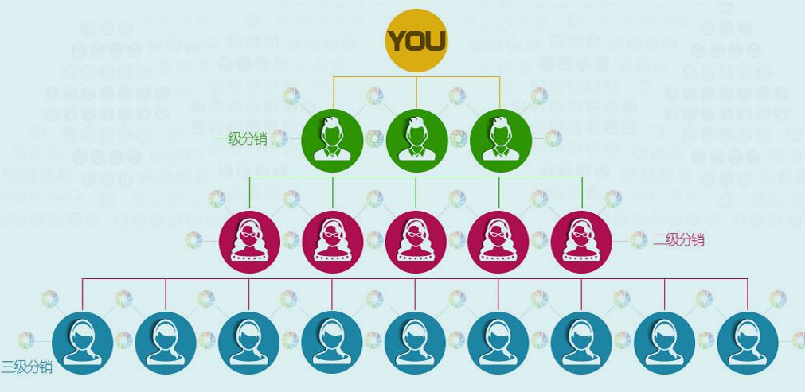
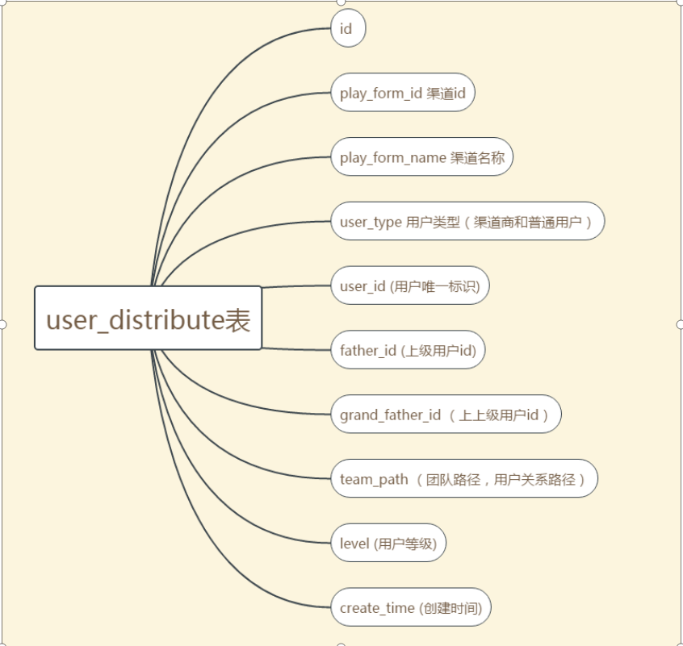
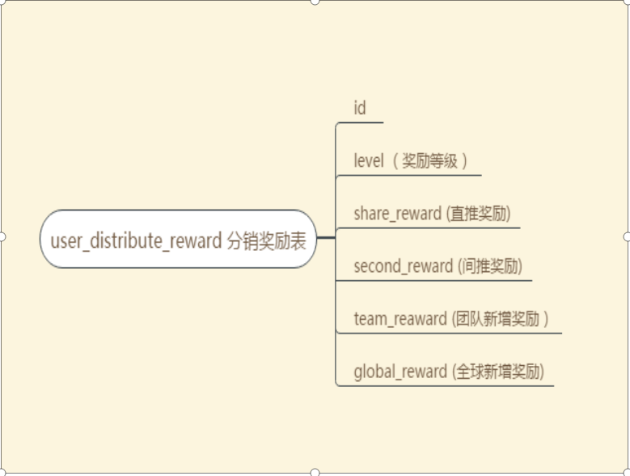
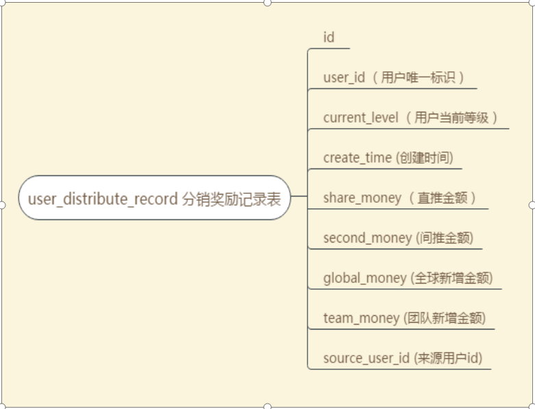
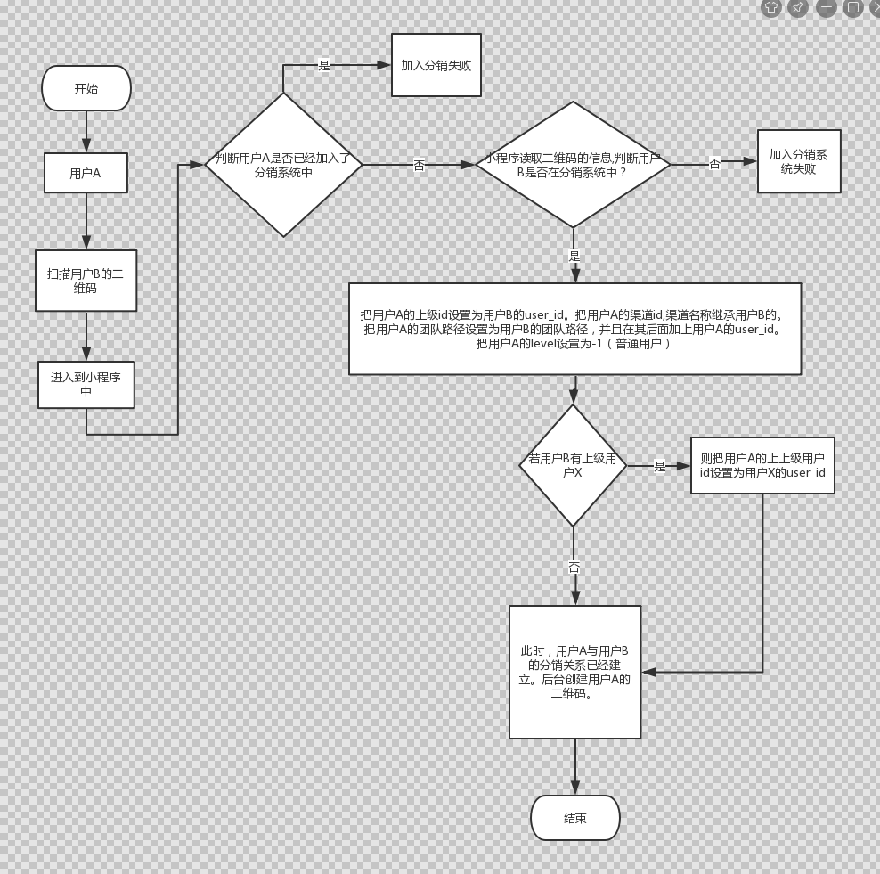
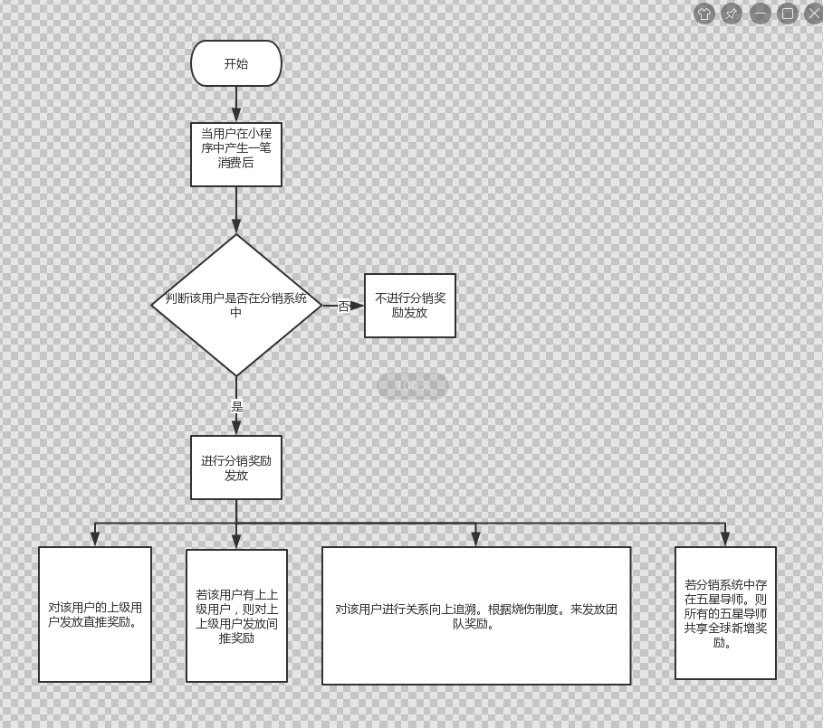
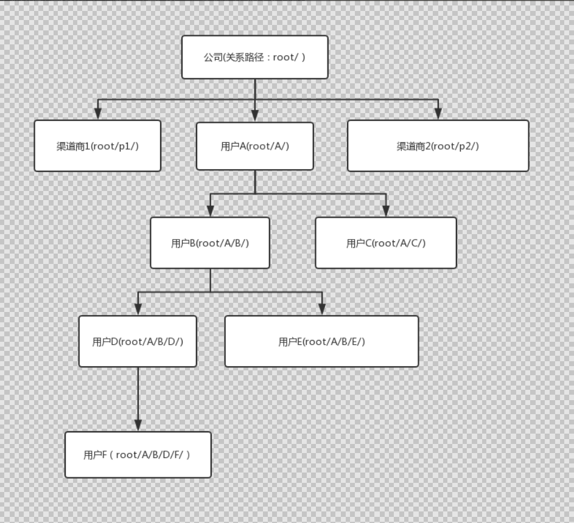

# 分销系统（简化版本）

## 1.介绍：

在分销系统中，有一个最上级用户(根用户)，其他用户都是该用户直接下级用户或间接下级用户。类似于下图：

这个简化版本的分销系统主要是通过以扫描二维码的方式来发展下级用户。==
**例如分销系统中的根用户是公司。每一个用户只有通过微信扫描公司或者别人的二维码，才能加入到分销系统中。并且在微信小程序中拥有一个专属的二维码。**

## 2.表的设计

user_distribute分销关系表字段介绍：
1. user_type:用户类型。0表示普通用户。1表示渠道商。
2. level:用户等级。-1表示普通用户。0表示为vip用户。1~5分别为1-5星导师用户。
3. father_id: 上级用户id。 若A是B的下级用户。则A的father_id 就是 B的user_id.
4. grand_father_id :上上级用户id。与father_id 同理。
5. team_path:用户关系路径。
例如： 用户A的team_path 是 A/ 。现在用户B是用户A的下级用户。则用户B			的team_path是 A/B/

user_distribute_reward表（A->B->C）：
1. level 奖励等级 ：分销系统中不同等级的用户，在分销系统中得到的奖励也不同。
2. share_reward 直推奖励：当用户B在小程序中产生一笔消费后，则用户B的上级用户（用户A）,得到一笔直推奖励。
3. seconf_reward 间推奖励：当用户C在小程序中产生一笔消费后，则用户C的上上级用户（用户A）得到一笔间推奖励。
4. team_reward 团队新增奖励：当某个团队中的用户产生一笔消费后，该团队中的一些特殊等级的用户（如导师），会得到一笔团队奖励。
5. global_reward 全球新增奖励：当整个分销系统中每产生一笔费用后,分销系统中所有等级最高的用户（五星导师，level5）会共享一笔费用。这个费用就是全球新增奖励。

user_distribute_record表：
1. 某个user_id 的用户在当前等级（current_level）下，在当前时间（create_time）下，得到一笔金额奖励（直推/间推/团队/全球）,该金融是来源于另一个用户（source_user_id）。

## 3.流程图：

### 1.加入分销系统的流程图

### 2.得到分销奖励流程图

### 3.分销关系示例图

解释说明：
1. 图中公司是分销系统中的最上级用户（根用户）。其团队路径是root/。
2. 用户F是分销系统中最下级用户。其团队路径是 root/A/B/D/F/。
3. 团队介绍：
    公司的团队就是公司下的所有用户(包括公司自身)。
    用户A的团队就是ABCDEF，用户B的团队就是BDEF

## 4.分销系统中奖励制度

>普通用户：
当其下级用户开通会员（产生一笔消费）。可得88元教育金。不可提现。

>VIP会员：
(1)下级用户开通会员（产生一笔消费）。可得88元教育金。可提现；
(2)免费参加一星用户考试认证。考试成功，就成为一星用户。

>一星用户：直推10名
(1)下级用户开通会员（产生一笔消费）可得价值38元教育金奖励；
(2)下下级用户开通会员（产生一笔消费）可得价值8元教育金奖励；
(3)当该用户的团队中每产生一笔消费后。该用户可享受团队奖励1%(360*0.01=3.6)的教育金奖励；
(4)免费参加二星用户考试。

>二星用户：直推50名
(1)下级用户开通会员（产生一笔消费）可得价值49元教育金奖励；
(2)下下级用户开通会员（产生一笔消费）可得价值18元教育金奖励；
(3)当该用户的团队中每产生一笔消费后。该用户可享受团队奖励1.5%(360*0.015=4.8)的教育金奖励；
(4)免费参加三星用户考试。

>三星用户：直推100名
(1)下级用户开通会员（产生一笔消费）。可得价值58元教育金奖励；
(2)下下级用户开通会员（产生一笔消费）。可得价值28元教育金奖励；
(3)当该用户的团队中每产生一笔消费后。该用户可享受团队奖励2%(360*0.02=7.2)的教育金奖励；
(4)免费参加四星用户考试。

>四星用户：直推300名
(1)下级用户开通会员（产生一笔消费）可得价值68元教育金奖励；
(2)下下级用户开通会员（产生一笔消费）可得价值39元教育金奖励；
(3)当该用户的团队中每产生一笔消费后。该用户可享受团队奖励2.5%(360*0.025=9)的教育金奖励；
(4)免费参加五星用户考试。

>五星用户：直推500名
(1)下级用户开通会员（产生一笔消费）可得价值88元教育金奖励；
(2)下下级用户开通会员（产生一笔消费）可得价值58元教育金奖励；
(3)当该用户的团队中每产生一笔消费后。该用户可享受团队奖励3%(360*0.03=10.8)的教育金奖励；
(4)当分销系统中每产生一笔消费。则所有五星导师共同分享3.6元的奖励

## 5.分销奖励制度中的烧伤制度（用于针对团队奖励）

**因为当某个团队中的星级用户过多时。该团队中每产生一笔消费。团队中的所有星级用户都会分到一笔团队奖励。因此设计出烧伤制度，来确保团队奖励不会发放过多。**

例如:上图中用户F的团队路径为root/A/B/D/F。
1.当F产生一笔消费后。向上追溯F的团队路径。从D开始。
2.在向上追溯的过程中。若遇见导师，则给予该导师用户团队奖励。并记录该导师等级。
3.继续向上追溯。当遇见比之前的导师等级还要大的导师。给予其团队奖励。
4.直到向上追溯到根用户，即公司为止。