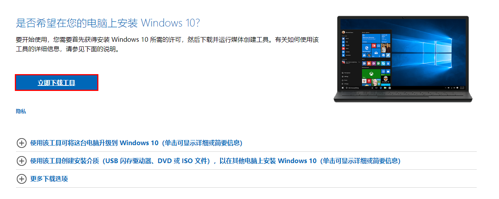
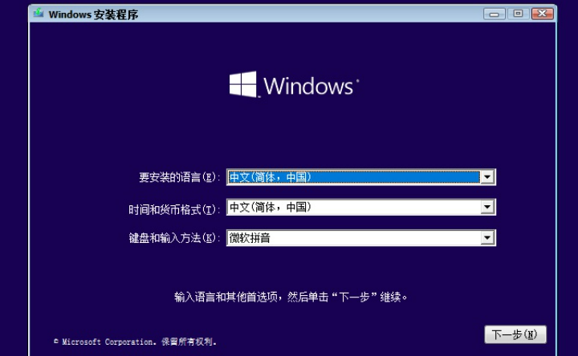
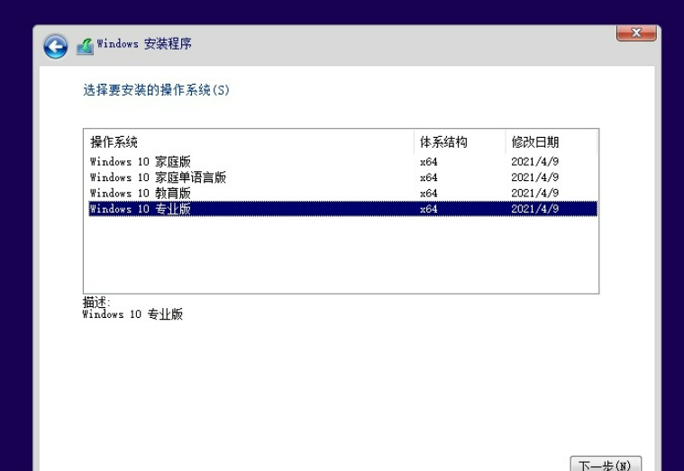
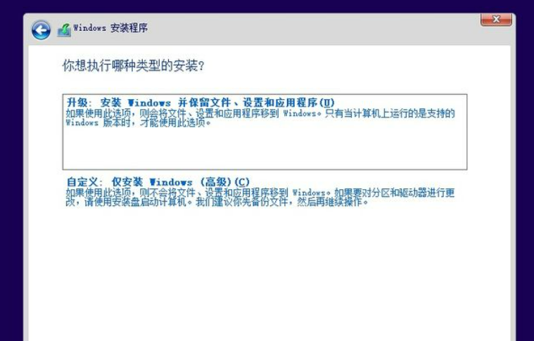
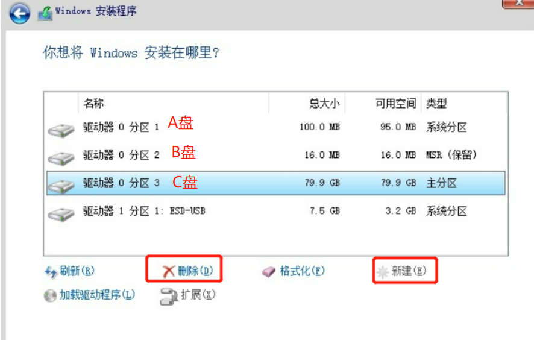
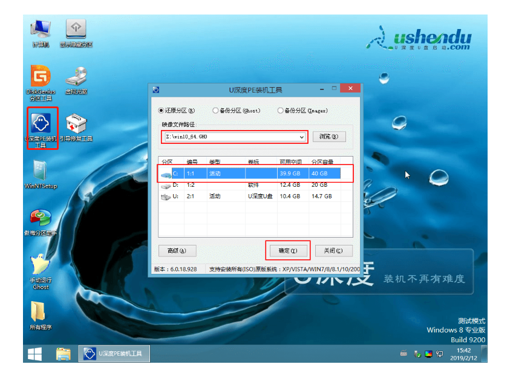

华硕X205TA思聪本这款笔记本。无法识别一般的U盘启动软件。例如大白菜，老毛桃等。主要是因为这款笔记本的主板是平板的,需要使用windows平板的重装系统方法。

注意：曾经使用软碟通工具制作的32位Ubuntu系统启动盘。重启电脑之后，该电脑无法识别到U盘启动盘。

> 方法1：使用微软官方工具制作U盘启动盘 (已成功使用)。优点：微软官方正版的系统，纯净。缺点：下载的win10系统是最新的。小电脑配置可能带不动。

1. 在微软官方网站下载win10系统安装工具软件

2. 准备一个8G以上的U盘,运行该软件。制作win10 32位系统的U盘启动盘。
3. 之后插入电脑，重启电脑。按f2键来进入到小电脑的bios系统中，设置u盘启动。重启电脑
4. 之后可以看到windows安装程序界面。一路点击下一步，选择win10专业版。选择自定义：仅安装Windows(高级)。点击下一步。

5. 之后先删除电脑上的所有分区。再重新建立C盘，D盘分区（有多余空间就建立）。再选择C盘分区作为系统盘。点击下一步。

6. 之后等待系统自动安装到电脑上。
7. 当小电脑重新安装win10专业版系统后。还需要安装小电脑专门的驱动（详见华硕小电脑驱动目录）。否则键盘和扬声器失去作用。
8. 小电脑系统重装完成。

> 方法2：直接运行iso文件 (已成功使用)。优点：微软官方正版的系统，纯净，可任意选择不同版本的iso文件。

1. 在msdn我告诉你网站上下载win10专业版iso镜像文件。注意不要下载太新的win10系统。
2. 直接右键-》装载，打开win10系统镜像iso文件，运行里面setup.exe 来重装win10系统。
3. 删除C盘中的windows.old文件夹。该文件夹是之前win10系统数据。无需保留，直接删除即可。
4. 之后一一安装小电脑驱动即可。

> 方法3：使用软碟通工具将iso文件制作为U盘启动盘 (已成功使用)。优点：微软官方正版的系统，任意选择不同的win10 iso文件。 

1. 在msdn我告诉你网站上下载win10专业版iso镜像文件。注意不要下载太新的win10系统。
2. 下载并安装软碟通。运行，点击试用
3. 自行百度软碟通用法，将下载的iso文件制作为U盘启动盘。
4. 制作好U盘启动盘后。插入U盘，重启电脑。按f2键来进入到小电脑的bios系统中，设置u盘启动。重启电脑
5. 之后可以看到windows安装程序界面。一路点击下一步即可。
6. 注意之后安装小电脑驱动。

注意：不要下载太老的win10版本（里面可能没有网络驱动，导致小电脑无法连上网）。也不要下载最新的win10版本（小电脑配置不高，带不动）。要下载不老不新的win10版本。

> 方法4(已成功使用)：缺点：安装的第三方win10系统会有许多第三方软件。

1. 通过使用U深度启动盘制作工具（http://ushendu.njshengyuanli.com.cn/）或者 u启动（http://uqidong.njshengyuanli.com/），来制作u盘启动盘。下载装机版安装。（原因：这个软件的装机版支持windows平板重装系统）
2. 制作U盘启动盘：选择HDD-fat32模式，兼容模式，选上支持windows平板电脑启动
3. 制作U盘启动盘后，下载win10的32位系统iso镜像文件,将iso文件存储到u盘的iso目录中。
4. 通过f2键来进入到小电脑的bios系统中，设置u盘启动。重启电脑
5. 之后进入到U深度的winpe界面，用DiskGenius工具将之前电脑能存在的硬盘分区全部删除。然后点击快速分区（选择建立ESP,MSR分区），之后分区新的C盘和D盘。
6. 打开U深度PE装机工具，点击浏览，选择你下载的系统iso文件。选择C盘作为系统盘。并点击确定。

7. 之后会弹出一个询问框，提示用户即将开始安装系统。确认还原分区和映像文件无误后，点击确定。
8. 开始等待系统安装。完成之后记得把boot启动顺序改回来。
9. 需要后续安装小电脑驱动（详见华硕小电脑驱动目录）

> 方法5（尚未使用）

1. 使用nt6_hdd_installer_v2.8.1硬盘重装工具，注意目前只能使用该版本，高版本在win10下使用会闪退。
2. 将下载好的系统镜像iso文件解压，放到除C盘的其他盘的根目录中。
3. 将nt6 hdd installer v2.8.1.exe，与解压后的iso文件，放到一起。运行这个exe程序
4. 选择模式2，并且格式化c盘，之后等待即可