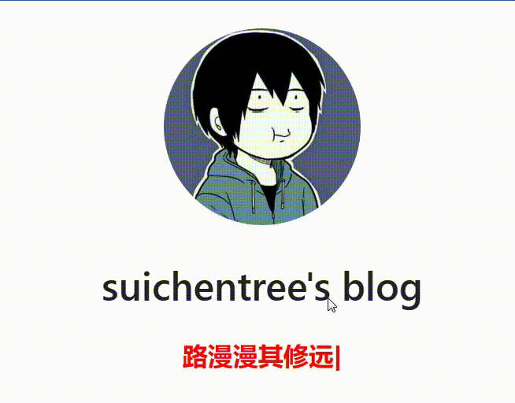

[toc]

# 博客优化

当前vuepress博客使用的主题是vuepress-reco。当前使用版本为1.x版本。

[vuepress-reco网站 http://v1.vuepress-reco.recoluan.com/](http://v1.vuepress-reco.recoluan.com/)

## 自动提交代码到github仓库

通过脚本来自动提交代码到github仓库。

push.sh 
```bash
# 该脚本主要分两个部分。
# 第一个部分: 提交代码到博客源代码仓库 https://github.com/suichentree/suichenblog.git
# 第一个部分: 将源代码打包运行，生成博客页面代码后。将页面代码提交到博客页面仓库 https://github.com/suichentree/suichentree.github.io.git

# 注意1: 在git终端中运行脚本。
# 注意2: 使用 source push.sh 命令运行该文件。bash push.sh 命令无法执行脚本中的cd命令,source命令可以。

# 定义commit方法
function commit() {
    #定义变量commitMessage,并接受外部输入赋值
    read -p "输入commitMessage: " commitMessage 
    echo "commitMessage is  $commitMessage"
    #将暂存区的文件提交到本地分支中
    git commit -m $commitMessage
}

# 定义push方法
function push(){
    # 本地分支强制推送最新文件到远程分支
    git push -f origin master
    # $?可以获取git push -f origin master命令是否运行成功，成功返回0，否则非0。
    if [ $? -eq 0 ] 
    then
        # 上传成功，方法结束
        echo "SUCCESS , git push success"
    else     
        # 上传失败，重新执行上传命令
        echo "ERROR , git push fail"
        # 延迟5秒
        sleep 5s
        # 重新执行push方法
        echo "Push Code to Remote Repository Again -------------------"
        push
    fi
}


# 脚本从这里开始--------------
echo "Start Run push.sh -------------------"

# 第一部分 start--------------------------
echo "Start Run Part1 -------------------"

# 将所有变动文件添加到暂存区
git add -A

# 检查是否有文件需要提交
check_commit=`git status`
if [[ $check_commit =~ "Changes to be committed:" ]] 
then 
    # 还有文件要提交
    echo "YES,some file need commit."
    # 执行提交方法
    commit
else     
    # 没有文件需要提交
    echo "NO, no file need commit"
fi

# 执行push方法
push

# 第二部分 start--------------------------
echo "Start Run Part2 -------------------"

# 生成博客静态文件
npm run build

# 进入生成的文件夹
cd public

# 初始化为git仓库
git init

# 添加到暂存区
git add -A

# 获取当前时间
time3=$(date "+%Y-%m-%d %H:%M:%S")

# 提交到本地分支
git commit -m "deploy blog $time3"

# 添加远程库地址
git remote add origin https://github.com/suichentree/suichentree.github.io.git

# 执行push方法
push

# 回到上级目录中
cd ..

# 脚本从这里结束--------------
echo "push.sh run finish -------------------"
```


## 给文章下方添加评论功能

[参考文章](https://github.com/mqyqingfeng/Blog/issues/270)

vuepress-reco主题内置评论插件 `@vuepress-reco/vuepress-plugin-comments`，可以根据自己的喜好选择 Valine 或者 Vssue；

Valine和Vssue都是评论插件，我选择的是Vssue评论插件。

> Vssue是什么？

[Vssue插件官网地址](https://vssue.js.org/zh/)

Vssue 是一个 Vue 驱动的、基于 Issue 的评论插件。

特点是支持多个代码托管平台，包括 GitHub、GitLab、Bitbucket、 Gitee 和 Gitea。因为基于 Vue，可以作为 Vue 插件使用，轻松集成到 Vue 应用中。

这里我选择的是GitHub平台来保存我的评论数据。

> 实现方式

1. 创建 GitHub OAuth App

登录你的GitHub账户-》选择setting -》Developer Settings -》OAuth Apps -》New OAuth App


2. 填写信息


- Application name: 随便填写一个名称。
- Homepage URL：填写博客的首页地址
- Authorization callback URL：填写博客的首页地址

然后点击注册应用。

3. 如图可以看到id已经生成了。之后点击按钮生成密钥。


4. 然后在工程的config.js上添加代码

```js
//config.js
module.exports = {
  theme: 'reco',
  themeConfig: {
    vssueConfig: {
      platform: 'github',
      owner: 'OWNER_OF_REPO',
      repo: 'NAME_OF_REPO',
      clientId: 'YOUR_CLIENT_ID',
      clientSecret: 'YOUR_CLIENT_SECRET',
    }
  }
}
```

- clientId: 填写你刚刚生成的clientId
- clientSecret：填写你刚刚生成的clientSecret
- owner：填写你的github名称，例如suichentree
- repo：填写你的博客所在的仓库名称。例如`suichentree.github.io`

5. 然后打包工程，更新博客代码到仓库中。

6. 然后可以在每篇文章的最底部。看到评论区域


> 如何评论？
1. 直接点击上图的登录。用你的github账号先登录。
2. 然后点击创建 Issue 
3. 之后就可以在评论框中输入你的评论。点击发表评论按钮即可。
4. 之后就可以看到你的评论了。


> 评论数据是如何存储的？


当你在某个文章最下方点击创建 Issue 的时候。相当于给博客仓库，创建了一个issue, 评论内容就是issue的内容。 


## 博客首页副标题添加打字机效果

由于vuepress-reco主题本身没有打字机效果插件，于是在npm网站上找到打字机效果插件，并给博客首页的副标题添加打字机效果。



打字机效果插件：vuepress-plugin-typed
[vuepress-plugin-typed链接](https://www.npmjs.com/package/vuepress-plugin-typed)

> 实现方法

1. 安装插件
```
npm i vuepress-plugin-typed
```

2. 在工程的config.js中配置打字机插件
```js
// config.js
module.exports = {
  //.....
  "plugins": [
    //副标题-打字机效果的插件
    ['typed',{
      // 首页副标题对应的标签选择器
      selector: '.home-blog .hero .description',
      // 打字内容
      strings: [
        "海里的咸鱼 (;-_-)ᴇᴍᴍᴍ ——suichentree",
        "路漫漫其修远兮，吾将上下而求索 ——屈原"
      ],
      typeSpeed: 150, // 打字速度
      backSpeed: 100, // 回退速度
      showCursor: true, //是否显示光标
      startDelay: 1000,    //延迟开始打字
      backDelay: 2000,  //延迟多少时间开始回退
      }
    ]
  ]
}
```

3. 在博客首页README.md设置副标题。如果不设置副标题，会导致打字机效果无法生效

```
# tagline副标题为空，真正的副标题内容配置在config.js中
tagline: ""
```

4. 打字机插件更多的配置，点击链接自己查阅。

[vuepress-plugin-typed地址](https://www.npmjs.com/package/vuepress-plugin-typed)


## 博客添加留言板页面

vuepress-reco主题本身没有开启留言板页面，需要自行添加。

留言板效果


> 实现方式

1. 在当前工程的blogs目录创建留言板目录。在留言板目录中创建messageBoard.md文件

messageBoard.md文件内容如下
```md
---
title: '留言板'
date: 2023-08-09
isShowComments: true
---

::: tip
🎉🎉🎉🎉🎉🎉🎉 

欢迎大家在此留下你的建议和意见，或者在 [GitHub](https://github.com/suichentree/suichentree.github.io) 提交你的留言。

🎉🎉🎉🎉🎉🎉🎉
:::

```

2. 在工程的config.js中添加留言板配置。

```js
//config.js
module.exports = {
  //.......
  "themeConfig": {
    //头部导航栏
    "nav": [
      //留言板配置
      {
        "text": "留言板",
        "link": "/blogs/留言板/messageBoard.html",
        "icon": "reco-suggestion",
      }
    ]
  }
}

```

3. 重新运行工程。


## 博客添加百度统计

给博客添加访问统计功能，使用百度统计工具。

> 实现方式

1. 访问百度统计网站,登录自己的百度账户。[百度统计](https://tongji.baidu.com/)

2. 使用设置-》新增网站


- 域名：填写博客的域名。例如`suichentree.github.io`
- 首页：填写博客首页的网址。例如`https://suichentree.github.io`

3. 新增网址后，找到访问统计代码。


4. 在工程的config.js中添加这段代码。

```js
module.exports = {
    head: [
      [
        'script', {}, `
        var _hmt = _hmt || [];
        (function() {
          var hm = document.createElement("script");
          hm.src = "https://hm.baidu.com/hm.js?xxxxxxxxxxxxxxxxxxx";
          var s = document.getElementsByTagName("script")[0]; 
          s.parentNode.insertBefore(hm, s);
        })();
        </script>        
        `
      ]
    ]
}
```

5. 本地验证

本地运行前端工程，访问页面。在F12控制台的网络页面查看请求。


若成功请求了hm.js和hm.gif ，表明验证成功。

6. 线上验证

将最新的博客代码提交到github上,部署完成后。在代码检查处，点击开始检查按钮。进行线上验证。


<font color="red">注意：如果你当前的上网状态是科学上网，那么代码检查可能失败。需要恢复到原来的上网状态，再重新进行代码检查。</font>

7. 如果检查成功，一般20分钟后，就可以看到博客的访问统计数据了。
