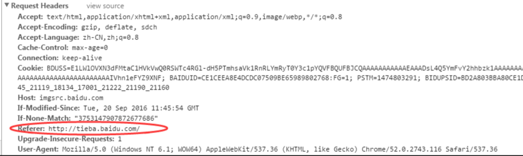
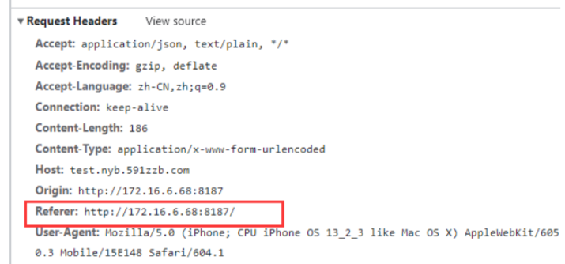

[toc]

# 图片防盗链

> 问题

当我们在自己的网站上使用其他第三方网站的图片的时候，可能会无法加载这些图片。但是我们单独访问这些图片的时候，是可以显示的。

原因是这些远程图片所在的网站设置防盗链机制。

> 什么是防盗链机制？

1. 当自己的网站去请求第三方网站中的图片的时候，请求头属性中有一个Referrer属性，该Referrer属性值就是自己网站的域名。
2. 当第三方网站的后台会判断请求的Referrer属性是不是本网站的。如果是那么请求通过。如果不是，那么请求拒绝，返回403 forbidden。因此请求图片失败，导致图片无法显示。

在百度贴吧网站中查看百度贴吧的图片


在其他网站中查看百度贴吧的图片


<font color="red">另外之所以本地请求这些远程图片可以正常显示。是因为本地请求的时候，请求头的Referrer属性为空值（或者没有Referrer属性）。此时网站无法判断Referrer属性。</font>

> 解决方法

方法1：在HTML代码的head中添加一句。

```html
<meta name="referrer" content="no-referrer" />
```

方法2：设置img/image标签的referrer属性

```html

<image referrer="no-referrer|origin|unsafe-url" src="xxx"/>
```