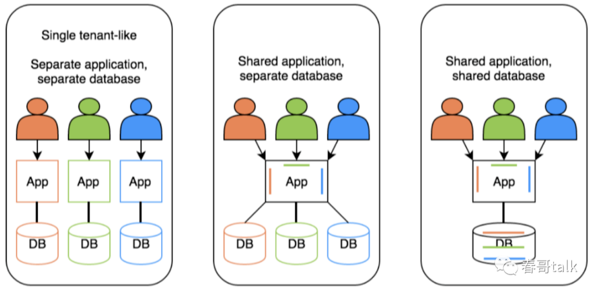

[toc]

# 多租户系统

## 介绍

> 什么是多租户系统？

一般情况下，如果我们设计一个学生管理系统，需要提供给不同的学校客户使用。那么我们需要把这个系统给每个学校去单独部署一套。

但是对于多租户的学生管理系统，可以让不同的学校客户共用这一套系统，但是学校客户又感知不到这点，就像为他们单独部署了一套学生管理系统一样。

<font color="red">多租户系统的定义：多租户是一种软件架构技术，实现如何在多用户的环境下，共用相同的系统或程序组件，并可保持各用户间数据的隔离性。</font>

这里的用户即租户，租户狭义上理解就是使用系统的人。广义上来说还应该包括创建的系统、数据等一切与当前租户有关的系统资源。

> 如何实现多租户的效果？

多租户系统相比传统系统最明显的区别就是数据隔离。多租户系统通过数据隔离的方式，可以让不同的用户共用一套系统或程序组件，并可保持各个用户间数据的隔离性。

## 数据隔离的模式

数据隔离有以下几种方式。
1. share everthing：数据库和schema共享，通过租户标识逻辑分离；
2. 共享数据库和共享schema：新租户单独生产新的独立schema；
3. 独立数据库：为每个租户分配独立数据库；


### 字段隔离模式

字段隔离模式是指，所有用户共用一个数据库实例，但是通过给表中额外增加一个字段，来区分不同来源的数据。从而将将多租户系统中的数据进行数据隔离。

例如查询出xxx学校中的小明学生。
```sql
select * from t_student where student_name = "小明" and source_id = "xxx学校"
```

### 用户隔离模式

字段隔离模式是指，所有用户共用一个数据库实例，但是通过给数据库创建不同的用户。以Mysql数据库为例，就是建立多个Mysql用户，每个Mysql用户下都有完整的独立的表。

通过不同的Mysql用户的方式，来将多租户系统中的数据进行数据隔离。

### 独立数据库模式

独立数据库模式是指，多租户系统中的数据，通过不同的数据库来把数据进行隔离。以Mysql数据库为例，就是装有很多个Mysql服务，每个租户对应一个实例 ，每个实例下具有相同的Schema和表 。

之后根据租户动态进行数据源切换，获取对应租户的数据库实例。

### 总结

总之，要做好租户之间的数据隔离，一个租户不应该看到其他租户下的数据，以满足业务需求。
- 独立数据库模式，隔离性好，但资源利用率低。
- 完全共享模式，隔离性弱，但资源利用率高。
- 具体采用哪种方式，可以根据租户需求和付费情况，具备灵活配置迁移的能力。



在当前云原生技术下，资源弹性、部署都比较简单。完全可以为单独的大租户动态扩展一套独立的容器集群为该租户服务，实现该租户独享一组容器资源，而非共享。

简而言之，通过
