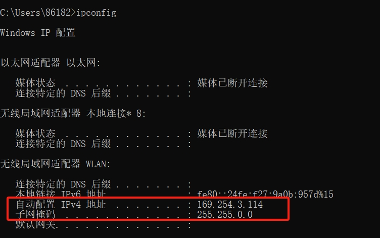

[toc]

# 已连接WiFi但无法上网问题

原因：某一天，手机可以连接wifi上网，但是电脑可以连接wifi但是无法上网。

当前电脑是设置自动获取ip的

然后在电脑连接wifi的状态下，通过在CMD输入`ipconfig`命令。查询wifi详细信息。

从图中可以看到，电脑连接wifi后，被分配了一个169.254.xxx.xxx的IP地址。

> 什么是169.254.xxx.xxx的IP地址

IP地址169.254.x.x属于链路本地地址。当设备无法从路由器的DHCP服务器获取到有效的IP地址时，设备会自动为自己分配一个APIPA地址。

APIPA地址范围是从169.254.0.1到169.254.255.254。这种地址通常在DHCP服务无法响应时由设备自动生成，以便设备能够在局域网内通信。

> 问题根源

无法上网的原因就是电脑无法与路由器的DHCP服务器通信，导致电脑给自己分配了169开头的地址。

这个169开头的ip地址是无法用来上网。从而导致电脑可以连接wifi但是无法上网的情况。

因此我们需要手动设置静态ip地址，不再使用路由器自动分配给我们的ip。

> 解决方式

1. 由于我们手机可以连接wifi。通过在手机的wifi信息，可以查询出具体的网关地址。
2. 然后手动设置一个ip地址，添加子网掩码，默认网关等信息。具体设置的ip地址可以随意，注意不要与手机的ip地址重复即可。

例如我的手机分配的ip为192.168.0.102。所以我的电脑就手动设置为192.168.0.101

3. 无法还是无法上网，也可以手动设置一个公共DNS服务器地址。

图中是阿里云的公共dns服务器地址。

4. 当设置好后，wifi就可以正常连接，并可以上网了。

成功上网后的wifi信息。

