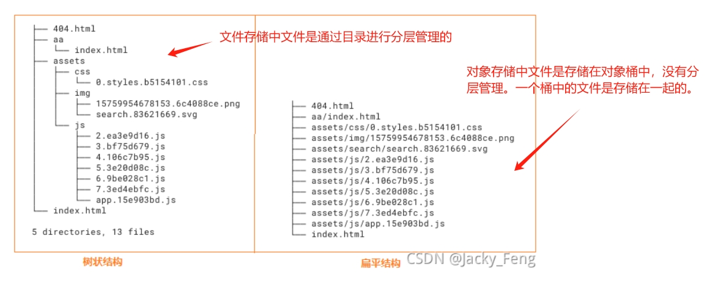

[toc]

# 常见的数据存储方式

目前有三种常见的数据存储方式：分别是文件存储、块存储和对象存储。

## 文件存储

文件存储也称为文件级存储或基于文件的存储，数据会以文件的形式存储在磁盘中。简而言之，数据先是存储在文件中，然后文件存储在磁盘中。

对于文件存储，它的服务对象是自然人。计算机中所有的数据都是0和1，存储在硬件上的一连串的01组合对自然人来说完全无法去分辨以及管理。因此自然人用“文件”这个概念对这些数据进行组织，所有用于同一用途的数据，按照不同应用程序要求的结构方式组成不同类型的文件（通常用不同的文件后缀来指代不同的类型文件），然后自然人给每一个文件起一个方便理解记忆的名字。

当文件很多的时候，我们按照某种划分方式给这些文件分组，每一组文件放在同一个目录（或者叫文件夹）里面，当然我们也需要给这些目录起一个名字。而且目录下面除了文件还可以有下一级目录（称之为子目录或者子文件夹），所有的文件、目录形成一个树状结构。最常用的Windows，Linux系统中，就是以这种方式组织起来的无数个文件和目录。

当需要访问计算机中的数据的时候，计算机需要先知道文件的具体存储地址，然后找到文件，读取文件中存储的数据。

> 什么是文件系统

把数据组织成目录-子目录-文件这种形式的数据结构，并利用这个结构用来寻找、添加、修改、删除文件的程序，以及用于维护这个结构的程序。这些程序组成的系统，就是叫文件系统。

文件系统有很多，常见的有Windows的FAT/FAT32/NTFS，Linux的EXT2/EXT3/EXT4/XFS/BtrFS等。

## 块存储

块存储的服务对象是可以读写块设备的软件系统，例如传统的关系型数据库。

块存储会将数据拆分成块，并单独存储各个块。每个数据块都有一个唯一标识符，所以存储系统能将较小的数据存放在最方便的位置。这意味着有些数据可以存储在 Linux 系统环境中，有些则可以存储在 Windows 系统环境中。

块存储通常会被配置为将数据与系统环境分离，并会将数据拆分，并分布到可以更好地为其提供服务的多个环境中。然后，当用户请求数据时，底层存储软件会重新组装来自这些环境的数据块，将其拼接成一个完整的数据。然后将它们呈现给用户。

由于块存储不依赖于单条数据路径（和文件存储一样），因此可以实现快速检索。每个块都独立存在，且可进行分区，因此可以通过不同的操作系统进行访问，这使得用户可以完全自由地配置数据。它是一种高效可靠的数据存储方式，且易于使用和管理。它适用于要执行大型事务的企业和部署了大型数据库的企业。这意味着，需要存储的数据越多，就越适合使用块存储。

块存储的缺点：块存储的成本高昂。它处理元数据的能力有限。

- 操作对象：磁盘
- 存储协议：SCSI、iSCSI、FC
- 接口命令：以SCSI为例，主要有Read/Write/Read Capacity
- 存储架构：DAS、SAN

## 对象存储

对象存储的服务对象则是其它计算机软件。

对象存储其实介于块存储和文件存储之间。文件存储的树状结构以及路径访问方式虽然方便人类理解、记忆和访问，但计算机需要把路径进行分解，然后逐级向下查找，最后才能查找到需要的文件，对于应用程序来说既没必要，也很浪费性能。

而块存储是排它的，服务器上的某个逻辑块被一台客户端挂载后，其它客户端就无法访问上面的数据了。

对象存储，也称为基于对象的存储，是一种扁平结构，文件会被拆分成多个部分并散布在多个硬件间。在对象存储中，数据会被分解为称为“对象”的离散单元，并保存在单个存储库中，而不是作为文件夹中的文件或服务器上的块来保存。

### 对象桶

对象存储是以存储桶（Bucket）为核心概念。存储桶就是存放对象的容器，且该“容器”无容量上限。存放在存储桶中的对象，没有文件夹和目录的概念。

用户可选择将对象存放到单个或多个存储桶中。存储桶的容量大小需要通过累加各个对象的大小得到。

>对于存储桶，应当以用途为粒度进行划分，确保每个存储桶的用途尽可能单一。例如，存放个人文件、发布静态网站、存储备份等用途都应该创建不同的存储桶。此外，不同项目的数据、不同的网站，或者完全私人的文件与工作性质、需要分享的文件，也应该划分不同的存储桶。

>注意：对象存储中没有「文件夹」的概念。对象存储的管理平台为了模仿文件存储的使用习惯，并与文件存储系统互相兼容而模拟了目录结构，背后的原理也仅仅是根据 / 这个字符对 key 进行分隔。为了表示空目录，部分云平台也提供「文件夹」对象，实际上只是 key 以 / 结尾的空存储对象。

### 对象

对象：对象存储中的基本单元，可理解为任何格式类型的数据，例如图片、文档和音视频文件等。

每个对象都由对象键（Key）、对象值（Data）、和对象元数据（Metadata）组成。
- 对象键（Key）：对象键是对象在存储桶中的全局唯一标识（UID），可以理解为文件路径。对象键（Key）用于检索对象，与文件实际存储路径无关。服务器和用户不需要知道数据的物理地址，通过key就能找到对象。
- 对象值（Data）：即存储对象内容数据，可以理解为实际存储的文件内容。
- 对象元数据（Metadata）：是一组键值对，可以通俗的理解为文件的属性，例如文件的修改时间、存储类型等。

在传统的文件存储中，元数据属于文件本身，和文件一起封装存储。而在对象存储中，元数据独立出来，并不在文件内部封装。

> 对象存储中对象的访问地址由存储桶访问地址和对象键组成，其结构形式为"存储桶所在的域名/对象键"。例如上传对象a.txt到存储桶bucket-001中,a.txt的访问地址是：`bucket-001.xxx.com/a.txt`。其中`bucket-001.xxx.com`为存储桶域名，`a.txt`为对象键。

> 由于对象存储中本身是没有文件夹和目录的概念的，因此对象存储不会因为上传对象project/a.txt，从而创建一个project文件夹。为了满足用户使用习惯，对象存储通过图形化工具中模拟了「文件夹」或「目录」的展示方式。例如具体实现是通过创建一个键值为project/，内容为空的对象，展示方式上模拟了传统文件夹。

> 对象存储优缺点
- 优点：容量大，高扩展性。从理论上来说，某个对象存储系统或单个桶（bucket），并没有总数据容量和对象数量的限制，即可以不停地往对象存储里增加资源，这个存储空间就是无限的，也是支持弹性伸缩的。
- 优点：高安全性，可靠性。对象存储采用了分布式架构，对数据进行多设备冗余存储（至少三个以上节点），实现异地容灾和资源隔离。数据访问方面，所有的桶和对象都有访问控制策略，所有连接都支持SSL加密，访问用户进行身份权限鉴定。
- 优点：高性能，支持海量用户的并发访问。

- 缺点：不支持直接在对象存储中修改文件。对象存储系统保存的对象不支持修改操作。用户哪怕是仅仅需要修改一个字节也需要重新上传整个对象。因此，它不适合存储需要频繁擦写的数据。

- 操作对象：对象（Object）
- 存储协议：S3、Swift
- 接口命令：主要有PUT/GET/DELETE等HTTP请求协议
- 存储架构：去中心化框架

