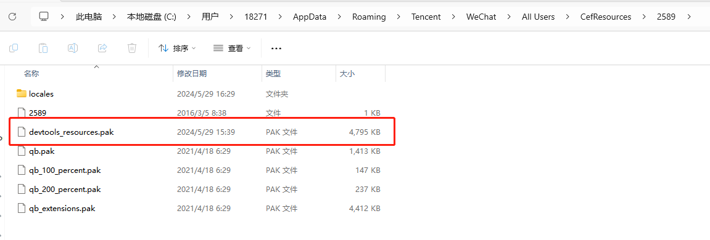
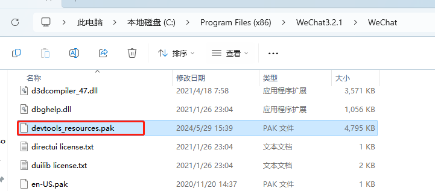
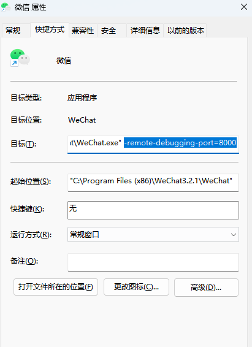
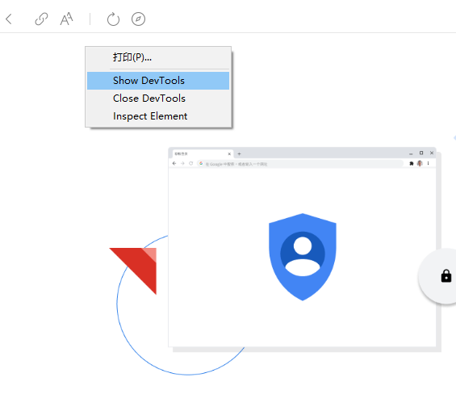
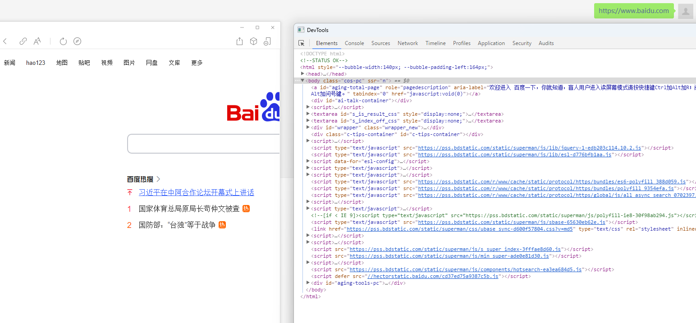

[toc]

# 微信内置浏览器-F12调试工具

> 为什么需要在微信中进行调试

我们在爬取数据的时候，通常需要在浏览器的F12调试工具中查询这些数据的请求是如何调用的。

而当我们需要爬取微信公众号或微信小程序中的数据的时候。由于在微信中无法打开F12调试工具。因此我们需要通过其他方法来获取微信中的数据。

> 解决方法

微信本身内置一个浏览器。最新版的微信已经禁止我们打开浏览器的调试工具，但是旧版本的微信还是可以打开调试工具。

因此我们需要下载旧版本的微信。然后通过旧版本的微信调试工具来爬取我们需要的数据。

## 第一步 安装旧版本微信和对应的devtools_resources.pak包

1. 下载安装微信3.2.1版本,并安装。
2. 下载对应的devtools_resources.pak包

> 为什么用 微信 3.2.1 版本？

在 3.3.x 之后的版本里，微信的内置浏览器禁用了F12调试的功能。

> devtools_resources.pak 是干嘛用的？

这个是Chrome开发者工具的非本地化资源包，微信默认是不带的。所以微信的内置浏览器无法打开F12调试工具。

因此我们需要下载这个包，并把这个包导入到旧版本微信的安装目录中和运行目录中。

## 第二步 放入pak包

1. 将下载的devtools_resources.pak文件复制到 `C:\Users\???\AppData\Roaming\Tencent\WeChat\All Users\CefResources\2589` 目录中。

注意不同的电脑，???这个路径稍有不同。

2. 将下载的devtools_resources.pak文件也复制到微信的安装目录中。

## 第三步 添加端口并重启微信

找到桌面上的微信快捷方式，右键属性，在“目标”的后面添加`-remote-debugging-port=8000`

注意：新增字符串需要和前面的字符串中间隔一个空格。

确定后重启微信，点击登录，手机确认登录。所有配置就完成了。

## 第四步 测试

在微信中打开一个网页链接。并进入微信内置浏览器空白处右键，会多出一个Show Devtools。点击就可以进入该网页的F12调式工具了。

如下图所示。

