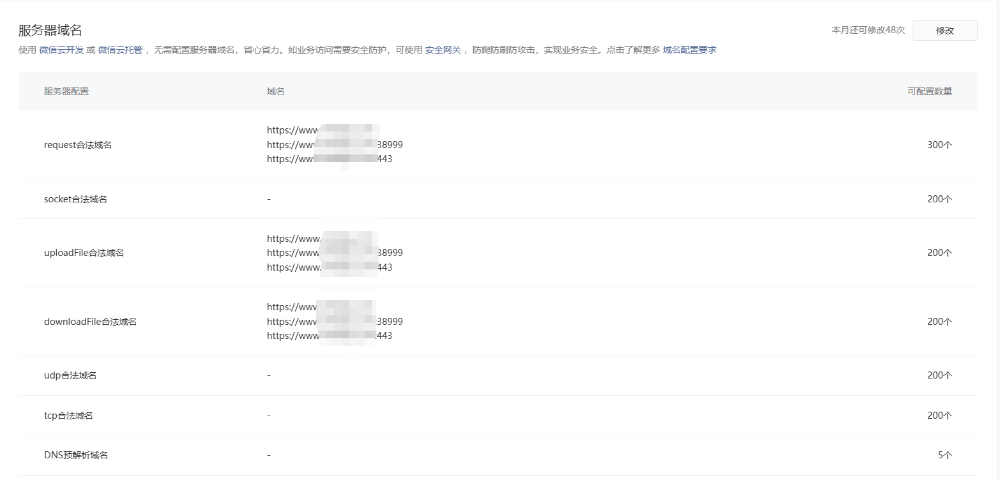

[toc]

# 微信小程序的https访问

微信小程序在生产环境中必须使用 HTTPS 协议，并且需要配置有效的 SSL 证书。

当我们部署好后台服务，但是在微信小程序中调用htpps接口的时候，缺报错。

> 解决方法

1. 需要先在微信公众平台中对该小程序设置服务器域名



2. 在后台服务部署的服务器中，找到域名证书。下载下来，放到后台工程的resources目录中。


3. 如果后台打包方式是jar包，即tomcat是内置在jar包中的时候。那么我们需要给后台接口添加SSL配置项。

```yml
server:
  port: 38999
  # 此处的ssl配置 用于进行https访问，否则https无法访问后端接口
  # domain.pfx ssl证书需要去线上服务器中找。 证书域名是 www.xiedajia.com
  ssl:
    key-store: classpath:domain.pfx
    key-store-type: PKCS12
    key-store-password: 3bo5exs1
```

4. 如果后台打包方式是war包，即后台服务和tomcat服务器分离开的。那么需要先把证书安装到tomcat服务器中。然后再把后台服务器在部署到tomcat服务器里面。