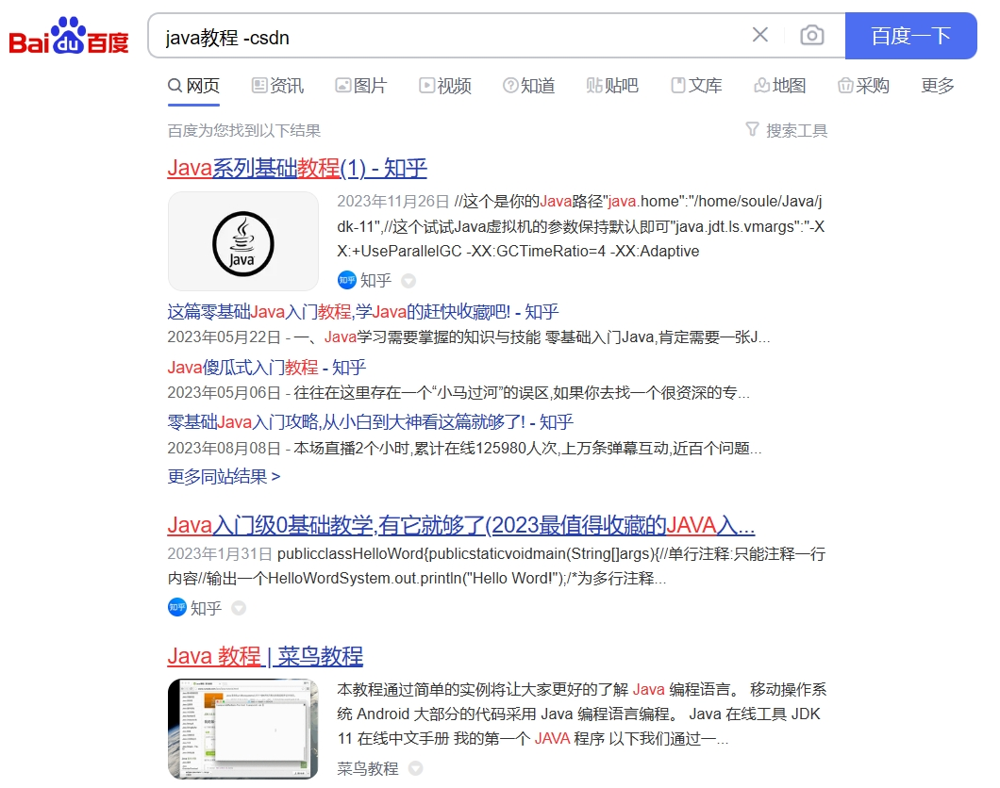
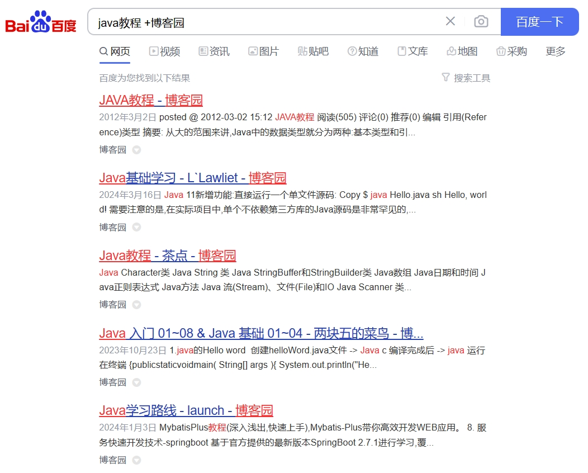
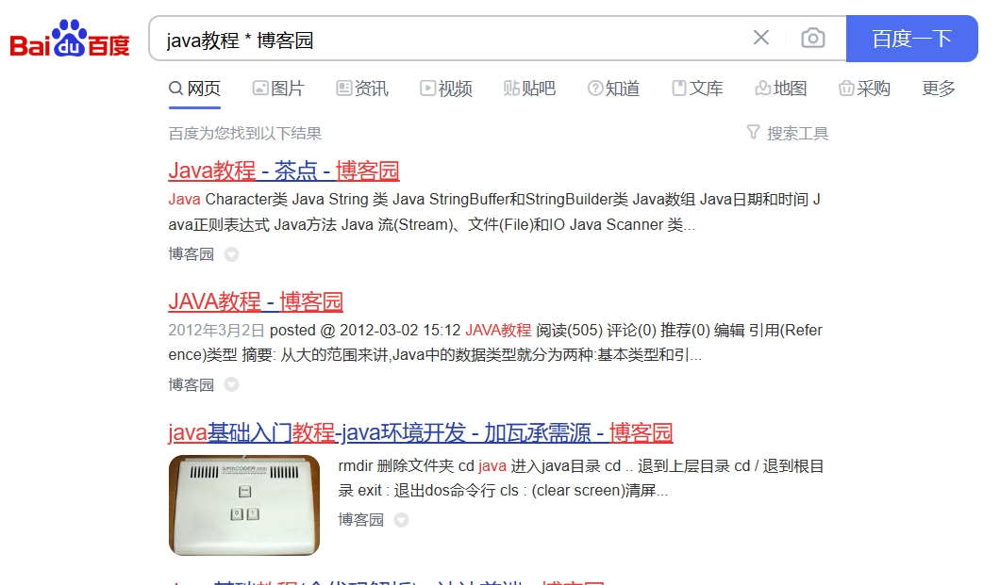
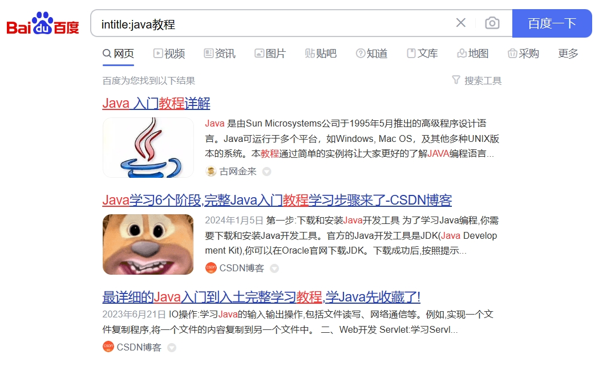
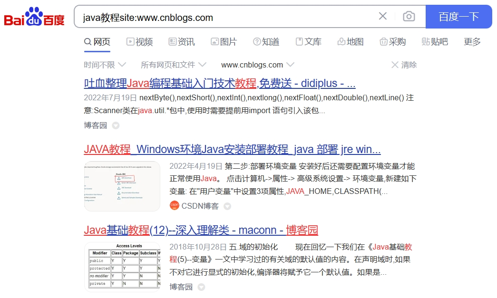
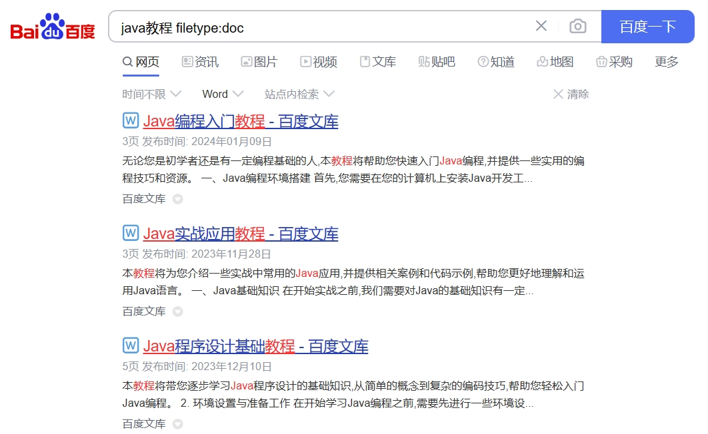
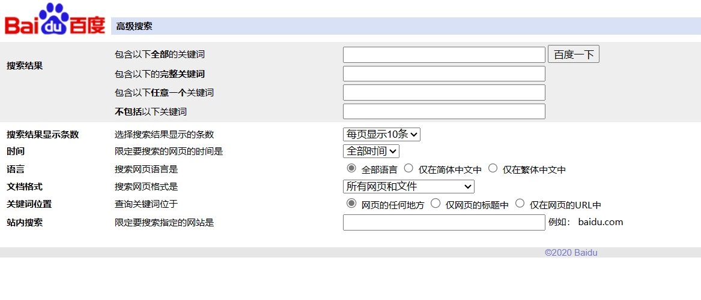

[toc]

# 搜索引擎高级用法

## 过滤不需要的内容

搜索方法：【搜索内容】+【空格】+【减号】+【过滤关键字】

搜索内容后面加上减号和需要过滤的关键字，即可过滤掉不需要的内容。

```
例如：java教程 -csdn
这个会屏蔽与csdn相关的java教程搜索结果
```



## 强制包含需要的内容

搜索方法：【搜索内容】+【空格】+【加号】+【需要关键字】

搜索内容后面加上加号和需要的关键字，强制搜索结果中包含这些关键字。

```
例如：java教程 +博客园
这个主要会查询出与博客园相关的java教程搜索结果。
```



## 准确匹配搜索关键词

搜索方法：【"】+【搜索关键词】+【"】

在搜索关键词前后加上双引号，可以准确匹配搜索关键词

```
例如："java教程"
会准确匹配出java教程搜索结果。
```


## 模糊匹配搜索内容

搜索方法：【搜索内容】+【*】+【搜索内容】

在搜索内容之间使用星号可以进行模糊匹配搜索，找到更多相关内容

```
例如：java教程 * 博客园
会模糊匹配出java教程和博客园，这两个交集的搜索结果。
```



## 指定搜索标题

搜索方法：【intitle：】+【搜索内容】

`intitle:`后面加上搜索内容，可以在搜索结果中指定搜索标题

```
例如：intitle:java教程
会搜索出java教程的搜索结果。
```




## 指定网站搜索

搜索方法：【关键字】+【site：】+【指定网站域名】

在关键字后面加上`site：`和指定网站域名，可以在指定网站内搜索相关内容

```
例如：java教程site:www.cnblogs.com
会在博客园网站域名中搜索java教程的搜索结果
```



## 指定文件类型搜索

搜索方法：【搜索内容】+【空格】+【filetype：】+【文件格式】

搜索内容后面加上“filetype：”和文件格式，可以在搜索结果中指定文件类型

```
例如：java教程 filetype:doc
会搜索与java教程相关的doc文档
```



## 百度高级搜索

百度高级搜索入口是`https://www.baidu.com/gaoji/advanced.html`

