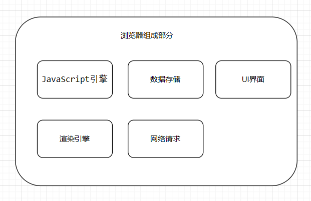

[TOC]

# 浏览器工作原理

## 浏览器的组成部分

- 人机交互部分（UI）
- 网络请求部分（Socket）
- JavaScript引擎部分（解析执行JavaScript）
- 渲染引擎部分（渲染HTML、CSS等）
- 数据存储部分（cookie、HTML5中的本地存储LocalStorage、SessionStorage等）



### 1 渲染引擎

渲染引擎又叫浏览器内核。渲染引擎主要把HTML、CSS代码渲染为用户看到的界面。

不同的浏览器使用的渲染引擎也不相同。例如chrome浏览器渲染引擎是Blink引擎。

渲染引擎的工作原理：
1. 解析HTML构建Dom树（文档对象模型），DOM是W3C组织推荐的处理可扩展置标语言的标准编程接口。
2. 构建渲染树，渲染树并不等同于Dom树，因为像`head标签 或 display: none`这样的元素就没有必要放到渲染树中了，但是它们在Dom树中。
3. 对渲染树进行布局，定位坐标和大小、确定是否换行、确定position、overflow、z-index等等，这个过程叫`"layout" 或 "reflow"`。
4. 绘制渲染树，调用操作系统底层API进行绘图操作。


## 浏览器访问网站的过程

1. 在浏览器地址栏中输入网址。例如https://www.taobao.com
2. 浏览器通过用户在地址栏中输入的URL构建HTTP请求报文。

```http
GET / HTTP/1.1
Host: www.taobao.com
Connection: keep-alive
Upgrade-Insecure-Requests: 1
User-Agent: Mozilla/5.0 (Windows NT 10.0; Win64; x64) AppleWebKit/537.36 (KHTML, like Gecko) Chrome/57.0.2987.133 Safari/537.36
Accept: text/html,application/xhtml+xml,application/xml;q=0.9,image/webp,*/*;q=0.8
Accept-Encoding: gzip, deflate, sdch, br
Accept-Language: zh-CN,zh;q=0.8,en;q=0.6
Cookie: l=Ag0NWp9E8X4hgaGEtIBhOmKxnSOH6kG8; isg=AkZGLTL-Yr9tHDZbgd5bsn4Rlzwg5IphaK-1BzBvMmlEM-ZNmDfacSyDfdgF; thw=cn
```

3. 浏览器发起DNS解析请求，将URL中的域名转换为IP地址。
4. 浏览器将请求报文发送给服务器。
5. 服务器接收请求报文，并解析。
6. 服务器处理用户请求，并将处理结果封装成HTTP响应报文。

```http
HTTP/1.1 200 OK
Server: Tengine
Date: Thu, 13 Apr 2017 02:24:25 GMT
Content-Type: text/html; charset=utf-8
Transfer-Encoding: chunked
Connection: keep-alive
Vary: Accept-Encoding
Vary: Ali-Detector-Type, X-CIP-PT
Cache-Control: max-age=0, s-maxage=300
Via: cache8.l2cm10-1[172,200-0,C], cache13.l2cm10-1[122,0], cache3.cn206[0,200-0,H], cache6.cn206[0,0]
Age: 293
X-Cache: HIT TCP_MEM_HIT dirn:-2:-2
X-Swift-SaveTime: Thu, 13 Apr 2017 02:19:32 GMT
X-Swift-CacheTime: 300
Timing-Allow-Origin: *
EagleId: 9903e7e514920502659594264e
Strict-Transport-Security: max-age=31536000
Content-Encoding: gzip

<!DOCTYPE html>
<html lang="zh-CN">
<head>
<meta charset="utf-8" />
<meta http-equiv="X-UA-Compatible" content="IE=edge,chrome=1" />
<meta name="renderer" content="webkit" />
<title>淘宝网 - 淘！我喜欢</title>
<meta name="spm-id" content="a21bo" />
<meta name="description" content="淘宝网 - 亚洲较大的网上交易平台，提供各类服饰、美容、家居、数码、话费/点卡充值… 数亿优质商品，同时提供担保交易(先收货后付款)等安全交易保障服务，并由商家提供退货承诺、破损补寄等消费者保障服务，让你安心享受网上购物乐趣！" />
<meta name="aplus-xplug" content="NONE">
<meta name="keyword" content="淘宝,掏宝,网上购物,C2C,在线交易,交易市场,网上交易,交易市场,网上买,网上卖,购物网站,团购,网上贸易,安全购物,电子商务,放心买,供应,买卖信息,网店,一口价,拍卖,网上开店,网络购物,打折,免费开店,网购,频道,店铺" />
</head>
<body>
......
</body>
</html>
```

7. 服务器将HTTP响应报文发送给浏览器。
8. 浏览器接收服务器响应的HTTP报文，并解析。
9. 浏览器解析HTML 页面并展示，在解析HTML页面时遇到新的资源需要再次发起请求。
10. 最终浏览器展示出了页面

## DNS域名解析的过程


## 浏览器解析HTML构建Dom树

参考代码:
```html
<html>
  <body>
    <p>Hello World</p>
    <div> </div>
  </body>
</html>
```


## 浏览器解析CSS构建Dom树

