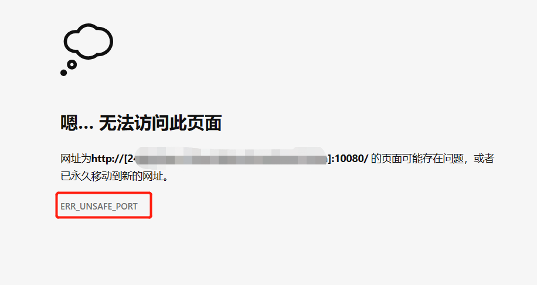
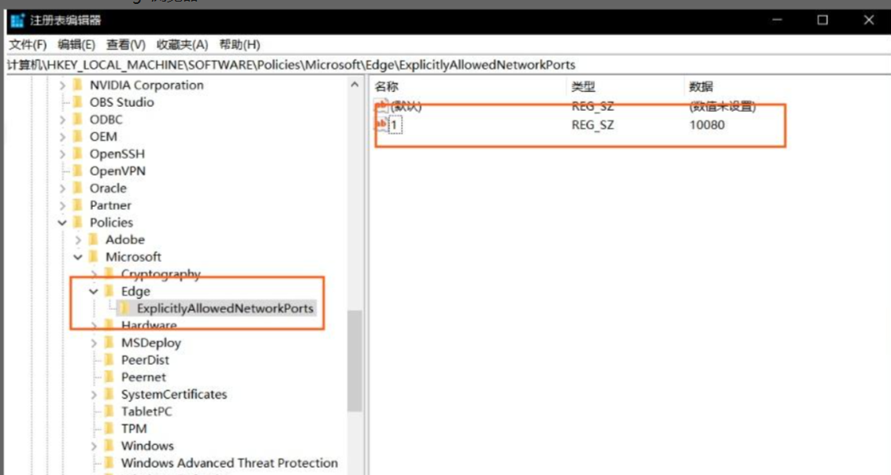

[toc]

# 浏览器的ERR_UNSAFE_PORT问题

[参考链接](https://zhuanlan.zhihu.com/p/383077079)

浏览器在访问某些使用特殊端口(例如10080端口)的网站时，会出现无法访问的情况，错误代码为ERR_UNSAFE_PORT。



百度查询后发现是各家浏览器集体封杀了很多非安全端口。若访问这些端口就会出现这个错误。简而言之，这个问题和浏览器有关，和服务器没关系。

部分非安全端口

```
1,    // tcpmux
7,    // echo
9,    // discard
11,   // systat
13,   // daytime
15,   // netstat
17,   // qotd
19,   // chargen
20,   // ftp data
21,   // ftp access
22,   // ssh
23,   // telnet
25,   // smtp
37,   // time
42,   // name
43,   // nicname
53,   // domain
77,   // priv-rjs
79,   // finger
87,   // ttylink
95,   // supdup
101,  // hostriame
102,  // iso-tsap
103,  // gppitnp
104,  // acr-nema
109,  // pop2
110,  // pop3
111,  // sunrpc
113,  // auth
115,  // sftp
117,  // uucp-path
119,  // nntp
123,  // NTP
135,  // loc-srv /epmap
139,  // netbios
143,  // imap2
179,  // BGP
389,  // ldap
465,  // smtp+ssl
512,  // print / exec
513,  // login
514,  // shell
515,  // printer
526,  // tempo
530,  // courier
531,  // chat
532,  // netnews
540,  // uucp
556,  // remotefs
563,  // nntp+ssl
587,  // stmp?
601,  // ??
636,  // ldap+ssl
993,  // ldap+ssl
995,  // pop3+ssl
2049, // nfs
3659, // apple-sasl / PasswordServer
4045, // lockd
6000, // X11
6665, // Alternate IRC
6666, // Alternate IRC
6667, // Standard IRC
6668, // Alternate IRC
6669, // Alternate IRC

```


## 解决方法

若想解决这个问题。首先可用更改服务器上的web服务端口，例如把10080端口改为其他安全的端口。

如果不想更改web服务的端口，那么就要更改浏览器设置了。

### chrome浏览器

关闭chrome浏览器->桌面找到浏览器快捷方式图标->点击右键选择属性->在【目标】后追加 空格+`--explicitly-allowed-ports=`+访问端口->点击【保存】->双击浏览器快捷方式图标，重新打开浏览器。

```
# 空格+下面字符串+端口
 --explicitly-allowed-ports=10080
```

### edge浏览器

win+R打开搜索栏，输入regedit，打开注册编辑器。进入计算机`\HKEY_LOCAL_MACHINE\SOFTWARE\Policies\Microsoft\Edge\ExplicitlyAllowedNetworkPorts`，此路径不一定存在，可自行创建。

然后在 ExplicitlyAllowedNetworkPorts 新建一个名称为 1 的字符串值，修改其值为10080。最后重启浏览器，访问端口为10080的地址。



