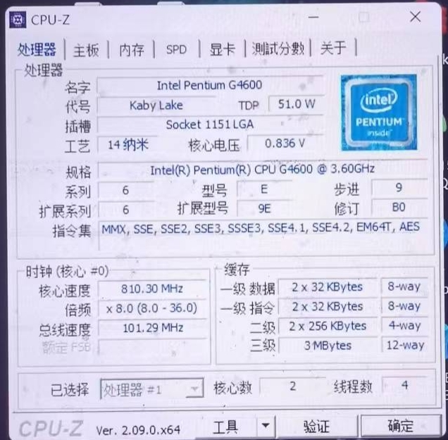
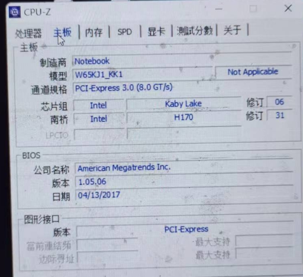
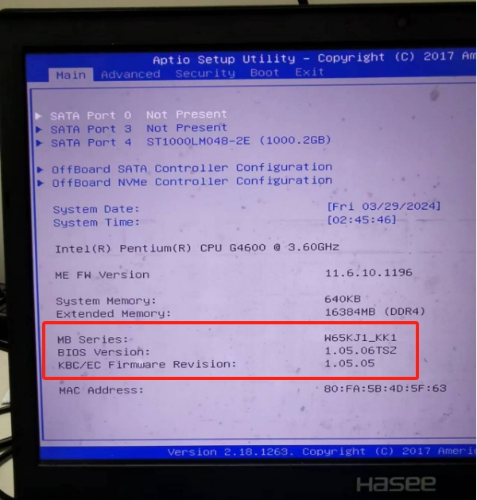
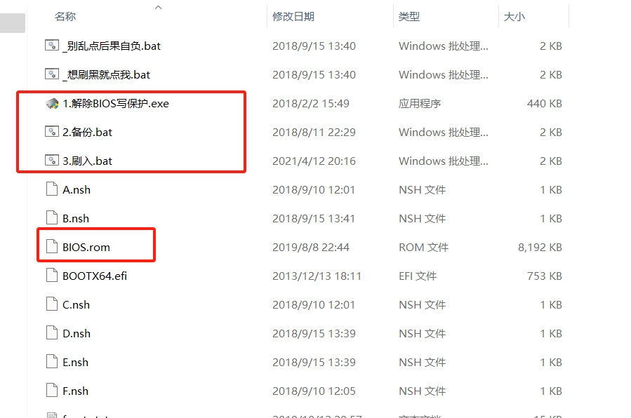
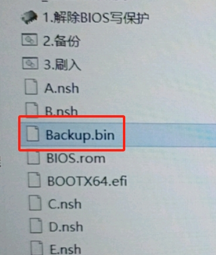
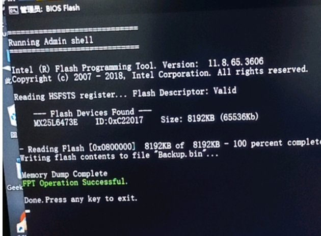
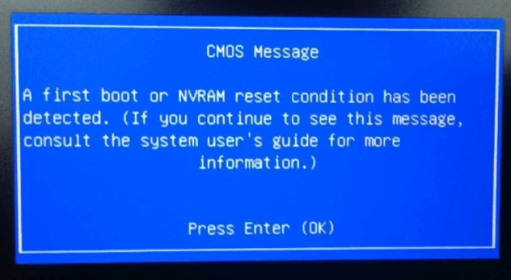
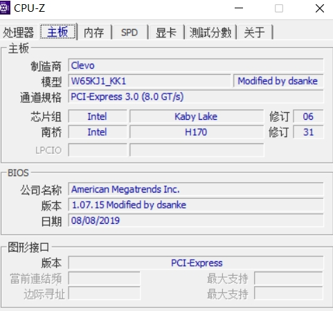
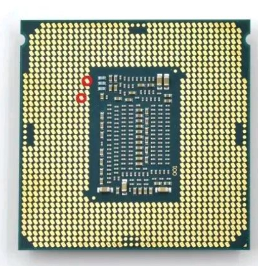

[toc]

# 神舟战神K670D刷Bios

目前手上的笔记本电脑型号为神舟战神K670D-G4D3。

原装的CPU是七代的奔腾G4600。原装的bios版本是1.05.06。这个笔记本的模具是蓝天的，并且CPU是可以更换的。

CPU-Z截图和Bios截图




也就是说如果你觉得奔腾G4600的性能无法满足你，那么你可以更换第七代CPU。

但是如果要更换第8/9代的intel CPU，那么需要更新这个笔记本的bios版本。

## 更新BIOS

更新BIOS的文件如下。下面的链接是网上找到的。自己也在百度网盘进行了备份。

```
链接：https://pan.baidu.com/s/1hGePSe1-fITRQTmz4MBZUg
提取码：K670
```

文件截图


BIOS.rom是1.07.15版本的bios文件。

更新方法：3个脚本文件。按1-2-3顺序分别以管理员身份运行一次就好了。

注意事项：
1.  运行以上三个脚本前请关闭所有其他软件。如果你的window系统设置了pin登录，麻烦先把pin登录关掉。
2. 另外如果windows系统用自己的微软账户登录，麻烦更换为本地账户。并且将登录密码去掉。简而言之就是直接登录。
3. 管理员运行第一个脚本文件（解除BIOS写保护），电脑会自动重启然后进入强冷模式。
4. 管理员运行第二个脚本文件（备份.bat），备份完成后，当前目录会出现Backup.bin备份文件。



5. 管理员运行第三个脚本文件（刷入.bat）。运行完后手动重启电脑。此时电脑会黑屏，我们需要等15分钟强制关机再开机。当开机后会有蓝色提示框，按回车就行了，电脑会自动重启，到此就刷好了。

刷入截图

蓝色提示框截图


6. 最后再重启一次电脑，如果出现了蓝天的Logo。那表示Bios更新成功了。刷新Bios后笔记本电脑的开机Logo，从战神变为了蓝天。

蓝天Logo截图


主板截图

此时主板的Bios版本从1.05.06变成了1.07.15

## 更换CPU

当更新了Bios版本之后，这款笔记本可以更换为8/9代的CPU。

更换CPU，要考虑笔记本的供电和散热能力。否则及时更换性能好的CPU，笔记本也无法驾驭。

- 如果更换i3-8100 CPU，那么不需要屏蔽CPU触点。
- 如果更换i5-8400 CPU,那么需要屏蔽CPU上的两个触点。并且这款CPU的性能不错，发热量不大。推荐更换。

i5-8400 CPU的屏蔽点位



```
//网上找到评测
推荐换
i3 8100 i3 8350K i5 8400(待机55度左右左右)
i7 8700(温度超级高)
i3 9100 i3 9320 i5 9400(待机55度左右)
i7 9700(温度超级高)
```
