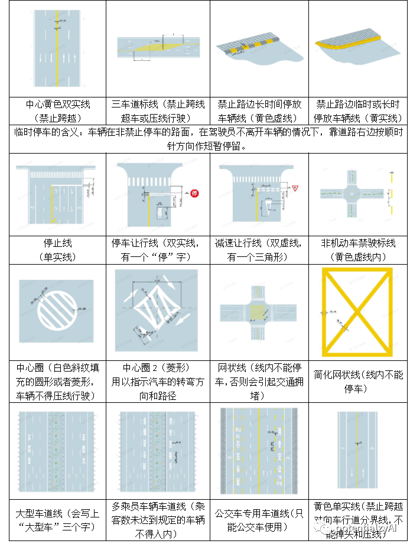

[toc]

## 科目一考点总结

记录时间：2023-03-29

科目一考试总时间为45分钟，考试试卷由100道题目组成，题型为判断题和单项选择题，每一题一分，满分100分，90分合格。考试试卷由系统按《机动车驾驶证工作规范》规定的比例关系随机抽取、组合。

### 驾驶证相关

#### 驾驶证申请条件

初次申领不可以申：大、中型客车；所有的牵引挂车
18岁以上：申领小汽车（C1，C2）、摩托车。
20岁-60岁：城市公交车、中型客车、大型货车、轻型牵引挂车、无轨电车或者有轨电车
22岁-60岁：大客车、重型牵引挂车。
70以上，需要每年进行一次身体检查。在每次记分周期（1年）结束后的30天内，提交检查证明。

口诀：
20-60轻挂
22-60重挂
2货（20岁申领货车）

#### xx年不得申请驾驶证的

口诀： 假1吊2撤（骗，毒）3醉5逃终生。

作弊=假，不正当手段=骗

假1就是提供假材料申领驾驶证的，一年内不得报考;
吊2就是吊销驾驶证后两年内不得报考;
撤（骗，毒）3指的是被撤撤销驾驶证的，三年内不得报考
醉5指的是醉驾被吊销驾照的，五年内不得报考;
逃终生指的是交通肇事逃逸的，终身不能报考驾驶证。

==PS：若醉酒构成犯罪的，终生不能报考。==

#### 违规申领驾驶证

1. 申领驾驶证过程中，申请人隐瞒或提供假材料，处以500以下罚款，并一年内不得再次申领驾驶证。
2. 申请人在考试中舞弊，贿赂的，取消考试资格。处以2000以下罚款，并一年内不得再次申领驾驶证。
3. 申请人以不正当手段取得驾驶证的，处以2000以下罚款，并三年内不得再次申请驾驶证。
4. 组织参与上面三种行为的，从而获取利益的，处以3-5倍，最高10万元罚款。

#### 驾驶证有效期

* 驾驶证有效期为6年，10年，长期
* 6年内，若每个记分周期（1年）都未满12分，则换10年证
* 10年内，若每个记分周期（1年）都未满12分，则换长期证。

#### 驾驶证遗失补证

1. 驾驶证遗失，驾驶人向驾驶证核发地或核发地以外的车辆管理所进行补发。
2. 车辆管理所1日内补发驾驶证。补发后，旧驾驶证作废
3. 驾驶证若被依法扣押，扣留或暂扣期间，则不能申请补发
4. 使用旧驾驶证，需处20-200的罚款。

==(补证1天，补牌15天，换证90天，临时牌3天过期)==

#### 驾驶证更换

1. 在有效期满90天内，向驾驶证核发地或核发地以外的车管所申请换证。
2. 若驾驶人在原车管所管辖区以外的地方居住。可以向居住地车管所申请换证。
3. 若驾驶人户籍迁出原车管所管辖区，可以向迁入地车管所申请换证。

#### 驾驶证如何注销

以下情况，车辆管理所将注销驾驶证
* 死亡，身体原因的
* 申请注销的
* 吸毒驾驶，或正在戒毒的。
* 驾驶证有效期1年以上没有换证的
* 70岁以上没有及时提交身体证明的
* 被依法吊销或撤销的

#### 实习期

取得驾照后的12个月内为实习期。
实习期内，在高速公路上行驶，需要持相同或包含其准驾车型3年以上人员同行。
实习期内，不准驾驶挂车或特殊（公交，消防等）车辆。
实习期内，不得参与记分减免。

#### 增加准驾车型

1. 取得小型汽车1年以上申请增加轻型挂车。
2. 取得小型汽车2年以上才能增加中型客车，或重型牵引车。
3. 取得小型汽车3年以上才能申请大型客车。

==口诀：轻1，中2，大客3==

#### 兵役、出国(境)等原因

驾驶人因兵役，出国等原因无法在规定时间内换证等，可以向车管所延期不超过3年。延期期间不得驾驶机动车。

#### 驾驶证审验

驾驶证审验类似与机动车年审，只不过审验针对的是驾驶证。

当驾驶人发生需要换证或违法事故的时候，需要去交管局参加审验或者审验教育。

驾驶证审验内容包括：
1. 违法行为和交通事故的处理情况
2. 身体条件情况
3. 记分和记满12分的学习和考试情况。

### 机动车

#### 车型

A1 大型客车
A2 重型牵引挂车
B1 中型客车
B2大型货车 
C1小型手动挡汽车 
C2小型自动挡汽车
C3 低速载货货车 
C4三轮汽车 
C5残疾人专用小型自动挡载客汽车 
C6轻型牵引挂车

C1驾照可以开：C2、C3、C4、
C2驾照可以开：只能开自动挡的车
C4驾照只能开C4 

B1中客，B2大货，C6轻挂

#### 车牌丢失，损毁的

机动车号牌丢失，损毁等情况下，需要向登记地车管所申请补发，换发。
车管所15天内补发，号码不变。申请人在15天内可以用临时号码牌。
号牌补发后，原号牌作废。
收到新号牌后，临时号牌三天内过期。

==(补证1天，补牌15天，变更30天，换证90天，临时牌3天过期)==

#### 驾驶报废机动车

驾驶拼装机动车或已达到报废标准机动车，处以200-2000元罚款。

达到报废标准的机动车，应该登记地车管所申请注销登记后，把机动车交售给回收企业。

#### 机动车登记

有下列情况的，需要在30天内向登记地车管所进行变更登记：
1. 更换车身颜色，发动机，车身或车架
2. 因质量问题需要更换整个车辆。
3. 机动车所有人住所迁出迁入车管所管辖区域的。
4. 机动车所有人姓名，联系方式变更的。

有下列情况的，需要向登记地车管所进行注销登记：
1. 车辆达到报废标准
2. 提出注销申请的

当你的机动车登记被依法撤销后，车管所会主动注销你的机动车登记。

==（注意：当不改变车的本身属性和驾驶人信息的时候，不需要变更登记。若改变则需要登记。）==

==机动车在抵押登记，质押备案期间可以办理转让登记。==

#### 机动车安全技术检验（年检）

机动车自注册登记起，需按照以下期间进行按照检验：
1. 营运载客车5年内每年检验1次，超过5年，每6个月1次。
2. 载货汽车和大中型非营运载客汽车10年内每年检验1次，超过10年，每6个月检验1次。
3. 非营运小微载客汽车，第6，10年才需要进行检验。另外10年内每两年需要向公安机关申领检验标志。超过10年的，每年检验1次。

#### 扣留机动车的情况

无两证（驾驶证，行驶证），两标（保险标志，合格标志），一牌（车牌）的扣留机动车。

### 记分

记分分值包含：12分，9分，6分，3分，1分。
一次记分周期为12个月，满分为12分
记分周期从驾驶人初次领取驾驶证之日起连续计算或者初次领取临时驾驶许可之日起累计计算。

校客危：校车、中型以上载客载货汽车、危险物品运输车辆
高快：高速公路、城市快速路
普通路：高速，城市快速之外的其他路

#### 1分

* 不系安全带
* 违反禁令标志标线
* 不按规定使用灯光
* 不按规定会车，普通路上不按规定倒车掉头
* 机动车载货长宽高超规定的
* 普通车未年检的
* 摩托车不带头盔的

#### 3分

* 打电话
* 不按规定超车让行，普通路上逆行的
* 车辆故障后，不按规定使用灯光或警告标志的。
* 不让行人，校车的
* 不按规定安装车牌的
* 校客危未年检的
* 货车疲劳驾驶的
* 高速路上车速低于60的

疲劳驾驶：指连续驾驶4小时未休息，或休息时间少于20分钟的。

#### 6分

* 不按交通指示灯开车的（闯红灯）
* 驾驶证暂扣期间开车的
* 运危险品的车辆没挂警示标志
* 造成致人轻微伤或者财产损失的交通事故后逃逸，尚不构成犯罪的
* 违法占用应急车道

#### 9分

* 在高速公路或者城市快速路上违法停车的
* 未挂车牌或故意遮挡车牌的
* 驾驶与准驾车型不符的机动车的；
* 没有资格开校车的
* 客车疲劳驾驶的

疲劳驾驶：指连续驾驶4小时未休息，或休息时间少于20分钟的。

#### 12分

* 酒后开车的
* 用假车牌，假证的
* 造成致人轻伤以上或者死亡的交通事故后逃逸，尚不构成犯罪的；
* 在高快路上倒车逆行掉头的
* 替人记分获取利益的

#### 超速记分

超速记分口诀:
* 普通车普通路上25，36，高快路上25，6，12。
* 校客危普通路上125和169。高快路上20上下6，12。

#### 超载记分

超载记分口诀：
1. 普通车超载2，5,10，扣分3，6，12。7座以上扣+3 （普车超载2510，扣分3612，7座以上要+3）
2. 校客超载不留情，20上下，6，12
3. 货车超载,未达30扣1分,50上下扣36。

#### 记分小结

不扣安全带1分，不带头盔1分，打电话3分。
长宽高扣1分 
擅自改造车辆结构扣1分	 
灯光13（不按规定使用灯光1分，车辆故障后不按规定使用灯光和放置警告标志的3分）
年检13（普通车1分，校客危3分）
车牌3，9，12（不按规定 < 不挂，遮挡 < 伪造变造）
疲劳驾驶货3客9
轻微财产逃逸6分，轻伤死亡逃逸12分

普通路上，违法倒车1分，逆行3分。
高快路上，慢行3分，占道6分，停车9分，倒车逆行12分。
（普通路上倒逆13）
（高快路上慢3占6停9倒逆12）

不按禁令标志，不按规定会车1分 < 不按规定车道行驶，借道穿插3分 < 不按交通灯6分（闯红灯）
不按规定车道XXX扣3分
穿插借道扣3分
礼让3分（不让行人校车3）

危险车辆不挂警告标志6分。
（危险车辆未经批准，未按指定时间速度路线的，扣6分）

有证6，无证9（暂扣驾驶证期间开车的6分，驾驶准驾不符的与无资格驾驶校车的9分）

获取利益的12分（替人记分获取利益12分）

酒后开车12分

#### 满分处理

驾驶人一个记分周期内满12分，会被扣留驾驶证。对于临时入境的驾驶人，则会被注销临时机动车驾驶许可。

##### 满分学习教育

大车：（大中型客车，大货车，重型挂车，公交车）
1. 每次满分学习天数为30天，若一个记分周期内多个满分，则每多一次增加30天，最多120天。
2. 现场学习，网络天数不得少于10天。其中现场学习不得少于5天。剩余天数自主学习

小车（其他车）：
1. 每次满分学习天数为7天，若一个记分周期内多个满分，则每多一次增加7天，最多60天。
2. 现场学习，网络天数不得少于5天。其中现场学习不得少于2天。剩余天数自主学习

##### 满分考试

一个记分周期内满12分参加科一
一个记分周期内满24分参加科一科三
一个记分周期内满36分参加科一科二科三

科一（法律法规）科二（场地），科三（道路）

#### 记分减免

驾驶人可以参加交通安全教育来扣减记分。在一个记分周期内累计最高扣减6分。
1. 网上学习的：3天内，累计满30分钟。一次扣减一分。
2. 现场学习的：满1小时1次，一次扣减2分。
3. 参加公益活动的: 满1小时1次，一次扣减1分。

下列情况不可以参加记分减免：
1. 本记分周期内或上个记分周期内，有两次以上12分的。==（两次满分不减分）==
2. 驾驶人实习期内
3. 驾驶证逾期未年检或被扣留的
4. 驾驶人名下有超期或没有办注销的车
5. 最近3个记分周期内，驾驶人有过一次扣十二分的情形（酒、逃、伪造、消分）或者在满分教育中弄虚作假的不可以参加减分。

#### 记分执行

若驾驶员一个记分周期内未达到12分，则该记分周期内的记分清除。

若驾驶人有罚款未交的，则罚款对应的分数会转入下个记分周期。

驾驶人可以一次处理一辆车的多个违法记录。若累计分值不超过12分，则可以处理其他车辆的违法记录。若累计分值达到12分，则不可以处理其他车辆的违法记录。

### 交通信号灯

绿灯亮：准许通行，但是转弯车辆需要让直行车辆。

黄灯亮：前轮越过停车线的车辆可以继续通行。
黄灯闪烁：表示前方是危险路段，提示车辆行人慢行，确认安全后缓慢通过。
三个框的黄灯表示交通信号暂时解除。
一个框的黄灯表示前方是危险路段，提示车辆行人慢行，确认安全后缓慢通过。

红灯亮：禁止车辆直行。但是右转弯车辆在不妨碍的情况下，可以通行。
（红灯：不可直行，可右转弯）

绿色箭头灯亮：准许车辆按指示方向通行。
红色箭头灯亮；禁止车辆按指示方向通行。

箭头灯相比圆灯增加了方向限制。

### 道路交通线

1. 虚线可变道，掉头，转弯，超车，实线不可变道，掉头，转弯，超车。
2. 网状线区域禁止车辆逗留

### 车灯

雪天、沙尘、冰雹、能见度低的情况，开前照灯、示廓灯和后尾灯。若是雾天可额外开启雾灯。

#### 开近光灯的情况

1. 夜间行驶在窄路窄桥，有路灯的道路上使用近光灯。
2. 没中心线，夜间会车，150米外改为近光灯
3. 夜间行驶在路口，有人则使用近光灯，无人则交替远近光灯
（总结：夜间有人有路灯或有交通信号灯的危险路段，用近光灯）

#### 开远光灯的情况

照明条件不好的可以开，平时很少开

#### 雾灯

雾天开启雾灯。其他天气不能开

#### 交替使用远、近光灯的情况

无交通信号灯的路口，夜间急弯，坡路、拱桥、人行道，交替使用远、近光灯

（总结：夜间无人无路灯无交通信号灯的危险路段，用远近光灯交替）

#### 危险报警闪光灯

1. 牵引车和被牵引车在行驶中，两者都要开启危险报警闪光灯。
2. 当车辆在道路上故障无法移动时，开启危险报警闪光灯。
3. 车辆在能见度低天气（雾，雨，雪）下临时停车时，开启危险报警闪光灯

### 普通道路行车规定

#### 停车规定

【距站30米不停车】距公交站、急救站、消防站30米内不能停车

【距路50米不停车】距交叉路口、铁道口、弯路、宽度小于四米的窄路、窄桥、陡坡、隧道等危险路段 50米内不能停车。

#### 停车线

* 蓝色停车线：免费
* 白色停车虚线：限时，收费
* 黄色停车线：专用

#### 变更车道

向左变更车道，提前开启左转向灯。向右变更车道，提前开启右转向灯。

#### 超车规定

1. 超车时，应当提前开启左转向灯,还可以远近光灯交替或按喇叭提示前车减速让行。
2. 无中心线道路时，若后车要超车，则条件允许的情况下，可以靠边行驶，让后车超车。
3. 若后车从前车左侧超车，超车后。要开启右转向灯，行驶回原车道。

#### 倒车规定

不得在铁路道口，交叉路口，单行路，急弯，隧道等容易发生危险的路段倒车。

#### 掉头规定

不得在铁路道口，交叉路口，单行路，急弯，隧道等容易发生危险的路段掉头。

#### 会车先行规定

机动车遇到相对方向车辆时，应该遵守：
1. 在障碍路段，无障碍一方先行。有障碍到一半，有障碍先行。
2. 在坡路段，上坡先行，下坡到一般，下坡先行。
3. 在狭窄山路上，不靠近山体的一方先行。

（上坡先行，无障碍先行，不靠近山体的先行）

#### 夜间会车规定

1. 夜间会车，在距离来车150米外用近光灯。（150米内就来不及了）
2. 在窄路，窄桥与非机动车会车时，用近光灯。

#### 交叉路口通行

1. 转弯让直行
2. 右方道路来车先行
3. 相对方向的右转弯车让左转弯车先行。（相对方向，右弯让左弯）
4. 准备进入环形路口的让已在环形路口的先行。(环外让环内)

#### 环岛路口

因我国实行右侧通行原则，所以按逆时针方向进入环岛。进环岛不用开转向灯，出环岛时要开右转向灯。

#### 限速通行规定

1. 道路无中心线时：城市道路最高30，公路最高40。（无中心线，城市30公路40）
2. 道路有中心线时：城市最高50，公路最高70.（有中心线，城市50公路70）

以下情况最高速度不得超过30：
1. 进出非机动车道，窄路窄桥，铁路道口时
2. 掉头，转弯，下坡时
3. 下雨，沙尘，雾，等能见度50米内时
4. 行驶在冰雪，泥泞道路时
5. 牵引故障机动车时，牵引车不得超过30

==（总结：不容易行驶，危险路段或视线不佳的情况下，一般速度不得超过30）==

#### 有无中心线道路

在无中心线道路上，车辆在道路中间行驶。
在有中心线道路上，车道在中心线两边行驶。

#### 车辆故障处理

在普通道路上，机动车发生故障时，应该开启危险报警闪光灯，并在车后50-100米内放置警告标志。若是夜间，还应该开启示廓灯和后位灯。

在高速公路上，机动车发生故障时，应该开启危险报警闪光灯，并在车后150米外放置警告标志。若是夜间，还应该开启示廓灯和后位灯。此外人员转移到应急车道上。

总结：
1. 高速故障：150米外设置警示标志，开启危险报警闪光灯，夜间还要开启示廓灯，后位灯。
2. 非高速故障：50-100米内设置警示标志，开启危险报警闪光灯，夜间还要开启示廓灯，后位灯。

#### 交通事故责任

1. 交通事故逃逸的，承担全部责任。若对方有错，可减轻责任。
2. 故意破坏现场的，承担全部责任。

若机动车之间发生交通事故：
1. 有过错一方的承担赔偿责任。若双方都有错误，则按比例分担责任。

若机动车与行人，非机动车发生交通事故：
1. 若行人非车无过错，机动车承担责任。
2. 若行人非车有过错，根据过错程度减轻机动车责任
3. 若机动车没有过错，则机动车最高不超过10%责任。
4. 若行人非车故意碰撞机动车的，机动车不承担责任。

#### 漫水桥路段行车

机动车经漫水桥路段时，应该停车察明水情，确认安全后，低速通过。

（涉及到漫水桥的题目，没有写停车察明水情的选项是错的。）

#### 遇见校车的行车规定：

1. 同方向1条车道上校车停车时，后方车辆应该停车等待，不得超车。
2. 同方向2条车道以上校车停车时，校车所在车道后方车辆和相邻车道后方车辆应该停车等待，不得超车。其余车道车辆减速慢行。

机动车不得鸣喇叭或用灯光催促校车。

### 高速行车规定

#### 高速禁止行为

* 倒车，逆行，停车。
* 在匝道，加速车道或减速车道进行超车。
* 在应急车道行驶或停车。
* 试车或学习驾驶车辆。
* 高速公路上最高时速不得超过120公里/小时。
* 行人，非机动车或设置最高时速不高于70公里/小时的车辆，不得进入高速公路。
* 高速距离出入口 1km 处不得超车，变道。

#### 高速车距要求

1. 车速超过100公里/小时，车距保持100米以上
2. 车速低于100公里/小时，车距保持50米以上

==（高速车距：车速100以上，车距100以上。车速100以下，车距50以上。）==

#### 高速车辆故障处理

高速路上车辆故障时，在来车方向150米以外设置警告标志，开启危险警告灯。若是夜间则要开启示廓灯和后位灯。人员尽快到应急车道上。

#### 高速限速规定

1. 高速最高时速不超过120，最低时速不小于60
2. 2条车道的，左侧车道最低车速为100。
3. 3条以上车道的，最左车道最低车速为110，中间车道最低车速为90。

高速车速规定：小车最高120，其他车最高100，摩托车最高80

#### 进出高速公路

驶入高速公路：匝道->加速车道
驶出高速公路：减速车道->匝道

入高速：开启左转向灯，驶入车道。
出高速：开启右转向灯。降低车速离开高速。

匝道本身是限速到40的，不能在匝道上加速减速。

#### 高速低能见度环境的规定

当高速上遇见雾，雨等恶劣环境时，需遵守下列规定：
1. 能见度<200米时，开启雾灯，近光灯，示廓灯，前后位灯。车速不超过60。车距保持100米以上。
2. 能见度<100米时，开启雾灯，近光灯，示廓灯，前后位灯和危险报警闪光灯。车速不超过40。车距保持50米以上。
3. 能见度<50米时，开启雾灯，近光灯，示廓灯，前后位灯和危险报警闪光灯。车速不超过20。并从最近出口离开高速。

总结：高速低能见度环境车速车距
* 能见度50以内，车速<20,并从最近出口离开高速。
* 能见度50-100以内，车速<40, 车距>50
* 能见度100-200以内，车速<60, 车距>100

### 罚款

#### 20以上200以下

关键字：旧驾驶证，实习期，变更信息

#### 200以上500以下

（扣证补领250，身体不适250。逾期不审250）

#### 200以上2000以下

扣证驾驶，他人开车，超速50，拼装报废，损害交通设施，造成财产损失,非法按照警报器的200-2000

#### 200以下，500以下

未按照规定XXX的/未及时XXX的罚款200以下。不按规定不用罚很多钱。
简单改变车身外观200以下（喷涂等）
改变车身参数相关500以下。

#### 驾驶证和机动车登记相关处罚

#### 审验，满分，减分教育相关处罚

#### 酒驾相关处罚

酒驾1000-2000，暂扣6个月驾驶证。
再次酒驾1000-2000，10日拘留，吊销驾驶证。
酒驾营运车5000
醉驾不罚款，追究刑事责任

（酒驾1000-2000，酒营5000）

#### 其他处罚

安全带罚50
伪造变造检验、保险标志，1000-3000罚款
伪造变造驾驶证行驶证的，2000-5000罚款
未按照国家规定缴纳保险的，扣留机动车，处保费2倍罚款。
==（伪造变造25千）==

#### 罚款总结

##### 记分罚款：
1. 机动车驾驶人请他人代为接受交通违法行为处罚和记分并支付经济利益的，违法所得3倍以下罚款，最高不超过5万元
2. 代替驾驶人接受处罚记分的，处以3倍以下，最高5万罚款。
（买分卖分，3倍5万）
3. 组织买分卖分的，5倍10万
（组织买卖，5倍10万）

##### 教育中弄虚作假1000：
1. 满分教育中弄虚作假，罚1000以下
2. 记分减免教育中弄虚作假，罚1000以下。
3. 审验教育中弄虚作假，罚1000以下。

##### 代替他人教育2000
1. 代替他人参加满分教育，罚款2000以下
2. 代替他人参与记分减免教育，罚款2000以下
3. 代替他人参与审验教育，罚款2000以下

##### 考试作弊2000：
申请人在考试中贿赂舞弊，罚款2000以下

##### 不正当手段2000：
1. 以欺骗，贿赂等不正当手段取得驾驶证的，罚款2000以下。
2. 以欺骗，贿赂等不正当手段取得机动车登记的，罚款2000以下。
3. 以欺骗，贿赂等不正当手段补领，换领机动车号牌，行驶证的。罚款2000以下。

##### 组织罚款：
1. 组织在审验教育，满分教育，记分减免教育中，有违法所得的，3倍2万。无违法所得的，2万以下。（组织教育，3倍2万）
2. 组织买分卖分的，5倍10万。（组织买卖，5倍10万）
3. 组织在驾驶证和机动车登记中获取利益的，3-5倍，10万以下。（组织驾驶证机动车登记，35倍10万）
4. 申请人在驾考中组织作弊的，构成犯罪的，3-7年有期徒刑并处罚金。

##### 假材料罚款500：
1. 隐瞒情况，提供虚假材料申领驾驶证，罚500。
2. 隐瞒情况，提供虚假材料申请机动车登记的，罚500。

#### 罚款题目技巧

1. 一般情况下罚款题目中，有20的不选。除了实习期上高速和旧驾驶证，变更信息的题目。
2. 对于xxx处罚xxx处理之类的题目。按照先罚款，后吊销驾驶证的选项。
3. 当驾驶证被暂扣期间的题目，不会收到吊销驾驶证处罚，会收到拘留处罚（因为驾驶证已经被暂扣了）

### 饮酒，醉酒驾车

20-80ml是饮酒
80ml以上是醉酒

口诀：20-80是饮酒，大于80是醉酒。

饮酒驾车：
1. 暂扣6个月驾驶证，罚款1000-2000。
2. 若再次饮酒驾驶，处10日拘留，罚款1000-2000，吊销驾驶证。
3. 饮酒开营运车的，15天拘留，5000罚款，吊销驾驶证，5年内不得获取驾驶证。

醉酒驾车：
1. 醉酒驾车，先约束到酒醒。然后吊销驾驶证，5年内不得获取驾驶证。
2. 醉酒开营运车的，先约束到酒醒，吊销驾驶证，10年内不得获取驾驶证。终生不能开营运车。

饮酒或醉酒导致重大事故，构成犯罪的，吊销驾驶证并且终生不得获取驾驶证。

==PS: 醉酒开小车是5年不得获取驾驶证。醉酒开营运车是10年不得获取驾驶证。==

### 交通肇事罪

具有下列情形的，以交通肇事罪处罚：
1. 酒驾毒驾
2. 无证驾驶
3. 明知安全装置失灵仍然驾驶车辆的
4. 严重超载驾驶的
5. 事故后逃逸的

无证驾驶是交通肇事罪。要除以拘役和罚金

0. 造成交通事故后逃逸的，终生不得获取驾驶证。
1. 事故造成财产损失或死亡的，3年内。
2. 事故后逃逸的，3-7年
3. 事故后逃逸并致人死亡的，7年以上。

==口诀：交通肇事，不逃逸3年内，逃逸3-7年，逃逸致人死亡的7年以上。==

### 危险驾驶罪

1. 醉驾
2. 超载超速
3. 追逐竞速

危险驾驶罪都有除以拘役和罚金

### 交警手势

0. 停止信号：左手高举，右手贴裤。
1. 靠边停车信号：左手高举，右手向前摆动。
1. 直行信号：左右手在一条直线上表示直行。最后手指向右边。就是右方车辆直行的意思。
2. 转弯信号：转弯手势是一只手掌心向前。另一只手向左右摆动。左手摆动是向左转弯，右手摆动是向右转弯。
3. 左待转弯信号：左手贴裤，右手向下摆。 没有右转弯待转信号。
4. 减速慢行信号：右手贴裤，左手向下摆。
6. 变道信号：右手横摆是变道

（左待，右减，右手横摆是变道）

### 交通标志牌

#### 红色：禁止，限制标志

1. 红色圆圈是禁止或限制。黑色圆圈是结束禁止或限制。
2. 八角是停车让行。三角是减速让行。
3. 一个斜线是禁止长时间停车。交叉斜线是禁止停车。
4. 一个红色圆圈，里面没有图案。表示禁止通行（禁止车辆和人员通行）
5. 一个红色牌子，中间一个白色减号。表示禁止车辆驶入。
6. 会车让行标牌：左边黑色宽箭头，右边红色窄箭头。宽的先行，窄的让行。表示会车时右边让行。

#### 黄色：警告标志，警告xx人，要注意xx

0. 黄色表示注意，警告。题目选项中出现注意两字，要优先选择。
1. 一个弯是急转弯。二个弯是反向弯。三个弯是连续弯。
2. 两头宽中间窄，表示窄桥。没有窄路标志

1. 有栅栏表示有人看守铁路道口。有火车表示无人看守铁路道口。柱子上一条红线表示50米。
2. 叉型符号，表示多股铁路与道路相交。
3. 只有注意隧道标志，没有注意涵洞标志。
5. 黄牌表示注意，因此第2,3个表示注意行人。荧光黄绿色和黄色相同。
6. 第4个是注意儿童标志。
7. 倒数第1个是绿牌，表示行人疏散通道标志。
8. 蓝牌表示指示。倒数第2，3个是人行横道。
9. 倒数第4个表示交通事故管理标志。

#### 蓝色：指示标志

1. 蓝色牌子，里面有数字，表示最低速度为多少。
2. 两边有虚线的，表示车道。
3. 会车先行标牌：宽的先行，窄的让行。表示会车时右边先行
4. 图案是车头，表示机动车。图案是车身，根据车身来分别判断。
5. 步行标志是一个大人牵着一个小孩。
6. 靠左右道路行驶标牌，图案是向左下，右下的箭头图案。

#### 指路标志：有道路名字的蓝色标志

#### 高速公路指路标志

### 汽车仪表盘和按键开关

前后挡风除雾键：扇形是前窗，方形是后窗。

1. 制动器指示灯（手刹指示灯）：里面是P，表示处于制动状态。里面是！，表示制动系统异常或故障。
2. 电瓶指示灯：正常为熄灭状态。如果常亮表示电瓶异常，充电电路故障。
3. 刹车盘指示灯：常亮表示刹车盘异常。
4. 机油指示灯：常亮表示发动机机油压力低，需要维修；机油用于保养发动机的作用。
5. 水温指示灯：常亮表示发动机内冷却液温度高，发动机温度高，冷却液不足，此时需要停止行驶。
6. 气囊指示灯：常亮表示气囊故障。
7. ABS指示灯：正常情况下不亮的，常亮表示ABS出现故障。ABS主要用于延长制动距离。
8. 发动机指示灯：常亮表示发动机故障。
9. 燃油指示灯：常亮表示车内油量不足。
10. 车门指示灯：常亮表示车门没关好
11. 清洗液指示灯（玻璃水指示灯）:常亮表示玻璃水不足。玻璃水用来清洗玻璃。
12. 远光指示灯：常亮表示远光灯开启。
13. 安全带指示灯：常亮表示安全带没有及时扣紧。
14. 示宽指示灯（前后位置灯，前后位灯）：常亮表示 示宽灯开启。

### 道路标线

白线：分隔同向车道，虚线可越线变道，实线不可越变道。

黄线：分割不同向车道，虚线可越线转弯。实线不可越线转弯。

黄色虚实线：虚线一侧可临时越线，实线一侧不可越线。

### 字母缩写

牵引力控制系统TCS\ASR\TRC

口诀：
1. 字母a开头，代表自动auto、自适应adaptive。字母a结尾表示辅助assist
2. 字母e开头，代表电子electornic,紧急emergency
3. 字母w结尾, 代表预警warning
4. 字母b开头，代表盲点blind,在中间或结尾，代表刹车制动brake
5. 字母s结尾，代表系统system, s在中间，代表标志sign
6. 字母t开头，代表交通traffic,牵引力traction
7. 有字母l, 代表车道lane
8. 有字母cc, 代表巡航的意思。
9. 有字母f, 代表前方forward,前照灯front-lignting

### 安全驾驶

骨折：
1. 骨折处出血，应该先止血和消毒，然后在固定。
2. 脊柱骨折应该必须保持脊柱固定（不能用软担架），要有三人以上扶持移动。

燃烧伤员
1. 救助燃烧伤员需要向身上喷冷水灭火。

心肺复苏：
1. 为成人做心肺复苏时，胸外按压频率是100-120次/分

伤口起泡
1. 当伤口已经起泡，用塑料袋或保鲜膜轻轻盖住伤口

失血过多出现休克
1. 救助失血过多出现休克的伤员要采取保暖措施。

失血流血
1. 失血流血要先止血，止血要按住近心端动脉。不能用绳子止血。

抢救昏迷失去知觉
1. 抢救昏迷失去知觉的伤员需要先检查呼吸。

行人参与道路交通：
1. 行人参与道路交通的主要特点：行走随意性大，方向多变。
2. 行人参与道路交通的特点：行走随意性大，方向多变，聚集，围观等。

横风
1. 遭遇横风的时候，驾驶人向来风的一侧适当修正方向盘。

安全头枕与安全气囊
1. 调整安全头枕高度与后脑勺平齐。
2. 安全头枕是保护颈椎的。
3. 安全气囊是辅助可充气系统。用于辅助的

湿滑路面：
1. 在湿滑路面上，若车辆方向偏离。驾驶人不要踩制动踏板。
（湿滑路面，驾驶人不要踩制动踏板）

信息共享，网上核查：
1. 对实现信息共享，网上核查的。申请人免予提交相关证明凭证。

4.9视力：
1. 申请驾驶证，双眼裸视力或校正视力在4.9以上

电动车灭火器：
1. 普通灭火器灭不了电动车的火。需要特殊灭火器。

