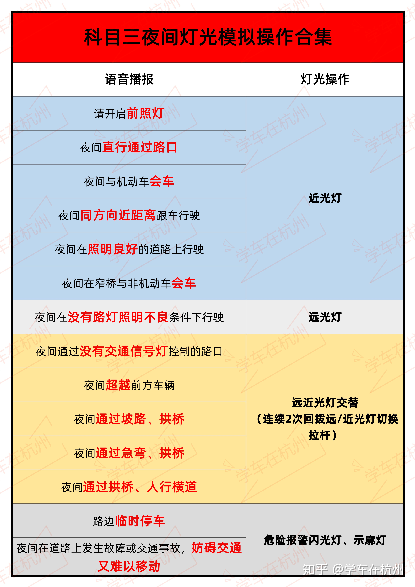
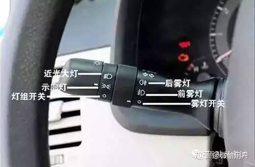

[toc]

# 科目三笔记

记录时间：2023-06-01

## 介绍

科目三道路驾驶技能考试满分为100分，成绩达到90分为合格。

科目三考试。一般包括：上车准备、起步、直线行驶、加减挡位操作、变更车道、靠边停车、直行通过路口、路口左转弯、路口右转弯、通过人行横道、通过学校区域、通过公共汽车站、会车、超车、掉头、夜间行驶模拟灯光等16项。

这16项可以分为三个部分：

>第一部分：准备部分  2项
上车准备，夜间行驶模拟灯光

>第二部分：加速部分 5项
起步，变更车道，超车，直线行驶，加减挡位操作

>第三部分：减速部分 9项
直行通过路口，通过人行横道，通过公共汽车站，通过学校区域，会车,路口左转弯,路口右转弯，掉头行驶，靠边停车

## 挡位与车速的关系

挡位与车速的关系公式：V = （n-1）* 10
1挡：车速0-10
2挡：车速10-20
3挡：车速20-30
4挡：车速30-40
5挡：车速40-50

通俗理解：1挡最大车速是10,2挡最大车速为20......

## 油离配合四步骤

油离配合四步骤:
1.踩离合
2.挂挡
3.送离合
4.踩油门

## 1 上车准备

1. 按照安全员指示，靠近车身，(自左前车门向后)绕车一周，确认安全后打开车门上车。
2. 上车后听到语音提示“请学员做好考试准备，并进行指纹验证”，首先调整座椅至合适自己的位置，调整内、外后视镜，系好安全带。然后进行指纹验证。

## 2 夜间行驶模拟灯光

夜间行驶灯光模拟将从以下项目中随机抽取进行考试。主要包括：

总结：
1. 照明不良: 远光灯
2. 超车，夜间通过危险路段：远近光灯交替两次
3. 临时停车或发生故障：危险闪光报警灯+示廓灯
4. 其余情况：近光灯

### 车辆灯光开关

下图为车辆的灯光开关：

灯光开关一共有两个旋钮。

示廓灯：左边旋钮从关闭状态往前扭一下。
近光灯：左边旋钮从关闭状态往前扭两下。
远光灯：握住灯光开关往前拨。
远近光灯交替：在近光灯的基础上，握住灯光开关往后拨。

其余同理。

## 3 起步

当听到语音提示“请起步”后：
1. 踩离合器，挂一档，打左转向灯(大于3秒)，同时(左扭头)观察左后视镜
2. 确认安全后，鸣笛，放驻车制动器，平稳起步，拨正转向灯。
3. 注意：在坡路起步时禁止后溜。

## 4 路口右转弯

当听到语音提示“前方路口右转弯”后
1. 开右转向灯(大于3秒)后，按导向箭头车道右转至行车道。

## 5 掉头

当听到语音提示“前方请掉头”后
1. 应打左转向灯(大于3秒)，通过(左)后视镜观察左后方交通情况
2. 确认安全后，方可降低车速，换入低档，驶入掉头区域。
3. 驶入掉头区域时应左右观察路况，确认安全后驶入新车道正常行驶并关闭左转向灯。

## 6 直行通过路口

当听到语音提示“前方通过路口”后
1. 考生应减速慢行(刹车)，观察道路交通情况，按照信号灯指示行驶
2. 通过路口时，车速应低于30km/h。路口内禁止停车。
   
## 7 路口左转弯

当听到语音提示“前方路口左转弯”后
1. 开左转向灯(大于3秒)后，按导向箭头车道左转至行车道。
   
## 8 通过公交车站

当听到语音提示“通过公交车站”
1. 考生应减速慢行(刹车)或在进入该区域前车速低于30km/h，左右(扭头)观察
2. 注意避让公交车辆及行人，确认安全后方可通过。
   
## 9 加减挡操作

当听到语音提示“请完成加减档动作”后
1. 考生应该将档位调整至2档，从2档依次升至5档，在5档位时时速需超过40km/h，再将档位依次降至2档。

## 10 会车

当听到语音提示“前方会车”后
1. 考生须注意前方来车，靠行车道右侧行驶至会车项目结束。注意避让其他车辆，不能压非机动车道线。

## 11 超车

当听到语音提示“请完成超车动作”后
1. 考生应打左转向灯(大于3秒)，同时通过(左)后视镜观察左后方交通情况
2. 确认安全后方可向左转动方向盘，驶入左侧车道进行超车。
3. 超过被超车辆后，确认与被超车辆保持安全距离后，打右转向灯(大于3秒)，同时通过(右)后视镜观察右后方，确认安全后驶入原车道正常行驶。
4. 当不具备超车条件时，可等待条件允许时，完成超车动作，禁止右侧超车。

## 12 直线行驶

当听到语音提示“请保持直线行驶”后
1. 考生应目视前方，双手控制好方向盘，保持车辆直线行驶。严禁骑压道路分界线。

## 13 变更车道

当听到语音提示“请变更车道”后
1. 考生应打(左)转向灯(大于3秒)，同时(左扭头)通过(左)后视镜观察后方交通情况
2. 确认安全后，向(左)转动方向盘变更车道。
3. 当不具备变更条件时，考生应减速慢行，等待条件允许后进行变更车道。严禁连续变更两条车道。

## 14 通过人行横道

当听到语音提示“前方通过人行横道”后
1. 考生应减速慢行(刹车)或在进入该区域前车速低于30km/h。若有行人通过，请把车辆停在安全线外等候，在行人通过人行横道后方可通过。

## 15 通过学校区域

当听到语音提示“前方通过学校”后
1. 考生应减速慢行(刹车)，或在进入该区域前车速低于30km/h，左右(扭头)观察，注意避让学生，确认安全后方可通过。

## 16 靠边停车

当听到语音提示“请靠边停车”后
1. 考生打右转向灯(大于3秒)，同时通过(右)后视镜观察右后方交通情况
2. 确认安全后，将车辆(右侧)平行停放在小于路沿石(或者道路边缘实线)30厘米以内处，但不能压到路沿石(或者道路边缘实线)
3. 停稳车辆，拉起驻车制动器，挂空档。

听到语音提示“考试合格，请下车”或“考试未通过，请下车”后，观察左后方交通情况，确认安全后，打开车门下车，考试完毕。