[toc]

# 科目二笔记

记录时间：2023-06-01

小车C1科目二考试项目包括倒车入库、侧方停车、坡道定点停车和起步、直角转弯、曲线行驶五项必考。

科目二考试满分100分，80分及格。

## 准备工作

### 调整座位

上车第一步就是调整座位。座位没有调整好，会影响后视镜中的点位，因此请务必调整好座位。

* 调整座位的前后距离: 左脚踩死离合，左腿膝盖处与附近的车内部装饰有一拳头的距离。
* 调整座椅靠背：自然靠在靠背上, 双手伸直搭在方向盘12点位置。要求手腕处正好搭在方向盘上。

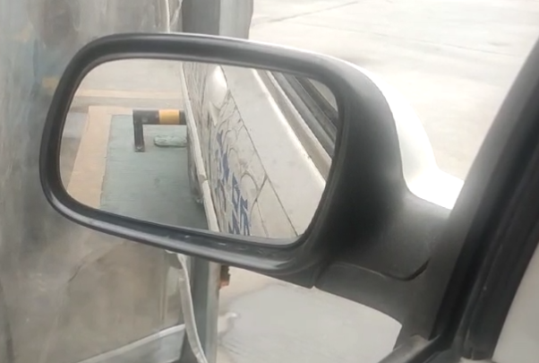
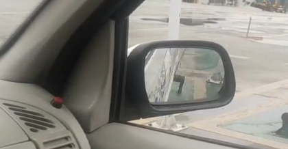

* 调整左后视镜看到门把手和后轮最低点。
* 调整右后视镜能看到门把手在上半部分和车尾轮廓处。

### 踩离合

踩离合要前脚掌踩住离合，通过后脚跟的前后移动来踩离合。

如何通过离合来控制好车速？
当踩离合到半联动点（车子开始前进）的时候，若发现车速变快，则轻踩离合。若车速过慢，则轻抬离合。总之，要让脚始终在半联动点上不断移动。这样才会使车速保持在一个不快不慢的范围。

注意：当你脚踩在离合上保持不动的时候，车速很有可能会越来越慢，甚至停车。因此你要不断的踩抬离合，来让车速保持一定的范围。

### 微调车身

当你倒车入库的时候，你必须要学会微调车身，从而让车正好进入库中。否则很容易车身扫线，车轮压线，从而扣分。

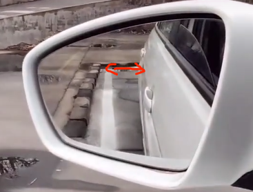

根据后视镜中车尾与边线的宽窄，来微调方向。

宽打窄回原则：在倒车的过程中后视镜中那边的车尾距离逐渐变宽，方向盘向那边打方向。反之，那边车尾距离逐渐变窄，方向盘向那边回方向。每次微调是打半圈方向盘进行调整。

当左右两边后视镜中车身与边线都平行的时候，就表示车辆正好摆正了。

## 倒车入库

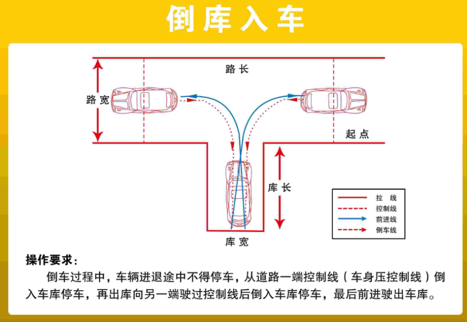

倒车入库的顺序：
先从左边行驶到起点处，然后右倒库->左倒库->驶离场地。

### 右倒库

1. 挂1挡先出库
2. 看左后视镜，直到后轮压快要倒库角延申的虚线之前，方向盘向右打死。向前行驶。
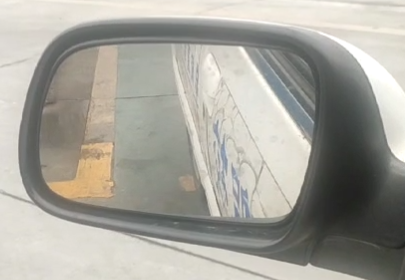
3. 看车盖左边突起处，直到突起处与库角重合，方向盘回半圈。向前行驶。
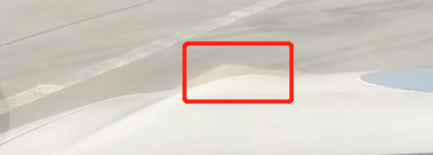
4. 看车头，把车头车身停正（与前方参照物平行，或者看本人是否与库线平行时），当车头车身停正后，方向盘回正。
5. 向前行驶，当库线与肩膀处于一条直线上时。停车挂倒挡，开始倒车。
6. 看左后视镜，直到左后视镜下沿与库角线即将重合时，此处就是打死点，方向盘向右打死。
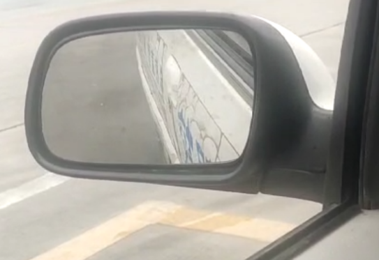

打死点：根据身高和坐姿，每个人的打死点各不相同。我的是后视镜下沿接触到黄线上边沿之前。

7. 继续倒车，看右后视镜，当右后视镜中车身与库角尖大概有两根手指的距离时，方向盘回半圈。
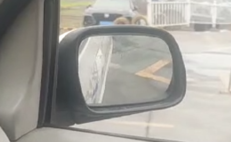

8. 当方向盘回半圈之后，此时可以继续微调车身，根据宽打窄回原则，需要把车身的左右两边的距离控制的差不多。
9. 继续倒车，先看右后视镜，当右后视镜中车身与边线平行时，方向盘回正。
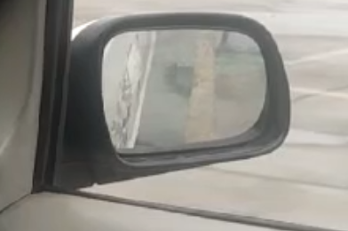
10. 然后看左后视镜。若左后视镜中车身与线不平行，根据宽打窄回原则，再次继续微调车身。
11. 当左右后视镜中车身与线都平行，表示车身此时是正的。
12. 继续倒车，看左后视镜，直到左后视镜下沿与库角线即将重合时，此处就是停车点，踩住刹车停车即可。
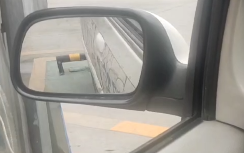

停车点：根据身高和坐姿，每个人的停车点各不相同。我的是后视镜下沿遮住一半黄线的时候。

### 左倒库

1. 挂1挡先出库
2. 当左边门框稍微超过库线时。方向盘向左打一圈半。继续向前行驶
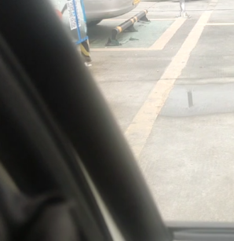
3. 当感觉膝盖搭到前方边线上时。停车挂倒挡。开始倒车
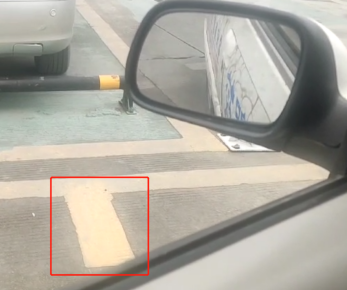
4. 倒车，看左后视镜。当左后视镜可以看到整个库身的时候，再次看车身与库角的距离，若距离大于两指，则方向盘加方向，若小于两指则方向盘回方向。在此过程中不断的让车身保持2指的距离。不断的加方向回方向。当后视镜中车尾进入库中的时候，就不需要再调整方向了
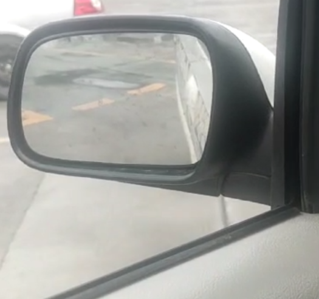
5. 倒车，当左后视镜中车身与库线平行时，方向盘回正。
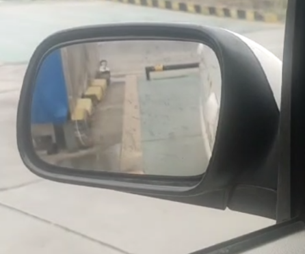
6. 观察右后视镜，若右后视镜中车身与库线不平行。根据宽打窄回原则，微调车身。继续倒车调整到车身与线平行为止，然后方向盘回正，继续倒车。
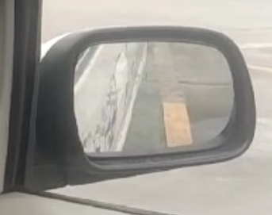
7. 当左右后视镜中车身与线都平行，表示车身是正的
8. 继续倒车，看左后视镜，直到左后视镜下沿与库角线即将重合时，此处就是停车点，踩住刹车停车即可。

停车点：根据身高和坐姿，每个人的停车点各不相同。我的是后视镜下沿遮住一半黄线。

## 侧方停车

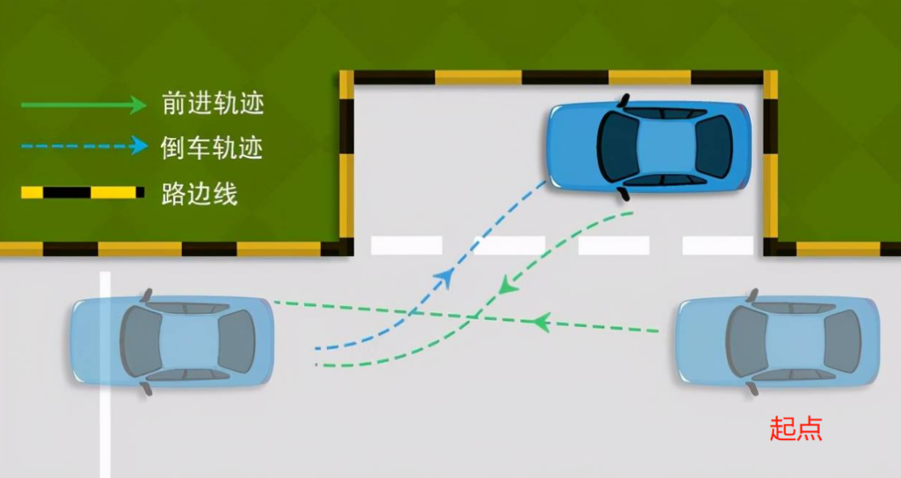

侧方停车的顺序：从起点处向前行驶->右倒库->左出库->驶离场地

1. 牵车是让车上的点位与地上的点位处在一条直线上，让车辆在向前行驶的过程中始终保持左边距离边线宽，右边距离边线窄。
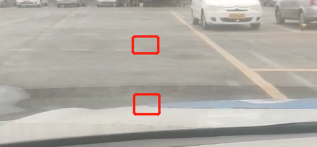

车上的点：号码牌的左边处。

2. 观察右边后视镜，当右边后视镜中库角横线出现在中间部分的时候，停车挂倒挡。开始倒车入库。
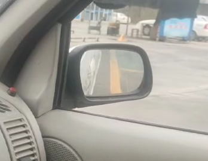

3. 倒车中，当右后视镜中的库角横线消失的时候，方向盘向右打死
4. 观察左后视镜，当左后视镜中的车身与库角形成45度夹角的时候，方向盘回正。继续倒车。
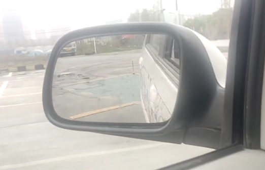

若方向盘回正后，在后视镜中看到车身与远处库角的夹角大于45度时，可以向左打一点方向盘，让其回到45度角。

5. 当左后视镜中后轮快要压住库角（压住地上虚线之前）的时候，方向盘向左打死。继续倒车
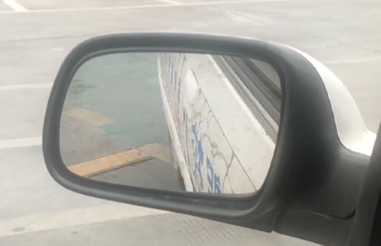

6. 当车身与边线平行的时候，直接停车。此时不需要回方向盘。
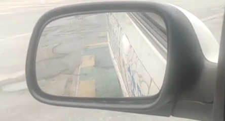

7. 开始出库，打开左转向灯（向下拉灯光把手），挂1挡。
8. 向前行驶，当车盖左边突起处，与道路边线重合时。方向盘回正。
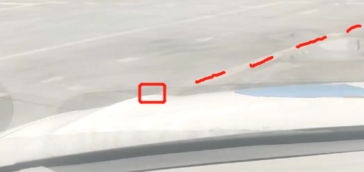

9. 向前行驶，当车盖中间处也与道路边线重合时，方向盘向右打一圈。
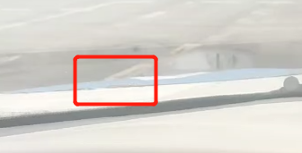

10. 向前行驶，当感觉车身正的时候，方向盘回正。侧方停车完成。

## 上坡定点停车与起步

注意：抬离合当车子动起来的时候，离合就保持不动。若上坡过程中感觉没有速度了，再慢抬离合。

1. 牵车，让车上的点与坡上的点在一条直线上。
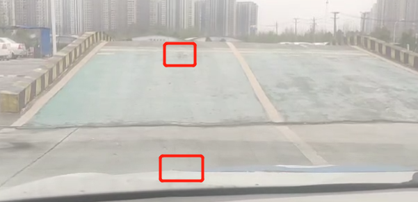
车上的点: 号码牌的左边处。

2. 上坡过程中，看左后视镜，注意右边车身与边线的距离，当到达停车点时，刹车踩死，离合踩死，进行停车。
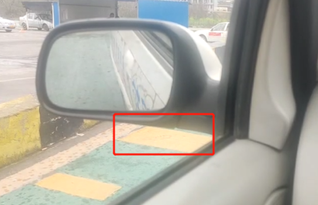

停车点：根据身高和坐姿，每个人的停车点各不相同。我的是后视镜下沿与黄色实线上沿刚刚接触。

3. 停车后，拉上手刹，两秒后，松下手刹。
4. 若右后视镜中，车身与边线很窄的情况下。方向盘向左90度。让右边车身与边线拉开一些距离。
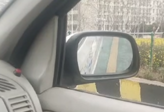

注意：在上坡的过程中，右边车身要与边线保持50cm以内的距离，否则会扣分。

5. 开始起步，开始慢慢抬离合，当车身开始抖动，连续抖动三下后。开始慢慢送刹车。此时车就能上坡了。当行驶一些距离后，方向盘回正。
6. 开始下坡。

## 直角转弯

1. 牵车，让车上的点与地上的点在一条直线上。
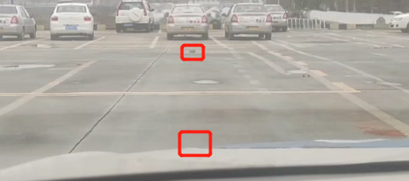
车上的点: 号码牌的左边处。
2. 慢慢的向前行驶。此时需要左手一直按住左转向灯开关。右手控制方向盘。
3. 当后视镜下沿与黄色边线分开的时候。方向盘向左打一圈。此时不需要管转向灯开关了，转向灯开关会自动回正的。
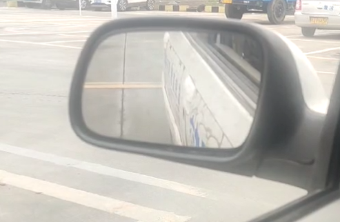

4. 当黄色边线与肩膀处于一条直线上时，方向盘继续向左打，直到左打死。

此处图片应该是黄色边线，图片选错了。

5. 当车头车身正了之后，方向盘回正，直角转弯就完成了。

## 曲线行驶

1. 牵车，让车头在弯道左右边线的中间。（车头中间对应道路中间）
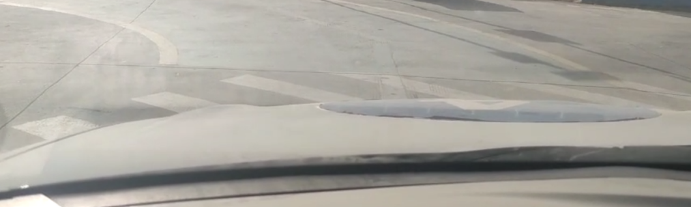

2. 让左边的突起处下沿与弯道右边线接触。
(突起处下沿不是突起处，要比突起处矮一点)
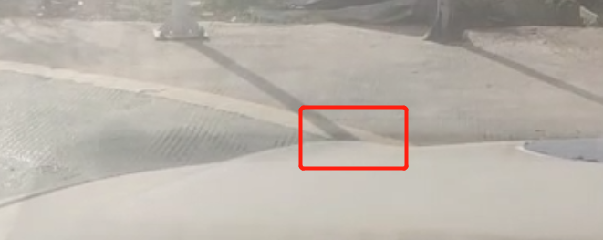

3. 当接触时，把方向盘向左打一圈。慢慢向前行驶。要求控制左突起处下沿一直与弯道右边线接触。

若左边突起处下沿超出弯道右边线外，则方向盘向左加上半圈。重新接触后，立即把加上的半圈回过来，从而让方向盘始终保持向左一圈的状态。
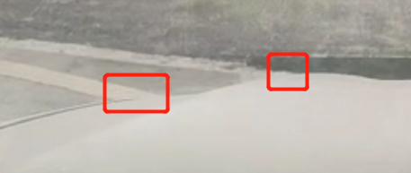

4. 当左突起处下沿进入弯道内。此时是正常的。表示第一个左弯快走完了，马上要走第二个右弯了。
5. 当左突起处下沿接触到弯道左边线时，方向盘回正。向前行驶.
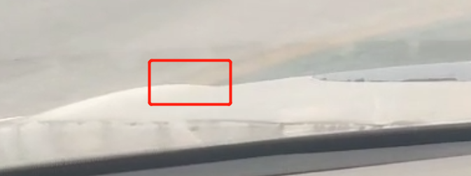
6. 当车身中间稍微靠右的地方与弯道左边线接触时，方向盘向右打一圈。
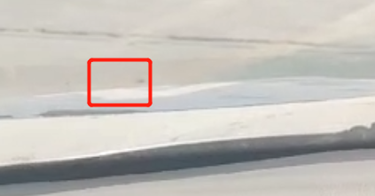

7. 然后探头看左后视镜，让弯道左边线一直出现在后视镜和车身的夹角中。继续向前行驶。在此过程中需要偶尔回头看正面，防止扣分。
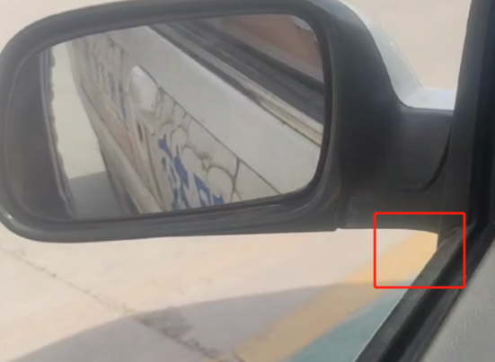

若弯道左边线不在夹角中时，方向盘可以向右加上半圈。重新让边线出在夹角中。然后把加上的右半圈回掉。
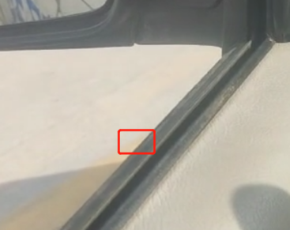

8. 当后视镜下沿处看到弯道尽头时，方向盘回正。继续行驶，完成曲线行驶。
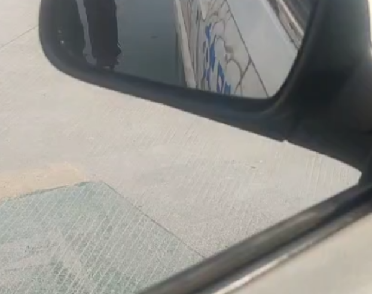

## 总结

总结一下，就是要多多练习，然后自己总结经验。并且要多练真车，模拟机和真车的手感完全不一样。