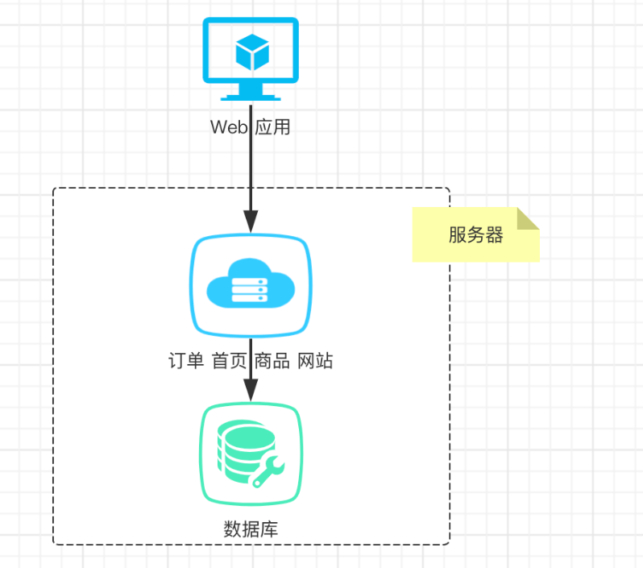
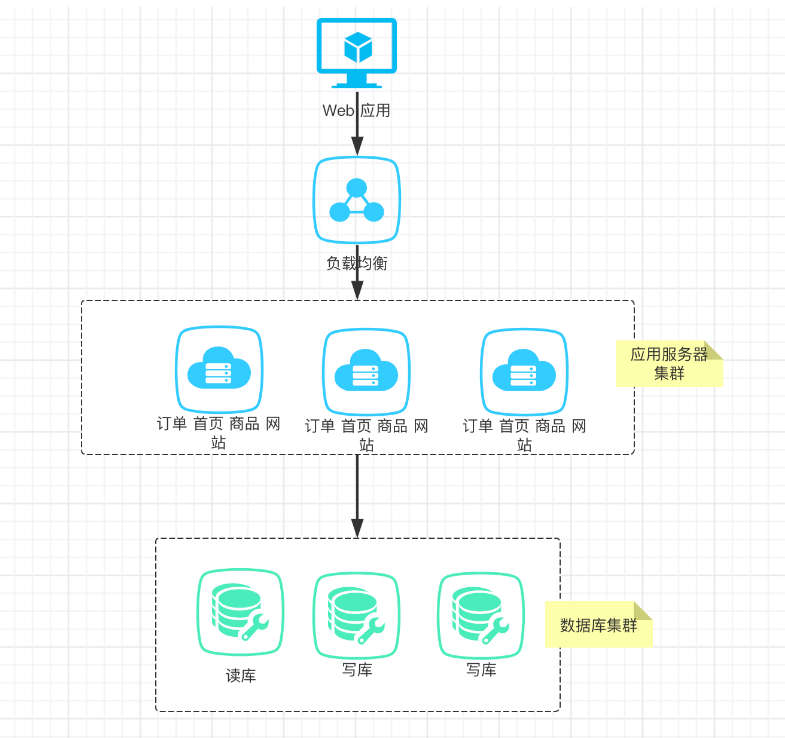
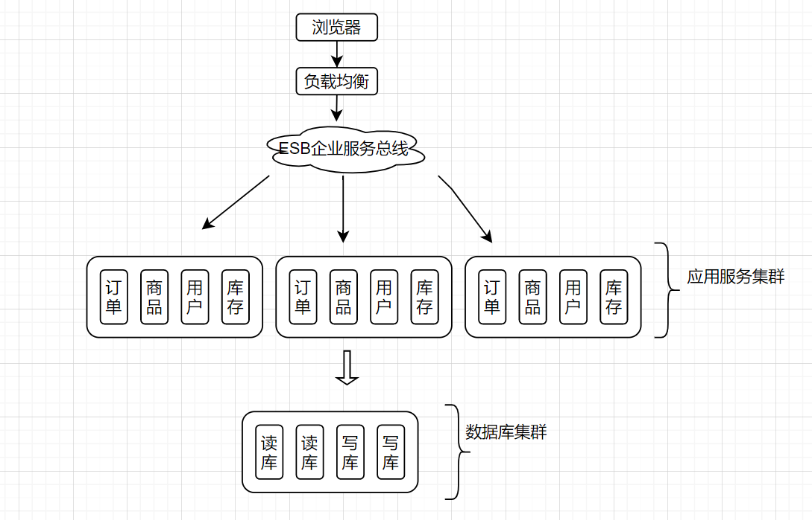

[toc]

## 1.系统服务架构演变

目前系统架构大体经历了下面几个过程: 
单体应用架构—>垂直应用架构—>分布式架构—>SOA架构—>微服务架构

### 单体应用架构

将所有的服务功能包含到一个应用中。

优点：架构，部署简单
缺点：随着访问量增加，难以抗住高并发。

解决方法：
1. 数据库和应用代码要放在不同的服务器上
2. 增加应用负载能力【集群服务器】
3. 增加负载均衡能力

### 垂直应用架构

通过集群服务器的方式，对服务应用和数据库进行复制扩展。从而增加服务和数据库的负载能力。

应用集群：将应用部署到多个服务器中。
数据库集群：将数据库部署到多个服务器中。

优点：随着访问量增大，可以增加服务器集群的数量。
缺点：
1. 集群的扩展只能对应用进行整个扩展，无法对应用中的使用频率高的功能模块进行单独扩展。因此每次集群扩展会导致冗余成本高。
2. 集群是让多个服务器部署的是同一套代码。若一处代码需要改动，则要重新部署多次。部署成本高。
3. 重复的业务代码过多。

解决方法：
1. 将公共的代码抽取出来，化为业务模块。

### 分布式应用架构

分布式架构的问题：
1. 不同业务服务模块之间的耦合太高，调用关系错综复杂，难以维护。一个模块出问题整个服务器宕机
2. 有些模块没有必要部署在所有的服务器上

解决方法：
1. 增加一个调度中心对集群进行实时管理。

### SOA架构(面向服务架构)

ESB就是一根管道，用来连接各个服务节点。将各个应用之间彼此的通信全部去掉，在中间引入一个ESB企业总线，各个服务之间，只需要和ESB进行通信，这个时候，各个应用之间的交互就会变得更加的清晰，业务架构/逻辑等，也会变得很清楚。

优点：
1. 使用治理中心（ESB\dubbo）解决了服务间调用关系的自动调节

缺点：
1. 服务间会有依赖关系，一旦某个环节出错会影响较大( 服务雪崩 )
2. 服务与服务之间管理困难。

### 微服务架构

微服务架构重点强调的一个是"业务需要彻底的组件化和服务化"，原有的单个业务系统会拆分为多个可以独立开发、设计、运行的小应用。这样的小应用和其他各个应用之间，相互去协作通信，来完成一个交互和集成，这就是微服务架构。

微服务架构下需要解决的问题：
* 服务注册发现
* 远程服务调用
* 负载均衡
* 断路器
* 分布式消息
* 配置中心
* 链路监控

#### 常用的微服务架构方案

1. dubbo
通信方式：RPC基于Dubbo协议
注册中心：zookeeper / redis
配置中心：diamond

2. SpringCloud：全家桶+第三方组件(Netflix)
通信方式：http restful
注册中心：eruka / consul
配置中心：config
断 路 器：hystrix
网关：zuul
分布式追踪系统：sleuth + zipkin
负载均衡：Ribbon

3. SpringCloud Alibaba
通信方式：http restful
注册中心：nacos discovery
配置中心：nacos config
服务熔断：Sentinel
网关：SpringCloud Gateway
分布式消息：RabbitMQ
负载均衡：Loadbalancer
分布式事务：Seatas

由于dubbo功能稀少，和eruka注册中心闭源，导致了SpringCloud Alibaba是目前国内主流的微服务架构解决方案。