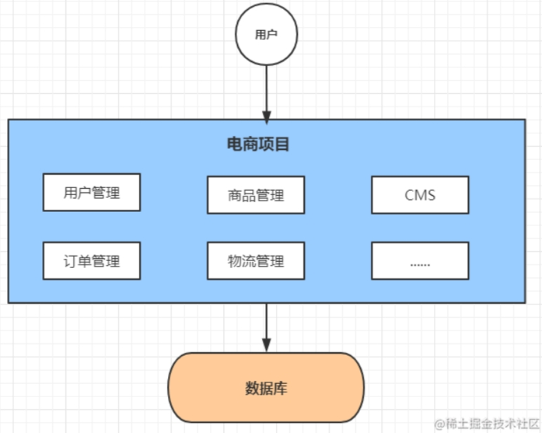
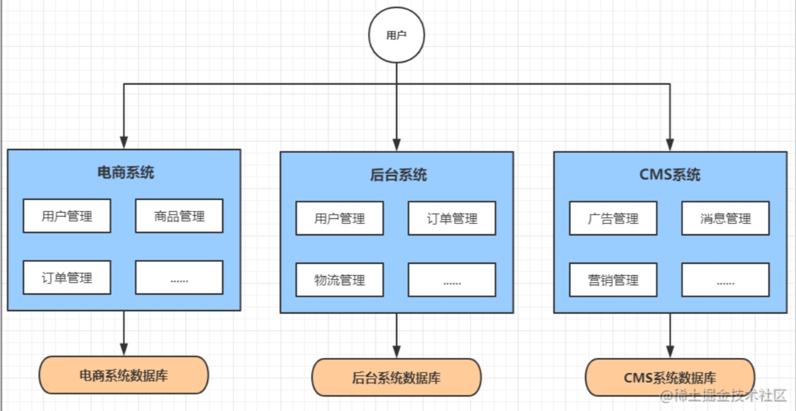
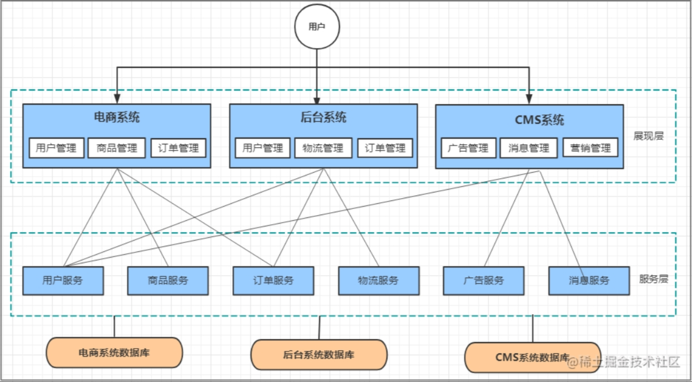
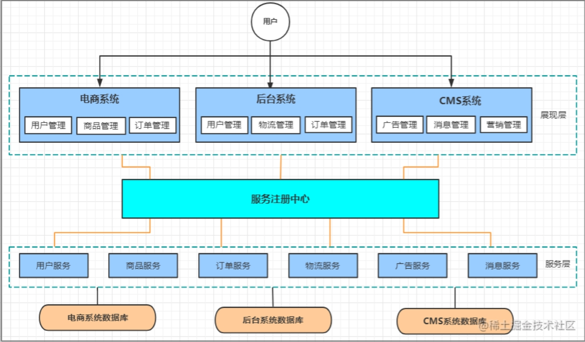
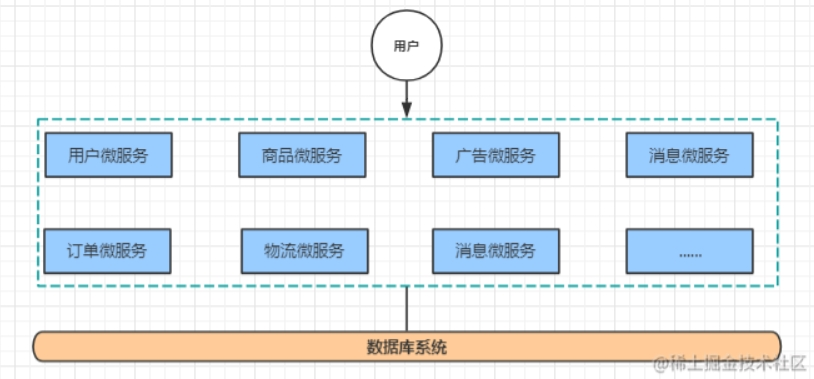

[toc]

# 系统服务架构演变

目前系统的服务架构大体经历了下面几个过程: 
单体应用架构—>垂直应用架构—>分布式服务架构—>SOA架构—>微服务架构

## 单体应用架构

互联网早期，通过将所有的功能代码都放在一个应用，并且部署在一个服务器即可。这样可以减少开发，部署和维护的成本呢。

如图所示一个电商系统，里面会包含很多用户管理，商品管理，订单管理，物流管理等等很多模块，这些模块通常在一个项目中，然后部署到一台服务器中。

>单体应用的优缺点：
- 优点：架构，部署，维护简单，开发成本低。
- 缺点：项目模块之间紧密耦合，无法针对不同模块进行优化和扩展。

## 垂直应用架构

随着单体应用的访问量不断增大，由于单体应用中的模块紧密耦合，无法针对不同的模块进行优化和扩展。因此就演化了垂直应用架构，即将一个单体应用拆分为多个应用，每个应用可以根据需求进行优化和扩展。

例如一个电商系统的单体应用，拆分为电商系统，后台系统，CMS系统等。我们可以根据需求来优化扩展对应的应用。

> 垂直应用的优缺点
- 优点：应用拆分实现了流量分担，解决了并发问题，而且可以针对不同模块进行优化和水平扩展。
- 缺点：应用之间相互独立，通常无法互相调用，并且应用之间会有重复的代码。

## 分布式应用架构

由于垂直应用是将一个单体应用拆分为多个互不相干的应用。

当垂直应用越来越多，重复的业务代码就会越来越多。此时我们可以把重复的代码抽取出来，做出一个独立的应用，并且让其他需要的应用去调用它。

这就是分布式应用架构。它将把应用拆分成表现层和服务层两个部分，服务层包含了具体的业务逻辑，而表现层只需要处理和页面的交互，业务逻辑都是通过调用服务层来实现。

如图所示

分布式架构优缺点
- 优点：抽取的公共业务代码来作为服务层，提高了代码的复用性
- 缺点：应用与应用之间的耦合性更高了。并且一旦其中一个公共业务出问题，那么会影响到其他的应用。

## SOA架构(面向服务架构)

在分布式架构下，当服务应用越来越多，就会出现服务应用的管理问题。此时需增加一个调度中心对服务应用进行实时管理。

这个服务注册中心就是调度中心，用来连接各个服务应用。各个服务应用之间，只需要和服务注册中心进行通信，这个时候，各个应用之间的交互就会变得更加的清晰，业务架构/逻辑等，也会变得很清楚。

SOA架构优缺点：
- 优点：使用注册中心解决了服务应用之间调用关系
- 缺点：服务与服务之间关系复杂，并且运维和测试部署都会变得困难。

## 微服务架构

微服务架构在某种程度上是面向服务的架构，它更加强调服务的"彻底拆分"。

即原有的单个业务系统会拆分为多个可以独立开发、设计、运行的小型服务。各个小型服务之间，相互通信，来组成一个业务系统。这就是微服务架构。

微服务架构优缺点：
- 优点：将一个系统根据服务进行拆分，服务与服务之间互相通信，并且有利于服务的扩展。
- 缺点：多服务运维难度，随着服务的增加，运维和部署的压力也在增大。

### 微服务架构下需要解决的问题

微服务架构，简单的说就是将单体应用进一步拆分，拆分成更小的服务，每个服务都是一个可以独立运行的项目。

一旦采用微服务系统架构，就势必会遇到这样几个问题：
* 这么多服务，如何管理它们？
* 这么多服务，它们之间是如何互相通信？
* 这么多服务，如何访问它们？
* 这么多服务，一旦某个服务出现了问题，该如何处理？

上面的这些问题都是微服务架构下会遇到的。因此为了解决上面的问题就出现了许多概念。如下所示
* 服务注册发现
* 服务调用
* 服务网关
* 服务容错
* 服务链路追踪

## 常用的微服务架构方案

> 方案1 SpringCloud：全家桶+第三方组件(Netflix)

Spring Cloud是一系列框架的集合。它利用Spring Boot的开发便利性巧妙地简化了分布式系统基础设施的开发，如服务发现注册、配置中心、消息总线、负载均衡、断路器、数据监控等，都可以用Spring Boot的开发风格做到一键启动和部署。

通信方式：http restful
注册中心：eruka / consul
配置中心：config
断 路 器：hystrix
网关：zuul
分布式追踪系统：sleuth + zipkin
负载均衡：Ribbon

> 方案2 SpringCloud Alibaba

SpringCloud Alibaba是目前国内主流的微服务架构解决方案。

通信方式：http restful
注册中心：nacos discovery
配置中心：nacos config
服务熔断：Sentinel
网关：SpringCloud Gateway
分布式消息：RabbitMQ
负载均衡：Loadbalancer
分布式事务：Seatas