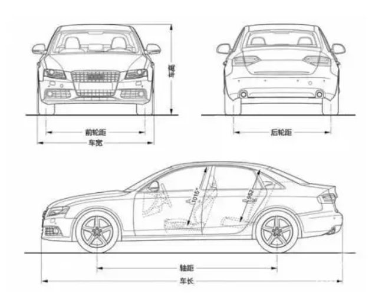

[toc]

# 购车指南

此笔记用于记录一些关于车辆的知识。并且通过这些知识来选择出自己想要的车辆。

## 预算和需求

买车最重要的就是明白自己的预算和需求。先确定自己的预算的情况下，然后根据自己的需求来选择车辆。

## 车辆等级

汽车等级是源自德国大众对汽车的一种分级方法，但它不是权威的标准，只是大众当初为自己制定平台战略时，制定的一套参考数值，虽然大众后面自己再没有使用，但是这个分级方法还是被广泛的使用开来，当然，国内也基本上采用这种标准。

汽车等级主要是通过车辆的轴距来区分。轴距是指汽车前轴中心到后轴中心的距离。

汽车等级一般分为：A00级、A0级、A级、B级、C级、D级六个级别，国内一般它们分别称为微型车、小型车、紧凑型车、中型车、中大型车、大型车。

一般情况下
- A00级车的轴距在2.0-2.3米
- A0级车的轴距在2.3-2.5米
- A级车的轴距在2.5-2.7米
- B级车的轴距在2.7-2.9米
- C级车的轴距在2.8-3.0米
- D级车的轴距在3.0米以上

## 汽车排放标准

传统汽车的工作是靠发动机燃油驱动汽车行驶的，由于这个工作原理，会导致排出很多汽车尾气和废气。这些尾气都会破坏环境，引起一系列的问题。

为了保护环境，国家推出了汽车的环保标准，汽车生产厂家出厂的汽车产品需要满足汽车的排放标准才能够上路。这项措施其实很多国家都在做，我国汽车的排放标准常见的有国5、国4、国3、欧5、欧4、欧3等排放标准，现在最新的是国6排放标准。

车辆排放标准是指车辆的排放尾气的标准。因此燃油车或会排放尾气的车辆才有汽车排放标准，而目前对于新能源车是没有排放标准的。

> 如果汽车排气污染不符合汽车环保标准会出现什么后果呢？

如果汽车的排放标准没有达标，那么该汽车就无法通过年检。如果汽车经过维修或控制了汽车的排放标准后，才能通过年检。如果汽车连续三次没有通过年检，那么这个汽车会被强制报废。

举个例子,目前最新的排放标准是国六，那么对于之前国五或者国四排放标准的汽车。他们无法通过国六标准，也就无法通过年检。因此他们需要维修或加装过滤器的形式来完成年检。

> 汽车排放标准与车辆上牌的关系？

通常情况下，车辆的排放标准与车辆上牌有关。

举个例子，比如你网上看中一辆新车，想要购买它日常代步，它是【国五】标准的，而你当地需要【国六】才能上牌，那么这辆新车，你就无法上你当地的牌照。

二手车也是同理，比如你在外地看中了一辆二手车子，它是【国五】的标准，但是你当地车管所只接受【国六】排放的车辆，那么你就无法在当地完成上牌的手续，进。

## 汽车牌照

举个例子，如果你在广州工作，但是你不是广州户口。那么你买车，可以上广州牌照（有条件），也可以上你的户口所在地牌照。广州对于非本地牌照的车辆，除了有限行政策。就没有其他限制要求了。

## 车辆限行

不同城市的车辆限行政策不同。

例如广州的车辆限行政策。

- 对于广州车牌暂未采取任何限行措施。
- 对于外地车牌的车辆。会要求在特定时段下的特定区域，外地车牌的车辆禁止通行。具体限行政策自行百度。

## 汽车配置

一辆汽车包括如下配置。

### 主要配置

#### 发动机

发动机包括如下参数。

1. 排量大小：1.0升、1.5升、1.6升、1.8升。。。一般来说，排量越大，动力越强，油耗越高，车价越贵；
2. 进气方式：自然吸气或者涡轮增压。自然吸气的技术更成熟，相同排量下动力没有涡轮增压强，但是维护保养成本比涡轮增压便宜。L是指自然吸气，T是指涡轮增压。例如汽车配置清单中1.5L是指1.5排量自然吸气方式，1.5T是指1.5排量涡轮增压方式。
3. 发动机缸数：常用的发动机缸数主要是3缸、4缸。3缸容易抖动，但是它省油、环保。4缸就是稳定，但是油耗会更高。汽车配置清单中L4就是4缸，L3就是3缸。
4. 排放标准：一般是国V标准，最新的车型可能为国VI标准。同价位下建议选择国VI排放车型。
5. 最大扭矩：扭矩影响的是爬坡能力、加速能力还有起步速度。最大扭矩越大，前面说到的三个能力就越强。

#### 变速器

变速器包括如下几种。

1. 手动变速器（MT）。一般是5级变速和6级变速。优点是成本低，技术成熟，维护保养方便。缺点是城市道路开车麻烦。
2. 自动变速器（AT）。有4AT、5AT、6AT、8AT甚至9AT、10AT。优点是技术成熟，缺点是结构复杂，存在传动动力损失；
3. 无极变速器（CVT）。没有具体档位，可模拟自动变速箱换挡效果。优点是结构简单，重量轻便，成本较低，节省燃油；缺点是可承受的扭矩较低，适用于中小排量汽车，而且加速平缓，缺少驾驶乐趣。
4. 双离合变速器(DCT)。分为干式和湿式双离合，一般是7级变速。优点是换挡迅速，结构简单；缺点是低速换挡存在顿挫，频繁换挡容易发热引发系统热保护。

#### 汽车底盘

汽车底盘主要看底盘的悬挂系统。家用轿车一般分为独立悬挂和半独立悬挂。能选独立悬挂就选择独立悬挂，当然，独立悬挂汽车售价更高。、

底盘参数代表车子的乘坐舒适性，主要看悬挂参数。汽车悬挂分为独立悬挂跟非独立悬挂两种。

- 舒适性方面： 独立悬挂 > 非独立悬挂。

常见的独立悬挂系统有麦佛逊式悬挂系统、双叉臂式独立悬架、多连杆式悬挂系统、空气悬挂系统。

- 舒适性方面：空气悬架>多连杆式>双叉臂式>麦佛逊式

#### 制动系统

家用汽车制动主要是盘式制动和鼓式制动。

- 盘式制动反应灵敏、散热快、造价高，多用于小车；
- 鼓式制动器散热差、制动力大，多用于货车。

#### 汽车驱动方式

汽车有前驱、后驱、四驱三种驱动方式。

- 前驱：适合大部分轿车跟SUV，驱动效率高但操纵性一般。
- 后驱：部分豪华轿车是后驱，驱动效率高，操纵性好。
- 四驱：高端SUV或越野车采用四轮驱动，驱动效率最高，操纵性最好，但是价格偏贵。

### 安全性配置

汽车的安全性配置越多越好。毕竟安全性配置主要是用来保护乘车人的安全。

安全性配置有以下：
1. 防抱死系统（ABS）。紧急刹车时，防止车轮抱死，引发车辆失控，该功能车辆基本都会配置。
2. 车辆稳定系统（ESP）。防止车辆发生侧滑，特别是在冬季冰雪湿滑路段非常实用，防止车辆失控。
3. 安全气囊。安全气囊主要看气囊位置，有驾驶座气囊、头部气囊、膝部气囊、侧气囊等。数量越多，安装位置越多越好。
4. 胎压监测。实时监测胎压情况，轮胎扎钉子泄气时，系统会及时报警。
5. 车道偏离预警系统：当检测到汽车偏离车道时，会发出警报信号，提示驾驶者车辆正在偏离当前车道。如果驾驶者打开转向灯，正常进行变线行驶，那么车道偏离预警系统不会做出任何提示。
6. 主动刹车系统：当车辆遇到突发危险情况时能自身主动产生制动效果让车辆减速
7. 后视镜加热：给后视镜加热，烘干镜面上的雾气和霜露，确保镜片表面清晰了。

### 舒适性配置

舒适性配置是为了提高乘车人在行车过程中的舒适性。

1. 空调系统。分为手动空调和自动空调。肯定是自动空调更方便。
2. 定速巡航系统。能够解放踩油门的右脚，特别是高速上行驶很方便，更高级的为自适应性巡航，更智能。
3. 天窗功能。适合开车兜风使用，看起来逼格更高。
4. 空气净化系统。主要是过滤PM2.5。
.....

