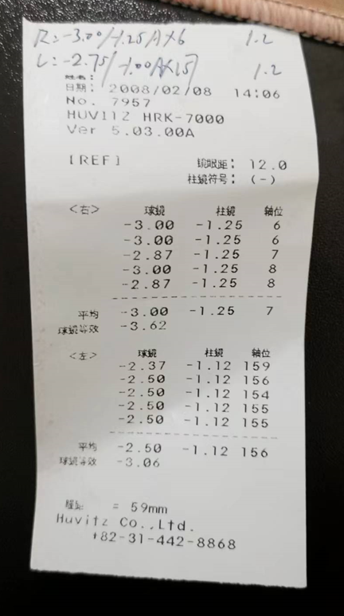
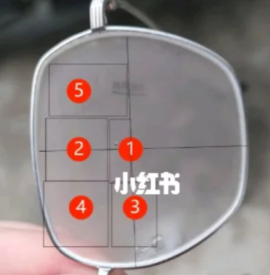

[toc]

## 配眼镜

20230407

网上配镜的理由：成年人度数稳定的，只需要单光的（无其他功能性的）眼镜才建议去网上配镜。成长中的儿童不建议网上配镜。

配眼镜：先选镜片，再选镜框。

### 验光

推荐选择：

* 宝岛线下门店验光（在宝岛眼镜公众号上找推荐验光师进行验光）
* 三甲医院的视光中心进行验光（有些医院的验光是外包的需要注意，有些医院有专门的视光中心）
* 本地大型眼镜连锁店进行验光

验光前一天，要充分休息，不要用眼过度。

验光单：
注意：不能用电脑打印出来的验光单来配眼镜。电脑验光单并不准确，实际还是要验光师手写的为准。

验光单上的球镜代表近视度数，柱镜代表散光度数。瞳距代表你双眼的瞳孔之间的距离。

### 镜片

镜片的选择主要考虑以下因素：品牌，系列，膜层，折射率。

镜片推荐品牌：蔡司，豪雅。不要选择旗下品牌。不同的品牌有不同的系列，一个二流品牌的中端系列并不比一流品牌的低端系列差。

膜层：膜层就是在镜片上镀一层膜，不同品牌有不同的膜层，有的膜层耐磨，有的膜层耐脏，有的膜层既耐磨又耐脏。

折射率：

目前市面上主流的镜片折射率有：1.50，1.56、1.60、1.67、1.71、1.74等几种。同等前提条件下，镜片的折射率越高，镜片越薄越轻。但是镜片折射率越高，阿贝数越低，色散越明显。

阿贝数（色散系数）：阿贝数越高，镜片的成像效果越好，越清晰。

总之：

* 400度以下的，选择1.50折射率
* 400-800度的，选择1.60折射率，1.60折射率的镜片认准mr-8材质的
* 其余折射率不建议选择。

推荐镜片：

* 蔡司A系列 1.50 莲花膜球面镜片
* 豪雅1.50 vp膜非球面镜片

厚度：蔡司1.50 > 豪雅1.50
膜层：vp膜 > 莲花膜

购买渠道：京东自营，1688

### 镜架

镜架品牌：派丽蒙，施洛华，海俪恩，海伦凯勒。首推派丽蒙，施洛华，这两家售后好。另外镜架品牌不要选择挂名的，要选择专门做镜架的品牌。

镜架材质：纯钛，tr材质，其余材质不推荐。

镜架移心量：移心量决定镜框左右镜片的中心处与双眼瞳孔能够一一对应。即镜片中心是否在瞳孔中心。

移心量公式： （镜框宽+中梁 - 瞳距）/ 2  <= 3

最佳移心量小于3。当移心量越小，你的瞳孔就越能对上镜片中心，而镜片中心
又是整个镜片的最薄处。因此移心量越小，你的镜片就能做的越薄，使得镜片宽度不会超过镜框边的宽度，从而看起来不好看。

另外，不要刻意追求移心量，需要移心量和镜架的舒适度，美观度综合考虑。

镜架选择原则：

1. 你的眼睛瞳孔正好处在镜片中心处(移心量为0)或中心偏上一点点处(移心量小于3)。这样的镜架才是适合你的。
2. 对于圆脸，不要选择镜框上下高度很宽的。因为镜框下沿怼在脸上很难受。
3. 好的镜架，重心分配合理。戴在脸上，不会全靠鼻托支撑镜架。同样，粗的镜腿可以提供环抱力，而细的镜腿不能提供环抱力。
4. 镜架的镜框建议左右宽度不要超过60，上下高度不要超过40（不建议选择大框眼镜）

瞳孔最佳位置：1号 > 1-2号中间 > 2号。其他位置不推荐

镜架购买建议：可以去京东自营上的官方旗舰店选择镜框，买来试戴，看行不行。可以就退回去。然后去第三方店买便宜的同牌子同型号镜架。

### 最后

最后在淘宝找了一家有实体店的卖家。从他们家买了豪雅的1.50镜片和派丽蒙的镜架。具体的价格400元左右，镜架200，镜片200。使用一段时间后感觉还行。

