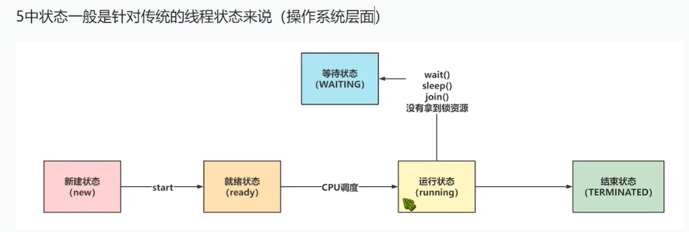
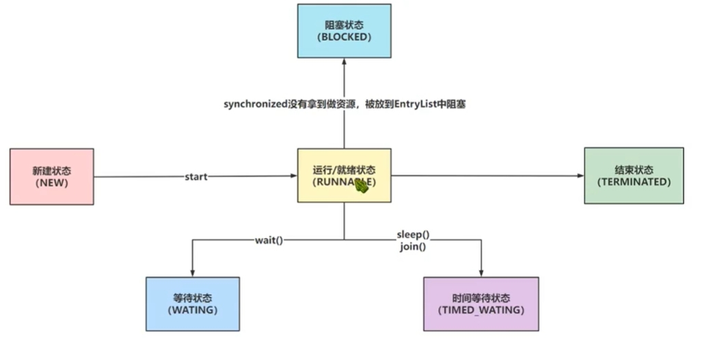

[toc]

# Java面试-速记版

Java面试题总结-速记版主要用于记录java面试中的常用题。并且提供一个容易记忆背诵的回答文本。

## java中线程的实现方式

通常情况下为4种方式。
* 继承Thread类，重写run方法
* 实现Runnable接口，重写run方法
* 实现Callable接口，重写call方法，并搭配FutureTask类。
* 基于线程池来构建一个新线程。

底层源码上，实际是一种方式，上面4种方式都是直接或间接实现Runnable接口，重写run方法的方式。

## java中线程的状态

线程的状态主要分两种情况。分别是操作系统层面中的线程（即传统意义上的线程），和java中的线程。

> 操作系统中的线程（即传统意义上的线程）

传统意义上的线程有5种状态。



但是java代码中给线程划分了6个状态。


## java中如何停止线程

主要有3中方式。
* 调用Thread类的stop方法，让线程停止。（不推荐）
* 修改Thread类的interrupt方法，将Thread类中的interrupt由false改为true。从而让线程停止（推荐）

## java中的sleep和wait的区别？

* sleep是Thread类中的方法。wait是Object类中的方法。
* 线程在调用sleep方法后，进入到timed_waiting状态，此时线程会自动被唤醒。但是线程在调用wait方法后，进入到waiting状态，此时线程需要手动唤醒。
* 线程在调用sleep方法后，不会释放锁资源。但是wait方法会让线程释放锁资源。

## java中的4种引用类型

java中的4种引用类型分别是强，软，弱，虚。

## java中锁的分类

> 乐观锁和悲观锁

java中的synchronized是悲观锁。

悲观锁：当线程获取不到锁资源的时候，会将当前线程挂起（即线程会进入到阻塞状态或等待状态）。

乐观锁：当线程获取不到锁资源的时候，会一直尝试获取锁资源。

> 公平锁和非公平锁

java中的synchronized是非公平锁。

公平锁：若线程A拿到了锁资源，线程B和C没有拿到。则线程BC会进行排队。根据排队顺序来获取锁资源。

非公平锁: 若线程A拿到了锁资源，线程B和C没有拿到。则线程BC会进行竞争，谁赢谁就排队排到前面。

> 互斥锁和共享锁

java中的synchronized是互斥锁。

互斥锁：同一时间，互斥锁只能被一个线程持有。
共享锁：同一时间，共享锁可以被多个线程共同持有。


## Spring中@Autowired和@Resource的区别？

相同点：
* 两个注解都可以写在属性和setter方法上的。这两个注解都与自动装配有关。

不同点：
* @Autowired是按照类型（byType）装配，来注入依赖对象。默认情况下它要求依赖对象必须存在。如果我们想使用按照名称（byName）来装配，可以结合@Qualifier注解一起使用。

* @Resource默认按照ByName自动注入。如果找不到就按照byType的方式自动注入。


## Spring中支持几种作用域？

Spring的IOC容器中的bean有5种作用域分别是：singleton、prototype、request、session和globalSession


* singleton 默认的,在IoC容器中仅有一个bean实例。每次请求，都只会拿掉这个bean实例。
* prototype 每次请求，IOC容器会产生一个新的bean实例来提供。
* request 每一次http请求都会产生一个新的bean实例，并且该 bean实例 仅在当前 HTTP 请求内有效。请求完成后，bean实例就会失效。
* session 每一次 HTTP 请求都会产生一个新的bean实例，同时该 bean实例 仅在当前HTTP session 内有效。
* globalSession 作用和session类似，只是使用portlet的时候使用。 


## spring事务的隔离级别

当多个事务访问相同数据会产生脏写，脏读，幻读，不可重复读等问题。事务的隔离级别主要用于解决这些问题的。

在spring中通过设置事务的隔离级别，从而可以解决上述问题。

- default 默认隔离级别，是直接使用数据库的事务隔离级别。
- read_uncommited 读未提交隔离级别，最低的隔离级别。用于解决脏写问题。
- read_commited 读已提交隔离级别，用于解决脏写和脏读问题。
- repeatable_read 可重复读隔离级别，用于解决脏写，脏读，不可重复读问题。
- serlalizable 串行化，最高的隔离级别，用于解决脏写，脏读，不可重复度，幻读问题。

注意：隔离级别不是设置的越高越好，隔离级别越高，spring事务的效率越低。

## spring事务的实现方式

spring事务的实现方式有两种，分别是编程式事务和声明式事务。

- 编程式事务：通过编程的方式来管理事务，灵活但是难以维护。
- 声明式事务：通过注解和xml配置的方式来管理事务。


## spirng中的AOP有哪些通知类型？

通知是指在方法执行前或执行后要做的动作，实际上是程序执行时要通过 SpringAOP 框架触发的代码段。

Spring 切面可以应用五种类型的通知：
- before 前置通知，在一个方法执行前被调用。
- after 后置通知，在方法执行之后调用的通知，无论方法执行是否成功。
- after-returning 后置成功通知，仅当方法成功完成后执行的通知。
- after-throwing 后置异常通知，在方法抛出异常退出时执行的通知。
- around 环绕通知，在方法执行之前和之后调用的通知。

## spring中的依赖注入是什么？

依赖注入是指不需要你主动创建对象，而是在配置文件中配置你的对象，让容器帮你创建对象，并管理对象。你需要用到对象的时候，直接从容器中取出对象即可。

## 依赖注入的方式有几种，分别是什么?

一、构造器注入
* 将被依赖对象通过构造函数的参数注入给依赖对象，并且在初始化对象的时候注入。
* 优点：对象初始化完成后便可获得可使用的对象。
* 缺点：当需要注入的对象很多时，构造器参数列表将会很长；不够灵活。若有多种注入方式，每种方式只需注入指定几个依赖，那么就需要提供多个重载的构造函数，麻烦。

二、setter方法注入
* IoC Service Provider通过调用成员变量提供的setter函数将被依赖对象注入给依赖类。
* 优点：灵活。可以选择性地注入需要的对象。
* 缺点：依赖对象初始化完成后由于尚未注入被依赖对象，因此还不能使用

三、接口注入
* 依赖类必须要实现指定的接口，然后实现该接口中的一个函数，该函数就是用于依赖注入。该函数的参数就是要注入的对象
* 优点接口注入中，接口的名字、函数的名字都不重要，只要保证函数的参数是要注入的对象类型即可。
* 缺点：侵入行太强，不建议使用。


## 谈谈springmvc的理解

先说springmvc和servlet的关系，然后说springmvc的组成部分。最后总结即可。

## 谈谈spring和springmvc的关系


## 什么是Spring Boot？

SpringBoot是基于spring的全新框架，目的是简化spring框架的搭建和开发过程。

SpringBoot框架根据约定大于配置的原则，在Spring框架的基础上进行了各种简化配置，提供了各种启动器，开发者能快速上手。

## SpringBoot的优点有哪些

- 独立运行：springboot打出的jar包，可以独立运行。因为jar包内嵌servlet容器，例如tomcat，jetty等。


## 如何理解 Spring Boot 中的 Starters？

Starters启动依赖。它包含了一系列可以集成到应用里面的依赖包，你可以一站式集成Spring及其他技术，而不需要到处找依赖包。如你想使用Spring JPA访问数据库，只要加入spring-boot-starter-data-jpa启动器依赖就能使用了。Starters包含了许多项目中需要用到的依赖，它们能快速持续的运行，都是一系列得到支持的管理传递性依赖。

> Starters命名

Spring Boot官方的启动器都是以spring-boot-starter-命名的，代表了一个特定的应用类型。

第三方的启动器不能以spring-boot开头命名，它们都被Spring Boot官方保留。一般一个第三方的应该这样命名，像mybatis的mybatis-spring-boot-starter

> 常用的starter

```
spring-boot-starter-web 嵌入tomcat和web开发需要servlet与jsp支持
spring-boot-starter-data-jpa 数据库支持
spring-boot-starter-data-redis redis数据库支持
spring-boot-starter-data-solr solr支持
mybatis-spring-boot-starter 第三方的mybatis集成starter
```

## bootstrap.yaml文件的作用

bootstrap.yaml文件在springboot中默认是不支持的，需要在springcloud中才支持它。bootstrap.yaml文件的作用是在springboot项目启动之前，启动一个父容器，这个父容器可以在springboot容器启动之前完成一些初始化加载操作。例如加载配置中心，注册中心的信息。

注意：这个父容器与sprntboot启动的容器是父子容器。

## @Component/@Controller/@Service/@Repository 注解的区别

@Component注解用于将java类标记为bean。当IOC容器启动后，会自动注入到容器中。

@Controller/@Service/@Repository注解功能与@Component注解类似，但是为了分辨服务层，控制层，数据层，而特别设计的注解。

## SpringBoot 的核心注解是哪个？由哪几个注解组成的？

核心注解是@SpringBootApplication。该注解是启动类注册。

@SpringBootApplication 注解包含了以下3个注解：
- @SpringBootConfiguration：用于实现配置文件的功能。包含了@Configuration注解。
- @EnableAutoConfiguration：用于打开自动装配的功能。
- @ComponentScan：用于spring扫描组件。

## springboot打的jar包和普通jar包，有什么区别？

springboot项目打的jar包是可执行jar包，这种jar包可以直接通过java -jar命令来运行。

其他项目不能直接依赖可执行jar包。依赖了也无法使用可执行jar包中的类。主要是因为可执行jar包的目录结构和普通jar包不同。

普通jar包解压之后就是代码。但是可执行jar包的代码在/BOOT-INF/classes目录下。

我们可以在springboot项目的pom文件中，将项目打成两个jar包，一个可执行jar包，一个普通jar包。