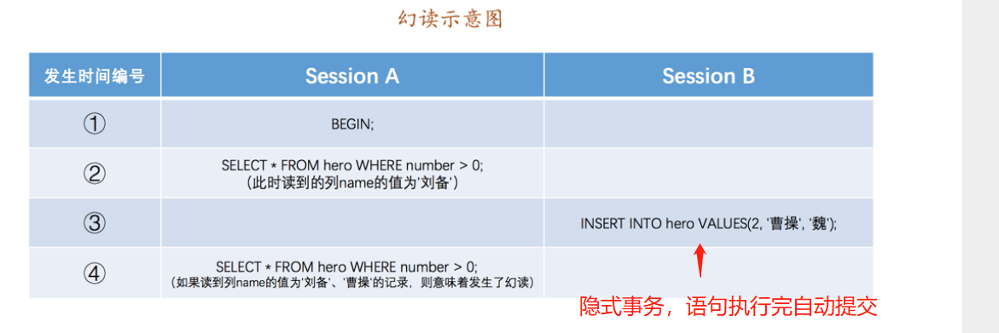

[toc]

# Java面试考点总结-MySql

## mysql有那些数据类型

整数类型
```
tinyInt         很小的整数(8位二进制)
smallint        小的整数(16位二进制)
mediumint       中等大小的整数(24位二进制)
int(integer)    普通大小的整数(32位二进制)
```

小数类型
```
float           单精度浮点数
double          双精度浮点数
decimal(m,d)    压缩严格的定点数
```

日期类型
```
year            YYYY
time            HH:MM:SS
date            YYYY-MM-DD
datetime        YYYY-MM-DD HH:MM:SS
timestamp       YYYY-MM-DD HH:MM:SS
```

文本、二进制类型
```
CHAR(M)         M为0~65535之间的整数
VARCHAR(M)      M为0~65535之间的整数
BLOB            允许长度0~65535字节
TEXT            允许长度0~65535字节
BINARY(M)       允许长度0~M个字节的定长字节字符串
```

## 存储引擎

常用的存储引擎有以下：
* Innodb引擎：Innodb引擎提供了对数据库ACID事务的支持。并且还提供了行级锁和外键的约束。它的设计的目标就是处理大数据容量的数据库系统。
* MyIASM引擎(原本Mysql的默认引擎)：不提供事务的支持，也不支持行级锁和外键。


## 索引
索引是一种特殊的文件(InnoDB数据表上的索引是表空间的一个组成部分)，它们包含着对数据表里所有记录的引用指针。

索引可以快速查询、更新数据库表中数据。索引的实现通常使用B树及其变种B+树。

通俗的说，索引就相当于目录。为了方便查找书中的内容，通过对内容建立索引形成目录。索引是一个文件，它是要占据物理空间的。

### 索引种类

* 主键索引:数据列不允许重复，不允许为NULL，一个表只能有一个主键。
* 唯一索引:数据列不允许重复，允许为NULL值，一个表允许多个列创建唯一索引。
    - 可以通过ALTER TABLE table_name ADD UNIQUE(column);创建唯一索引
    - 可以通过ALTER TABLE table_name ADD UNIQUE(column1,column2);创建唯一组合索引
* 普通索引:基本的索引类型，没有唯一性的限制，允许为NULL值。
    - 可以通过ALTER TABLE table_name ADD INDEX index_name(column);创建普通索引
    - 可以通过ALTER TABLE table_name ADD INDEX index_name(column1,column2,column3);创建组合索引
* 全文索引：是目前搜索引擎使用的一种关键技术。
    - 可以通过ALTERTABLEtable_nameADDFULLTEXT(column);创建全文索引。


### 组合索引是什么？为什么需要注意联合索引中的顺序？

MySQL可以使用多个字段同时建立一个索引，叫做联合索引。在联合索引中，如果想要命中索引，需要按照建立索引时的字段顺序挨个使用，否则无法命中索引。

具体原因为:
MySQL使用索引时需要索引有序，假设现在建立了"name，age，school"的联合索引，那么索引的排序为: 先按照name排序，如果name相同，则按照age排序，如果age的值也相等，则按照school进行排序。

当进行查询时，此时索引仅仅按照name严格有序，因此必须首先使用name字段进行等值查询，之后对于匹配到的列而言，其按照age字段严格有序，此时可以使用age字段用做索引查找，以此类推。

因此在建立联合索引的时候应该注意索引列的顺序，一般情况下，将查询需求频繁或者字段选择性高的列放在前面。此外可以根据特例的查询或者表结构进行单独的调整。

### 什么是最左前缀原则？什么是最左匹配原则?

顾名思义，就是最左优先，在创建多列索引时，要根据业务需求，where子句中使用最频繁的一列放在最左边。

最左前缀匹配原则，非常重要的原则，mysql会一直向右匹配直到遇到范围查询(>、<、between、like)就停止匹配，比如a=1andb=2andc>3andd=4如果建立(a,b,c,d)顺序的索引，d是用不到索引的，如果建立(a,b,d,c)的索引则都可以用到，a,b,d的顺序可以任意调整。=和in可以乱序，比如a=1 and b=2 and c=3建立(a,b,c)索引可以任意顺序，mysql的查询优化器会帮你优化成索引可以识别的形式

## 事务

### 什么是数据库事务？

事务是一个不可分割的数据库操作序列，也是数据库并发控制的基本单位，其执行的结果必须使数据库从一种一致性状态变到另一种一致性状态。事务是逻辑上的一组sql操作，要么都执行，要么都不执行。

### 事物的四大特性(ACID)

1. 原子性（atomicity）： 事务是最小的执行单位，不允许分割。事务的原子性确保动作要么全部完成，要么完全不起作用；
2. 一致性（consistency）： 执行事务前后，数据保持一致，多个事务对同一个数据读取的结果是相同的。
3. 隔离性（isolation）： 并发访问数据库时，一个用户的事务不被其他事务所干扰，各并发事务之间数据库是独立的；
4. 持久性（durability）： 一个事务被提交之后。它对数据库中数据的改变是持久的，即使数据库发生故障也不应该对其有任何影响。


### 什么是脏写，脏读，不可重复读，幻读？

当事务并发执行时会遇到以下问题。

1. 脏写
如果一个事务A修改了另一个未提交事务B修改过的数据，若事务B之后进行回滚，则事务A中的更新操作会失效。这就是脏写。


2. 脏读
如果一个事务A读到了另一个未提交事务B修改过的数据，若事务B之后进行回滚，则事务A读取的值是一个不存在的值。这就是脏读。


3. 不可重复读
若一个事务A在执行过程中多次查询某个数据。在事务A还没有结束时，另一个已经提交的事务B修改了那个数据。那么由于事务B的修改，在事务A中两次读到的数据可能不一样。即某个事务执行期间，多次查询结果值不一样。这就是不可重复读。


4. 幻读
幻读强调的是一个事务A按照某个相同条件多次读取记录时，之后读到了之前没有读到的记录。

如果事务A先根据某些条件查询出一些记录，之后另一个已提交的事务B又向表中插入记录，事务A再次按照该条件查询时，会把事务B插入的记录也读出来。即事务执行期间，多次查询结果的条数不相同。这就是幻读




<font color="red">

不可重复读和幻读的区别：
1. 不可重复读的重点是修改；同样的条件，第1次和第2次读取的值不一样。
2. 幻读的重点在于新增或者删除；同样的条件，第1次和第2次读出来的记录数不一样。

</font>

### 什么是事务的隔离级别？MySQL的默认隔离级别是什么？

为了达到事务的四大特性，数据库定义了4种不同的事务隔离级别，由低到高依次为Read uncommitted、Read committed、Repeatable read、Serializable，这四个级别可以逐个解决脏读、不可重复读、幻读这几类问题

<font color="red">

1. 由于脏写是最严重的问题，所以4种隔离级别都会禁止脏写问题的出现。
2. Mysql中InnoDB存储引擎默认的支持隔离级别是可重复读

</font>


SQL标准定义了四个隔离级别：
* READ-UNCOMMITTED(读取未提交)： 最低的隔离级别，允许读取尚未提交的数据变更，可能会导致脏读、幻读或不可重复读。
* READ-COMMITTED(读取已提交)： 允许读取并发事务已经提交的数据，可以阻止脏读，但是幻读或不可重复读仍有可能发生。
* REPEATABLE-READ(可重复读)： 对同一字段的多次读取结果都是一致的，除非数据是被本身事务自己所修改，可以阻止脏读和不可重复读，但幻读仍有可能发生。
* SERIALIZABLE(可串行化)： 最高的隔离级别，完全服从ACID的隔离级别。所有的事务依次逐个执行，这样事务之间就完全不可能产生干扰，也就是说，该级别可以防止脏读、不可重复读以及幻读。

## 锁

### 对MySQL的锁了解吗?

当数据库有并发事务的时候，可能会产生数据的不一致的问题，这时候需要一些机制来保证访问的次序，锁机制就是这样的一个机制。就像酒店的房间，如果大家随意进出，就会出现多人抢夺同一个房间的情况，而在房间上装上锁，申请到钥匙的人才可以入住并且将房间锁起来，其他人只有等他使用完毕才可以再次使用。

## 从锁的粒度上分类,MySQL都有哪些锁呢？

在关系型数据库中，可以按照锁的粒度把数据库锁分为行级锁、表级锁和页级锁。

MyISAM和InnoDB存储引擎使用的锁：
* MyISAM采用表级锁。
* InnoDB支持行级锁和表级锁，默认为行级锁。

行级锁：
* 行级锁是Mysql中锁定粒度最细的一种锁，表示只针对当前操作的行进行加锁。其加锁粒度最小，但加锁的开销也最大。行级锁分为共享锁和排他锁。
* 特点：开销大，加锁慢；会出现死锁；锁定粒度最小，发生锁冲突的概率最低，并发度也最高。

页级锁：
* 页级锁是MySQL中锁定粒度介于行级锁和表级锁中间的一种锁。表级锁速度快，但冲突多，行级冲突少，但速度慢。所以取了折衷的页级，一次锁定相邻的一组记录。
* 特点：开销和加锁时间界于表锁和行锁之间；会出现死锁；锁定粒度界于表锁和行锁之间，并发度一般。

表级锁：
* 表级锁是MySQL中锁定粒度最大的一种锁，表示对当前操作的整张表加锁，它实现简单，资源消耗较少，被大部分MySQL引擎支持。表级锁定也分为表共享锁与表排他锁。
* 特点：开销小，加锁快；不会出现死锁；锁定粒度大，发出锁冲突的概率最高，并发度最低。

### 从锁的类别上分类,MySQL都有哪些锁呢？

从锁的类别上来讲，有共享锁和排他锁。

* 共享锁: 又叫做读锁。当用户要进行数据的读取时，对数据加上共享锁。共享锁可以同时加上多个。
* 排他锁: 又叫做写锁。当用户要进行数据的写入时，对数据加上排他锁。排他锁只可以加一个，排他锁和其他的排他锁，共享锁都相斥。


### 隔离级别与锁的关系?

在读未提交（Read Uncommitted）级别下，读取数据不需要加共享锁，这样就不会跟被修改的数据上的排他锁冲突

在读已提交（Read Committed）级别下，读操作需要加共享锁，但是在语句执行完以后释放共享锁；

在可重复读（Repeatable Read）级别下，读操作需要加共享锁，但是在事务提交之前并不释放共享锁，也就是必须等待事务执行完毕以后才释放共享锁。

串行化（SERIALIZABLE）是限制性最强的隔离级别，因为该级别锁定整个范围的键，并一直持有锁，直到事务完成。


