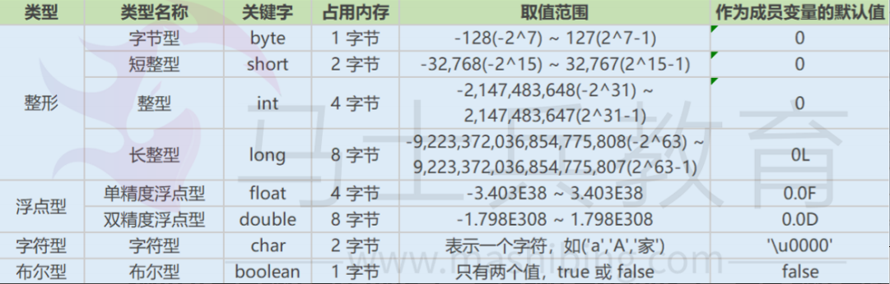
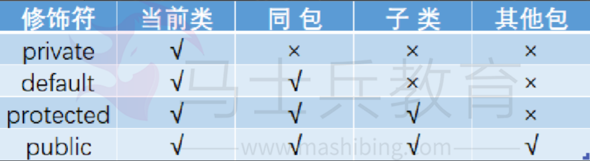
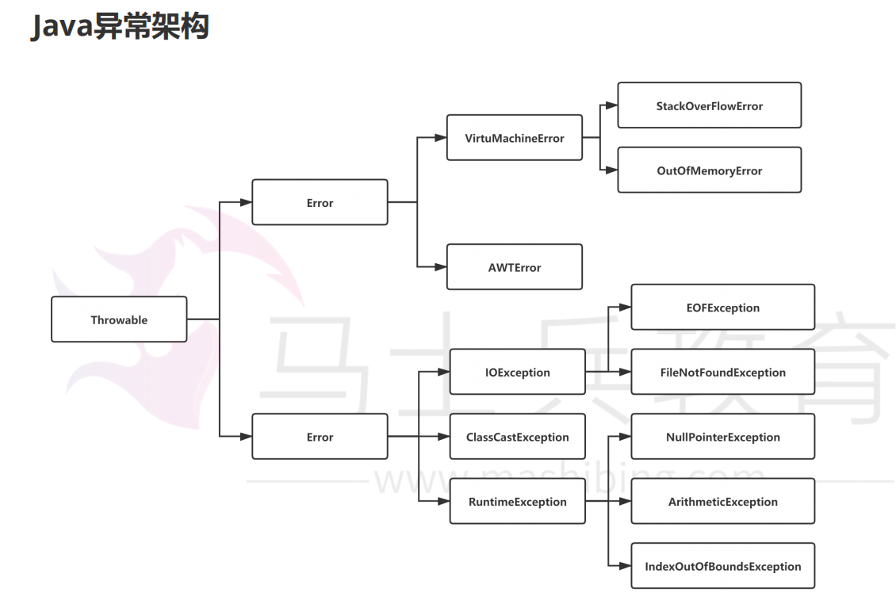
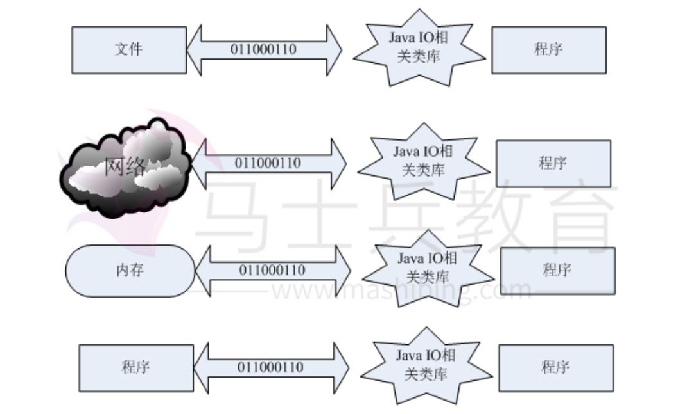
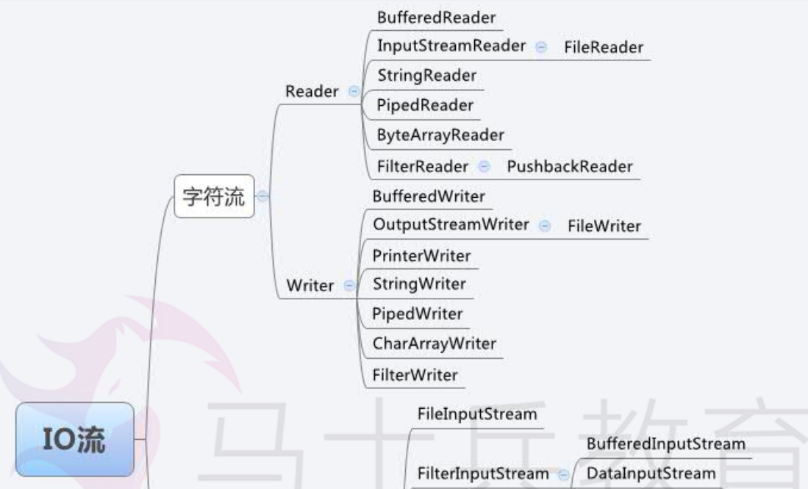
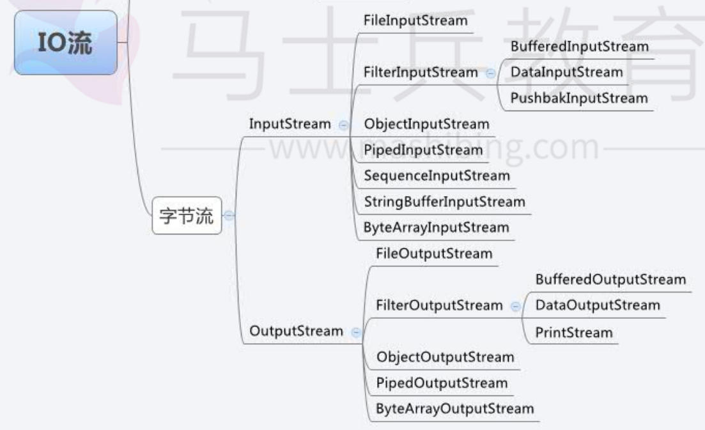
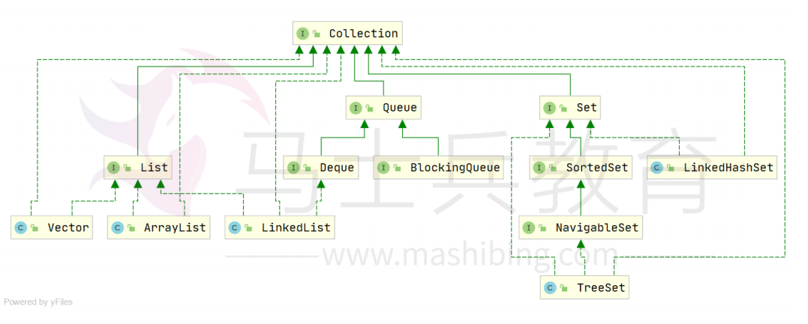
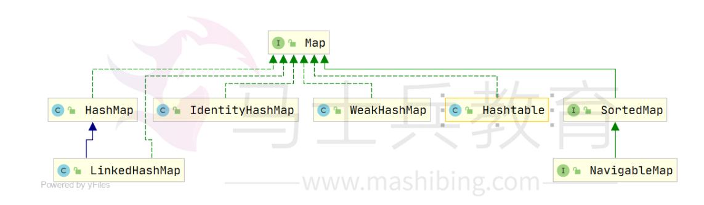
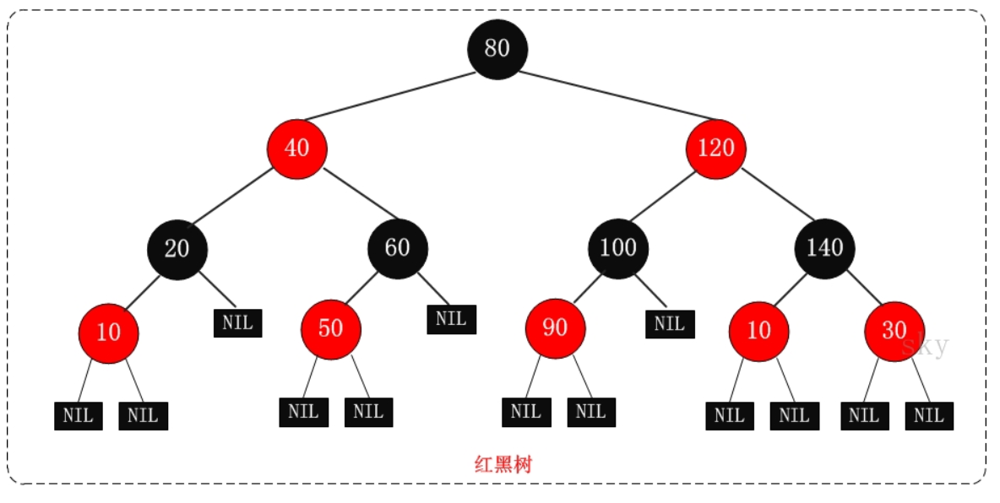

[toc]

# Java面试考点总结

# 基础语法

## 1 基本数据类型

### 8种基本数据类型，3种引用数据类型

> 8种基本数据类型
> char short int long double float boolean byte

> 引用数据类型
> 类(class)，接口(interface)，数组([])

* 字节是存储容量的基本单位。字符是数字，字母，汉字以及其他语言的各种符号。
* 1字节=8个二进制单位
* 一个二进制单位可以表现0,1两种状态。



### switch的表达式只能是什么数据类型?

目前 switch(expr)中，expr表达式只能是byte、short、char、int、enum枚举类型、String。但是长整型（long）在目前所有的java版本中都是不可以的。

### +=有隐含的强制类型转换

short s1 = 1; s1 = s1 + 1; 会报错
* 由于 1 是 int 类型，因此 s1+1 运算结果也是 int型，需要强制转换类型才能赋值给short 型。

short s1 = 1; s1 += 1; 不会报错
* short s1 = 1; s1 += 1;可以正确编译，因为 s1+= 1;相当于 s1 = (short(s1 + 1);其中有隐含的强制类型转换


## 2 访问修饰符

定义：可以使用访问修饰符来保护对类、变量、方法和构造方法的访问。

* private : 在同一类内可见。注意：不能修饰类（外部类）
* default (即缺省，什么也不写，不使用任何关键字）: 在同一包内可见，不使用任何修饰符。
* protected : 对同一包内的类和所有子类可见。注意：不能修饰类（外部类）。
* public : 对所有类可见。




## 3 运算符

### &和&&的区别

&运算符有两种用法：(1)按位与；(2)逻辑与。

&&运算符是短路与运算。逻辑与跟短路与的差别是非常巨大的，虽然二者都要求运算符左右两端的布尔值都是true 整个表达式的值才是 true。

&&之所以称为短路运算，是因为如果&&左边的表达式的值是 false，右边的表达式会被直 接短路掉，不会进行运算。

注意：逻辑或运算符（|）和短路或运算符（||）的差别也是如此。

## 4 关键字

### final finally finalize区别

final可以修饰类、变量、方法。
* final 类：表示该类不能被继承。
* final 方法：表示该方法不能被重写。
* final 变量：表示该变量是一个常量。若是基本类型变量，则无法被再次赋值。若是引用变量，则引用地址不可变，但值可变。

finally一般作用在try-catch代码块中，在处理异常的时候，通常我们将一定要执行的代码方法写到finally代码块中，表示不管是否出现异常，该代码块都会执行，一般用来存放一些关闭资源的代码。

finalize是一个方法，属于Object类的一个方法，而Object类是所有类的父类，该方法一般由垃圾回收器来调用，当我们调用System.gc() 方法的时候，由垃圾回收器调用finalize()，回收垃圾，一个对象是否可回收的最后判断。

### this关键字

this是自身的一个对象，代表对象本身，可以理解为：指向对象本身的一个指针。

用法：
1.普通的直接引用，this相当于是指向当前对象本身。
2.形参与成员名字重名，用this来区分
3.引用本类的构造函数

### super关键字

super可以理解为是指向自己父类对象的一个指针。

super也有三种用法：
1.普通的直接引用与this类似，super相当于是指向当前对象的父类的引用，这样就可以用
super.xxx来引用父类的成员。
2.子类中的成员变量或方法与父类中的成员变量或方法同名时，用super进行区分。
3.引用父类构造函数

### static关键字

* static 除了构造器，可以修饰类，变量，方法，代码块，内部类（包括接口）。
* static 修饰的变量，方法为静态变量，静态方法。两者属于类，不属于单个对象。

static注意事项：
1. 静态只能访问静态。 
2. 非静态既可以访问非静态的，也可以访问静态的。

## 5 流程控制语句

### break,continue,return的区别及作用

break 跳出当前循环，不再执行循环(结束当前的循环体)

continue 跳出本次循环，继续执行下次循环(结束正在执行的循环 进入下一个循环条件)

return 程序返回，不再执行下面的代码(结束当前的方法 直接返回)

# 面向对象

## 面向对象的三大特性：封装 继承 多态

### 抽象
抽象：抽象是将一类对象的共同特征总结出来构造类的过程，包括数据抽象和行为抽象两方面。抽象只关注对象有哪些属性和行为，并不关注这些行为的细节是什么。

### 封装
封装：隐藏对象的属性和实现细节，仅对外提供公共访问方式，将变化隔离，便于使用，提高复用性和安全性。

### 继承
继承：继承是使用已存在的类的定义作为基础建立新类的技术，新类的定义可以增加新的数据或新的功能，也可以用父类的功能，但不能选择性地继承父类。通过使用继承可以提高代码复用性。继承是多态的前提。

关于继承如下 3 点请记住：
1. 子类能继承父类非 private 的属性和方法。子类不能继承父类的构造方法。
2. 子类可以拥有自己属性和方法，即子类可以对父类进行扩展。
3. 子类可以用自己的方式实现父类的方法。

### 多态
父类或接口定义的引用变量可以指向子类或具体实现类的实例对象。提高了程序的拓展性。

在Java中有两种形式可以实现多态：继承（多个子类对同一方法的重写）和接口 （实现接口并覆盖接口中同一方法）。

方法重载（overload）实现的是编译时的多态性（也称为前绑定），而方法重写（override）实现的是运行时的多态性（也称为后绑定）。

# 类与接口

## 抽象类和接口的对比

抽象类：

0. 抽象类使用abstract关键字声明。一个类只能继承一个类。
1. 抽象类不能实例化。只能被继承。若子类不是抽象类，则子类需要实现抽象类中的抽象方法。
2. 抽象类有抽象方法和普通方法。可以是任意访问修饰符
3. 抽象类可以定义任何成员变量
4. 抽象类可以定义构造器

接口：

0. 接口使用interface关键字声明。一个类可以实现多个接口。
1. 接口不能实例化。只能实现。若子类不是接口，则子类需要实现接口中的所有抽象方法。
2. 接口只有抽象方法，没有普通方法。并且只能是public，default访问修饰符。
3. 接口只能定义静态常量字段。即字段默认都是 static 和 final。
4. 接口不能定义构造器

## 抽象类能使用 final 修饰吗？

不能，定义抽象类就是让其他类继承的，如果定义为 final 该类就不能被继承， 这样彼此就会产生矛盾，所以 final不能修饰抽象类。


# 变量与方法

## 成员变量与局部变量区别

成员变量：方法外部，类内部定义的变量。
局部变量：方法中的变量。

```
作用域
成员变量：针对整个类有效。
局部变量：只在某个范围内有效。(一般指的就是方法,语句体内)

存储位置
成员变量：随着对象的创建而存在，随着对象的消失而消失，存储在堆内存中。
局部变量：在方法被调用，或者语句被执行的时候存在，存储在栈内存中。当方法调用完，或者语句结束后，就自动释放。

生命周期
成员变量：随着对象的创建而存在，随着对象的消失而消失
局部变量：当方法调用完，或者语句结束后，就自动释放。

初始值
成员变量：有默认初始值。
局部变量：没有默认初始值，使用前必须赋值。
```

## 静态变量和实例变量区别

静态变量：静态变量由于不属于任何实例对象，属于类的，所以在内存中只会有一份，在类的加载过程中，JVM只为静态变量分配一次内存空间。

实例变量：每次创建对象，都会为每个对象分配成员变量内存空间，实例变量是属于实例对象的，在内存中，创建几次对象，就有几份成员变量。

## 静态变量与普通变量区别

static变量也称作静态变量，静态变量和非静态变量的区别是：静态变量被所有的对象所共享，在内存
中只有一个副本，它当且仅当在类初次加载时会被初始 化。

而非静态变量是对象所拥有的，在创建对象的时候被初始化，存在多个副本，各个对象拥有的副本互不影响。

## 静态方法和实例方法的区别

静态方法和实例方法的区别主要体现在两个方面：
1. 在外部调用静态方法时，可以使用"类名.方法名"的方式，也可以使 用"对象名.方法名"的方式。而
实例方法只有后面这种方式。也就是说，调 用静态方法可以无需创建对象。
2. 静态方法在访问本类的成员时，只允许访问静态成员（即静态成员变量 和静态方法），而不允许访
问实例成员变量和实例方法；实例方法则无此限制。

# 内部类

将一个类的定义放在另外一个类的定义内部，这就是内部类。内部类本身就是类的一个属性，与其他属性定义方式一致。

内部类可以分为四种：成员内部类、局部内部类、匿名内部类和静态内部类。

## 静态内部类

定义在类内部的静态类，就是静态内部类。
静态内部类可以访问外部类所有的静态变量，而不可访问外部类的非静态变量； 静态内部类的创建方式，new 外部类.静态内部类()。

## 成员内部类

定义在类内部，成员位置上的非静态类，就是成员内部类。
成员内部类可以访问外部类所有的变量和方法，包括静态和非静态，私有和公 有。成员内部类依赖于外部类的实例，它的创建方式外部类实例.new 内部类()。

## 局部内部类

定义在方法中的内部类，就是局部内部类。
定义在实例方法中的局部类可以访问外部类的所有变量和方法，定义在静态方法 中的局部类只能访问外部类的静态变量和方法。局部内部类的创建方式，在对应 方法内，new 内部类()。

## 匿名内部类

匿名内部类就是没有名字的内部类，日常开发中使用的比较多。

# 异常



Throwable 是 Java 语言中所有错误与异常的父类。其有两个重要的子类。Exception（异常） 和 Error（错误）

Error（错误）:是程序无法处理的错误，表示运行应用程序中较严重问题。大多数错误与代码编写者执行的操作无关，而表示代码运行时 JVM（Java 虚拟机）出现的问题。

Exception（异常）:是程序本身可以处理的异常。

注意：异常和错误的区别：异常能被程序本身可以处理，错误是无法处理。

## try catch finally总结

* try 块：用于捕获异常。其后可接零个或多个 catch 块，如果没有 catch块，则必须跟一个 finally 块。
* catch 块：用于处理 try 捕获到的异常。
* finally 块：无论是否捕获或处理异常，finally 块里的语句都会被执行。

在以下 4 种特殊情况下，finally 块不会被执行：
1. 在 finally 语句块中发生了异常。
2. 在前面的代码中用了 System.exit()退出程序。
3. 程序所在的线程死亡。
4. 关闭 CPU

## throw和 throws 的区别

* throw – 用于抛出异常。
* throws – 用在方法签名中，用于声明该方法可能抛出的异常。

位置不同
1. throws 用在方法上，后面跟的是异常类，可以跟多个；而 throw 用在函数内，后面跟的是异常对象。

功能不同：
2. throws 用来声明异常，让调用者只知道该功能可能出现的问题，可以给出预先的处理方式；throw抛出具体的问题对象，执行到throw，功能就已经结束了，跳转到调用者，并将具体的问题对象抛给调用者。也就是说 throw 语句独立存在时，下面不要定义其他语句，因为执行不到。
3. throws 表示出现异常的一种可能性，并不一定会发生这些异常；throw 则是抛出了异常，执行throw 则一定抛出了某种异常对象。
4. 两者都是消极处理异常的方式，只是抛出或者可能抛出异常，但是不会由函数去处理异常，真正的处理异常由函数的上层调用处理。

##  try-catch-finally 中，如果 catch 中 return 了， finally 还会执行吗？

会执行，在 return 前执行。

如果存在 finally 代码块， try中的return语句不会立马返回调用者，而是记录下返回值待 finally 代码块执行完毕之后再向调用者返回其值，然后如果在finally 中修改了返回值,就会返回修改后的值。

# 重写与重载

## 重载和重写的区别

方法的重载和重写都是实现多态的方式，区别在于前者实现的是编译时的多态 性，而后者实现的是运行时的多态性。

重载：发生在同一个类中，方法名相同参数列表不同（参数类型不同、个数不 同、顺序不同），与方法返回值和访问修饰符无关，即重载的方法不能根据返回 类型进行区分

重写：发生在父子类中，方法名、参数列表必须相同，返回值小于等于父类，抛 出的异常小于等于父类，访问修饰符大于等于父类（里氏代换原则）；如果父类 方法访问修饰符为private则子类中就不是重写。

重载：同一类中的同名不同参方法。
重写：不同类中的同名同参方法。

# 对象相等判断

## == 和 equals 的区别是什么

对于基本数据类型（包括包装类）：== 比较的是值。对于引用数据类型 == 比较的是内存地址。

equals() : 它的作用是判断两个对象是否相等。但它一般有两种使用情况： 
- 情况1：若类没有覆盖equals()方法时。默认通过“==”比较这两个对象，即比较两个对象的内存地址是否相等。
- 情况2：若类覆盖equals()方法。则比较两个对象的内容相等；若它们的内容相等，则返回 true。

说明：
* 原生的equals()方法。等价==。
* String中的equals方法是被重写过的。因此String的equals方法比较的是对象的值。

## hashCode 与 equals

### hashCode()与equals()的相关规定
若两个对象相等，则hashcode一定也是相同的。则两个对象分别调用equals方法都返回true。

若两个对象有相同的hashcode值，它们也不一定是相等的。

# 值传递

## 值传递和引用传递的区别
值传递：指的是在方法调用时，传递的参数是按值的拷贝传递，传递的是值的拷贝，也就是说传递后就互不相关了。 

引用传递：指的是在方法调用时，传递的参数是引用的地址，也就是变量所对应的内存空间的地址。也就是说传递前和传递后都指向同一个引用（也就是同一个内存空间）。

## 为什么 Java 中只有值传递

Java程序设计语言总是采用按值传递。也就是说，方法得到的是所有参数值的一个拷贝，也就是说，方法内不能修改传递给它的任何参数变量的内容。

例如：当一个对象实例作为一 个参数被传递到方法中时，参数的值就是对该对象的引用。对象的属性可以在被 调用过程中被改变，但对对象引用的改变是不会影响到调用者的。

# IO流

## IO流的概念
* 数据在两设备间的传输称为流，流的本质是数据传输，根据数据传输特性将流抽象为各种类，方便更直观的进行数据操作。
* 流有输入和输出，输入时是流从数据源流向程序。输出时是流从程序传向数据源，而数据源可以是内存，文件，网络或程序等。



## IO流的区分

>按照流的流向分，可以分为输入流和输出流； 
>输入流:只能从中读取数据，而不能向其写入数据。
>输出流：只能向其写入数据，而不能从中读取数据。

>按照操作单元划分，可以划分为字节流和字符流； 
>字节流以字节（8bit）为单位，字符流以字符为单位
>字节流能处理所有类型的数据（如图片、avi等），而字符流只能处理字符类型的数据。
>只要是处理纯文本数据，就优先考虑使用字符流。 除此之外都使用字节流。


>按照流的角色划分为节点流和处理流。
>向一个特定的IO设备（如磁盘、网络）读/写数据的流，称为节点流，节点流也被成为低级流。
>处理流是对一个已存在的流进行连接或封装，通过封装后的流来实现数据读/写功能，处理流也被称为高级流。


Java 关于I0流的40多个类都是从如下4个抽象类基类中派生出来的。
* InputStream/Reader: 所有的输入流的基类，前者是字节输入流，后者是字符输入流。
* OutputStream/Writer: 所有输出流的基类，前者是字节输出流，后者是字符输出流。

InputStream,Reader,OutputStream以及Writer，这四大抽象基类，本身并不能创建实例来执行输入/输出，但它们将成为所有输入/输出流的模版，所以它们的方法是所有输入/输出流都可以使用的方法。类似于集合中的Collection接口。




## BIO,NIO,AIO的区别

简答
* BIO：Block IO 同步阻塞式 IO，就是我们平常使用的传统 IO，它的特点是模式简单使用方便，并发处理能力低。

* NIO：Non IO 同步非阻塞 IO，是传统 IO 的升级，客户端和服务器端通过Channel（通道）通讯，实现了多路复用。

* AIO：Asynchronous IO 是 NIO 的升级，也叫 NIO2，实现了异步非堵塞 IO ，异步 IO 的操作基于事件和回调机制。

详细回答
* BIO (Blocking I/O): 同步阻塞I/O模式，数据的读取写入必须阻塞在一个线程内等待其完成。在活动连接数不是特别高（小于单机1000）的情况下，这种模型是比较不错的，可以让每一个连接专注于自己的 I/O 并且编程模型简单，也不用过多考虑系统的过载、限流等问题。线程池本身就是一个天然的漏斗，可以缓冲一些系统处理不了的连接或请求。但是，当面对十万甚至百万级连接的时候，传统的 BIO 模型是无能为力的。因此，我们需要一种更高效的 I/O 处理模型来应对更高的并发量。

* NIO (New I/O): NIO是一种同步非阻塞的I/O模型，在Java 1.4 中引入了NIO框架，对应 java.nio包，提供了 Channel , Selector，Buffer等抽象。NIO中的 N可以理解为Non-blocking，不单纯是New。它支持面向缓冲的，基于通道的I/O操作方法。 NIO的阻塞模式使用就像传统中的支持一样，比较简单，但是性能和可靠性都不好；非阻塞模式正好与之相反。对于低负载、低并发的应用程序，可以使用同步阻塞BIO来提升开发速率和更好的维护性；对于高负载、高并发的（网络）应用，应使用 NIO 的非阻塞模式来开发。

* AIO (Asynchronous I/O): AIO 也就是 NIO 2。在 Java 7 中引入了 NIO 的改进版 NIO 2,它是异步非阻塞的IO模型。异步 IO 是基于事件和回调机制实现的，也就是应用操作之后会直接返回，不会堵塞在那里，当后台处理完成，操作系统会通知相应的线程进行后续的操作。AIO 是异步IO的缩写，虽然 NIO 在网络操作中，提供了非阻塞的方法，但是 NIO 的 IO 行为还是同步的。对于 NIO 来说，我们的业务线程是在 IO 操作准备好时，得到通知，接着就由这个线程自行进行 IO 操作，IO操作本身是同步的。目前来说 AIO 的应用还不是很广泛，Netty 之前也尝试使用过 AIO，不过又放弃了。

# 常用类的API

## String相关

### 什么是字符串常量池？

字符串常量池位于堆内存中，专门用来存储字符串常量，可以提高内存的使用率，避免开辟多块空间存储相同的字符串，在创建字符串时 JVM 会首先检查字符串常量池，如果该字符串已经存在池中，则返回它的引用，如果不存在，则实例化一个字符串放到池中，并返回其引用。

### String有哪些特性

* 不变性：String 是只读字符串，对它进行任何操作，其实都是创建一个新的对象，再把引用指向该对象。不变模式的主要作用在于当一个对象需要被多线程共享并频繁访问时，可以保证数据的一致性。
* 常量池优化：String 对象创建之后，会在字符串常量池中进行缓存，如果下次创建同样的对象时，会直接返回缓存的引用。
* final：使用 final 来定义 String 类，表示 String 类不能被继承，提高了系统的安全性。

### 是否可以继承 String 类

String 类是 final 类，不可以被继承。

String str="i"与 String str=new String(“i”)一样吗？不一样，因为内存的分配方式不一样。String str="i"的方式，java 虚拟机会将其分配到常量池中；而 String str=new String(“i”) 则会被分到堆内存中。 

String s = new String(“xyz”);创建了几个字符串对象? 两个对象，一个是静态区的"xyz"，一个是用new创建在堆上的对象。

### String和StringBuffer、StringBuilder的区别是什么？

> 可变性

String类中使用字符数组保存字符串，private final char value[]，所以 string对象是不可变的。

StringBuilder与StringBuffer都继承自 AbstractStringBuilder类，在AbstractStringBuilder中也是使用字符数组保存字符串，char[] value，这两种对象都是可变的。

> 线程安全性

String中的对象是不可变的，也就可以理解为常量，线程安全。

StringBuffer对方法加了同步锁或者对调用的方法加了同步锁，所以是线程安全的。StringBuilder并没有对方法进行加同步锁，所以是非线程安全的。

> 性能

StirngBuilder > StringBuffer > String

## 包装类相关

装箱：将基本类型用它们对应的引用类型包装起来；
拆箱：将包装类型转换为基本数据类型；

###  int 和 Integer 有什么区别？

为了能够将这些基本数据类型当成对象操作，Java 为每一个基本数据类型都引入了对应的包装类型（wrapper class），int 的包装类就是 Integer。

原始类型: boolean，char，byte，short，int，long，float，double 

包装类型：Boolean，Character，Byte，Short，Integer，Long，Float，Double

# 线程

## 说说多线程

* 线程是操作系统调度的最小单元,一个进程中可以包含多个线程。从而可以让一个进程并发地处理多个任务。
* 每个线程拥有各自的堆栈，局部变量。同时每个线程也共享进程内的资源。由于共享资源,处理器可以让这些线程之间快速切换执行,从而让使用者感觉这些线程在同时执行。
* 一个程序运行之后至少有一个进程,而一个进程可以包含多个线程,但至少要包含一个线程。

使用多线程的原因：
* 程序使用多线程技术,就可以将计算逻辑分配到多个处理器核心上,显著减少程序的处理时间,从而随着更多处理器核心的加入而变得更有效率。
* 使用多线程技术,可以将数据一致性不强的逻辑操作派发给其他线程处理,如上传图片、发送邮件、生成订单等。这样响应用户请求的线程就能够尽快地完成处理,大大地缩短了响应时间。

## java是如何保证线程安全？

Java保证线程安全的方式有三种,按照资源占用情况由轻到重排列,分别是java.util.concurrent.atomic包中的原子类、volatile、锁。

锁：
* Java中加锁的方式有两种,分别是synchronized关键字和Lock接口。

# 反射

## 说说对反射的了解

通过反射机制我们能做如下事情：
1. 通过获得任意一个类的Class对象并通过该对象查看类信息。并创建类的实例对象，访问该实例对象的成员变量。
2. 生成一个类的动态代理类或动态代理对象。应用场景有：使用JDBC时如果要创建数据库连接要通过反射机制加载数据库驱动程序。从注解或xml配置中解析出来的类是字符串需要利用反射实例化。AOP实现方案是在程序运行时通过反射机制创建目标对象代理类。


# 集合容器

## 集合和数组的区别

* 数组是固定长度的；集合可变长度的。
* 数组可以存储基本数据类型，也可以存储引用数据类型；集合只能存 储引用数据类型。
* 数组存储的元素必须是同一个数据类型；集合存储的对象可以是不同 数据类型。

## 常用的集合类有哪些？

Map接口和Collection接口是所有集合框架的父接口：
1. Collection接口的子接口包括：Set接口和List接口
2. Map接口的实现类主要有：HashMap、TreeMap、Hashtable、 ConcurrentHashMap以及Properties等
3. Set接口的实现类主要有：HashSet、TreeSet、LinkedHashSet等
4. List接口的实现类主要有：ArrayList、LinkedList、Stack以及Vector等




Java 容器分为 Collection 和 Map 两大类，Collection集合的子接口有Set、 List、Queue三种子接口。比较常用的是Set、List。Map接口不是 collection的子接口。

Collection集合主要有List和Set两大接口
* List：一个有序（元素存入集合的顺序和取出的顺序一致）容器，元素可以重复，可以插入多个null元素，元素都有索引。常用的实现类有 ArrayList、LinkedList 和 Vector。
* Set：一个无序（存入和取出顺序有可能不一致）容器，不可以存储重复元素， 只允许存入一个null元素，必须保证元素唯一性。Set 接口常用实现类是 HashSet、 LinkedHashSet 以及TreeSet。

Map是一个键值对集合，存储键、值和之间的映射。 Key无序，唯一；value 不要求有序，允许重复。

Map没有继承于Collection接口，从Map集合中检索元素时，只要给出键对象，就会返回对应的值对象。Map 的常用实现类：HashMap、TreeMap、HashTable、LinkedHashMap、 ConcurrentHashMap。

## 各个集合容器的底层数据结构

List
* Arraylist： Object数组
* Vector： Object数组
* LinkedList： 双向循环链表

Set
* HashSet（无序，唯一）：基于 HashMap 实现的，底层采用 HashMap 来保存元素
* LinkedHashSet： LinkedHashSet 继承与 HashSet，并且其内部是通过 LinkedHashMap 来实现的。有点类似于我们之前说的LinkedHashMap 其内部是基 于 Hashmap 实现一样，不过还是有一点点区别的。
* TreeSet（有序，唯一）： 红黑树(自平衡的排序二叉树。) 

Map
* HashMap： JDK1.8之前HashMap由数组+链表组成的，数组是HashMap的主体，链表则是主要为了解决哈希冲突而存在的（“拉链法”解决冲突）.JDK1.8以后在解决哈希冲突时有了较大的变化，当链表长度大于阈值（默认为8）时，将链表转化为红黑树，以减少搜索时间
* LinkedHashMap：LinkedHashMap 继承自 HashMap，所以它的底层仍然是 基于拉链式散列结构即由数组和链表或红黑树组成。另外，LinkedHashMap 在上面 结构的基础上，增加了一条双向链表，使得上面的结构可以保持键值对的插入顺序。 同时通过对链表进行相应的操作，实现了访问顺序相关逻辑。
* HashTable： 数组+链表组成的，数组是 HashMap 的主体，链表则是主要为 了解决哈希冲突而存在的
* TreeMap： 红黑树（自平衡的排序二叉树）

## 哪些集合类是线程安全的？

java.uti包中的集合类大部分都是非线程安全的，例如：ArrayList/LinkedList/HashMap等等，其中Vector和Hashtable是线程安全的，但是这两个类性能很差，在实际的开发中不常用。对于这些非线程安全的类，可以利用Collections工具类提供的synchronizedXxx()方法,可以将这些集合类包装成线程安全的集合类。

另外java.util.concurrent包中的提供了大量的支持并发访问的集合类。例如ConcurrentHashMap和ConcurrentMap等线程安全的集合类。

## List 和 Set 和 Map 区别

List是存储的数据是有顺序，并且允许重复，值允许有多个null。常用的实现类有 ArrayList、LinkedList 和 Vector。

Set是存储的数据是没有顺序的,并且不允许重复，只允许一个 null 元素。常用的实现类是 HashSet、LinkedHashSet 以及 TreeSet。

Map是存储键和值这样的双列数据的集合，存储的数据是没有顺序的，键不能重复，值是可以有重复的，key最多有一个null。常用的几个实现类是 HashMap、LinkedHashMap、TreeMap。

## List 和 Set 和 Map的使用场景

1）如果你经常会使用索引来对容器中的元素进行访问，那么 List 是你的正确的选择。如果你已经知道索引了的话，那么 List 的实现类比如 ArrayList 可以提供更快速的访问,如果经常添加删除 元素的，那么肯定要选择LinkedList。

2）如果你想容器中的元素能够按照它们插入的次序进行有序存储，那么还是 List，因为 List 是 一个有序容器，它按照插入顺序进行存储。

3）如果你想保证插入元素的唯一性，也就是你不想有重复值的出现，那么可以选择一个 Set 的 实现类，比如 HashSet、LinkedHashSet 或者 TreeSet。所有 Set 的实现类都遵循了统一约束 比如唯一性，而且还提供了额外的特性比如 TreeSet 还是一个 SortedSet，所有存储于 TreeSet 中的元素可以使用Java 里的 Comparator 或者 Comparable 进行排序。LinkedHashSet 也按 照元素的插入顺序对它们进行存储。

4）如果你以键和值的形式进行数据存储那么 Map 是你正确的选择。你可以根据你的后续需要 从Hashtable、HashMap、TreeMap 中进行选择。


# Collection接口

## List接口

### 说一下 ArrayList 的优缺点

ArrayList的优点如下：
* ArrayList 底层以数组实现，是一种随机访问模式。ArrayList 实现了 RandomAccess 接口，因此查找的时候非常快。
* ArrayList 在顺序添加一个元素的时候非常方便。

ArrayList 的缺点如下：
* 删除元素的时候，需要做一次元素复制操作。如果要复制的元素很多，那么就会比较耗费性能。 
* 插入元素的时候，也需要做一次元素复制操作，缺点同上。

ArrayList 比较适合顺序添加、随机访问的场景。

### 如何实现数组和 List 之间的转换？

数组转 List：使用 Arrays. asList(array) 进行转换。

List 转数组：使用 List 自带的 toArra() 方法   

### ArrayList 和 LinkedList 的区别是什么？

* 数据结构实现：ArrayList 是动态数组的数据结构实现，而 LinkedList 是双向链表的数据结构实现。
* 查询效率：ArrayList 比 LinkedList 效率要高。ArrayList通过数组下标访问，LinkedList通过遍历访问。
* 增删效率：LinkedList 比 ArrayList 效率要高，因为ArrayList增删会影响数组内的其他数据的下标。
* 内存空间占用：LinkedList 比 ArrayList 更占内存，因为 LinkedList 的节点除了存储数据，还存储了两个引用，一个指向前一个元素，一个指向后一个元素。
* 线程安全：ArrayList 和 LinkedList 都是不同步的，都不保证线程安全。

## Set接口

### 说一下 HashSet 的实现原理？

HashSet 是基于 HashMap 实现的，HashSet的值存放于HashMap的key上，HashMap的value统一为PRESENT，因此 HashSet 的实现比较简单，相关 HashSet 的操作，基本上都是直接调用底层HashMap 的相关方法来完成，HashSet 不允许重复的值。

### HashSet如何检查重复？HashSet是如何保证数据不可重复的？

向HashSet 中add ()元素时，判断元素是否存在的依据，不仅要比较hash值，同时还要结合equles 方法比较。

HashSet 中的add ()方法会使用HashMap 的put()方法。

HashMap 的 key 是唯一的，HashSet 添加进去的值就是作为 HashMap 的key，并且在HashMap中如果K/V相同时，会用新的V覆盖掉旧的V，然后返回旧的V。所以不会重复（ HashMap比较key是否相等是先比较 hashcode 再比较equals ）。

### hashCode（）与equals（）的相关规定

1. 如果两个对象相等，则hashcode一定也是相同的
2. 两个对象相等,对两个equals方法返回true
3. 两个对象有相同的hashcode值，它们也不一定是相等的
4. 综上，equals方法被覆盖过，则hashCode方法也必须被覆盖
5. hashCode()的默认行为是对堆上的对象产生独特值。如果没有重写hashCode()，则该class的两个对象无论如何都不会相等（即使这两个对象指向相同的数据）。

### ==与equals的区别

1. ==是判断两个变量或实例是不是指向同一个内存空间 equals是判断两个变量或实例所指向的内存空间的值是不是相同
2. ==是指对内存地址进行比较 equals()是对字符串的内容进行比较
3. == 指引用是否相同 equals()指的是值是否相同

# Map接口

## HashMap 的实现原理？

HashMap实际上是数组和链表的结合体。

HashMap 基于 Hash 算法实现的
1. 当我们往Hashmap中put元素时，利用key的hashCode重新hash计算出当前对象的元素在数组中的下标
2. 存储时，如果出现hash值相同的key，此时有两种情况。(1)如果key相同，则覆盖原始值；(2)如果key不同（出现冲突），则将当前的key-value 放入链表中
3. 获取时，直接找到hash值对应的下标，在进一步判断key是否相同，从而找到对应值。
4. 理解了以上过程就不难明白HashMap是如何解决hash冲突的问题，核心就是使用了数组的存储方式，然后将冲突的key的对象放入链表中，一旦发现冲突就在链表中做进一步的对比。当链表中的节点数据超过八个之后，该链表会转为红黑树来提高查询效率，从原来的O(n)到O(logn)

## HashMap为什么使用红黑树替换链表?

当HashMap的链表长度>8时，会把链表转换为红黑树。

原因：开始使用链表，占用空间少，查询性能也相差不大。但是当链表越来越长，查询效率逐渐变低，为保证查询效率才会舍弃链表转为红黑树，以空间换时间。

### 红黑树

红黑树本质上是平衡二叉树。有时不太平衡。

红黑树和平衡二叉树的区别：
* 平衡二叉树的左右子树的高度差绝对值不超过1，但是红黑树在某些时刻可能会超过1，只要符合红黑树的规则即可。
* 平衡二叉树只要不平衡时就会进行旋转，而红黑树不符合规则时，有些情况只用改变颜色不用旋转，就能达到平衡。

红黑树的红黑规则：
1. 每个节点要么是黑色，要么是红色。
2. 根节点是黑色。叶子节点（NIL）也是黑色。
3. 若一个节点是红色的，则它的子节点必须是黑色的。(父子节点不能同时为红色)
4. 从一个节点到该节点的子孙节点的所有路径上包含相同数目的黑节点。


上图中根节点到叶子节点的所有路径都包含3个黑节点。

红黑树使用红黑二色进行“着色”，目的是利用颜色值作为二叉树的平衡对称性的检查，只要插入的节点“着色”满足红黑二色的规定，那么最短路径与最长路径不会相差的太远，红黑树的节点分布就能大体上达至均衡。


## HashMap的扩容操作是怎么实现的？

HashMap的初始容量为16

扩容是当hashMap中的键值对数量大于阀值时或者初始化时，就调用resize方法进行扩容；每次扩展的时候，都是扩展2倍；扩展后Node节点对象的位置要么在原位置，要么移动到原始位置+增加的数组大小这个位置上。

## HashMap是怎么解决哈希冲突的？

1. 使用链地址法（使用散列表）来链接拥有相同hash值的数据；
2. 使用2次扰动函数（hash函数）来降低哈希冲突的概率，使得数据分布更平均；
3. 引入红黑树进一步降低遍历的时间复杂度，使得遍历更快；

## HashMap 与 HashTable 的区别？

* 线程安全：HashMap 是非线程安全的，HashTable 是线程安全的；HashTable 内部方法都经过synchronized修饰。
* 性能：HashMap > HashTable
* null: HashMap中null可以作为键值，但只能有一个。Hashtable不允许存入null
* 底层: HashMap和HashTable都是用数组+链表作为底层数据结构的。但是HashMap的链表长度>8时，链表会转换为红黑树。

## HashMap的死循环问题？

由于HashMap并非是线程安全的，所以在高并发的情况下必然会出现一个问题。即在并发的情况，当HashMap要扩容时，可能会产生循环链表，在执行get的时候，会触发死循环，引起CPU的100%问题，因此一定要避免在并发环境下使用HashMap。建议并发环境下使用ConcurrentHashMap。

## HashMap 和 ConcurrentHashMap 的区别

1. ConcurrentHashMap对整个桶数组进行了分割分段(Segment)，然后在每一个分段上都用lock锁进行保护，而HashMap没有锁机制，不是线程安全的。（JDK1.8之后ConcurrentHashMap启了一种全新的方式实现,利用CAS算法。）
2. HashMap的键值对允许有null，但是ConCurrentHashMap都不允许。


