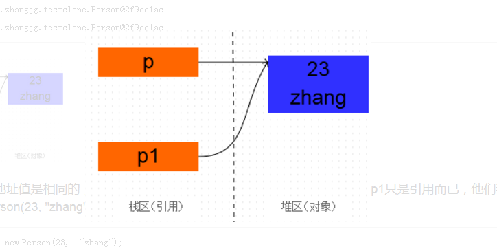

[toc]

上次更新时间：2022-04-20

## JAVA面试题-基础1

### 1. 面向对象的特征有哪些方面？

**面向对象的特征主要有以下几个方面：**

抽象：抽象是将一类对象的共同特征总结出来构造类的过程。抽象只关注对象有哪些属性和行为，并不关注这些行为的细节是什么。参考java中的抽象类和接口。抽象类的抽象方法是没有具体实现代码的。接口是完全抽象类。

继承：继承是从已有类得到继承信息创建新类的过程。提供继承信息的类被称为父类；得到继承信息的类被称为子类（派生类）。

封装：封装是把数据和操作数据的方法绑定起来，对数据的访问只能通过已定义的接口。类的封装就是隐藏一切可隐藏的东西，只向外界提供最简单的编程接口。

多态性：多态性是指允许不同子类型的对象对同一消息作出不同的响应。简单的说就是用同样的对象引用调用同样的方法但是做了不同的事情。实现多态需要做两件事：1). 方法重写（子类继承父类并重写父类中已有的或抽象的方法）； 2). 对象造型（用父类型对象变量去引用子类型对象，调用方法就会根据子类对象的不同而表现出不同的行为）。

### 2. 访问修饰符 public private default protected的区别？

访问级别 | 同类 | 同包 | 子类 | 不同的包 
------------ | ------------- |  ------------- |  ------------- |  ------------- 
公开 public | √ | √ | √ | √ 
保护 producted | √ | √ | √ | × | ×
默认 default | √ | √ | × | ×
私有 private | √ | × | × |× 

### 3. java 8个基本数据类型？

Java8中基本数据类型
> char short int long double float boolean byte

字节是存储容量的基本单位。字符是数字，字母，汉字以及其他语言的各种符号。
<font color="red">1字节=8个二进制单位</font>

一个二进制单位可以表现0,1两种状态。
```
> 布尔型 boolean
> 占1个字节
> 取值范围: true false
> 默认值：false

> 字节型：byte
> 占1个字节
> 取值范围: -128 ~ 127（-2^7 ~ 2^7-1）
> 默认值：0

> 短整型：short
> 2个字节
> 取值范围：-2^15 ~ 2^15-1
> 默认值：0

> 整型：int
> 4个字节
> 取值范围：-2^31 ~ 2^31-1
> 默认值：0

> 长整型：long
> 8个字节
> 取值范围：-2^63 ~ 2^63-1
> 默认值：0

> 字符型 char
> 2个字节
> 取值范围 0~2^16-1
> 默认值：'\u0000'

> 单精度浮点型 float
> 4个字节
> 默认值：0.0f

> 双精度浮点型 double
> 8个字节
> 默认值：0.0d
```

### 4. short s1 = 1; s1 = s1 + 1;有错吗? short s1 = 1; s1 += 1;有错吗？

首先s1是short类型。1 是int类型。
s1 = s1 + 1; 会编译报错。需要强制转换类型 改为 s1 = (short) (s1 + 1);才行。
s1 += 1; 不会编译报错。因为 s1+= 1;相当于 s1 = (short(s1 + 1)）;其中有隐含的强制类型转换。

### 5. &和&&的区别？

&：不管前面的条件是否正确，后面都执行。即左右两边都要判断
&&：左边条件正确时，才执行右边，不正确时，就不执行，就效率而言，这个更好。

**注意：运算符（|）和运算符（||）的差别也是如此**


### 6. 解释内存中的栈(stack)、堆(heap)和方法区(method area)?

1. 通常基本数据类型的变量，对象的引用保存在栈空间；
2. 通过 new 关键字和构造器创建的对象则放在堆空间
3. 方法区存储已经被 JVM 加载的类信息、常量、静态变量、JIT 编译器编译后的代码等数据；

### 7. Math.round(11.5) 等于多少？Math.round(-11.5)等于多少？
Math.round(11.5)的返回值是 12，Math.round(-11.5)的返回值是-11。
Math.round()的原理是在参数上加 0.5 然后进行下取整。

### 8. switch表达式能用那些类型数据？

以java8为准，switch只支持10种类型.

基本类型：byte char short int 
包装类 ：Byte,Short,Character,Integer，String，enum      

实际上switch表达式只能使用int类型或者能转换为int类型的包装类。上面的10种类型都能自动转换为int类型。


浮点类型：float,double不行。长整型long占8个字节，也不行。

### 9. 两个对象值相同(x.equals(y) == true)，但却可有不同的hash code，这句话对不对？

不对，如果两个对象 x 和 y 满足 x.equals(y) == true，它们的哈希码（hash code）应当相同。

Java 对于 eqauls 方法和 hashCode 方法是这样规定的：
1. 如果两个对象相同（equals 方法返回 true），那么它们的 hashCode 值一定要相同；


### 10. 当一个对象被当作参数传递到一个方法后，此方法可改变这个对象的属性，并可返回变化后的结果，那么这里到底是值传递还是引用传递？

是值传递。Java 只支持参数的值传递。
当一个对象实例作为一个参数被传递到方法中时，参数的值就是该对象的副本。副本的属性可以在被调用过程中被改变，但副本的改变是不会影响到原本对象的。

### 11. String 和 StringBuilder、StringBuffer 的区别？

String：字符串常量
StringBuffer 字符串变量（线程安全）
StringBuilder 字符串变量（非线程安全）

总结:
1. 在Java中，使用"+"号来串联字符串。底层会通过StringBuilder的append()方法来实现。

### 12. 重载（Overload）和重写（Override）的区别。重载的方法能否根据返回类型进行区分？

重载：在同一类中，名字相同但是其他不相同的几个方法。叫做重载。
重写：在父类子类中，子类对父类方法的重写。参数，返回类型，方法名相同。

### 13. java数组有没有 length()方法？String 有没有 length()方法？
数组有 length 的属性。
String 有length()方法。

### 14. char 型变量中能不能存贮一个中文汉字，为什么？
可以，unicode字符集也包括汉字字符。一个 char 类型占 2 个字节（16 比特），所以放一个中文是没问题的。

### 15.抽象类（abstract class）和接口（interface）有什么异同？

1. 抽象类和接口都不能够实例化。
2. 抽象类中可以定义构造器，可以有抽象方法和具体方法。而接口中不能定义构造器而且其中的方法全部都是抽象方法。
3. 抽象类中的成员可以是 private、默认、protected、public的。而接口中的成员全都是 public 的。
4. 抽象类中可以定义成员变量，而接口中定义的成员变量实际上都是常量。
5. 若继承了某个抽象类或者实现了某个接口都需要对其中的抽象方法全部进行实现，否则该类仍然需要被声明为抽象类。

**有抽象方法的类必须被声明为抽象类，而抽象类未必要有抽象方法。接口中的方法全部都是抽象方法。**

### 16.抽象的（abstract）方法是否可同时是静态的（static）？

抽象方法需要子类重写，而静态的方法是无法被重写的，因此二者是矛盾的

### 17.阐述静态变量和实例变量的区别？

1. 静态变量被 static 修饰符修饰。属于类变量，不属于类的任何一个对象，一个类不管创建多少个对象，静态变量在内存中有且仅有一个拷贝。静态变量可以实现让多个对象共享内存。
2. 实例变量依存于某一实例，需要先创建对象然后通过对象才能访问到它。

### 18.是否可以从一个静态（static）方法内部发出对非静态（non-static）方法的调用？

不可以，静态方法只能访问静态成员。

### 19.如何实现某个类的对象克隆？
两种方式：
1. 该类实现 Cloneable 接口并重写 Object 类中的 clone()方法；
2. 该类实现 Serializable 接口，通过对象的序列化和反序列化实现克隆，可以实现真正的深度克隆。

### 20.String s = new String(“xyz”);创建了几个字符串对象？
两个对象，一个是常量区的”xyz”，一个是用 new 创建在堆上的对象。

### 21.String str=“abc”和String str=new String(“abc”); 产生几个对象？
1. 前者1或0，后者2或1，先看字符串常量池，如果字符串常量池中没有，都在常量池中创建一个，如果有，前者直接引用，后者在堆内存中还需创建一个“abc”实例对象。
2. 对于基础类型的变量和常量：变量和引用存储在栈中，常量存储在常量池中。

### 22.接口是否可继承（extends）接口？抽象类是否可实现（implements）接口？抽象类是否可继承具体类（concreteclass）？
1. 接口可以继承接口，而且支持多重继承。
2. 抽象类可以实现(implements)接口。
3. 抽象类可继承具体类也可以继承抽象类。

### 23.一个”.java”源文件中是否可以包含多个类（不是内部类）？有什么限制？
可以，但一个源文件中最多只能有一个公开类（public class）而且文件名必须和公开类的类名完全保持一致。

### 24.Java 中的 final 关键字有哪些用法？
1. 修饰类：表示该类不能被继承；
2. 修饰方法：表示方法不能被重写； 
3. 修饰变量：表示变量只能一次赋值以后值不能被修改（常量）。

### 25.创建对象时构造器的程序运行顺序？

```java
class A {
	static {
		System.out.print("1");
	}
	public A() {
		System.out.print("2");
	}
}
class B extends A{
	static {
		System.out.print("a");
	}
	public B() {
		System.out.print("b");
	}
}
public class Hello {
	public static void main(String[] args) {
		A ab = new B();
		ab = new B();
	}
}
//执行结果：1a2b2b。
```

**创建对象时构造器的调用顺序是：先初始化静态成员，然后调用父类构造器，再初始化非静态成员，最后调用自身构造器。**

### 25-2.类的实例化顺序，比如父类静态数据，构造函数，字段，子类静态数据，构造函数，字段，当 new 的时候，他们的执行顺序?

父类静态代变量、
父类静态代码块、
子类静态变量、
子类静态代码块、
父类非静态变量（父类实例成员变量）、
父类构造函数、
子类非静态变量（子类实例成员变量）、
子类构造函数

### 26.如何实现字符串的反转及替换？

使用 String 或 StringBuffer/StringBuilder 中的方法。或者是用递归实现字符串反转，代码如下所示：

```java
public static String reverse(String originStr) {
	if(originStr == null || originStr.length() <= 1){
        return originStr;
    }else{
        return reverse(originStr.substring(1)) + originStr.charAt(0);
    }
}
```

### 27.怎样将 GB2312 编码的字符串转换为 ISO-8859-1 编码的字符串？
```java
String s1 = "你好";
String s2 = new String(s1.getBytes("GB2312"), "ISO-8859-1");
```

### 28.String 类的常用方法都有那些？

* indexOf()：返回指定字符的索引。
* charAt()：返回指定索引处的字符。
* replace()：字符串替换。
* trim()：去除字符串两端空白。
* split()：分割字符串，返回一个分割后的字符串数组。
* getBytes()：返回字符串的 byte 类型数组。
* length()：返回字符串长度。
* toLowerCase()：将字符串转成小写字母。
* toUpperCase()：将字符串转成大写字符。
* substring()：截取字符串。
* equals()：字符串比较。


### 29.equal() 和 == 区别

对于基本数据类型的变量， == 比较的是实际值。
对于类的实例变量，==比较的是实例变量引用的地址。
若类中重写了equal()的。equal()比较的是内容实际值。

<font color="red">一般情况下，equal都是比较地址</font>

### 30.Error 和 Exception 有什么区别？列出一些你常见的运行时异常？

Error 表示系统级的错误和程序不必处理的异常，比如内存溢出，不可能指望程序能处理这样的情况；Exception 表示需要捕捉或者需要程序进行处理的异常，是一种设计或实现问题；

```
（1）ArithmeticException（算术异常）
（2） ClassCastException （类转换异常）
（3） IllegalArgumentException （非法参数异常）
（4） IndexOutOfBoundsException （下标越界异常）
（5） NullPointerException （空指针异常）
（6） SecurityException （安全异常）
```

### 31.try{}里有一个 return 语句。那么try 后的finally{}会不会执行，什么时候被执行，在 return前还是后?

会执行，在return前执行。
**finally代码块执行完毕之后再向调用者返回其值，然后如果在finally中修改了返回值，就会返回修改后的值。**

### 32.Java 语言如何进行异常处理，关键字：throws、throw、try、catch、finally 分别如何使用？

一般情况下是用try来执行一段程序，如果系统会抛出（throw）一个异常对象，可以通过它的类型来捕获（catch）它，或通过总是执行代码块（finally）来处理；
**throw 语句用来明确地抛出一个异常；throws 用来声明一个方法可能抛出的各种异常**

### 33.阐述 final、finally、finalize 的区别?

1. final：修饰符（关键字）有三种用法：如果一个类被声明为 final，意味着它不能被继承。将变量声明为 final，可以保证它们在使用中不被改变，被声明为 final的变量必须在声明时给定初值，而在以后的引用中只能读取不可修改。被声明为 final 的方法也同样只能使用，不能在子类中被重写。
2. finally：finally是tyr..catch..finally语句中。<font color="red">无论是否抛出异常，finally代码块都会执行</font>。若finally中有return，则会直接renturn.返回值为finally中修改的。若finally中没有return，则会执行try中的renturn.返回值为try的返回值。
2. finalize：Object 类中定义的方法，Java 中允许使用 finalize()方法在垃圾收集器将对象从内存中清除出去之前做必要的清理工作。这个方法是由垃圾收集器在销毁对象时调用的，通过重写 finalize()方法可以整理系统资源或者执行其他清理工作。


### 34.Session和Cookie的区别？

cookie是Web服务器发送给浏览器的文本信息。浏览器将cookie存储在本地电脑上。以后浏览器给Web服务器发请求的时候，同时会发送所有为该服务器存储的cookie。

区别：
1. session存储在服务端，cookie存储在客户端。
2. session会在一定时间内存储在服务器中，当访问增多，导致服务器性能下降时。应该使用cookie
3. 单个cookie的保存的数据不超过4k。许多浏览器限制一个站点最多保存20个cookie。
4. session能够存储任意的Java对象，cookie只能存储String类型的对象

### 35.Object类的方法有那些？

hashcode() equals() toString() getClass() waitnotify() notifyAll() finalize()

Object类位于java.lang包中，是所有Java类的祖先。每个类都使用 Object 作为超类。所有对象（包括数组）都实现这个类的方法。可以使用类型为Object的变量指向任意类型的对象。

1. hashCode方法就是根据一定的规则将与对象相关的信息（比如对象的存储地址，对象的字段等）映射成一个数值，这个数值称作为散列值。
2. equals()方法 比较两个对象是否相等。
3. clone()方法：快速创建一个已有对象的副本。
4. toString()方法。返回一个字符串，该字符串由类名、at 标记符“@”和此对象哈希码的无符号十六进制表示组成
5. finalize()方法：垃圾回收器准备释放内存的时候，会先调用finalize()

### 36.能将 int 强制转换为 byte 类型的变量吗？如果该值大于 byte 类型的范围，将会出现什么现象？
可以做强制转换，但是 Java 中 int 是4个字节，32 位的，而 byte 是1个字节 8 位的，所以，如果强制转化是，int 类型的高 24 位将会被丢弃，byte 类型的范围是从 -128 到 127。

### 37.存在两个类，B 继承 A，C 继承 B，我们能将 B 转换为C 么？如 C = (C) B；

```
C c = new C();
B b = c;
向上转型（子类转型为父类）是可以的。

B b = new B();
C c = (C)b;
向下转型（父类转换为子类）是不可以的

B b = new C();
C c = (C)b;
若父类指向子类引用，再向下转型，这是可以的
```

### 38. 3*0.1 == 0.3 将会返回什么？true 还是 false？
3*0.1 实际上的值是0.33333.... 它是一个浮点数。
false，因为有些浮点数不能完全精确的表示出来。

### 39.为什么 Java 中的 String 是不可变的（Immutable）？
String 不可变是因为 Java 的设计者认为字符串使用非常频繁，将字符串设置为不可变可以允许多个客户端之间共享相同的字符串。

### 40.JRE、JDK、JVM 及 JIT 之间有什么不同？
1. JRE 代表 Java 运行 时（Java run-time），是 运 行 Java 引用所必须的。
2. JDK 代表 Java 开发工具（Java development kit），是 Java 程序的开发工具，如 Java编译器，它也包含 JRE。
3. JVM 代表 Java 虚拟机（Java virtual machine），它的责任是运行 Java 应用。
4. JIT 代表即时编译（Just In Time compilation），当代码执行的次数超过一定的阈值时，会将 Java 字节码转换为本地代码，如，主要的热点代码会被准换为本地代码，这样有利大幅度提高 Java 应用的性能。

### 41. a.hashCode() 有什么用？与 a.equals(b) 有什么关系？
hashCode() 方法是相应对象整型的 hash 值。两个使用 equal() 方法来判断相等的对象，必须具有相同的 hash code。
如果类没有重写equals的方法，则equals一般是对于引用的地址。

### 42.Java 中怎么打印数组？
使用 Arrays.toString() 和 Arrays.deepToString() 方法来打印数组

### 43.为什么在重写 equals 方法的时候需要重写 hashCode 方法？
因为equals一般是对比引用地址，而hashCode的hash值都是通过对引用地址进行hash算法得到的。
因为有强制的规范指定需要同时重写 hashcode 与 equal 是方法，许多容器类，如 HashMap、HashSet 都依赖于 hashcode 与 equals 的规定。

### 44.详解Java的Object类各种方法

Object类位于java.lang包中，是所有Java类的祖先。每个类都使用 Object 作为父类。所有对象（包括数组）都实现这个类的方法。可以使用类型为Object的变量指向任意类型的对象。其含有下列方法：
hashcode() equals() toString() getClass() waitnotify() notifyAll() finalize()

>hashcode()
hashCode方法就是根据一定的规则将与对象相关的信息（比如对象的存储地址，对象的字段等）映射成一个数值，这个数值称作为散列值。

例如：
当集合要添加新的对象时，先调用这个对象的hashCode方法，得到对应的hashcode值。在HashMap中会用一个table保存已经存进去的对象的hashcode值，如果table中没有该hashcode值，它就可以直接存进去，不用再进行任何比较了；如果存在该hashcode值， 就调用它的equals方法与新元素进行比较，相同的话就不存了，不相同就散列其它的地址。

注意：
1. 在程序运行过程中，同一个对象多次调用hashCode（）方法应该返回相同的值。
2. 当两个对象通过equals（）方法比较返回true时，则两个对象的hashCode（）方法返回相等的值。
3. 对象用作equals（）方法比较标准的Field，都应该用来计算hashCode值。

>equals()方法 比较两个对象是否相等
所有的对象都拥有标识(内存地址)和状态(数据)。
Object的equals()方法是比较两个对象的内存地址是否相等，即是否引用同一个对象。

>clone()方法：快速创建一个已有对象的副本
克隆的步骤：1：创建一个对象； 2：将原有对象的数据导入到新创建的数据中。

clone方法首先会判对象是否实现了Cloneable接口，若无则抛出CloneNotSupportedException, 最后会调用internalClone.

<font color="red">
1. Object.clone()方法返回一个Object对象。必须进行强制类型转换才能得到我们需要的类型。
2. 其次克隆是创建一个新的对象，原对象和克隆对象的哈希值是不一样的。
</font>


<h3>浅拷贝深拷贝</h3>

浅拷贝:拷贝对象的引用值
```java
Person p = new Person(23, "zhang"); 
Person p1 = p;
```


深拷贝：完全复制一个新对象
```java
Person p = new Person(23, "zhang"); 
Person p1 = (Person) p.clone();
```


>toString()方法

Object 类的 toString 方法返回一个字符串，该字符串由类名、at 标记符“@”和此对象哈希码的无符号十六进制表示组成。

>finalize()方法：垃圾回收器准备释放内存的时候，会先调用finalize()

(1).对象不一定会被回收。
(2).垃圾回收不是析构函数。
(3).垃圾回收只与内存有关。
(4).垃圾回收和finalize()都是靠不住的，只要JVM还没有快到耗尽内存的地步，它是不会浪费时间进行垃圾回收的


### 45.详解异常


```
java.lang.Throwable是所有异常的根
java.lang.Error是程序中无法处理的错误，表示运行应用程序中出现了严重的错误。
java.lang.Exception是程序本身可以捕获并且可以处理的异常
```

RuntimeException类是运行时异常。一般是由程序逻辑错误引起的，在程序中可以选择捕获处理，也可以不处理。

RumtimeException子类：
* Java.lang.ArithmeticException 算术运算异常
* Java.lang.ArrayStoreExcetpion 数组存储异常
* Java.lang.ClassCastException 类型转换异常
* Java.lang.ArrayIndexOutBoundException 数组下标越界异常
* Java.lang.IndexOutOfBoundsException 索引超出边界异常
* Java.lang.NullPointerException 空指针异常

CheckedException类是检查时异常，都是可以被处理的异常。<font color="red">所有Java程序必须显式处理Checked异常。如果程序没有处理Checked异常，该程序在编译时就会发生错误无法编译.</font>

例子：
* Java.lang.ClassNotFoundException 类找不到异常
* Java.lang.NoSuchMetodException 方法找不到异常
* Java.io.IOException  输入或输出异常

>显式处理异常
抛出异常：throw，throws
捕获异常：try，catch，finally

throw 用在方法内，用来抛出一个异常对象，将这个异常对象传递到调用者处，并结 束当前方法的执行。
throws 运用于方法声明之上，用于表示当前方法不处理异常，而是提醒该方法的调用者来处理异常

>自定义异常
继承Exception或者RuntimeException，如果希望写一个检查性异常类，则需要继承 Exception 类。如果你想写一个运行时异常类，那么需要继承 RuntimeException 类。


## 46 详解泛型

泛型就是指广泛的、普通的类型。在java中是指把类型明确的工作推迟到创建对象或调用方法的时候才去明确的特殊的类型。<font color="red">该机制允许程序员在编译时监测非法的类型。</font>

泛型好处：
* 泛型的好处是在编译的时候检查类型安全，并且所有的强制转换都是自动和隐式的，以提高代码的重用率
* 在编译时期没有出现警告，那么运行时期就不会出现ClassCastException异常

>泛型的使用

泛型有三种使用方式，分别为：泛型类、泛型接口、泛型方法。

**T可以随便写为任意标识，常见的如T、E、K、V等形式的参数常用于表示泛型**

```java
==========泛型类
public class Generic<T>{ 
    //key这个成员变量的类型为T,T的类型由外部指定  
    private T key;
    public Generic(T key) { //泛型构造方法形参key的类型也为T，T的类型由外部指定
        this.key = key;
    }
    public T getKey(){ //泛型方法getKey的返回值类型为T，T的类型由外部指定
        return key;
    }
}
==========泛型接口
//定义一个泛型接口
public interface Generator<T> {
    public T next();
}
============泛型方法
/**
 * 泛型方法的基本介绍
 * @param tClass 传入的泛型实参
 * @return T 返回值为T类型
 * 说明：
 *     1）public 与 返回值中间<T>非常重要，可以理解为声明此方法为泛型方法。
 *     2）只有声明了<T>的方法才是泛型方法，泛型类中的使用了泛型的成员方法并不是泛型方法。
 *     3）<T>表明该方法将使用泛型类型T，此时才可以在方法中使用泛型类型T。
 *     4）与泛型类的定义一样，此处T可以随便写为任意标识，常见的如T、E、K、V等形式的参数常用于表示泛型。
 */
public <T> T genericMethod(Class<T> tClass)throws InstantiationException ,
  IllegalAccessException{
        T instance = tClass.newInstance();
        return instance;
}

```

<h3>泛型中占位符 T和?有什么区别？</h3>

* T指的是某一类具体的对象，list集合里只能存放同一类型数据，如果插入不同类型数据则会报错。
* ？也可以表示成占位符，它指的是某多种具体的对象.所以这样就表明我们的list中存放N种数据类型也是可以的。

```java
//这种写法表示可以接收指定的数据类型和它的子类数据类型的list集合
List<? extends 数据类型> list;
//只接收指定的数据类型及它的父类类型
List<? super 数据类型> list;
```

### 47 启动一个线程是用run()还是start()?有什么区别？

启动一个线程是调用start()方法，这并不意味着线程就会立即运行，只是进入了可运行状态。
直接调用run()方法不会产生线程，而是把它当作普通的方法调用，马上执行。