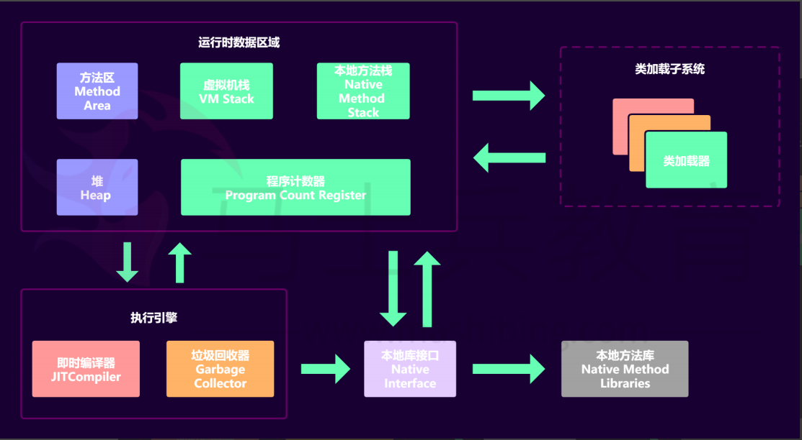
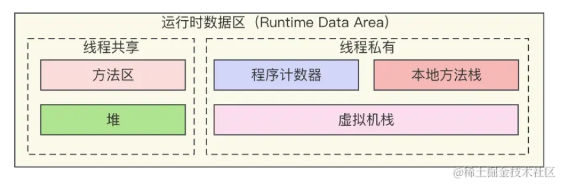
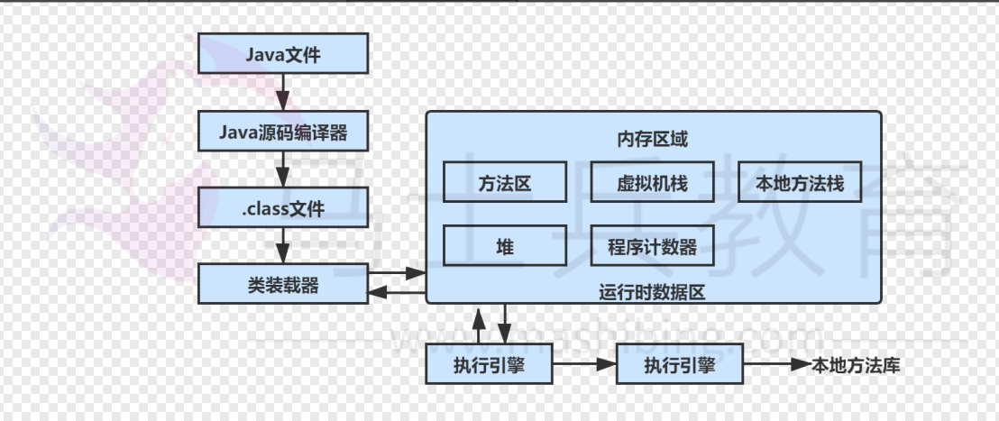
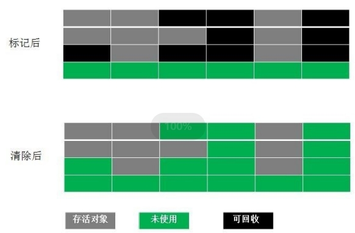
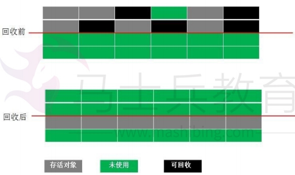
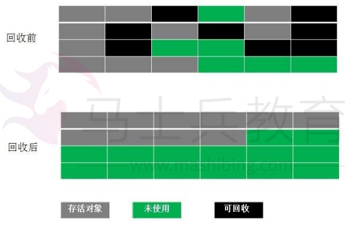

[toc]

# Java面试题总结-JVM

## 说一下 JVM 的主要组成部分及其作用？

> 各个组成部分：

- 运行时数据区：就是JVM的内存。
- 类加载器：加载字节码文件（.class文件）到运行时数据区域中。
- 执行引擎：用来执行字节码文件中的指令。
- 本地库接口：通过本地库接口和本地方法库，java可以执行其它编程语言。

## 说一下 JVM 的类加载器？

类加载器的工作就是把class字节码文件从硬盘加载到运行时数据区中（JVM内存）。

## 说一下 JVM 运行时数据区?

运行时数据区就是JVM的内存，类加载器会将字节码文件加载到运行时数据区中。

运行时数据区分为5个部分。

> ① 程序计数器

程序计数器是线程私有的。每个线程都有自己独立的程序计数器。其生命周期与线程的生命周期保持一致。

程序计数器的主要作用是：当线程执行字节码指令的时候，程序计数器记录当前线程正在执行的字节码指令的地址。

由于线程是需要占用CPU时间片才能运行的。而当线程的CPU时间片耗尽，线程就会从运行状态进入到就绪状态。而程序计数器就是确保下次线程运行的时候，能够从正确的位置继续执行字节码指令。

> ② 虚拟机栈

虚拟机栈是线程私有的。每个线程都有自己独立的虚拟机栈。其生命周期与线程的生命周期保持一致。

虚拟机栈的主要作用是：虚拟机栈内部存储着一个个栈帧。一个栈帧代表一个方法。而每个栈帧也存储了线程执行这个方法需要的各个数据。例如局部变量，方法返回地址等。

> ③ 本地方法栈

本地方法栈是线程私有的。

与虚拟机栈的作用是一样的，虚拟机栈本质上是存储Java方法的，而本地方法栈是为虚拟机调用 Native 方法（非java方法）服务的。

> ④ 堆

堆是线程共享的。所有的线程都共享这一个堆。

堆的主要作用：用于存储的是实例化对象本身（不是引用变量）。

> ⑤ 方法区

方法区是线程共享的。

方法区的作用是：用于存储类的名称，类的方法信息，类的成员变量信息，常量，静态变量等。

## JVM运行步骤

1. 首先类加载器加载字节码文件。
2. 类加载器将字节码文件中的数据和指令，加载到运行时数据区。
3. 执行引擎将字节码文件中的指令翻译为底层系统指令。
4. 再交由 CPU 去执行，而这个过程中需要调用其他语言的本地库接口（Native Interface）来实现整个程序的功能。

## 深拷贝和浅拷贝的区别是什么？

深拷贝和浅拷贝主要用于对象的复制上。

- 浅拷贝：创建一个新的引用变量。新引用变量指向被复制对象。
- 深拷贝：创建一个新的引用变量，和新的对象。新的对象的数据与被复制对象完全一致。并且新的引用变量指向新的对象。

## 堆和栈的区别是什么?

堆是指运行时数据区中的堆。栈是指运行时数据区的虚拟机栈。

虚拟机栈是线程私有。栈中的一个个栈帧表示的是线程要执行的一个个方法。每个栈帧存储的是线程要执行方法所需要的数据。例如局部变量，方法返回地址等。

堆是线程共享的。堆存储的是实例化对象本体数据。

## Java会存在内存溢出异常吗？

内存溢出异常是指：不再被使用的对象或者变量一直被占据在内存中。

理论上来说, Java的GC垃圾回收机制会把不再被使用的对象从内存中清除。

但是如果长生命周期的对象持有短生命周期对象的引用，这种情况下可能导致短生命周期对象不能被GC垃圾回收机制回收。长时间下来，从而导致内存溢出异常。

## 简述Java垃圾回收机制？

当JVM处于空闲时或者堆内存不足的情况下，JVM会执行垃圾回收进程。它会扫描JVM中没有被任何引用的对象，并将它们添加到要回收的集合中，进行回收。

## 如何判断对象是否被引用？如何判断对象是否可被回收？

- 引用计数器法：每个对象都有一个引用计数，对象被引用的时候计数器 +1，引用被释放时计数 -1。当计数器为 0 时就可以被回收。
- 可达性分析算法：从 GC Roots 开始向下搜索，搜索所走过的路径称为引用链。 当一个对象到 GC Roots 没有任何引用链相连时，则证明此对象是可以被回收的。

## JVM中堆内存划分？

根据Java虚拟机规范，JVM将堆内存划分为：
- New（年轻代）：年轻代用来存放JVM刚分配的Java对象
- Tenured（年老代）：年轻代中经过15次垃圾回收没有回收掉的对象将被Copy到年老代

其中年轻代和年老代都是属于堆内存。

PS: java8 取消了永久代，采用了 Metaspace元空间。

## 垃圾回收机制何时执行？

- 当年轻代内存满时，会引发一次普通GC，该GC仅清除年轻代中的对象。
- 当年老代内存满时会引发Full GC，Full GC将会同时清除年轻代、年老代的对象。
- 当永久代内存满时也会引发Full GC，会导致Class、Method元信息的清除。

## 垃圾回收算法有哪些？

当java开始进行垃圾回收机制的时候，java会通过垃圾回收算法去清除被回收的对象。

垃圾回收算法有多种。

### 标记清除算法

最基础的垃圾回收算法。先标记出所有需要回收的对象，然后清除被标记的对象所占用的空间。

由于被回收对象分布在内存的各个位置，而标记清除算法只会清除回收对象所在的内存。最终会导致内存的碎片化。

### 复制算法

复制算法可用解决标记清除算法产生的内存碎片问题。

复制算法是将内存划分为等大小的两块。每次只使用其中一块，当一块内存用完时，就将还存活的对象复制到第二块内存上，然后一次性清除第一块内存。

复制算法的缺点是内存有一半容量是浪费的。

### 标记整理算法

标记整理算法可以同时解决标记清除算法和复制算法的问题。

标记整理算法先标记可回收对象，然后将可回收对象集中到一起。最后再一起回收标记对象。

### 分代收集算法

现在的虚拟机垃圾收集大多采用这种方式。它根据对象的生存周期，将堆内存分为年轻代和年老代。

在年轻代中，由于对象生存期短，每次回收都会有大量对象死去，那么这时就采用复制算法。

年老代里的对象存活率较高，没有额外的空间进行分配，所以使用标记-整理算法 或者 标记清除算法。

