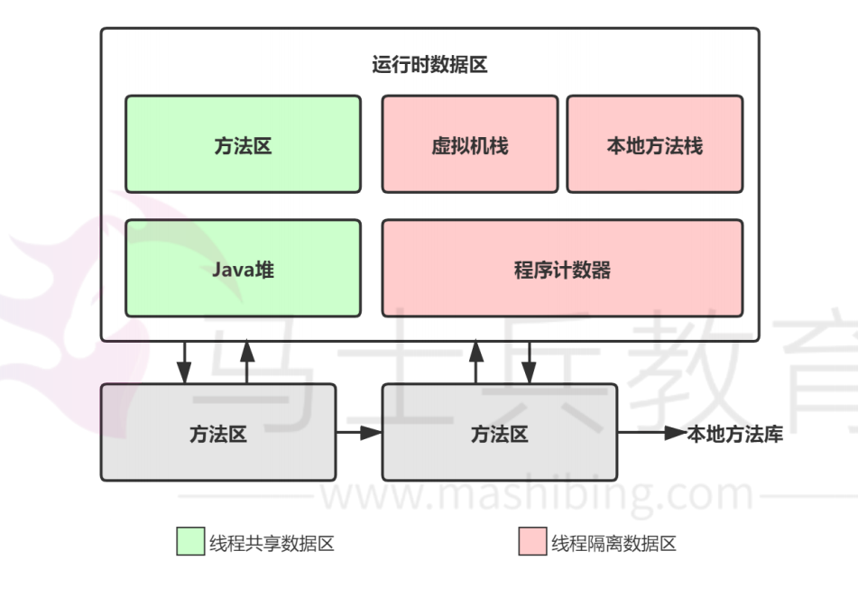

[toc]

# Java面试题总结-JVM

## JVM 的主要组成部分及其作用

JVM包含两个子系统和两个组件：
* 两个子系统为Class loader(类装载子系统)、 Execution engine(执行引擎)；
* 两个组件为Runtime data area(运行时数据区)、Native Interface(本地接口)。

各个组成部分：
* Class loader(类装载)：根据完整类名(如:java.lang.Object)来装载class文件到运行时数据区中的方法区（method area）。
* Execution engine（执行引擎）：执行classes中的指令。
* Native Interface(本地库接口)：与 本地方法库（native libraries）交互，是其它编程语 言交互的接口。
* Runtime data area(运行时数据区域)：这就是常说的JVM的内存。

Java程序运行步骤：
1. 首先利用IDE集成开发工具编写Java源代码，源文件的后缀为.java；
2. 再利用编译器(javac命令)将源代码编译成字节码文件，字节码文件的后缀名为.class；
3. 然后JVM中的类装载器开始读取字节码文件。由于字节码文件中包含数据和指令。
4. 类加载器将字节码文件中的数据加载到运行时数据区。把字节码文件中的指令加载到执行引擎中。
5. 执行引擎将字节码文件中的指令翻译为底层系统指令。再交由 CPU 去执行，而这个过程中需要调用其他语言的本地库接口（Native Interface）来实现整个程序的功能。

## JVM中的运行时数据区

Java 虚拟机在执行Java程序的过程中会把它所管理的内存区域划分为若干个不同的数据区域。这些区域都有各自的用途，以及创建和销毁的时间，有些区域 随着虚拟机进程的启动而存在，有些区域则是依赖线程的启动和结束而建立和销毁。

* 程序计数器（Program Counter Register）：当前线程所执行的字节码的行号 指示器，字节码解析器的工作是通过改变这个计数器的值，来选取下一条需要执行的 字节码指令，分支、循环、跳转、异常处理、线程恢复等基础功能，都需要依赖这个 计数器来完成；
* 虚拟机栈（Java Virtual Machine Stacks）：用于存储局部变量表、操作 数栈、动态链接、方法出口等信息；
* 本地方法栈（Native Method Stack）：与虚拟机栈的作用是一样的，只不过虚 拟机栈是服务 Java方法的，而本地方法栈是为虚拟机调用 Native 方法服务的；
* Java 堆（Java Heap）：Java 虚拟机中内存大的一块，是被所有线程共享 的，几乎所有的对象实例都在这里分配内存；
* 方法区（Methed Area）：用于存储已被虚拟机加载的类信息、常量、静态变 量、即时编译后的代码等数据。

## 堆和栈的区别?

存放内容：
* 堆存放的是对象的实例和数组。
* 栈存放的是对象的引用,局部变量，操作数栈，返回结果。

程序可见性上：
* 堆对于整个应用程序都是共享、可见的。
* 栈只对于线程是可见的。所以是线程私有。

PS:
1. 静态变量放在方法区
2. 静态的对象还是放在堆。

## 如何为对象分配堆内存

类加载完成后，接着会在Java堆中划分一块内存分配给对象。内存分配根据Java堆是否规整，有两种方式：
* 指针碰撞：如果Java堆的内存是规整，即所有用过的内存放在一边，而空闲的的 放在另一边。分配内存时将位于中间的指针指示器向空闲的内存移动一段与对象大小 相等的距离，这样便完成分配内
存工作。
* 空闲列表：如果Java堆的内存不是规整的，则需要由虚拟机维护一个列表来记录 那些内存是可用的，这样在分配的时候可以从列表中查询到足够大的内存分配给对象，并在分配后更新列表记录。

