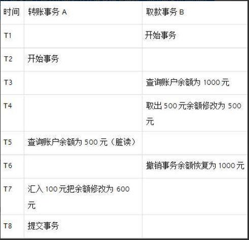
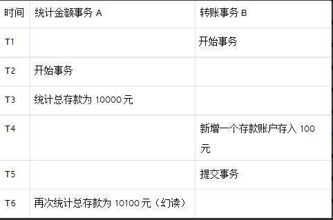

[toc]

# Java面试题总结-事务与反射


## 事务的 ACID 是指什么，事务的四个特性是什么？

* （1）原子性(Atomic)：事务中各项操作，要么全做要么全不做，任何一项操作的失败都会导致整个事务的失败；
* （2）一致性(Consistent)：事务结束后系统状态是一致的；
* （3）隔离性(Isolated)：并发执行的事务彼此无法看到对方的中间状态；
* （4）持久性(Durable)：事务完成后所做的改动都会被持久化，即使发生灾难性的失败。通过日志和同步备份可以在故障发生后重建数据。

**只有存在并发数据访问时才需要事务。当多个事务访问同一数据时，可能会存在 5 类问题，包括 3 类数据读取问题（脏读、不可重复读和幻读）和 2 类数据更新问题（第 1 类丢失更新和第 2 类丢失更新）。**

## 事务导致的脏读、不可重复读和幻读是什么？第 1 类丢失更新和第 2 类丢失更新分别是什么？

脏读：A 事务读取 B 事务尚未提交的数据并在此基础上操作，而 B事务执行回滚，那么 A 读取到的数据就是脏数据。


不可重复读：事务 A 重新读取前面读取过的数据，发现该数据已经被另一个已提交的事务 B 修改过了。


幻读：事务 A 重新执行一个查询，返回一系列符合查询条件的行，发现其中插入了被事务 B 提交的行。


第 1 类丢失更新：事务 A 撤销时，把已经提交的事务 B 的更新数据覆盖了。


第 2 类丢失更新：事务 A 覆盖事务 B 已经提交的数据，造成事务 B 所做的操作丢失。


## 反射在spring中的应用

Spring的IOC的实现原理利用的就是Java的反射机制。Spring的工厂类利用反射机制将对象实例化并且把对象注入到spring容器中。

过程：1.通过解析xml文件，获取到id属性和class属性里面的内容。2.利用反射原理获取到配置里面类的实例对象，存入到Spring的bean容器中。 

<font color="red">只要在代码或配置文件中看到类的完整路径（包.类），其底层原理基本上使用的就是Java的反射机制。</font>


## 反射获得一个类的类对象有哪些方式？

* （1）方法 1：类型.class，例如：String.class
* （2）方法 2：对象.getClass()，例如：”hello”.getClass()
* （3）方法 3：Class.forName()，例如：Class.forName(“java.lang.String”)

## 如何通过反射创建对象？通过反射调用对象方法？
方法 1：通过类对象调用 newInstance()方法，例如：String.class.newInstance()

方法 2：通过类对象的 getConstructor()或 getDeclaredConstructor()方法获得构造器（Constructor）对象并调用其 newInstance()方法创建对象。

例如：
```java
String.class.getConstructor(String.class).newInstance(“Hello”);
```

反射调用对象方法：
```java
String str = "hello";
Method m = str.getClass().getMethod("toUpperCase");
System.out.println(m.invoke(str));
// HELLO
```