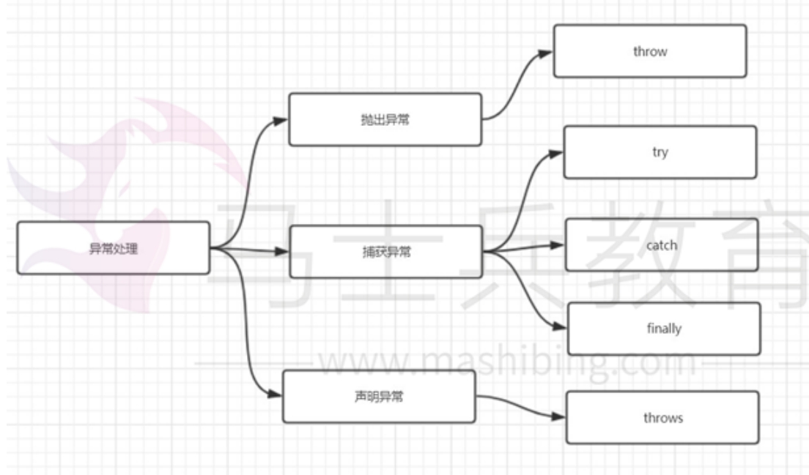
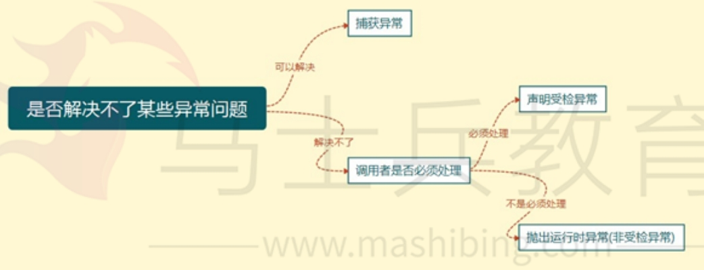

[toc]

# Java面试题总结-基础1

## 面向对象编程三大特性: 封装 继承 多态

> 封装

封装把类的属性私有化，同时提供一些可以被外界访问的属性的方法，如果某个属性不想被外界访问，可以不提供方法给外界访问。

封装主要通过4个访问修饰符来控制。 

private default protected public

> 继承

继承是使用已存在的类的定义作为新类的基础。新类可以增加新的数据或新的功能，也可以直接用父类的功能。通过使用继承我们能够非常方便地复用以前的代码。

继承的注意事项：
1. 子类拥有父类非 private 的属性和方法。
2. 子类不能继承父类的构造函数。
3. 子类可以拥有自己属性和方法，即子类可以对父类进行扩展。
4. 子类可以对父类的方法进行重写。

> 多态

多态是指程序中定义的引用变量所指向的具体类型和通过该引用变量发出的方法调用在编程时并不确定，而是在程序运行期间才确定，即一个引用变量倒底会指向哪个类的实例对象，该引用变量发出的方法调用到底是哪个类中实现的方法，必须在由程序运行期间才能决定。

在 Java 中有两种形式可以实现多态。
- 继承（多个子类对同一方法的重写）
- 接口（实现接口并覆盖接口中同一方法）。

## 基础语法

### 介绍一些java的8种基本数据类型？

java定义了以下8种数据类型


### 介绍一下java的访问修饰符？

<font color="red">在 Java 语言中，访问控制修饰符有 4 种。分别是 public、 private、protected 和 default，其中 default (即缺省，不使用任何关键字) 是一种没有定义专门的访问控制符的情况。</font>

按隐藏程度：private > default > protected > public


访问权限级别 | 本类 | 同包 | 不同包的子类 | 不同的包的非子类
------------ | ------------- |  ------------- |  ------------- |  ------------- 
公开 public | √ | √ | √ | √ 
保护 protected | √ | √ | √ | × | ×
默认 default | √ | √ | × | ×
私有 private | √ | × | × |× 

√ 可访问
x 不可访问，意思是无法看到，无法调用。

### == 和 equals 的区别是什么

- 对于基本数据类型的变量， == 比较的是实际值。
- 对于引用类型的变量，==比较的是引用的地址。


<font color="red">一般情况下，equal都是比较地址。若类中重写了equal()的。equal()比较的是内容实际值。string类就是重写了equal()方法，所以比较的是具体值。</font>

### hashCode()与equals()

- hashCode()是Object类的方法，因此任何java类都包含有hashCode()。hashCode() 的作用是计算出对象的哈希码。	
- equals() : 它的作用也是判断两个对象是否相等。但它一般有两种使用情况： 
  - 情况1：类没有覆盖equals() 方法。等价于通过“==”比较这两个对象。
  - 情况2：类覆盖了 equals() 方法。则根据重写的equals()方法来具体判断。

> hashCode()与equals()的相关规定

若两个对象相等，则hashcode一定也是相同的。若两个对象有相同的hashcode值，它们也不一定是相等的。

### 值传递和引用传递的区别

- 值传递：在方法调用时，会将实参拷贝一份，然后赋值给形参。即实参和形参只是存储相同数据的两个参数，实参与形参是没有关联的。 

- 引用传递：在方法调用时，形参接收的是实参的引用地址。也就是形参和实参是指向同一个地址的。即操控形参相当于操控实参。

### 为什么Java只有值传递?

Java总是采用按值传递。因此java中方法形参就是方法实参的拷贝。

例如：在方法调用时，方法形参的值就是实参的引用地址的拷贝。

在方法内，形参中的属性数值改变了，会影响到实参。但是形参引用地址的改变是不会影响到实参的。因为方法结束后，形参就生命就结束了。

### +=有隐含的强制类型转换

short s1 = 1; s1 = s1 + 1; 会报错
* 由于 1 是 int 类型，因此 s1+1 运算结果也是 int型，需要强制转换类型才能赋值给short 型。

short s1 = 1; s1 += 1; 不会报错
* short s1 = 1; s1 += 1;可以正确编译，因为 s1+= 1;相当于 s1 = (short)(s1 + 1);其中有隐含的强制类型转换

### 构造函数能不能被重写？

构造函数不能被继承，因此不能被重写，但可以被重载

### Overload 和 Override 的区别？

- 重写 Override: 在子类中定义某方法与其父类有相同的名称和参数，我们说该方法被子类重写了。重写是父类与子类之间多态性的一种表现。
- 重载 Overload： 是一个类中多态性的一种表现。如果在一个类中定义了多个同名的方法，它们或有不同的参数个数或有不同的参数类型，则称为方法的重载。

## 关键字

### final finally finalize区别

final可以修饰类、变量、方法。
* final 类：表示该类不能被继承。
* final 方法：表示该方法不能被重写。
* final 变量：表示该变量是一个常量。若是基本类型变量，则无法被再次赋值。若是引用变量，则引用地址不可变，但值可变。

finally一般作用在try-catch代码块中，在处理异常的时候，通常我们将一定要执行的代码方法写到finally代码块中，表示不管是否出现异常，该代码块都会执行。

finalize是属于Object类的一个方法，该方法一般由垃圾回收器来调用。当垃圾回收器来调用finalize()方法的时候，用于判断对象是否可回收。

### this和super的区别

- this代表对象本身。可以理解为指向对象本身的一个指针。
- super代表父类对象，可以理解为指向自己父类对象的一个指针。

### 介绍一下static

static可以修饰
- 修饰成员变量: 静态变量
- 修饰成员方法：静态方法
- 修改代码块：静态代码块
- 修饰类（只能修饰内部类也就是静态内部类）

> static变量和static方法的作用

被static修饰的变量或者方法是独立于该类的任何对象。即静态变量和静态方法不属于任何一个实例对象，而是被类的实例对象所共享。

> static代码块的作用

静态代码块主要作用是优化类的性能。因为类初次加载的时候，会按照static块的顺序来执行每个static块，并且只会执行一次。

我们可以将一些只需要进行一次的初始化操作，都放在类的static代码块中进行。这样可以提高类的性能。

> static注意事项

- 静态只能访问静态。 
- 非静态既可以访问非静态的，也可以访问静态的。


## 异常

### Java 中的异常层次结构

在Java中，所有的异常都有一个共同的父类，即 Throwable类。Throwable类有两个重要的子类：Exception（异常） 和 Error（错误）。

- Error（错误）:是程序无法处理的错误。例如JVM的问题。
- Exception（异常）:是程序本身可以处理的异常。


Exception 又有两个分支，一个是运行时异常 RuntimeException, 一个是检查时异常ChekedException。

- 运行时异常 RuntimeException 通过是程序员代码导致的异常。如NullPointerException 、 ClassCastException等。
- 检查时异常ChekedException 一般是外部错误，这种异常都发生在编译阶段，Java 会强制程序去捕获此类异常，即对可能出现异常的程序进行 try catch。

### 异常关键字

- try 块：用于监听代码是否发生异常。其后可接 catch 块。
- catch 块：用来捕获try语句块中发生的异常。
- finally 块：无论是否捕获到异常，finally 块里的语句都会被执行。
- throw – 用于抛出具体的异常对象。
- throws – 用在方法签名中，用于声明该方法可能抛出的异常。


### 异常处理的机制

在Java中，异常的处理机制分为声明异常，抛出异常和捕获异常。




> 声明异常

在方法签名处使用 throws 关键字声明可能会抛出的异常。

> 抛出异常 

如果你觉得在这个方法内处理异常不合适或者异常解决不了，那么你可以在方法内将异常抛出到方法外，让方法的调用者去处理。

throw关键字作用是在方法内部抛出一个Throwable类型的异常。任何Java代码都可以通过throw语句抛出异常。

> 捕获异常

如果你想处理某个异常，可以通过try…catch…finally 进行异常捕获,之后根据不同的异常情况来进行相应的处理。

### throw 和 throws 的区别

- throws用在方法上，用来声明该方法可能会出现什么异常。如果一个方法用 throws 标识了可能抛出的异常，调用该方法的方法中必须包含可处理异常的代码，否则也要在方法签名中用 throws 关键字声明相应的异常。
- throw用在方法内，后面跟上异常对象。表明用来抛出一个具体的异常对象。

### 常见的 RuntimeException 有哪些？

- ClassCastException(类转换异常)
- IndexOutOfBoundsException(索引越界异常)
- NullPointerException(空指针异常)

## 字符串

### 介绍一下String?

1）String 类是 final 型，固 String 类不能被继承，它的成员方法也都默认为 final 方法。String对象一旦创建就固定不变了，对 String 对象的任何改变都不影响到原对象，相关的任何改变操作都会生成新的 String 对象。

2）String 类是通过 char 数组来保存字符串的，String 对 equals 方法进行了重定，比较的是值相等。

```java
String a = "test"; String b = "test"; String c = new String("test");
```

a、b 和字面上的 test 都是指向 JVM 字符串常量池中的"test"对象，他们指向同一个对象。而new 关键字一定会产生一个对象 test，该对象存储在堆中。所以 new String("test")产生了两个对象，保存在栈中的 c 和保存在堆中的 test。而在 java 中根本就不存在两个完全一模一样的字符串对象，故在堆中的 test 应该是引用字符串常量池中的 test。

```java
String str1 = "abc"; //栈中开辟一块空间存放引用 str1，str1 指向池中 String 常量"abc" 

String str2 = "def"; //栈中开辟一块空间存放引用 str2，str2 指向池中 String 常量"def" 

String str3 = str1 + str2;//栈中开辟一块空间存放引用 str3
//str1+str2 通过 StringBuilder 的最后一步 toString()方法返回一个新的 String 对象"abcdef"
//会在堆中开辟一块空间存放此对象，引用str3指向堆中的(str1+str2)所返回的新String对象。

System.out.println(str3 == "abcdef");//返回 false 因为 str3 指向堆中的"abcdef"对象，而"abcdef"是字符池中的对象，所以结果为 false。JVM 对 String str="abc"对象放在常量池是在编译时做的，而 String str3=str1+str2 是在运行时才知道的，new 对象也是在运行时才做的。

```

### String的特性

- 不变性：String 是只读字符串。对它进行任何操作，其实都是创建一个新的对象，再把引用指向该对象。不变性的主要作用在于当一个对象需要被多线程共享并频繁访问时，可以保证数据的一致性。
- 常量池优化：String 对象创建之后，会在字符串常量池中进行缓存，如果下次创建同样的对象时，会直接返回缓存的引用。
- final：使用 final 来定义 String 类，表示 String 类不能被继承，提高了系统的安全性。

### String 为什么要设计成不可变的？

1）字符串常量池需要 String 不可变。因为 String 设计成不可变，当创建一个 String 对象时，若此字符串值已经存在于常量池中，则不会创建一个新的对象，而是引用已经存在的对象。如果字符串变量允许必变，会导致各种逻辑错误，如改变一个对象会影响到另一个独立对象。

2）String 对象可以缓存 hashCode。字符串的不可变性保证了 hash 码的唯一性，因此可以缓存 String 的 hashCode，这样不用每次去重新计算哈希码。在进行字符串比较时，可以直接比较 hashCode，提高了比较性能；

3）安全性。String 被许多 java 类用来当作参数，如 url 地址，文件 path 路径，反射机制所需的 Strign 参数等，若 String 可变，将会引起各种安全隐患。

### String、StringBuffer、StringBuilder 有什么区别？

String
- 底层使用的是 private final char[] 常量字符数组保存字符串。因此String对象是不可变的。
- 因为对象不可变可以保证线程安全

StringBuffer
- 底层用char[] 字符数组保存字符串。因此StringBuffer对象是可变的。
- 内部方法都通过synchronized关键字修饰。线程安全

StringBuilder
- 底层用char[] 字符数组保存字符串。因此StringBuilder对象是可变的。
- 非线程安全。

速度比较： StirngBuilder > StringBuffer > String

## IO流

### Java 中的IO流分为几种类型？

- 按照流的流向分，可以分为输入流和输出流；
- 按照操作单元划分，可以划分为字节流和字符流；
- 按照流的角色划分为节点流和处理流。

1. InputStream/Reader: 所有的输入流的基类，前者是字节输入流，后者是字符输入流。
2. OutputStream/Writer: 所有输出流的基类，前者是字节输出流，后者是字符输出流。

### Files的常用方法都有哪些？

- Files. exists()：检测文件路径是否存在。
- Files. createFile()：创建文件。
- Files. createDirectory()：创建文件夹。
- Files. delete()：删除一个文件或目录。
- Files. copy()：复制文件。
- Files. move()：移动文件。
- Files. size()：查看文件个数。
- Files. read()：读取文件。
- Files. write()：写入文件。


## 反射

### 说说你对 Java 反射的理解

在程序运行过程中，对于任意一个类，只要直到该类的完整类名称。那么便可以通过反射机制，获取该类的实例化对象。从而调用该类的任意一个方法和变量。

这种能动态获取信息及动态调用对象方法的功能称为 java 语言的反射机制。

反射的例子如下
```
1) 获取类的 Class 对象实例 Class clz = Class.forName("com.zhenai.api.Apple");
2) 根 据 Class 对 象 实 例 获 取 Constructor 对 象 Constructor appConstructor = clz.getConstructor();
3) 使 用 Constructor 对 象 的 newInstance 方 法 获 取 反 射 类 对 象 Object appleObj = appConstructor.newInstance();
4) 获取方法的 Method 对象 Method setPriceMethod = clz.getMethod("setPrice", int.class);
5) 利用 invoke 方法调用方法 setPriceMethod.invoke(appleObj, 14);
```

> 反射的优缺点

- 优点：通过反射可以灵活的对某个类进行实例化对象，提高代码灵活度。
- 缺点：反射要比new多一系列解释操作，性能比new要慢。

### 反射的应用场景有哪些？

反射是框架设计的灵魂。有很多设计、开发都与反射机制有关。

例如spring框架中的配置文件,在spring框架启动后，spring框架先读取配置文件的信息后，根据配置文件上的配置名称。来获取类的完整路径，然后通过反射机制来创建相关配置类。

应用场景如下：
1. JDBC连接数据库时使用Class.forName()通过反射加载数据库的驱动程序；
2. Spring 通过XML配置将Bean对象装载到IOC容器的过程
   1. spring读取xml配置文件。
   2. 解析xml配置文件，得到bean对象的类名称信息。
   3. 通过反射机制，创建bean的实例化对象。

<font color="red">只要在代码或配置文件中看到类的完整路径，其底层原理基本上使用Java的反射机制来创建对于的实例化对象。</font>

## 序列化

### java序列化是什么？

通常情况下，java对象存在JVM中。这些java对象的生命周期不会比JVM的生命周期更长。但在应用中，就可能要求在JVM停止运行之后能够持久化指定的java对象，并在将来重新读取被持久化的java对象。

Java 对象序列化可以让java对象持久化到内存和硬盘上。

使用 Java 对象序列化，在持久化java对象时，会把其状态保存为一个字节数组，在未来，再将这些字节数组转换成java对象。

注意地是，Java 对象序列化保存的是Java对象的”状态”，即它的成员变量。不会保存静态变量。

> 如果让java类进行序列化

在 Java 中，只要一个类实现了 java.io.Serializable 接口，那么这个类就可以被序列化。

通过 ObjectOutputStream 和 ObjectInputStream 对java对象进行序列化及反序列化。

