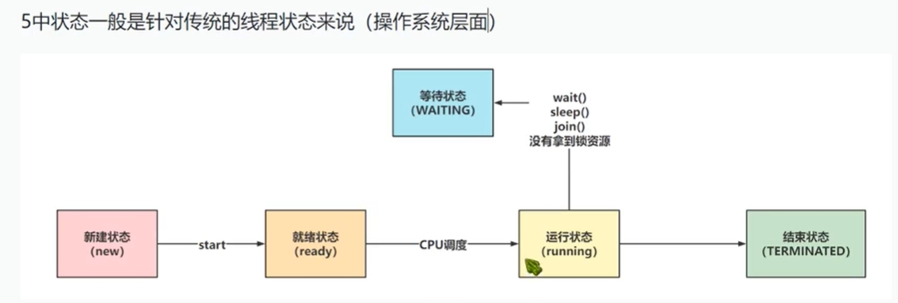
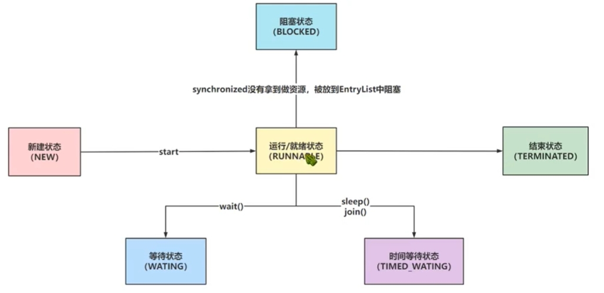

[toc]

# Java面试题总结-线程1

## 基础

### 简述线程，程序、进程的基本概念

> 什么是程序？

程序是含有指令和数据的文件，存储在磁盘或其他存储设备中，也就是说程序是静态的代码。

> 什么是进程？

进程是程序的一次执行过程。系统运行一个程序即是一个进程从创建，运行到消亡的过程。

简单来说，一个进程就是一个执行中的程序，它在操作系统中一个指令一个指令地执行着。

> 什么是线程？

线程也被称为轻量级进程。线程是一个比进程更小的执行单位。一个进程在其执行的过程中可以产生多个线程。

假如一个进程就是一个运行中的音乐播放程序。那么线程就是这个程序中的各个正在运行的功能。例如显示歌词，播放音乐，进度条控制等

### java中线程的实现方式

通常情况下为4种方式。
* 继承Thread类，重写run方法
* 实现Runnable接口，重写run方法
* 实现Callable接口，重写call方法，并搭配FutureTask类。
* 基于线程池来构建一个新线程。

底层源码上，实际是一种方式，上面4种方式都是直接或间接实现Runnable接口，重写run方法的方式。


### java中线程有哪些状态？

线程的状态主要分两种情况。分别是操作系统层面中的线程（即传统意义上的线程），和java中的线程。

> 操作系统中的线程（即传统意义上的线程）

传统意义上的线程有5种状态。



但是java代码中给线程划分了6个状态。


### 线程的状态与方法


> 线程状态如下：

1. 新建状态（New）：新创建了一个线程对象。
2. 就绪状态（Runnable）：线程对象创建后，当其他线程调用了对象的start()方法后。该线程就会进入到可运行线程池中，等待获取CPU的使用权。
3. 运行状态（Running）：就绪状态的线程获取了CPU使用权后，开始执行程序代码。
4. 阻塞状态（Blocked）：阻塞状态是线程由于某种原因放弃CPU使用权，暂时停止运行。
阻塞的情况分三种：
   - 等待阻塞：运行的线程执行wait()方法，该线程会释放锁，即释放占用的资源，JVM会把该线程放入“等待池”中。进入这个状态后，是不能自动唤醒的，必须依靠其他线程调用notify()或notifyAll()方法才能被唤醒。(wait会释放持有的锁)
   - 同步阻塞：运行的线程在获取对象的同步锁时，若该同步锁被别的线程占用，则JVM会把该线程放入锁池中。
   - 其他阻塞：运行的线程执行sleep()或join()方法后，JVM会把该线程置为阻塞状态。当sleep()状态超时、join()等待线程终止时，线程重新转入就绪状态。（注意 sleep是不会释放持有的锁，即不会释放占用的资源。）
5. 死亡状态（Dead）：线程执行完了或者因异常退出了run()方法，该线程结束生命周期。

> 有关线程的方法如下

```
sleep() wait() yield() notify() notifyAll() join()

sleep()方法：sleep是Thread类的方法。当线程主动调用sleep方法后，线程会进入到阻塞状态，但是线程不会释放锁，即不会释放线程占用的资源。当线程阻塞时间结束后，线程便重新开始访问资源。

wait()方法：wait是Object类的方法，当被访问的资源调用wait方法后，会导致拥有该资源的锁的线程会放弃锁，从而让线程进入到等待状态。只有其他线程调用notify方法（或notifyAll方法）后，哪些等待状态的线程才能进入到就绪状态。

notify()方法：object类的方法。会唤醒一个等待状态的线程并使该线程开始执行。所以如果有多个线程等待一个对象，这个方法只会唤醒其中一个线程。这个线程是指由于没有拿到锁，从而进入等待状态的线程。

notifyAll()方法：object类的方法。会唤醒所有等待状态的线程。这个线程是指由于没有拿到锁，从而进入等待状态的线程。

//--------------------------

yield()方法：线程调用yield()方法后，当前线程停止运行，进入到就绪状态。让其他线程有执行的机会。如果没有其他线程的话，那么yield()方法将不会起作用，并且线程会由可执行状态后马上又被执行。

join()方法：在线程A中调用子线程B的 join() 方法，则线程A转为阻塞状态，直到子线程B结束，当前线程A再由阻塞状态变为就绪状态，重新等待执行。

例如：t.join();//这里main方法的线程必须要等待子线程t运行结束，若无此句，main线程则会执行完毕，导致结果不可预测。

```

### java中如何停止线程

主要有3中方式。
* 调用Thread类的stop方法，让线程停止。（不推荐）
* 修改Thread类的interrupt方法，将Thread类中的interrupt由false改为true。从而让线程停止（推荐）

### notify()和notifyAll()有什么区别？

notify()和notifyAll()都是object类的方法。
- notify可以唤醒一个处于wait状态的线程,使其重新争夺对象锁。
- notifyall,可以唤醒所有处于wait状态的线程，使其重新争夺对象锁。

### sleep()和wait()有什么区别？

sleep是Thread类中的静态方法。

当前线程执行sleep()方法后，会让线程在指定时间暂停执行（休息）。该线程会让出CPU时间片，从而让其他线程争取CPU时间片。当指定的时间到了线程会进入到就绪状态，开始重新争夺CPU时间片。

另外，在调用sleep()方法的过程中，线程不会释放锁。因此sleep()方法让线程暂停执行，但是其他线程还是无法执行该线程占用的方法。

打个比方，一个人在工厂工作，他感觉已经有些累了。那么他就会跟操作系统说：在未来的半个小时之内我暂时不工作了。这样，操作系统在随后的半个小时里面不会让他工作。这个人虽然不工作了，但是他还是坐在工位上，其他空闲的人，无法干他的工作。当他休息好后，就可以接着继续做未完成的工作。

wait是Object类中的静态方法。

调用对象的wait()方法后，访问该对象的当前线程会主动放弃CPU时间片，进入等待状态，并释放掉锁。当前线程进入等待状态后，只有其他线程调用同一对象的notify()方法或notifyAll()方法时才能唤醒等待池中的该线程进入等锁池，如果线程重新获得锁，该线程就可以进入就绪状态，等待获取CPU时间片，从而重新执行。

> sleep()方法和 wait()方法的区别?

- sleep()方法，线程不会放弃对象锁。
- wait()方法，线程会放弃对象锁。

### 为什么wait和notify方法要在同步块中调用？

wait()方法强制当前线程释放锁。这意味着线程在调用某对象的wait()方法之前，当前线程必须已经获得该对象的锁。而如果线程要获取对象的锁，则表示该线程正在执行对象中的同步方法或同步代码块。

所以，线程必须在某个对象的同步方法或同步代码块中才能调用该对象的wait()方法。

在调用对象的notify()和notifyAll()方法之前，调用线程必须已经得到该对象的锁。因此，必须在某个对象的同步方法或同步代码块中才能调用该对象的notify()或notifyAll()方法。

### yield()方法有什么作用？

yield()方法是Thread类的静态方法。

yield()方法是停止当前线程（即当前线程让出CPU时间片）。让同等优先权的线程或更高优先级的线程有执行的机会。

如果没有同级或更高级的线程，那么执行yield()方法的线程有可能在进入到暂停状态后马上又被执行

### 线程的 sleep()方法和 yield()方法有什么区别？

1. sleep()方法给其他线程运行机会时不考虑线程的优先级，因此会给低优先级的线程以运行的机会；yield()方法只会给相同优先级或更高优先级的线程以运行的机会；
2. 线程执行 sleep()方法后转入阻塞状态，而执行 yield()方法后转入就绪状态；

### 请说出你所知道的线程同步的方法？

- wait():使一个线程处于等待状态，并且释放所持有的对象的lock。
- sleep():使一个正在运行的线程处于睡眠状态，是一个静态方法。
- notify():唤醒一个处于等待状态的线程，注意的是在调用此方法的时候，并不能确切的唤醒某一个等待状态的线程，而是由JVM确定唤醒哪个线程，而且不是按优先级。

### 使用多线程的好处？使用多线程需要注意的地方？

好处：将一个大任务拆分为几个小任务。然后让多线程分别运行这几个小任务，会比一个单线程运行一个大任务，要快的多。

注意的地方：若多个线程同时对一个全局变量进行访问。这会造成该全局变量的值被同时修改，容易造成错误。

### 为什么要用线程池？

1. 在实际使用中，服务器在创建和销毁线程上花费的时间和资源，可能比服务器使用线程去处理请求上花费的时间和资源要多得多。
2. 如果在系统里创建太多的线程，可能会导致系统由于过度消耗内存从而导致系统资源不足。

因此为了减少创建和销毁线程的次数，控制线程的数量，并利用已有线程来进行服务处理，线程池技术诞生了。

### 线程池的作用?

线程池就是事先创建若干个可执行的线程放入一个池（容器）中，需要的时候从池中获取线程，从而不用自行创建线程，使用完毕不需要销毁线程而是放回池中，从而减少创建和销毁线程对象的开销。

> 线程池的好处

1. 第一：降低资源消耗。通过重复利用已创建的线程降低线程创建和销毁造成的消耗。
2. 第二：提高响应速度。任务可以不需要等到线程创建就能立即执行。
3. 第三：提高线程的可管理性。线程是稀缺资源，如果无限制的创建，会消耗系统资源，使用线程池可以对线程进行统一的分配。

### Collections.synchronizedXXX() 和 ConcurrentHashXXX类 有什么区别？

Collections.synchronizedXXX() 方法用于将非线程安全的集合类转换为线程安全的集合类，原理是给集合类中的方法都添加上synchronized修饰符。

ConcurrentHashXXX类是java提供的原生的线程安全集合类。

在性能方面，ConcurrentHashXXX类 优于 Collections.synchronizedXXX()方法转换之后的线程安全的集合类。

### synchronized 关键字的作用

synchronized 修饰符可以修饰方法，代码块。
- 修饰普通方法：线程访问方法前要获得当前实例对象的锁。相当于给实例对象加锁。
- 修饰静态方法：因为静态成员不属于任何一个实例对象，是属于类的。相当于是给当前类加锁，会作用于类的所有对象实例。

例如一个线程A调用一个实例对象的非静态 synchronized 方法，而线程B需要调用这个实例对象所属类的静态 synchronized 方法，是允许的，不会发生互斥现象，因为访问静态 synchronized 方法占用的锁是当前类的锁，而访问非静态 synchronized 方法占用的锁是当前实例对象锁。

- 修饰代码块：线程执行代码块前要先获得对象锁。相当于给实例对象加锁。

总结： synchronized 关键字加到 静态方法 和 代码块上是给类上锁。synchronized 关键字加到普通方法上是给类的某个实例化对象上锁。

### 简述 synchronized 和 java.util.concurrent.locks.Lock的异同？

Lock是java提供的锁类。通过Lock类可以对方法，类，代码块进行手动上锁。

而synchronized修饰符是jvm提供的，当synchronized修饰符修饰方法，类，代码块的时候。当程序在jvm中执行的时候，jvm会识别出这些被synchronized修饰的目标，从而给目标加锁。

- Lock 能完成 synchronized 所实现的所有功能；
- Lock 有比synchronized 更精确的线程语义和更好的性能，而且不强制性的要求一定要获得锁。
- synchronized 会自动释放锁，而 Lock 一定要求程序员手工释放，并且最好在 finally 块中释放（这是释放外部资源的最好的地方）。

### 什么是线程局部变量？

线程局部变量是局限于线程内部的变量，属于线程自身所有，不在多个线程间共享。Java 提供 ThreadLocal 类来支持线程局部变量，是一种实现线程安全的方式。

### 当一个线程进入某个对象的一个 synchronized 的实例方法后，其它线程是否可进入此对象的其它方法？

如果其他方法没有 synchronized 的话，其他线程是可以进入的。所以要开放一个线程安全的对象时，得保证每个方法都是线程安全的。

### 说说对volatile的理解

volatile是一种修饰符，主要用于修饰类中的成员变量（属性）。

当多个线程并发访问某个类的实例化对象的时候。如果某一个线程修改了对象中volatile修饰的成员变量。那么对于其他线程是可见的。即线程每次获取volatile变量的值都是最新的。

那么volatile是如何做到的呢？

### volatile如何保证内存可见性？

在java虚拟机的内存模型中，有主内存和工作内存的概念。主内存就是各个线程共享的内存。工作内存是属于线程自己的。

在JVM中，主内存是线程共享的包括堆和方法区，工作内存是线程私有的包括虚拟机栈，程序计数器，本地方法栈。

- 线程访问普通变量：读操作会优先读取工作内存的数据，如果工作内存中不存在，则从主内存中拷贝一份数据到工作内存中；写操作只会修改工作内存的副本数据，这种情况下，其它线程就无法读取变量的最新值。

- 线程访问volatile变量：对于volatile变量，读操作时Java虚拟机会把工作内存中对应的值设为无效，要求线程从主内存中读取数据；写操作时Java虚拟机会把工作内存中对应的数据强制刷新到主内存中，这种情况下，其它线程就可以读取变量的最新值。


## 线程安全

### 什么是线程安全？

线程安全的定义就是：如果多个线程并发执行过程中会不会产生资源的冲突。如果不会就是线程安全的，会就是线程不安全的。

### 线程的主内存和工作内存是什么？

在java中，每个线程都有主内存和线程的工作内存之分。主内存上存放的是线程共享的数据，工作内存上存放的是线程私有的数据。

- 当线程读取数据的时候，会先从工作内存中读取数据，如果没有，则到主内存中读取数据，然后把读取的数据写入到工作内存中。
- 如果线程要修改某一条数据的时候，会先读取这条数据，然后把这条数据拷贝到工作内存中之后再进行修改。修改完后，再将这条数据从工作内存写入到主内存中。

线程中主内存和工作内存之间的关系


而在JVM的运行时数据区中，程序计数器，虚拟机栈，本地方法栈是线程私有的。方法区和堆是线程共享的。

因此线程的主内存就对应JVM的方法区和堆，工作内存就对应JVM的程序计数器，虚拟机栈，本地方法栈。

### 如何实现线程安全？

Java里面一般用以下几种机制保证线程安全。
1. 阻塞同步锁（互斥同步锁,悲观锁）
2. 非阻塞同步锁（乐观锁）
3. 无同步方案：ThreadLocal类/Volaitile类型

> 阻塞同步锁（互斥同步锁,悲观锁）

阻塞同步锁也叫做互斥同步锁,悲观锁。特征是会对没有获取锁的线程进行阻塞。

Java里面的互斥同步锁就是Synchorized和ReentrantLock，前者是由语言级别实现的互斥同步锁，理解和写法简单但是机制笨拙，

ReentrantLock是API层面的互斥同步锁，需要程序自己打开并在finally中关闭锁，和synchorized相比更加的灵活.

互斥同步锁都是可重入锁，好处是可以保证不会死锁。

> 非阻塞同步锁（乐观锁）

非阻塞同步锁也叫乐观锁，相比悲观锁来说，它会先进行资源在工作内存中的更新，然后根据与主内存中旧值的对比来确定在此期间是否有其他线程对共享资源进行了更新，如果旧值与期望值相同，就认为没有更新，可以把新值写回内存，否则就一直重试直到成功。

乐观锁的实现方式就是 CAS（Compare And Swap）算法。

非阻塞同步锁是不可重入的，可能会造成死锁。

> 无同步方案：ThreadLocal类/Volaitile类型

线程本地的变量，每个线程获取一份共享变量的拷贝，单独进行处理。


