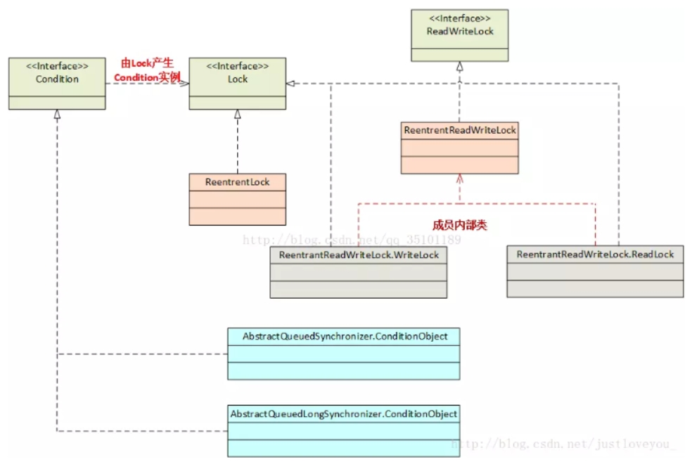

[toc]

# Java面试题总结-锁1

## 锁

### java中锁的分类

> 乐观锁和悲观锁

java中的synchronized是悲观锁。

悲观锁：当线程获取不到锁资源的时候，会将当前线程挂起（即线程会进入到阻塞状态或等待状态）。

乐观锁：当线程获取不到锁资源的时候，会一直尝试获取锁资源。

> 公平锁和非公平锁

java中的synchronized是非公平锁。

公平锁：若线程A拿到了锁资源，线程B和C没有拿到。则线程BC会进行排队。根据排队顺序来获取锁资源。

非公平锁: 若线程A拿到了锁资源，线程B和C没有拿到。则线程BC会进行竞争，谁赢谁就排队排到前面。

> 互斥锁和共享锁(即读锁和写锁)

java中的synchronized是互斥锁。

互斥锁：同一时间，互斥锁只能被一个线程持有。
共享锁：同一时间，共享锁可以被多个线程共同持有。

### java线程阻塞的代价

在java的线程中如果要阻塞或唤醒一个线程就需要操作系统介入，需要线程在用户态与内核态之间切换，这种切换会消耗大量的系统资源。

因为用户态切换至内核态需要传递数据给内核，内核也需要保护好用户态传递的数据等，以便内核态调用结束后切换回用户态继续工作。

因此如果线程状态切换是非常频繁的时候，这将会消耗很多CPU处理时间；

### 乐观锁

乐观锁是一种加锁思想。

乐观锁认为某个线程在访问数据的过程中其它线程不会修改这个数据，因此不加锁访问数据。而当该线程需要修改数据时，才会判断该数据在此期间是否被其它线程修改。
- 如果其它线程确实没有修改，则该线程直接加锁并修改数据；
- 反之如果该数据已经被其它线程修改，则该线程将放弃修改数据。并且重复读-比较-写的操作。

> 如果判断数据是否被更新？

线程在读取数据的时候，会先读出当前数据的版本号。然后修改的时候再读取一遍，比较跟上一次的版本号，如果一样则加锁。

### 什么是 CAS 比较与交换算法？

CAS（Compare And Swap）比较并交换算法是乐观锁的一种实现方式。

CAS 算法的过程是这样：涉及3个操作数：更新值、旧值、新值。
1. 只有当数据的旧值与新值相同时，才会将数据修改为更新值。
2. 如果新值与旧值不同，则说明已经有其他线程对数据做了更新，则当前线程什么都不做。
3. 否则，线程将数据更新为更新值，并返回更新值。

### 悲观锁

悲观锁是一种加锁思想。

悲观锁认为某个线程使用数据的过程中，其它线程也会过来修改这个数据。为了保证数据安全，其采用的是一种先加锁再访问的策略，其它线程要想也访问该数据则被阻塞等待、直到其获取到锁才可以访问。

Java中的synchronized修饰符就是一个典型的悲观锁。

### 自旋锁

自旋锁原理非常简单，如果持有锁的线程能在很短时间内释放锁资源。那么之前没有拿到锁的线程就不需要做内核态和用户态之间的切换，从而进入阻塞挂起状态。

那些没有拿到锁的线程只需要等一等（自旋），等持有锁的线程释放锁后。开始重新去获取锁，这样就避免线程在内核态和用户态之间的切换，导致的消耗了。

> 自旋等待的最大时间

由于线程自旋是需要占用cpu的，相当于自旋线程让cpu在做无用功。因此需要设定一个自旋等待的最大时间。避免线程一直自旋，导致cpu的占用。

如果持有锁的线程执行的时间超过自旋等待的最大时间后，还是没有释放锁。那么其他自旋的线程会停止自旋进入阻塞状态。

> 自旋锁的优缺点

- 优点：自旋锁尽可能的减少线程的阻塞，这对于锁的竞争不激烈，且占用锁时间非常短的代码块来说性能能大幅度的提升，因为自旋的消耗会小于线程阻塞挂起再唤醒的操作的消耗。

- 缺点：对于锁的竞争激烈，或者需要持有锁的线程长时间占用的同步块来说，这时候就不适合使用自旋锁了，因为自旋锁的线程会导致 cpu 做无用功，占着 同时有大量线程在自旋的时候会导致线程自旋的消耗大于线程阻塞挂起操作的消耗，其它需要 cpu 的线程又不能获取到 cpu，造成 cpu 的浪费。

### 公平锁与非公平锁

- 公平锁（Fair）：线程对数据加锁后，其他线程进行排队等待，先来先得
- 非公平锁（Nonfair）：线程对数据加锁后，其他线程不考虑排队等待问题，直接尝试获取锁，获取不到自动到队尾等待。

> 公平锁和非公平锁的区别
1. 非公平锁性能比公平锁高 5~10 倍，因为公平锁需要在多核的情况下维护一个队列
2. Java 中的 synchronized 是非公平锁，ReentrantLock 默认的 lock()方法采用的是非公平锁

### Synchronized

synchronized 它可以把任意一个非 NULL 的对象当作锁。它属于悲观锁，同时属于可重入锁。

Synchronized 作用范围
1. 作用于方法时，锁住的是实例化对象(this)；
2. 当作用于静态方法时，锁住的是类。因此作用于静态方法的时候相当于类的一个全局锁，会锁所有调用该静态方法的线程。

### java 中 Lock接口（锁接口）详解

java.util.concurrent.locks包下有一些关于锁的类与接口。

Lock和ReadWriteLock是关于锁的两大根接口，Lock根接口的主要实现类是ReentrantLock（可重入锁），ReadWriteLock根接口的主要实现类是ReentrantReadWriteLock（读写锁）。

#### Synchronized与Lock根接口的区别？

- synchronized是java中的一个关键字，也就是说是Java语言内置的特性。使用synchronized不需要用户去手动释放锁，当synchronized方法或者synchronized代码块执行完之后，系统会自动让线程释放对锁的占用；
- Lock不是Java语言内置的特性。而是需要程序员去主动使用Lock接口。Lock 提供了比 synchronized 关键字更广泛的锁操作，它能更好的处理线程问题。

### ReentrantLock 可重入锁

ReentantLock 是 Lock接口的主要实现类，它除了能完成 synchronized 所能完成的所有工作外，还提供了诸如可响应中断锁、可轮询锁请求、定时锁等避免多线程死锁的方法。

### ReadWriteLock 读写锁

Java 中的读写锁有一个根接口 java.util.concurrent.locks.ReadWriteLock ， 也有具体的实现类
ReentrantReadWriteLock。

读写锁，在读的地方使用读锁，在写的地方使用写锁，灵活控制，如果没有写锁的情况下，读是无阻塞的,在一定程度上提高了程序的执行效率。

### 死锁与活锁的区别？

死锁：是指两个或两个以上的进程（或线程）在执行过程中，因争夺资源而造成的一种互相等待的现象，若无外力作用，它们都将无法推进下去。

产生死锁的必要条件：1、互斥条件：所谓互斥就是进程在某一时间内独占资源。2、请求与保持条件：一个进程因请求资源而阻塞时，对已获得的资源保持不放。3、不剥夺条件:进程已获得资源，在末使用完之前，不能强行剥夺。4、循环等待条件:若干进程之间形成一种头尾相接的循环等待资源关系。

活锁：任务或者执行者没有被阻塞，由于某些条件没有满足，导致一直重复尝试，失败，尝试，失败。

活锁和死锁的区别在于，处于活锁的实体是在不断的改变状态，所谓的“活”， 而处于死锁的实体表现为等待；活锁有可能自行解开，死锁则不能。

### 线程调度方式

系统有两种线程调度方式：抢占式调度和协同式调度。

> 抢占式调度：

抢占式调度指的是每条线程执行的时间、线程的切换都由系统控制。系统控制指的是在系统某种运行机
制下，可能每条线程都分同样的执行时间片，也可能是某些线程执行的时间片较长，甚至某些线程得不
到执行的时间片。在这种机制下，一个线程的堵塞不会导致整个进程堵塞。

> 协同式调度：

协同式调度指某一线程执行完后主动通知系统,让系统切换到另一线程上执行，这种模式就像接力赛一样。协同式调度的情况下线程的执行时间由线程本身控制，线程切换可以预知，不存在多线程同步问题，但它有一个致命弱点：如果一个线程编写有问题，运行到一半就一直堵塞，那么可能导致整个系统崩溃。

总结：
- 抢占式调度中，系统主动控制各个线程运行。线程是被动的。
- 协同式调度中，各个线程自己控制自己的运行。线程是主动的。

### JVM 的线程调度方式（抢占式调度）

java 使用的线程调度方式是抢占式调度。Java 中线程会按优先级分配 CPU 时间片运行，且优先级越高越优先执行，但优先级高并不代表能独自占用执行时间片，可能是优先级高得到越多的执行时间片，反之，优先级低的分到的执行时间少但不会分配不到执行时间。

