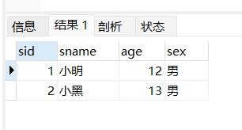
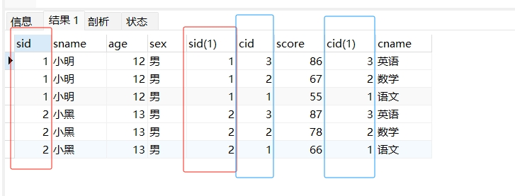
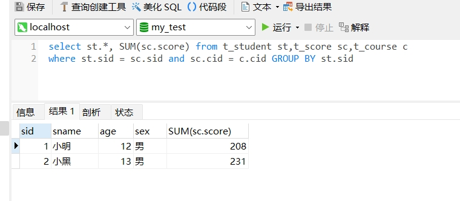

[toc]

# MySql笔试题总结1

有三张表。分别是学生表，课程表，成绩表。

学生表（t_student）

sid | sname | age | sex
------ | ------ | ------ | -------
1 | 小明 | 12 | 男
2 | 小黑 | 13 | 男
3 | 小白 | 11 | 女

课程表（t_course）

cid | cname 
------ | ------ 
1 | 语文
2 | 数学
3 | 英语

成绩表(t_score)，sid为学生编号，cid为课程编号

sid | cid | score 
------ | ------ | ------ 
1 | 1 | 55
1 | 2 | 67
1 | 3 | 86
2 | 1 | 66
2 | 2 | 78
2 | 3 | 87

## 查询成绩表中存在成绩的学生信息

SQL思路：
1. 先通过 GROUP BY，将成绩表根据学生编号进行分组。可以得到有成绩的学生有哪些。
2. 然后通过 in , 在学生表中查询有成绩的学生信息。

```sql
select * from t_student where sid in 
(select sid from t_score GROUP BY sid )
```



## 查询所有学生的所有成绩

SQL思路：
1. 通过sid,cid字段，将三张表关联在一起查询。从而查询出所有学生的所有成绩

```sql
select * from t_student st,t_score sc,t_course c
where st.sid = sc.sid and sc.cid = c.cid
```



## 查询所有学生的总成绩

SQL思路：
1. 通过sid,cid字段，将三张表关联在一起查询。从而查询出所有学生的所有成绩
2. 然后根据学生编号进行分组，并计算出总成绩

```sql
-- 第一步：查询出所有学生的所有成绩
select * from t_student st,t_score sc,t_course c
where st.sid = sc.sid and sc.cid = c.cid

-- 第二步：根据学生编号进行分组，并计算出总成绩
select st.*, SUM(sc.score) from t_student st,t_score sc,t_course c
where st.sid = sc.sid and sc.cid = c.cid GROUP BY st.sid 
```



## 查询平均成绩>60的学生信息

SQL思路：
1. 先关联学生表和成绩表，将所有学生的所有成绩查询出来。
2. 然后对所有学生的所有成绩，根据学生编号分组，并根据所有成绩计算出平均成绩。
3. 最后通过 HAVING 筛选出平均成绩>60的学生信息

```sql
-- 第一步：先查询出所有学生的所有成绩
select * from t_student st,t_score sc
where st.sid = sc.sid 

-- 第二步：对所有学生的所有成绩，根据学生编号进行 GROUP 分组。并计算出平均成绩。单个学生的所有成绩的平均成绩
select st.sid, st.sname, AVG(sc.score) from t_student st,t_score sc
where st.sid = sc.sid GROUP BY st.sid 

-- 第三步：通过 HAVING 筛选出平均成绩>60的学生信息
select st.sid, st.sname, AVG(sc.score) as 平均成绩 from t_student st,t_score sc
where st.sid = sc.sid GROUP BY st.sid HAVING 平均成绩 > 60
```

## 查询语文成绩 > 数学成绩的学生信息

SQL思路：
1. 先查询出所有学生的语文成绩和数学成绩。分别作为临时表1和临时表2
2. 然后将临时表1，临时表12，学生表,三个表进行关联查询。

```sql
select st.* from t_student st, 
(select *from t_score where cid='1') t1,
(select *from t_score where cid='2') t2,
where st.sid=t1.sid and st.sid=t2.sid
and t1.score > t2.score
```

## 查询数学成绩大于60的学生信息，并按语文成绩降序排列

SQL思路：
1. 先查询出数学成绩大于60的所有学生信息
2. 然后按数学成绩进行降序排序

```sql
SELECT * FROM
t_score sc,t_student st
WHERE 
sc.sid=st.sid and sc.score > 60 and sc.cid='2'
ORDER BY sc.score DESC
```


