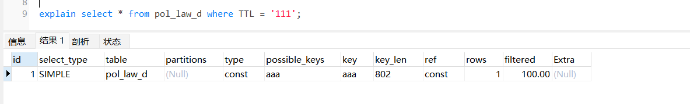

[toc]

# MySql面试-速记版

## 介绍一下索引

索引本质上就是一种将数据库的数据按照排序方式存储的数据结构。

索引的优点：
- 提高数据库查询数据的效率，减低数据库系统的IO成本
- 通过索引对数据库中的数据进行排序，从而降低数据库系统的CPU消耗

索引的缺点
- 创建和维护索引需要耗费数据库系统多余的时间，随着索引的增加而增加。本质上是索引会占用数据库系统的计算量。
- 创建和维护索引需要耗费数据库系统多余的空间，随着索引的增加而增加。

创建索引的原则
- 在经常被当作搜索条件的字段上创建索引，可以加快查询速度。
- 在主键字段上创建索引，可以优化数据库中数据的排序结构.
- 在经常作为外键的字段上创建索引。可以加快外键查询的速度。
- 在经常需要作为排序条件的字段上创建索引，因为索引本质上就是排好序的数据。这样可以加快排序查询时间。

## 索引的类型

根据字段类型：
- 普通索引：基于普通字段创建的索引，没有任何限制。
- 唯一索引: 与普通索引类似，但是唯一索引的字段值必须唯一。
- 主键索引：基于主键字段的索引。
- 全文索引：当数据量大的时候。使用like模糊查询效率很低。因此全文索引主要用于代替like模糊查询。全文索引比like模糊查询快很多倍。

根据字段个数：
- 单列索引：即组成索引的字段通常是一个字段。
- 组合索引：组合索引是相对与单列索引的，组合索引是由多个字段组成的索引。

什么情况下使用组合索引？
- 一般根据查询条件where,当有一些查询条件是经常组合在一起使用的时候，那么这些查询条件对应的字段可以组成一个组合索引。

全文索引的注意事项：
- 全文索引必须在字符串或文本类型的字段上才能建立。


## 介绍一下聚簇索引和非聚簇索引

聚簇索引和非聚簇索引本质上是两种数据存储方式的选择。

聚簇索引和非聚簇索引的区别：在索引数据结构上的叶子节点是否存储一行完整的数据记录。即一个叶子节点就是一行完整的数据。

- 聚簇索引：将数据与索引放在一起存储，索引数据结构上的叶子节点保存了完整数据。
- 非聚簇索引：将数据与索引分开存储，索引数据结构上的叶子节点存储了数据的地址。

mysql的innoDB存储引擎中主键索引使用的是聚簇索引的存储方式。而myisam存储引擎中大部分索引都是用非聚簇索引。


> 聚簇索引

聚簇索引本质上是一种数据存储方式，它根据数据记录的主键来构建B+树。B+树的叶子节点存储的就是一行记录。也就是说整个B+树就是数据表本身。B+树根据数据表的主键存储了数据表的所有数据。

InnoDB存储引擎中表的原则（表中必须存在聚簇索引）：
- 如果表中没有定义主键字段，则表中第一个非空唯一字段就是作为聚簇索引。
- 如果表中有定义主键字段，则主键字段就是主键索引就是聚簇索引。
- 如果都没有，则InnoDB存储引擎会在表中创建一个隐藏row-id字段作为聚簇索引。

聚簇索引的优点
- 聚簇索引比非聚簇索引在查询速度上要快，因为聚簇索引比非聚簇索引要少一次IO查询

聚簇索引的缺点
- 由于聚簇索引是将索引和数据存储在一起，并且是根据数据的主键字段来构建b+树数据结构，因此当插入一行全新数据的时候，如果插入数据的主键字段是最大的，那么插入速度是最快的，如果插入数据的主键字段不是最大的，那么插入速度依赖与插入顺序。因此通常情况下，聚簇索引的主键字段通常是自增的。
- 另外，当更新表中的主键字段的时候，将会导致B+树结构中被影响数据的变动，这样做代价很高，将会影响到b+树的性能。因此主键字段一般定义为不可更新。

> 非聚簇索引

非聚簇索引本质上也是一种数据存储方式。它根据数据记录的主键来构建B+树。B+树的叶子节点存储了数据的地址。而真正的表数据是存储在独立的地方。

## 最左前缀原则是什么？

最佳左前缀法则只适用于组合索引上。

首先组合索引中字段会与where子句中的字段，会根据最左前缀原则来匹配，匹配上的where子句就能使用组合索引，否则无法使用组合索引。

最左前缀原则如下：
* 按从左到右的顺序依次进行匹配。直到遇到范围查询（>,<,between,like）就停止匹配。
* 例如组合索引index_name(a,b,c)，只会匹配where子句中的a、a,b、a,b,c 三种类型的查询。
* <font color="red">注意若where子句中abc三个字段都存在，无论什么顺序。mysql会将where子句优化为a,b,c查询。</font>
* <font color="red">注意如果where子句中的各个字段通过 >,<,between,like 连接。则不会触发组合索引</font>

```
例如：某个组合索引包含三个字段（姓名，年龄，性别）。即aaa_index(name,age,gender)

select * from table where name = '小明'
select * from table where name = '小明' and age = 12
select * from table where name = '小明' and age = 12 and gender = '男'
select * from table where name = '小明' and gender = '男'

只有上面这三个语句能够使用到索引aaa_index。其余的查询语句无法使用到组合索引aaa_index。
第四个语句只能匹配到name，gender字段索引，不能匹配到name,age,gender字段索引。

原因解释：
组合索引index_name(a,b,c)，只会走a、a,b、a,b,c 三种类型的查询。a,c顺序只能匹配a,c字段组合索引，不会匹配a,b,c字段组合索引。
```

## 为什么模糊查询中的like以%开头的索引会失效？

like查询为模糊查询。当%出现在左边的时候，则索引会失效。%出现在右边则索引不会失效。

索引失效的原因：
- 当%号在右边：由于b+树的索引顺序，是按照首字母的大小排序，所以到%号在右边，那么可以在b+树上可以根据首字母查询。
- 当%号在左边：此时字段的首字母是%号，因此无法在b+树上进行查询。因此索引就会失效。
- 当%号在左右两边：无法在b+树上进行查询。因此索引就会失效。

## InnoDB存储引擎和myisam存储引擎的区别？

外键：
- InnoDB支持外键。
- MyISAM不支持外键。

事务上
- InnoDB支持事务，适合大量insert和update操作。
- MyISAM不支持事务，适合大量select查询操作。

锁机制上：
- InnoDB支持行级锁，可以锁定指定的行记录，基于索引来实现行级锁机制。
- MyISAM支持表级锁，可以锁定整个表。

索引结构上：
- InnoDB使用聚簇索引，即索引和数据存储在一起。
- MyISAM使用非聚簇索引，索引和数据分开存储。

存储文件上：
- InnoDB中的一个表在磁盘中对应为两个文件（表结构，数据）。
- MyISAM中的一个表在磁盘上对应为三个文件（表结构、表数据、索引）。

InnoDB的使用场景
- 需要事务支持。
- 行级锁对高并发有很好的性能。
- 数据修改和新增较多的
- 数据一致性要求高的

MyISAM的使用场景
- 不需要事务支持
- 并发较低的
- 数据修改较少，查询较多的
- 数据一致性要求不高的。


## B树和B+树的区别？

> 什么是b树？

b树是一个多路查找树，b树上的每个节点可以存储多个数据。这样可以保证减少树的深度的同时，同时存储更多的数据（把瘦高的树变得矮胖）。

通常把b树中所有节点的最大子节点的个数，称为b树的阶。

b树结构存储的方式：
- b树的每个节点会存储指向下个节点的地址。
- b树中每个节点的不光存储索引，也存储数据记录。即索引和数据记录分布在整个b树上。  
- b树上的节点中的索引值，是按从左到右升序存储的。

b树的优缺点：
- b树的优点：由于节点内部存储索引和数据记录，因此找到索引就相当于找到了数据。
- b树的缺点：由于节点不光存储索引，也存储数据。所以当节点中的数据存储较多的时候，那么节点中的索引存储就会较少。从而导致b树的层变高，查询的io次数就变多。

b树的使用场景：
- b树主要用于文件系统和部分数据库索引，例如mongoDB。大部分关系型数据库都是使用b+树来实现数据存储。

> 什么是b+树？

b+树是在b树的基础上进行了优化。

b+树结构存储的方式：
- 非叶子节点只存储键值信息。
- 所有的数据记录都存储在叶子节点上。
- 叶子节点之间都有一个指向其他叶子节点的指针。方便叶子节点通过指针找到其他叶子节点。

> b+树相比b树的优点

由于b+树的非叶子节点只存储索引，而b树的节点不光存储索引也存储数据。因此在相同数据量的情况下，b+树比b树更矮胖（即子节点更多）。从而导致b+树相比b树的查询能力更快。

另外由于b+树的叶子节点之间都通过指针连接，因此对b+树全部查询，只需要查询叶子节点即可。而对b树全部查询，需要把整个树查询一遍。


## explain语句是什么？

explain语句可以模拟mysql执行sql查询语句，从而查看sql查询语句的执行情况。

<font color="red">注意explain语句是针对的查询语句，而不是更新，删除语句。</font>


```sql
# explain语句的语法如下
explain + sql语句

# 例如： 给TTL字段创建一个索引aaa。
# 下面用explain语句来查询下面这个sql语句的执行情况
explain select * from pol_law_d where TTL = '111';
```



通过explain语句，我们可以获取sql查询语句的执行情况。如上图所示。

上图字段描述：
- id:标识符
- select_type:表示sql语句的类型.(SIMPLE表示简单sql语句)
- table:查询语句涉及到的表名
- partitions:查询语句涉及到的分区
- type:表示查询语句的连接类型，可以了解该语句的连接性能
- possible_keys:表示查询语句可能使用的索引
- key:表示查询语句实际使用的索引
- key_len:表示使用的索引字段的长度
- ref:列与索引的比较
- rows:扫描出的行数(估算的行数)
- filtered:按表条件过滤的行百分比
- Extra:查询语句的执行情况的描述和说明

##  explain语句的type字段是什么？

type字段表示连接类型，表示查询语句是通过什么方式查询到数据的。

type字段的值如下所示
```sql
# 从最佳连接类型到最坏连接类型
system > const > eq_ref > ref > range > index > ALL
```

type类型 | 解释
------------ | ------------- 
system | 不进行磁盘IO,查询系统表，仅仅返回一条数据
const | 表示语句只用到了主键索引，最多返回1条数据，属于精确查询
eq_ref | 只用到了唯一性索引，属于精确查询
ref | 只用到了非唯一性索引，返回多条数据，属于精确查询
range | 用到了索引树中的一部分索引，属于范围查询。例如 >,<,between等范围查询
index | 用到了索引树中的所有索引，仅仅比ALL快一些。因为索引文件比数据文件小。
ALL | 不适用索引，直接进行了全表扫描。


<font color="red">当type值为index或ALL的情况下，表示该sql查询语句需要进行优化，至少要达到range或者ref的级别才能使用。</font>

## explain语句的Extra字段

Extra字段表示语句的执行情况类型。

Extra类型 | 解释
------------ | ------------- 
Using filesort | 表示该语句进行排序查询的时候，没有使用到索引。
Using index  | 表示语句用到了索引
Using index condition | 表示语句用到了部分索引
Using join buffer | 表示语句用到了连接缓存。使用join的时候会显示
Using temporary | 表示语句用到了临时表。使用分组和排序查询的时候会显示
Using where | 表示语句需要全表扫描，没有用到索引。

## 如何对MySQL的limit分页查询进行优化？

一般的分页查询使用简单的limit语句就能实现。

```sql
# limit语法如下
select * from 表名 limit [offset,] rows 

# offset 偏移量，从0开始，可选。
# rows 返回记录数。
# 如果只有rows参数，那么就返回从0开始的指定行数据。
```

据统计：
- 如果偏移量固定，当返回记录数低于100的时候，查询时间差距不大。但是随着返回记录数越大，查询时间越大。

```sql
select * from user limit 100,1
select * from user limit 100,10
select * from user limit 100,100
select * from user limit 100,1000
select * from user limit 100,10000
```

- 如果返回记录数不变，当偏移量超过100的时候，随着偏移量越大，查询时间会急剧增加。

```sql
select * from user limit 1,100
select * from user limit 10,100
select * from user limit 100,100
select * from user limit 1000,100
select * from user limit 10000,100
```

问题原因总结：limit的分页查询机制，是每次都会从表的第一条记录开始搜索，因此就算返回记录数只有100，但是随着偏移量越大，那么搜索的时间就越长，查询时间就越长。

> 优化方式1：通过索引来进行分页。

由于limit分页查询总是会从表的第一条记录开始搜索。因此我们可以通过索引来直接跳到偏移量的位置上，然后再开始分页查询。

例如，我们想要查询从第1000条开始的100条记录。假设id是自增的。我们可以通过where查询语句，直接跳到1000条。然后再进行分页查询。
```sql
# 下面两条查询语句的效果是一样的
select * from studeng limit 1000,100 
select * from studeng where id >=1000 limit 100 
```

> 优化方式2：利用子查询进行优化

首先利用子查询，跳到偏移量开始的地方。然后再进行分页查询。

```sql
# 先定位到偏移量开始的记录上
select id from studeng where id = 1000

# 然后再进行分页查询
select * from studeng where id >=(select id from studeng where id = 1000) limit 100 
```

## 索引在哪些情况下会失效？

索引在以下情况下会失效：
- 查询条件包含or，那么索引会失效。
- like模糊查询，并且%开头的时候，索引会失效。因为这是范围查询，而不是精准查询。
- 当查询条件的字段没有匹配上组合索引的最左前缀原则的时候，组合索引会失效。
- 对索引的字段进行函数和运算符计算的时候，索引会失效。
- 索引字段上使用>,<,!=,not in,is null等范围查询的时候，索引会失效。因为这些条件不是用于精准查询，而是用于范围查询的。
- 当索引字段需要类型转换的时候，索引会失效。例如id是int类型。但是语句where id = "1"。此时语句中的id需要经过类型转换。

总结：大多情况下，当sql语句是精准查询，而不是范围查询的时候。sql语句中的索引字段才会生效。

## mysql中事务的特性ACID

事务是一种机制。事务会把一组数据库命令作为一个整体进行操作，即这一组数据库命令要么都执行，要么都不执行。

事务的特性ACID:
1. 原子性（atomicity）： 事务作为一个整体被执行，不允许分割。包含在事务中的数据操作要么全部完成，要么全部不完成；
2. 一致性（consistency）： 事务应该确保数据库的状态从一个一致状态转变为另一个一致状态。例如：A和B互相转账。一致性就是要保证转账前后，A和B的账号金额总体一样的。
3. 隔离性（isolation）： 一个事务的执行不能被其他事务干扰，即一个事务的内部操作和使用的数据对其他事务是隔离的。
4. 持久性（durability）： 事务一旦被提交之后。它对数据库中数据的改变是持久的，即使数据库发生故障也不会丢失。

## Mysql 中有哪几种锁？

按照数据操作的读写来划分：
- 读锁（共享锁）：如果事务要读取某条数据，那么事务需要先给这条数据加上读锁之后，才能读取这条数据的信息。并且其他事务也可以并发读取这条数据（即这条数据可以有多个读锁），但是如果其他事务想要修改这条数据（给这条数据加上写锁），除非这条数据上的所有读锁都释放了。

- 写锁（排他锁）：如果事务想要修改某条数据，那么事务需要先给这条数据加上写锁之后才能修改这条数据。此时其他事务就不能给这条数据加上写锁和读锁。除非这条数据上的写锁释放了。因为写锁会与其他写锁和读锁冲突。

按照数据操作的粒度来划分：
- 表级锁：开销小，加锁快，不会出现死锁。锁定粒度大，发生锁冲突的概率最高，并
发量最低。
- 行级锁：开销大，加锁慢，会出现死锁。锁力度小，发生锁冲突的概率小，并发度最
高
- 页级锁：处于表级锁和行级锁之间。会出现死锁，并发一般。

按照数据操作的性能来划分：
- 乐观锁：乐观锁的实现方式是在数据更新提交的时候，通过对数据的版本进行对比。如果版本不一致，则表示该数据已经被其他人给更新了。则当前的数据更新操作失败。
- 悲观锁：悲观锁的实现方式是在对某条数据进行修改的时候，为了避免被其他人修改。我们先把该条数据给锁定了，不让别人修改，只让自己修改。自己修改完了，在把这条数据的锁定解除。


## 介绍一下mysql的共享锁和排他锁？

读锁（共享锁）：如果事务要读取某条数据，那么事务需要先给这条数据加上读锁之后，才能读取这条数据的信息。并且其他事务也可以并发读取这条数据（即这条数据可以有多个读锁），但是如果其他事务想要修改这条数据（给这条数据加上写锁），除非这条数据上的所有读锁都释放了。

写锁（排他锁）：如果事务想要修改某条数据，那么事务需要先给这条数据加上写锁之后才能修改这条数据。此时其他事务就不能给这条数据加上写锁和读锁。除非这条数据上的写锁释放了。因为写锁会与其他写锁和读锁冲突。


> 加锁的方式

InnoDB存储引擎中，当涉及到update,delete,insert语句的时候会默认给涉及到的数据加上写锁。select语句默认不会添加锁。

另外还可以手动的方式给sql语句添加锁
- 添加读锁：select * from user where ..... lock in share mode;
- 添加写锁：select * from user where ..... for update;


## 并发事务会出现哪些问题？

在应用程序中，如果多个事务并发运行，可能会导致以下的问题。

- 脏写：如果一个事务A修改了另一个事务B修改未提交的数据，若事务B之后进行回滚，则事务A中的更新操作会失效。这就是脏写。
- 脏读：如果一个事务A读到了另一个事务B修改但未提交的的数据，若事务B之后进行回滚，则事务A读取的是一个未提交的值。这就是脏读。
- 不可重复读：若一个事务A在执行过程中多次查询某个数据。在事务A还没有结束时，另一个事务B修改并提交了那个数据。那么由于事务B的修改并提交，在事务A中两次读到的数据可能不一样。即某个事务执行期间，多次查询的数据值不一样。这就是不可重复读。
- 幻读：幻读是指一个事务A按照某个相同条件多次读取数据时，前后结果不一致。

## 事务隔离级别有哪些?MySQL的默认隔离级别是?

为了解决事务并发运行时出现的4种问题。mysql设计了4种隔离级别。4种问题的严重程度：脏写 > 脏读 > 不可重复读 > 幻读。

> 隔离级别分为4种

<font color="red">

1. 由于脏写是最严重的问题，所以4种隔离级别都会禁止脏写问题的出现。
2. Mysql中InnoDB存储引擎默认的支持隔离级别是可重复读

</font>


* READ-UNCOMMITTED(读取未提交)： 最低的隔离级别，允许读取尚未提交的数据变更，可能会导致脏读、幻读或不可重复读，但是脏写问题解决了。
* READ-COMMITTED(读取已提交)： 允许读取并发事务已经提交的数据，可以阻止脏读问题，但是幻读或不可重复读仍有可能发生。
* REPEATABLE-READ(可重复读)： 对同一字段的多次读取结果都是一致的，除非数据是被本身事务自己所修改，可以解决脏读和不可重复读问题，但幻读仍有可能发生。
* SERIALIZABLE(可串行化)： 最高的隔离级别，完全服从ACID的隔离级别。所有的事务依次逐个执行，这样事务之间就完全不可能产生干扰，也就是说，该级别可以防止脏读、不可重复读以及幻读。

简化版：
- 读未提交：解决脏写问题。其他3个问题不行。
- 读已提交：解决脏读，脏写问题。其他2个问题不行
- 可重复度：解决不可重复读，脏读，脏写问题。其他1个问题不行
- 串行化：4个问题都能解决。

## 事务隔离级别和锁的关系？

首先事务隔离级别是用于解决事务并发执行产生的脏读，脏写，不可重复度，幻读的问题的。

之所以能够解决这些问题，是因为本质上事务的隔离级别就是对锁和MVCC两者结合的封装实现。即 锁 + MVCC = 事务隔离级别

对于用户来说，首先选择使用隔离级别来解决事务并发问题。如果当选用的隔离级别不能够解决并发问题的时候，才有必要手动设置锁。
 
一般来说，建议采用默认的隔离级别，然后存在的一些并发问题。还可以通过乐观锁和悲观锁来解决

## mysql死锁的原因和处理方法？

如果一个事务访问表A（锁住了表A），然后又访问表B。另一个事务访问表B（锁住了表B），然后又访问表A。由于两个事务各自锁住了一个表，又想互相访问对方锁住的表。因此两个事务产生了争执，从而导致这两个事务都无法进行下一步。这时死锁就产生了。

死锁可以理解为事务之间互相争执，而导致事务无法结束的一种现象。

死锁的处理方法：
- 这种死锁比较常见，通常是由于程序的bug导致的，一般是通过调整程序的逻辑来解决。即对于事务的多表操作，要保证对多个表同时上锁。例如某个事务要操作A,B表，那么就先把A，B表都上锁之后，再进行下一步的操作。

## 什么是分库分表

分库是指将存储再同一个数据库的数据，分散存储到不同数据库上，以达到缓解数据库负载的效果。

分表是指将存储再同一个表上的数据，分散存储到不同表上，以达到缓解表负载的效果。

分库分表的目的是解决由于数据量过大，从而导致数据库系统性能降低的问题。将原来单个的数据库进行拆分成多个数据库，将原来单个表进行拆分成多个表。从而达到提高数据库系统的性能。

分库分表有四种方式：垂直分库，垂直分表，水平分库，水平分表。

> 垂直分库

由于数据库中不同的表对于不同的业务。垂直分库是指将单个数据库中的数据表，按照业务的不同将表进行分类。然后把各个业务的数据表拆分到各个数据库中。并将各个数据库部署再各个服务器上。


> 垂直分表

当表中字段太多时，会影响表的性能。垂直分表是指将单个表的拆分成多个表，每个表存储一部分的字段。这样一个大表就变成了多个小表。

例如可以将职位表拆分为职位信息表和职位描述表。


> 水平分库

水平分库是指将一个数据库中的数据，切分到多个数据库上。水平分库并不是将数据库中的表按照业务不同进行拆分，而是将表中的数据按照某种逻辑进行分开存储。

例如将订单表的数据，根据id是奇数还是偶数，来分别存储再不同的数据库上。


水平分库可以有效缓解单个数据库的性能瓶颈和压力。

> 水平分表

针对某个数据量特别大的单张表，按照某种规则将一个表的数据水分开存储到多个表上。这些表还是存在一个数据库中。

水平分表可以缓解单个表的性能瓶颈和压力，但是由于还是再一个数据库中，对于数据库的性能还是存在瓶颈的。

如图将一个职位信息表，水平拆分为多个职位信息表。


总结：
- 垂直分表：将一个表按照字段拆分为多个表，每个表存储其中一部分字段。
- 垂直分库：将数据库中的表，按照业务逻辑的不同，将表分开存储到不同的数据库上。这些数据库部署再各自的服务器上。
- 水平分表：将一个表的数据按照一定规则，分开存储再同一个数据库的多个表中，每个表只存储一部分数据。
- 水平分库：将一个表的数据按照一定规则，分库存储在不同数据的同一个表中（即每个数据库都有一个相同名称的表）。每一个表都存储一部分数据。


## 什么是mysql主从复制

主从复制的用途：
- 用于故障切换，实时灾备。
- 用于备份，避免出现故障影响业务。
- 用于读写分离，提供查询服务。

主从复制部署的必要条件：
- 主库开启binlog日志
- 主库从库的server-id设置必须不同。
- 在主库中创建一个用户，让从库连接这个用户。通过这个用户让主库从库进行连接。

主从复制的原理
- mysql中有一种日志叫binlog日志。这个日志会记录数据库中的所有写操作的sql语句。
- 主从复制的原理就是把主库上的bin日志，复制到从库上，然后让从库执行一遍这个bin日志。这样从库与主库上的数据就一致了。


