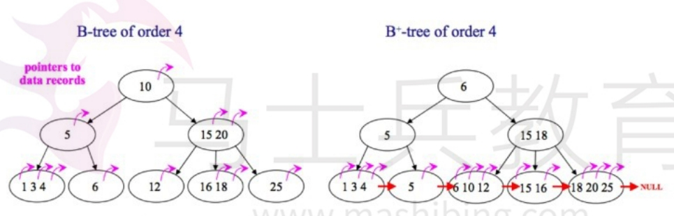

[toc]

# MySql面试题总结1

## 基础部分

### mysql有哪些数据类型

整数类型：
- tinyint       1字节
- smallint      2字节
- int           4字节
- bigint        8字节

小数类型：
- float         4字节
- double        8字节
- decimal(m,d)  严格的定点数

日期时间类型： 
- year          年
- time          时分秒
- date          年月日
- datetime      年月日时分秒
- timestamp     带有时区的年月日时分秒

字符串类型：
- varchar
- char
- text
- blob


>使用策略：
- 对于经常变更的数据来说，CHAR比VARCHAR更好，因为CHAR是定长的不容易产生碎片。
- 对于非常短的列，CHAR比VARCHAR在存储空间上更有效率。
- 使用时要注意只分配需要的空间，更长的列排序时会消耗更多内存。
- 尽量避免使用TEXT/BLOB类型，查询时会使用临时表，导致严重的性能开销。

### InnoDB存储引擎和myisam存储引擎的区别？

InnoDB存储引擎
- 外键：InnoDB支持外键。
- 事务上：InnoDB支持事务，适合大量insert和update操作。
- 锁：InnoDB支持行级锁，表级锁。
- 索引：InnoDB使用聚簇索引，即索引和数据存储在一起。


MyISAM存储引擎
- 外键：MyISAM不支持外键。
- 事务上：MyISAM不支持事务，适合大量select查询操作。
- 锁：MyISAM支持表级锁，可以锁定整个表。
- 索引: MyISAM使用非聚簇索引，索引和数据分开存储。

InnoDB的使用场景
- 需要事务支持。
- 行级锁对高并发有很好的性能。
- 数据修改和新增较多的
- 数据一致性要求高的

MyISAM的使用场景
- 不需要事务支持
- 并发较低的
- 数据修改较少，查询较多的
- 数据一致性要求不高的。

### SQL约束有哪些？

- NOT NULL（非空约束）: 字段值不能为空（NULL）。
- UNIQUE（唯一约束）: 字段值不能重复，一个表允许有多个 Unique 约束。
- PRIMARY KEY（主键约束）: 字段值不能重复，但它在一个表只允许有一个主键约束。
- FOREIGN KEY（外键约束）: 表与表的连接字段。

### varchar和char的区别？

char:
- char表示定长字符串，长度是固定的；如果插入数据的长度小于char的固定长度时，则用空格填充；
- 因为长度固定，所以存取速度要比varchar快很多。但是会占据多余的空间，是空间换时间的做法；

varchar:
- varchar表示可变长字符串，长度是可变的；插入的数据是多长，就按照多长来存储；
- 因为长度不固定，因此存取速度比char慢。但是不占用多余空间。

### varchar(50)中50，是什么意思？

varchar是可变长字符串，长度是可变的。而50表示可以存放50个字符。

例如：varchar(50)和varchar(200)在存储hello字符串所占空间一样，但后者在排序时会消耗更多内存。


### mysql中int(10)和char(10)以及varchar(10)的区别

- int(10)的10表示显示的数据的长度，不是存储数据的大小； 
- char(10)表示存储定长的10个字符，不足10个就用空格补齐，占用更多的存储空间。
- varchar(10)表示存储10个变长的字符


### 说一说drop、delete与truncate的区别

SQL中的drop、delete、truncate都表示删除，但是三者有一些差别。

- delete和truncate只删除表的数据不删除表的结构
- 速度,一般来说: drop> truncate >delete 
- delete语句是dml,这个操作会放到rollback segement中,事务提交之后才生效;如果有相应的trigger,执行的时候将被触发. 
- truncate,drop是ddl, 操作立即生效,原数据不放到rollback segment中,不能回滚. 操作不触发trigger.


### 解释 MySQL 外连接、内连接与自连接的区别

- 内连接 根据某个条件筛选出符合条件的记录，不符合条件的记录不会出现在结果集中，即内连接只连接匹配的行。
- 外连接 其结果集中不仅包含符合连接条件的行，而且还会包括左表、右表或两个表中的所有数据行，这三种情况依次称之为左外连接，右外连接，和全外连接。
- 左外连接，也称左连接，左表为主表，左表中的所有记录都会出现在结果集中，对于那些在右表中并没有匹配的记录，仍然要显示，右边对应的那些字段值以NULL 来填充。
- 右外连接，也称右连接，右表为主表，右表中的所有记录都会出现在结果集中。


### 当WHERE子句、GROUP BY子句、HAVING子句、ORDER BY子句同时出现在一个SQL查询语块中时，执行顺序为？

常见的一些语句执行顺序： 1 from 2 where 3 group by 4 having 5 select 6 order by 7 limit 

## 索引部分

### 介绍一下索引

索引本质上就是一种将数据按照排序方式存储的文件。

> 有无索引对查询有什么区别？

如果一个表没有建立索引，我们对这个表进行查询的话。那么mysql会将表中的所有数据都查询出来，然后根据查询条件进行一一比对。最终查询我们想要的数据。

如果一个表建立了索引，我们对这个表进行查询，并且查询条件也是这个索引字段的话。那么mysql会先从索引中查询我们想要的数据。由于索引中数据本身是有序的。因此mysql能很快的查询我们想要的数据。


总结：如果要查询的字段都建立过索引，那么mysql会直接在索引中查询而不会访问原始数据（否则只要有一个字段没有建立索引就会做全表扫描）。

### 索引的优缺点

索引的优点：
- 提高数据库查询数据的效率，减低数据库系统的IO成本
- 通过索引对数据库中的数据进行排序，从而降低数据库系统的CPU消耗

索引的缺点
- 创建和维护索引需要耗费数据库系统额外的时间和空间，随着索引的增加而增加。

创建索引的原则
- 在经常被当作搜索条件的字段上创建索引，可以加快查询速度。
- 在主键字段上创建索引，可以优化数据库中数据的排序结构.
- 在经常作为外键的字段上创建索引。可以加快外键查询的速度。
- 在经常需要作为排序条件的字段上创建索引，因为索引本质上就是排好序的数据。这样可以加快排序查询时间。

### 索引的类型

根据字段类型：
- 普通索引：基于普通字段创建的索引，没有任何限制。
- 唯一索引: 与普通索引类似，字段值不能重复,允许为null。
- 主键索引：基于主键字段的索引，字段值不能重复，不允许为null。
- 全文索引：当某个字段的数据量大的时候。使用like模糊查询效率很低。因此全文索引主要用于代替like模糊查询。全文索引比like模糊查询快很多倍。

根据字段个数：
- 单列索引：单列索引是由一个字段组成的索引。
- 组合索引：组合索引是由多个字段组成的索引。

>什么情况下使用组合索引？

一般根据查询条件where,当有一些查询条件是经常组合在一起使用的时候，那么这些查询条件对应的字段可以组成一个组合索引。

> 全文索引的注意事项：

全文索引必须在字符串或文本类型的字段上才能建立。

### 介绍一下聚簇索引和非聚簇索引

聚簇索引和非聚簇索引本质上是两种数据存储方式。

mysql的innoDB存储引擎中主键索引使用的是聚簇索引的存储方式。而myisam存储引擎中大部分索引都是用非聚簇索引。

- 聚簇索引：将数据存储与索引放到了一块，找到索引也就找到了数据。
- 非聚簇索引：将数据存储于索引分开结构，索引结构的叶子节点指向了数据的地址。


> 聚簇索引

聚簇索引本质上是一种数据存储方式，它根据数据记录的主键来构建B+树。B+树的叶子节点存储的就是一行记录。也就是说整个B+树就是数据表本身。B+树根据数据表的主键存储了数据表的所有数据。

InnoDB存储引擎中表的原则（表中必须存在聚簇索引）：
- 如果表中没有定义主键字段，则表中第一个非空唯一字段就是作为聚簇索引。
- 如果表中有定义主键字段，则主键字段就是主键索引就是聚簇索引。
- 如果都没有，则InnoDB存储引擎会在表中创建一个隐藏row-id字段作为聚簇索引。

聚簇索引的优点
- 聚簇索引比非聚簇索引在查询速度上要快，因为聚簇索引比非聚簇索引要少一次IO查询

聚簇索引的缺点
- 由于聚簇索引是将索引和数据存储在一起，并且是根据数据的主键字段来构建b+树数据结构，因此当插入一行全新数据的时候，如果插入数据的主键字段是最大的，那么插入速度是最快的，如果插入数据的主键字段不是最大的，那么插入速度依赖与插入顺序。因此通常情况下，聚簇索引的主键字段通常是自增的。
- 另外，当更新表中的主键字段的时候，将会导致B+树结构中被影响数据的变动，这样做代价很高，将会影响到b+树的性能。因此主键字段一般定义为不可更新。

> 非聚簇索引

非聚簇索引本质上也是一种数据存储方式。它根据数据记录的主键来构建B+树。B+树的叶子节点存储了数据的地址。而真正的表数据是存储在独立的地方。
    
### 创建索引的原则

1. 对频繁作为查询条件的字段去创建索引。对更新频繁的字段不适合创建索引。
2. 外键的字段一定要建立索引。
3. 对不能有效区分数据的字段不适合做索引(如性别，就男女2种，区分度实在太低)
4. 最左前缀原则，适合组合索引的非常重要的原则。

### 最左前缀原则是什么？

最佳左前缀法则只适用于组合索引上。

首先组合索引中字段会与where子句中的字段，会根据最左前缀原则来匹配，匹配上的where子句就能使用组合索引，否则无法使用组合索引。

最左前缀原则如下：
* 按从左到右的顺序依次进行匹配。直到遇到范围查询（>,<,between,like）就停止匹配。
* 例如组合索引index_name(a,b,c)，只会匹配where子句中的a、a,b、a,b,c 三种类型的查询。
* <font color="red">注意若where子句中abc三个字段都存在，无论什么顺序。mysql会将where子句优化为a,b,c查询。</font>
* <font color="red">注意如果where子句中的各个字段通过 >,<,between,like 连接。则不会触发组合索引</font>

```
例如：某个组合索引包含三个字段（姓名，年龄，性别）。即aaa_index(name,age,gender)

select * from table where name = '小明'
select * from table where name = '小明' and age = 12
select * from table where name = '小明' and age = 12 and gender = '男'
select * from table where name = '小明' and gender = '男'

只有上面这三个语句能够使用到索引aaa_index。其余的查询语句无法使用到组合索引aaa_index。
第四个语句只能匹配到name，gender字段索引，不能匹配到name,age,gender字段索引。

原因解释：
组合索引index_name(a,b,c)，只会走a、a,b、a,b,c 三种类型的查询。a,c顺序只能匹配a,c字段组合索引，不会匹配a,b,c字段组合索引。
```

### 索引的数据结构

索引的数据结构和具体存储引擎的实现有关。而InnoDB存储引擎的默认索引使用的数据结构为：B+树。

### 索引在哪些情况下会失效？

索引在以下情况下会失效：
- 查询条件包含or，那么索引会失效。
- like模糊查询，并且%开头的时候，索引会失效。因为这是范围查询，而不是精准查询。
- 当查询条件的字段没有匹配上组合索引的最左前缀原则的时候，组合索引会失效。
- 对索引的字段进行函数和运算符计算的时候，索引会失效。
- 索引字段上使用>,<,!=,not in,is null等范围查询的时候，索引会失效。因为这些条件不是用于精准查询，而是用于范围查询的。
- 当索引字段需要类型转换的时候，索引会失效。例如id是int类型。但是语句where id = "1"。此时语句中的id需要经过类型转换。

总结：大多情况下，当sql语句是精准查询，而不是范围查询的时候。sql语句中的索引字段才会生效。

### 为什么模糊查询中的like以%开头的索引会失效？

like查询为模糊查询。当%出现在左边的时候，则索引会失效。%出现在右边则索引不会失效。

索引失效的原因：
- 当%号在右边：由于b+树的索引顺序，是按照首字母的大小排序，所以到%号在右边，那么可以在b+树上可以根据首字母查询。
- 当%号在左边：此时字段的首字母是%号，因此无法在b+树上进行查询。因此索引就会失效。
- 当%号在左右两边：无法在b+树上进行查询。因此索引就会失效。

### B树和B+树的区别？



> 什么是b树？

b树是一个多路查找树，b树上的每个节点可以存储多个数据。这样可以保证减少树的深度的同时，同时存储更多的数据（把瘦高的树变得矮胖）。

通常把b树中所有节点的最大子节点的个数，称为b树的阶。

b树结构存储的方式：
- b树的每个节点会存储多个指向下个节点的地址。
- b树中每个节点的不光存储索引，也存储数据记录。即索引和数据记录分布在整个b树的每个节点上。  
- b树上的节点中的索引值，是按从左到右升序存储的。

b树的优缺点：
- b树的优点：由于每个节点内部存储索引和数据记录，因此找到索引就相当于找到了数据。
- b树的缺点：由于节点不光存储索引，也存储数据记录。所以当节点中的数据存储较多的时候，那么节点中的索引存储就会较少。从而导致b树的层变高，那么查询的io次数就变多。

b树的使用场景：
- b树主要用于文件系统和部分数据库索引，例如mongoDB。大部分关系型数据库都是使用b+树来实现数据存储。

> 什么是b+树？

b+树是在b树的基础上进行了优化。即b+树的非叶子节点只存储索引，不存储数据记录。

b+树结构存储的方式：
- 非叶子节点只存储索引信息和指向下个节点的地址信息。
- 所有的数据记录都只存储在叶子节点上。
- 叶子节点之间都有一个指向相邻叶子节点的指针。这样叶子节点之间就形成了顺序链表，方便直接通过叶子节点找到其他叶子节点。

> b+树相比b树的优点

由于b+树的非叶子节点只存储索引，而b树的节点不光存储索引也存储数据。因此在相同数据量的情况下，b+树比b树更矮胖（即子节点更多）。从而导致b+树相比b树的查询能力更快。

另外由于b+树的叶子节点之间都通过指针连接，因此对b+树全部查询，只需要查询叶子节点即可。而对b树全部查询，需要把整个树查询一遍。

### 索引为什么使用B+树而不是B树

- B树只适合随机检索，而B+树同时支持随机检索和顺序检索（b+树叶子节点互相连接）。
- B+树相比b树更矮更胖，空间利用率更高，可减少磁盘I/O次数。
- 增删文件（节点）时，B+树效率更高。因为B+树的叶子节点包含所有关键字，并以有序的链表结构存储，这样可很好提高增删效率。

### InnoDB存储引擎和myisam存储引擎的索引实现方式？

myisam存储引擎是使用B+Tree作为索引的结构。但是b+tree的叶子节点存放的是数据记录的地址。所以myisam存储引擎的索引都是非聚簇索引。


InnoDB存储引擎也是使用B+Tree作为索引的结构。但是b+tree的叶子节点存放的是完整的数据记录。所以InnoDB存储引擎的索引都是聚簇索引。


### explain语句是什么？

explain语句可以模拟mysql执行sql查询语句，从而查看sql查询语句的执行情况。

<font color="red">注意explain语句是针对的查询语句，而不是更新，删除语句。</font>


```sql
# explain语句的语法如下
explain + sql语句

# 例如： 给TTL字段创建一个索引aaa。
# 下面用explain语句来查询下面这个sql语句的执行情况
explain select * from pol_law_d where TTL = '111';
```


通过explain语句，我们可以获取sql查询语句的执行情况。如上图所示。

上图字段描述：
- id:标识符
- select_type:表示sql语句的类型.(SIMPLE表示简单sql语句)
- table:查询语句涉及到的表名
- partitions:查询语句涉及到的分区
- type:表示查询语句的连接类型，可以了解该语句的连接性能
- possible_keys:表示查询语句可能使用的索引
- key:表示查询语句实际使用的索引
- key_len:表示使用的索引字段的长度
- ref:列与索引的比较
- rows:扫描出的行数(估算的行数)
- filtered:按表条件过滤的行百分比
- Extra:查询语句的执行情况的描述和说明

## 事务部分

### 什么是事务？

事务是一组数据库操作，这组操作中的所有命令，要么都执行，要么都不执行。

### 事务的特性ACID

在mysql中，事务会把一组数据库命令作为一个整体进行操作，即这一组数据库命令要么都执行，要么都不执行。

事务的特性ACID:
1. 原子性（atomicity）： 事务是最小的执行单位。事务的原子性确保事务要么全部完成，要么全都不完成。
2. 一致性（consistency）： 执行事务前后，数据库的状态从一个一致状态转变为另一个一致状态。例如：A和B互相转账。一致性就是要保证转账前后，A和B的账号金额总体一样的。
3. 隔离性（isolation）： 事务并发访问数据库时，一个事务不被其他事务所干扰。即一个事务的内部操作和使用的数据对其他事务是隔离的。
4. 持久性（durability）： 事务一旦被提交之后。它对数据库中数据的改变是持久的，即使数据库发生故障也不会丢失。

### 并发事务会出现哪些问题？

在应用程序中，如果多个事务并发运行，可能会导致以下的问题。

- 脏写：如果一个事务A修改了另一个事务B修改未提交的数据，若事务B之后进行回滚，则事务A中的更新操作会失效。这就是脏写。
- 脏读：如果一个事务A读到了另一个事务B修改但未提交的的数据，若事务B之后进行回滚，则事务A读取的是一个未提交的值。这就是脏读。
- 不可重复读：若一个事务A在执行过程中多次查询某个数据。在事务A还没有结束时，另一个事务B修改并提交了那个数据。那么由于事务B的修改并提交，在事务A中两次读到的数据可能不一样。即某个事务执行期间，多次查询的数据值不一样。这就是不可重复读。
- 幻读：幻读是指一个事务A按照某个相同条件多次读取数据时，查询的记录数前后不一致。即之前查询的记录是2条，之后查询的记录是10条。

### 脏读产生的详细过程？

数据库的数据是在磁盘中的。当事务读取数据的时候，会先去内存中寻找，如果没有再去磁盘中寻找。在磁盘找到后，会将其存储到内存中。

而脏读就是，一个事务B读取并修改了内存中的一条数据（之后提交事务B后就会被持久化到数据库）。恰恰是这个时候，事务A来读取了同一条数据，肯定也是先从内存中寻找 ，但是事务A读取的是被事务B修改过的数据。

如果这个时候这个事务B有异常了，回滚了。那么修改后的数据没有持久化到磁盘，但是事务A刚才读了事务B没有持久化的数据，也就是错误的数据。这就是脏读。

### 不可重复读和幻读的区别？

不可重复读的重点是修改。即同样的条件, 你读取过的数据, 再次读取出来发现值不一样了。在一个事务中前后两次读取的结果并不一致，导致了不可重复读。

幻读的重点在于新增或者删除。即同样的条件, 第1次和第2次读出来的记录数不一样。

从总的结果来看, 似乎不可重复读和幻读都表现为两次读取的结果不一致。但如果你从代码的角度来看,两者的区别就比较大。
- 对于不可重复读, 只需要锁住满足条件的记录。可以采取行级锁防止该记录数据被更改或删除。
- 对于幻读, 要锁住满足条件及其相近的记录。可以采用表级锁防止表中记录变化。

### 事务隔离级别有哪些?MySQL的默认隔离级别是?

为了解决事务并发运行时出现的4种问题。mysql设计了4种隔离级别。

4种问题的严重程度：脏写 > 脏读 > 不可重复读 > 幻读。

> 隔离级别分为4种

<font color="red">

1. 由于脏写是最严重的问题，所以4种隔离级别都会禁止脏写问题的出现。
2. Mysql中InnoDB存储引擎默认的支持隔离级别是可重复读

</font>


* READ-UNCOMMITTED(读取未提交)： 最低的隔离级别，允许读取尚未提交的数据变更，可能会导致脏读、幻读或不可重复读，但是脏写问题解决了。
* READ-COMMITTED(读取已提交)： 并发事务下只允许读取已经提交的数据，可以阻止脏读问题，但是幻读或不可重复读仍有可能发生。
* REPEATABLE-READ(可重复读)： 对同一字段的多次读取结果都是一致的，除非数据是被事务本身自己所修改，可以解决脏读和不可重复读问题，但幻读仍有可能发生。
* SERIALIZABLE(可串行化)： 最高的隔离级别，完全服从ACID的隔离级别。所有的事务依次逐个执行，这样事务之间就完全不可能产生干扰，也就是说，该级别可以防止脏写，脏读、不可重复读以及幻读。

简化版：
- 读未提交：解决脏写问题。其他3个问题不行。
- 读已提交：解决脏读，脏写问题。其他2个问题不行
- 可重复读：解决不可重复读，脏读，脏写问题。其他1个问题不行
- 串行化：4个问题都能解决。

### 事务隔离级别和锁的关系？

事务隔离级别是用于解决事务并发执行产生的脏读，脏写，不可重复度，幻读的问题的。

而事务隔离级别的实现方式就是基于锁机制和并发调度 MVVC（多版本并发控制）。

即 事务隔离级别 = 锁 + MVVC

### mysql事务相关的redolog和undolog日志文件？


## 锁部分

### 什么是锁

当多个事务并发地读取同一数据时，若对事务的并发操作不加控制就可能会读取和存储不正确的数据，破坏数据库的一致性。

锁就是实现数据库并发控制的一个机制。当事务在对某个数据对象进行操作前，先向系统发出请求，对其加锁。加锁后事务就对该数据对象有了一定的控制，在该事务释放锁之前，其他的事务不能对此数据对象进行更新操作。

### 锁与事务隔离级别的关系？

- 读未提交：读取数据不加共享锁。这样就不会跟修改数据的事务的排他锁冲突。
- 读已提交：读取数据加共享锁，但是在查询语句执行完以后释放共享锁；
- 可重复读：读操作需要加共享锁，但是在事务提交之前并不释放共享锁，也就是必须等待事务执行完毕以后才释放共享锁。
- 串行化：是限制性最强的隔离级别。在事务执行期间，一直持有锁，直到事务完成。


### Mysql 中有哪几种锁？

> 按照数据的读写操作来划分：

- 读锁（共享锁）：如果事务要读取某条数据，那么事务需要先给这条数据加上读锁之后，才能读取这条数据的信息。并且其他事务也可以并发读取这条数据（即这条数据可以有多个读锁），但是如果其他事务想要修改这条数据（给这条数据加上写锁），除非这条数据上的所有读锁都释放了。
- 写锁（排他锁）：如果事务想要修改某条数据，那么事务需要先给这条数据加上写锁之后才能修改这条数据。此时其他事务就不能给这条数据加上写锁和读锁。除非这条数据上的写锁释放了。因为写锁会与其他写锁和读锁冲突。

> 按照数据操作的粒度来划分：

- 表级锁：表示对当前操作的整张表加锁。锁定粒度大，发生锁冲突的概率最高，并发量最低。
- 行级锁：表示只针对当前操作的行进行加锁。锁定粒度小，发生锁冲突的概率小，并发度最高
- 页级锁：表示只针对当前操作的页进行加锁。处于表级锁和行级锁之间。锁定粒度界于表锁和行锁之间，并发度一般。

> 按照数据操作的性能来划分：

- 乐观锁：乐观锁的实现方式是在数据更新提交的时候，通过对数据的版本进行对比。如果版本不一致，则表示该数据已经被其他人给更新了。则当前的数据更新操作失败。
- 悲观锁：悲观锁的实现方式是在对某条数据进行修改的时候，为了避免被其他人修改。我们先把该条数据给锁定了，不让别人修改，只让自己修改。自己修改完了，在把这条数据的锁定解除。

### MySQL中InnoDB引擎的行锁是怎么实现的？

InnoDB是基于索引来完成行锁。

### 什么是死锁? 如何解决？

如果一个事务访问表A（锁住了表A），然后又访问表B。另一个事务访问表B（锁住了表B），然后又访问表A。由于两个事务各自锁住了一个表，又想互相访问对方锁住的表。因此两个事务产生了争执，从而导致这两个事务都无法进行下一步。这时死锁就产生了。

简而言之，死锁是指两个或多个事务在同一资源上相互占用，并请求锁定对方的资源，从而导致恶性循环的现象。

> 常见的解决死锁的方法
1. 如果是程序上的多个事务并发存取多个表，一般是通过调整程序的逻辑来解决。
2. 在同一个事务中，尽可能做到一次锁定所需要的所有资源，减少死锁产生概率；例如某个事务要操作A,B表，那么就先把A，B表都上锁之后，再进行下一步的操作。
3. 对于非常容易产生死锁的业务部分，可以尝试使用升级锁定颗粒度，通过表级锁定来减少死锁产生的。

### 死锁的产生的四个条件？

下面四个条件是死锁的必要条件，只要系统发生死锁，这些条件必然成立，而只要任何一个条件不满足，就不会发生死锁

1. 互斥条件：一个资源每次只能被一个进程使用。
2. 请求与保持条件：一个进程因请求资源而阻塞时，对已获得的资源保持不放。
3. 不剥夺条件:进程已获得的资源，在末使用完之前，不能强行剥夺。
4. 循环等待条件:若干进程之间形成一种头尾相接的循环等待资源关系。

### MySQL中InnoDB引擎的行锁是怎么实现的？

答：InnoDB是基于索引来完成行锁?

可以根据条件来完成行锁锁定，并且 id 是有索引键的列，如果 id不是索引键那么InnoDB将完成表锁，并发将无从谈起。

### 什么是乐观锁，乐观锁的实现机制？

> 什么是乐观锁？

假设不会发生并发冲突。在事务访问数据的时候不加锁，而是当事务提交数据的时候再加锁。

乐观锁的实现方式：版本号机制或CAS算法。

版本号机制：
即为数据库表增加一个 “version” 字段来实现。当读取数据时，将version字段的值一同读出，数据每更新一次，对此version值加1。当我们提交更新的时候，判断数据库表对应记录的当前版本信息与第一次取出来的version值进行比对，如果数据库表当前版本号与第一次取出来的version值相等，则予以更新，否则认为是过期数据。

CAS算法：
事务再读取数据的时候，将数据记录下来。当事务提交数据的时候，再次读取一次数据，判断两次的数据是否一致。若一致，则事务提交。若不一致则事务放弃提交。

### 什么是悲观锁，悲观锁的实现机制？

> 什么是悲观锁？

假定会发生并发冲突。悲观锁就是在事务读取数据的时候，为了不让其他事务数据，就会先对自己读取的数据加锁，只有当事务完成之后，再释放锁。即事务执行期间，全程对数据加锁。

悲观锁的实现方式: 依赖数据库中的锁机制。


## 视图部分

### 什么是视图？

视图，本质上是一种虚拟表，在物理上是不存在的。可以对视图进行增，改，查等操作。但是视图的数据来自视图的定义，即数据来自基本表。

> 视图的特点

- 视图是由基本表(实表)产生的表(虚表)。
- 视图本身结构的建立和删除不影响基本表。
- 对视图数据的更新(添加，删除和修改)会直接影响基本表。

> 视图的使用场景

简化sql查询，提高开发效率。兼容老的表结构。

### 视图的优缺点

优点：
1. 查询简单化。视图能简化用户的操作。
2. 数据安全性。视图使用户能以多种角度看待同一数据，能够对机密数据提供安全保护

缺点
1. 性能。如果这个视图是由一个复杂的多表查询所定义，那么数据库需要花费一定的时间对视图进行更新。
2. 修改限制。当修改视图的某些行时，数据库必须把它转化为对基本表的某些行的修改。对于比较复杂的视图，数据库要花费一定的时间去修改。

## 存储过程部分

### 什么是存储过程？

存储过程是一个预编译的SQL语句，可以理解为函数，方法。如果某些情况下需要执行多次SQL，使用存储过程要比执行多个SQL语句要快。

### 存储过程有哪些优缺点？

优点：
- 存储过程是预编译过的，执行效率高。
- 存储过程的代码直接存放于数据库中，通过存储过程名可以直接调用。
- 存储过程可以重复使用，减少数据库开发人员的工作量。

缺点：
- 调试存储过程中的SQL语句很麻烦
- 若后期数据库的数据表发生变化，那么存储过程也要变化。维护存储过程很麻烦。

## 触发器部分

触发器是一种由事件驱动的特殊的存储过程。触发器是指一段代码，当触发某个
事件时，自动执行这些代码。

> MySQL中都有哪些触发器？

Before Insert
After Insert
Before Update
After Update
Before Delete
After Delete


