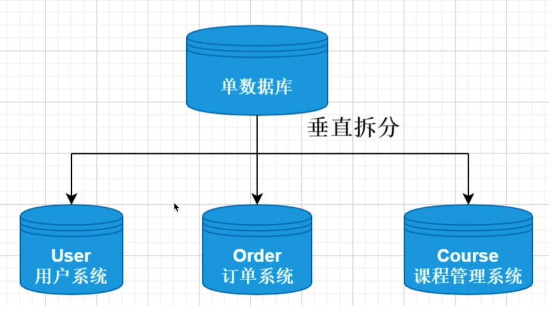
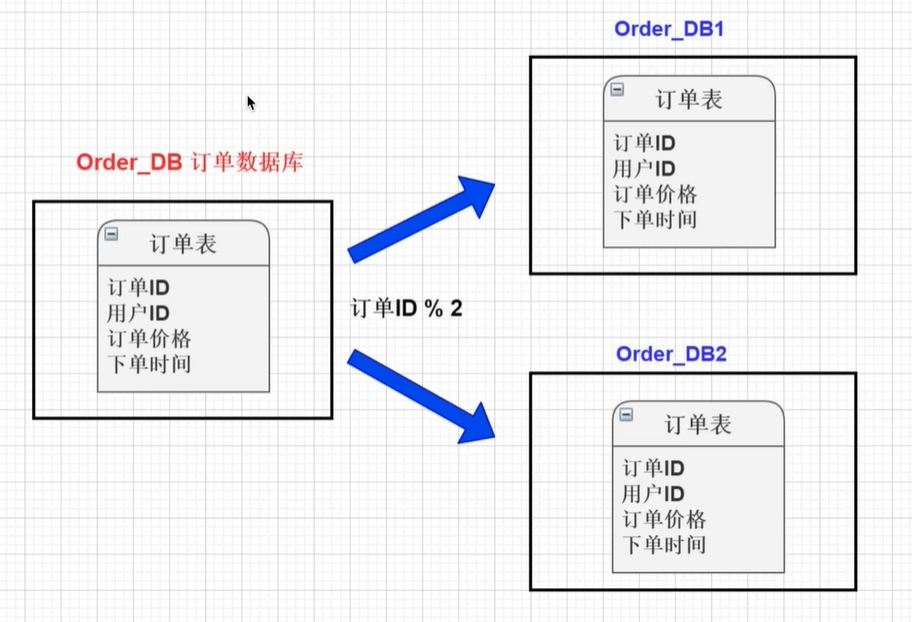

[toc]

# MySql面试题总结2

## SQL优化部分

### 如何才能知道SQL语句运行很慢的原因？

如何才能知道SQL语句运行慢的原因？最有效的方法便是explain命令。

MySQL提供了explain命令来查看SQL语句的执行情况。例如是否使用索引，使用什么索引，使用的索引的相关信息等。

其中最重要的是type字段，type字段可以看出语句有没有使用索引。

### mysql数据库如何执行一条SQL语句？

1. 客户端与服务端建立连接。
1. 服务端获取要执行的SQL语句
2. 解析SQL语句并生成执行计划，然后执行。
3. 将数据首先读取内存中，然后进行逻辑处理。
4. 最后将语句执行结果，发送给客户端。
5. 关掉服务端与客户端的连接，释放资源。

### MySQL 对于千万级的大表要怎么优化？

1. 首先优化sql语句和索引
3. 添加redis缓存
4. 主从复制，读写分离。
5. 垂直拆分，将一个大表，拆分为多个小表。
6. 水平拆分，将一个大表的大量数据记录，均分到多个表上。

### 超大数据表的分页如何优化？

超大数据表的分页。例如`select * from table where age > 20 limit 1000000,10`这种查询。

执行这条语句，mysql会先加载1000010条数据，然后只取最后10条，其他数据全部丢弃。这种情况下mysql当然会很慢。

> 如何优化这种分页语句？

可以修改为`select * from table where id in (select id from table where age > 20 limit 1000000,10)`

这样虽然也load了一百万的数据,但是由于索引覆盖,要查询的所有字段都在索引中,所以速度会很快。

这种方式是利用子查询来触发索引，从而加快mysql的查询速度。

### 慢查询日志

我们可以通过慢查询日志来对sql进行优化。

慢查询日志：用于记录执行时间超过某个临界值的SQL日志，用于快速定位慢查询的SQL。

开启慢查询日志：
- 配置项：slow_query_log: on        //开启慢查询日志
- 配置项：long_query_time=0.5       //设置查询临界时间 

### 慢查询如何优化？

通过慢查询日志，将慢查询SQL记录下来。

首先分析语句，看看是否load了额外的数据，可能是查询了多余的行并且抛弃掉了，可能是加载了许多结果中并不需要的列，对语句进行分析以及重写。

然后分析explain语句的执行情况，然后获得其使用索引的情况，之后修改语句或者修改索引，使得语句可以尽可能的命中索引。

### 主键是自增ID还是UUID？

推荐使用自增ID，不要使用UUID。

因为在InnoDB存储引擎中，主键索引是聚簇索引，即B+树叶子节点上存储了主键索引值以及全部的数据。如果主键索引是自增ID，那么对于b+树来说很方便的增加节点。

如果是UUID，id是随机的，那么对于b+树来说，增加节点会导致其他的节点的移动，进而造成mysql的性能下降。

### 常见的sql优化有哪些？

1. 查询语句中不要使用select *
2. 在需要多表查询的情况下，减少使用子查询，多使用关联查询（left join,right join,inner join）替代
3. 减少使用IN或者NOT IN ,使用exists，not exists或者关联查询语句替代
4. or 的查询尽量用 union或者union all 代替(在确认没有重复数据或者不用剔除重复数据时，union all会更好)
5. 应尽量避免在 where 子句中使用!=或<>操作符，否则存储引擎会放弃使用索引而进行全表扫描。
6. 应尽量避免在 where 子句中对字段进行 null 值判断，否则将导致引擎放弃使用索引而进行全表扫描，如： select id from t where num is null 可以在num上设置默认值0，确保表中num列没有null值，然后这样查询： select id from t where num=0


### 如何对MySQL的limit分页查询进行优化？

一般的分页查询使用简单的limit语句就能实现。

```sql
# limit语法如下
select * from 表名 limit [offset,] rows 

# offset 偏移量，从0开始，可选。
# rows 返回记录数。
# 如果只有rows参数，那么就返回从0开始的指定行数据。
```

据统计：
- 如果偏移量固定，当返回记录数低于100的时候，查询时间差距不大。但是随着返回记录数越大，查询时间越大。

```sql
select * from user limit 100,1
select * from user limit 100,10
select * from user limit 100,100
select * from user limit 100,1000
select * from user limit 100,10000
```

- 如果返回记录数不变，当偏移量超过100的时候，随着偏移量越大，查询时间会急剧增加。

```sql
select * from user limit 1,100
select * from user limit 10,100
select * from user limit 100,100
select * from user limit 1000,100
select * from user limit 10000,100
```

问题原因总结：limit的分页查询机制，是每次都会从表的第一条记录开始搜索，因此就算返回记录数只有100，但是随着偏移量越大，那么搜索的时间就越长，查询时间就越长。

> 优化方式1：通过索引来进行分页。

由于limit分页查询总是会从表的第一条记录开始搜索。因此我们可以通过索引来直接跳到偏移量的位置上，然后再开始分页查询。

例如，我们想要查询从第1000条开始的100条记录。假设id是自增的。我们可以通过where查询语句，直接跳到1000条。然后再进行分页查询。
```sql
# 下面两条查询语句的效果是一样的
select * from studeng limit 1000,100 
select * from studeng where id >=1000 limit 100 
```

> 优化方式2：利用子查询进行优化

首先利用子查询，跳到偏移量开始的地方。然后再进行分页查询。

```sql
# 先定位到偏移量开始的记录上
select id from studeng where id = 1000

# 然后再进行分页查询
select * from studeng where id >=(select id from studeng where id = 1000) limit 100 
```

## 数据库结构优化部分

### 数据库结构优化？

1. 垂直拆分表：将字段很多的表分解成多个表对于字段较多的表。如果有些字段的使用频率很低，可以将这些字段分离出来形成新表。
2. 增加中间表：对于需要经常联合查询的表，可以建立中间表以提高查询效率。通过建立中间表，将需要通过联合查询的数据插入到中间表中，然后将原来的联合查询改为对中间表的查询。

### 大数据量的表如何优化？

当MySQL单表记录数过大时，数据库的CRUD性能会明显下降，一些常见的优化措施如下：
1. 限定查询数据的范围： 禁止不带任何限制数据范围条件的查询语句。
2. 读/写分离： 经典的数据库拆分方案，主库负责写，从库负责读。
3. 缓存：对重量级、更新少的数据使用redis的缓存。
4. 水平拆分，垂直拆分表。

### 分库分表之后,id 主键如何处理？

当分库分表后，若每个表的id都是从1开始自增，则容易出现相同id的问题。因此我们需要一个生成全局的id的方式。

生成全局 id 有下面这几种方式
- uuid: 不适合作为主键，因为太长了。并且无序性不可读，查询效率低。比较适合用于生成唯一的名字的标示比如文件的名字。
- 数据库自增 id : 两台数据库分别设置不同步长，生成不重复ID的策略来实现高可用。这种方式生成的 id 有序，但是需要独立部署数据库实例，成本高，还会有性能瓶颈。
- 利用 redis 生成 id : 性能比较好，灵活方便，不依赖于数据库。但是，引入了新的组件造成系统更加复杂，可用性降低，编码更加复杂，增加了系统成本。
- 美团的Leaf分布式ID生成系统 ：Leaf 是美团开源的分布式ID生成器，能保证全局唯一性、趋势递增、单调递增、信息安全，里面也提到了几种分布式方案的对比，但也需要依赖关系数据库、Zookeeper等中间件。


### 什么是分库分表？

分库是指将存储再同一个数据库的数据，分散存储到不同数据库上，以达到缓解数据库负载的效果。

分表是指将存储再同一个表上的数据，分散存储到不同表上，以达到缓解表负载的效果。

分库分表的目的是解决由于数据量过大，从而导致数据库系统性能降低的问题。将原来单个的数据库进行拆分成多个数据库，将原来单个表进行拆分成多个表。从而达到提高数据库系统的性能。

分库分表有四种方式：垂直分库，垂直分表，水平分库，水平分表。

> 垂直分库

由于数据库中不同的表对于不同的业务。垂直分库是指将单个数据库中的数据表，按照业务的不同将表进行分类。然后把各个业务的数据表拆分到各个数据库中。并将各个数据库部署再各个服务器上。



> 垂直分表

当表中字段太多时，会影响表的性能。垂直分表是指将单个表的拆分成多个表，每个表存储一部分的字段。这样一个大表就变成了多个小表。

例如可以将职位表拆分为职位信息表和职位描述表。


> 水平分库

水平分库是指将一个数据库中的数据，切分到多个数据库上。水平分库并不是将数据库中的表按照业务不同进行拆分，而是将表中的数据按照某种逻辑进行分开存储。

例如将订单表的数据，根据id是奇数还是偶数，来分别存储再不同的数据库上。


水平分库可以有效缓解单个数据库的性能瓶颈和压力。

> 水平分表

针对某个数据量特别大的单张表，按照某种规则将一个表的数据水分开存储到多个表上。这些表还是存在一个数据库中。

水平分表可以缓解单个表的性能瓶颈和压力，但是由于还是再一个数据库中，对于数据库的性能还是存在瓶颈的。

如图将一个职位信息表，水平拆分为多个职位信息表。


总结：
- 垂直分表：将一个表按照字段拆分为多个表，每个表存储其中一部分字段。
- 垂直分库：将数据库中的表，按照业务逻辑的不同，将表分开存储到不同的数据库上。这些数据库部署再各自的服务器上。
- 水平分表：将一个表的数据按照一定规则，分开存储再同一个数据库的多个表中，每个表只存储一部分数据。
- 水平分库：将一个表的数据按照一定规则，分库存储在不同数据的同一个表中（即每个数据库都有一个相同名称的表）。每一个表都存储一部分数据。

### MySQL分表自增ID解决方案

当我们对MySQL进行分表操作后，将不能依赖MySQL的自动增量来产生唯一ID了，因为数据已经分散到多个表中。

最经典的解决方式是 分布式id生成算法 SnowFlake (雪花算法)

SnowFlake算法生成的id，是一个64bit大小的整数，它的结构如下图所示。


- 最高位1位。不用。生成的id一般都使用整数，所以这个最高位固定是0。0表示正数，1表示负数
- 41位，用来记录时间戳。
- 10位，用来记录机器ID。
- 12位，用来记录同毫秒内产生的不同id。

在Java中SnowFlake算法生成的id就是long类型来存储，long类型就是占8个字节，64位二进制。

SnowFlake可以保证。
- 所有生成的id按时间趋势递增。
- 整个分布式系统内不会产生重复id。  

只需要将雪花算法用Java语言实现出来，封装为一个工具方法，那么各个业务应用可以直接使用该工具方法来获取分布式ID，只需保证每个业务应用有自己的工作机器id即可，而不需要单独去搭建一个获取分布式ID的应用。

另外大多数公司，其实并没有直接使用snowflake雪花算法。而是进行了改造，因为snowflake算法中最难实践的就是工作机器id，原始的snowflake算法需要人工去为每台机器去指定一个机器id，并配置在某个地方从而让snowflake从此处获取机器id。

## Mysql主从复制-读写分离

### MySQL的主从复制原理以及流程

> 主从复制的原理

在主数据库上，涉及到数据的操作都会记录到主机的二进制日志（binlog）上，当进行主从数据同步的时候，主机将binlog文件发送给从机。然后从机将这些日志重新执行一遍；从而使得从数据库的数据与主数据库保持一致。

> 主从复制的作用
1. 主数据库出现问题，可以切换到从数据库。
2. 可以进行数据库层面的读写分离。
3. 可以在从数据库上进行日常备份。

### MySQL如何记录binlog日志？

当mysql设置主从复制后，主数据库需要将数据操作记录到binlog日志上，然后传输到从数据库上。

而主数据库记录数据操作到binlog日志的方式有以下几种。

1. statement 基于SQL语句的复制：将对数据库操作的sql语句写入到binlog中。
2. row 基于行的复制：将每一条数据的变化写入到binlog中。
3. mixed 混合模式：statement与row的混合模式。

### 什么是mysql主从复制？

主从复制的用途：
- 用于故障切换，实时灾备。
- 用于备份，避免出现故障影响业务。
- 用于读写分离，提供查询服务。

主从复制部署的必要条件：
- 主库开启binlog日志
- 主库从库的server-id设置必须不同。
- 在主库中创建一个用户，让从库连接这个用户。通过这个用户让主库从库进行连接。

主从复制的原理
- mysql中有一种日志叫binlog日志。这个日志会记录数据库中的所有写操作的sql语句。
- 主从复制的原理就是把主库上的bin日志，复制到从库上，然后让从库执行一遍这个bin日志。这样从库与主库上的数据就一致了。
