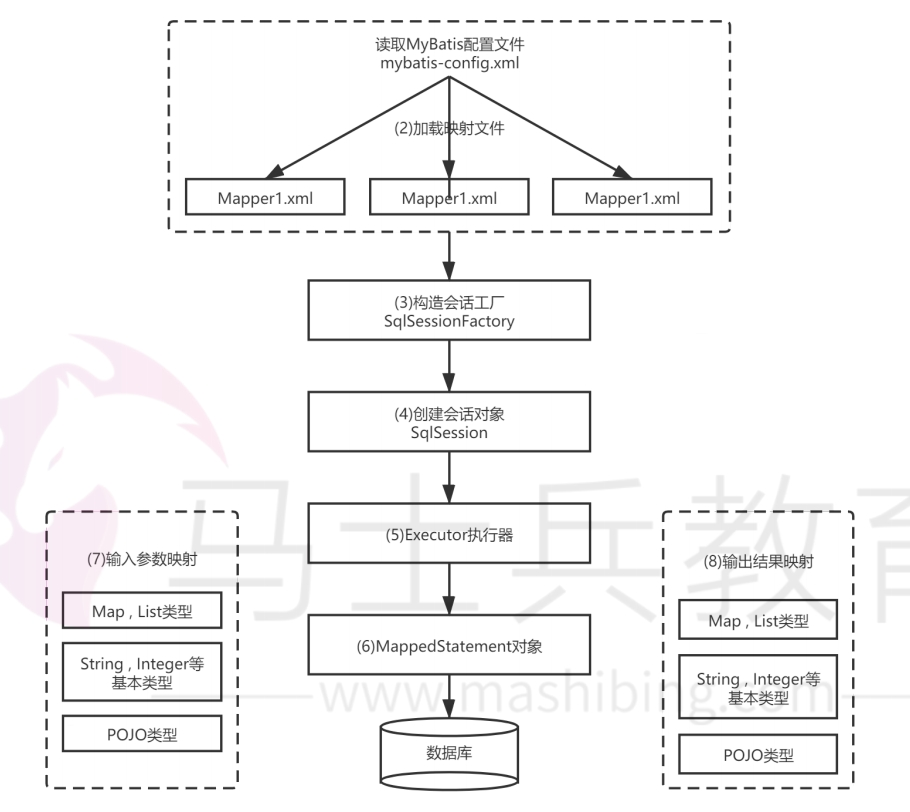

[toc]

# Mybatis面试题总结

## 什么是Mybatis？

MyBatis 是一个半 ORM（对象关系映射）的持久层框架。使用Mybatis开发时只需要关注SQL语句
本身，不需要花费精力去处理加载驱动、创建连接、创建statement等繁杂的过程。

## 什么是ORM？

ORM（Object Relational Mapping），对象关系映射，是一种为了解决关系型数据库数据与Java对象的映射关系的技术。

简单的说，ORM可以将 java 对象自动持久化到关系型数据库中。

## 为什么说Mybatis是半自动ORM映射工具？它与全自动的区别在哪里？

- Hibernate是全自动ORM映射框架，使用Hibernate查询对象时，可以根据对象关系模型直接获取，所以它是全自动ORM的。
- Mybatis是半自动ORM映射框架，它在查询对象时，需要手动编写sql来完成，所以是半自动ORM映射。

## 传统传统JDBC开发存在的问题？MyBatis是如何解决这些问题的？

① 数据库链接创建、释放频繁造成系统的资源浪费。
- 解决方式：mybatis在xml配置文件中配置数据连接池，使用连接池管理数据库连接。

② Sql语句写在代码中造成代码不易维护。
- 解决方式：mybatis将Sql语句配置在mapper.xml文件中，将SQL语句与java代码分离。

③ 向sql语句传参数麻烦
- 解决方式：Mybatis通过XML标签，支持编写动态SQL语句，将java对象中的数据映射到sql语句的参数中。

④ 对sql结果集解析麻烦
- 解决方式：Mybatis自动将sql执行结果集映射为java对象。

## Mybatis有什么优缺点？

优点：
* MyBatis 把sql语句放在XML文件中编写，将业务代码与sql语句分离开来。降低了程序的耦合度。
* MyBatis 可以自动将数据结果集转换成 Java 对象，大大简化了代码。

缺点：
* MyBatis 中 SQL 语句的编写工作量较大，对开发人员编写SQL语句的功底有一定要求。
* MyBatis中的 SQL 语句依赖于数据库，从而导致数据库移植性差，无法随意更换数据库。

## MyBatis的工作原理

MyBatis 的工作原理如下图所示。

Mybatis启动后
1. 读取 MyBatis 配置文件：mybatis-config.xml 为 MyBatis 的全局配置文件，配置了数据库连接信息等。
2. 读取 SQL 映射文件：映射文件中配置了操作数据库的 SQL 语句。
3. 创建会话工厂：通过配置文件来创建会话工厂 SqlSessionFactory。
4. 创建会话对象：由会话工厂创建 SqlSession 对象，该对象中包含了执行 SQL 语句的所有方法
5. Executor 执行器：MyBatis 底层定义了一个 Executor 接口来操作数据库，它将根据 SqlSession 传递的参数动态地生成需要执行的SQL语句，同时负责查询缓存的维护。
6. MappedStatement 对象：在 Executor 接口的执行方法中有一个 MappedStatement 类型的参数，该参数是对映射信息的封装，用于存储要映射的 SQL 语句的 id、参数等信息。
7. 输入参数映射：通过java对象给SQL语句设置参数的过程。
8. 输出结果映射：把结果集解析为java对象的过程。

## 为什么需要预编译？

预编译：是指数据库驱动在发送 SQL 语句和参数给数据库之前。对SQL语句进行编译，这样数据库执行 SQL 语句时，就不需要再重新编译了。节省了数据库执行sql语句的时间。

好处：
1. 预编译节省了数据库执行sql语句的时间。
2. Mybatis可以把预编译对象缓存起来。下次对于同一个SQL，可以直接使用缓存中的预编译对象。节省了Mybatis的执行时间。
3. Mybatis 默认情况下，将对所有的 SQL 进行预编译。

## Mybatis是否支持延迟加载？

Mybatis仅支持一对一association查询和一对多collection查询的延迟加载。

在Mybatis配置文件中，可以配置是否启用延迟加载`lazyLoadingEnabled=true|false。`

延迟加载的原理：使用 CGLIB 创建目标对象的代理对象，当调用目标方法时，进入拦截器方法。

## #{}和${}的区别是什么？

> `#{}`

- Mybatis在处理#{}时，#{}传入参数是以字符串传入，然后对其进行预编译处理。
- #{} 可以有效的防止SQL注入

> `${}`
- Mybatis在处理${}时，把{}替换成变量的值。不会对其进行预编译处理。
- ${} 不能防止SQL 注入

## 什么是 MyBatis 的接口绑定？有哪些实现方式？

Mybatis的接口绑定：是指将接口中的方法与SQL语句进行绑定。我们通过调用接口中的方法，就相当于调用SQL语句。其中接口方法的参数，就是传递给SQL语句的参数。接口方法的返回值，就是SQL语句执行后的结果集。

接口绑定有两种实现方式。
- 注解绑定：在接口方法上标注@Select、@Update等注解。注解里面包含SQL语句。
- XML文件绑定：通过编写映射XML文件。将xml文件与接口绑定，接口的方法与xml文件中的sql语句绑定。

当Sql语句比较简单时候,可以用注解绑定的方式。当SQL语句比较复杂时候,用xml绑定的方式。一般用 xml 绑定的比较多。

## MyBatis使用XML映射文件来进行接口绑定，有哪些要求？

1. XML映射文件中的namespace属性的值必须是接口的完整类路径。
1. 接口方法名和XML映射文件中对应的SQL标签的id属性值相同。
2. 接口方法的参数类型和XML映射文件中对应的SQL标签的parameterType属性值相同。
3. 接口方法的返回值类型和XML映射文件中对应的SQL标签的resultType属性值相同。

## Mybatis接口绑定的工作原理是什么？

接口绑定的工作原理是动态代理。

Mybatis 运行时会使用JDK动态代理为接口生成代理对象。当程序运行到调用接口方法的时候，代理对象会拦截接口方法，转而执行接口对于的SQL语句。然后将结果集转换为Java对象，并通过接口的返回值返回。

## Mybatis如何将结果集封装为java对象的，有几种方式？

方式1：映射文件中SQL标签有一个resultType属性。这个属性会将SQL语句的结果集转换为对应的java对象，并返回。

方法2：对于复杂的结果集来说。可以映射文件中设置resultMap标签。通过`<resultMap>`标签自定义列名和对象属性名之间的映射关系。可以将复杂的结果集解析为java对象并返回。

方式3：如果列名和对象属性名不一样，那么可以在SQL语句中定义字段名的别名，让字段名的别名和对象属性名一致。从而让结果集能够转换对应的java对象。

## MyBatis实现一对一，一对多查询有几种方式，怎么操作的？

主要有联合查询和嵌套查询两种方式。

联合查询是把几个表联合起来查询。主要通过在`resultMap`标签里面配置`association`，`collection`子标签来配置一对一和一对多的映射关系；

嵌套查询主要是先查一个表，根据查询结果的外键id，再去另外一个表里面查询数据,也是通过配置`association`，`collection`子标签，但去另外一个表的查询要配置`select`标签才行。

## Mybatis的动态sql是什么？

Mybatis的动态sql是指: 在XML映射文件内，可以通过SQL标签的方式来编写动态sql。

Mybatis 提供9种动态sql标签：trim,where,set,foreach,if,choose,when,otherwise,bind。

## Mybatis的分页插件的原理是什么？

分页插件的基本原理是拦截待执行的sql，然后重写sql，添加对应的limit分页语句

举例：`select * from student`，拦截 sql 后重写为：`select t.* from （select * from student）t limit 0，10;`

