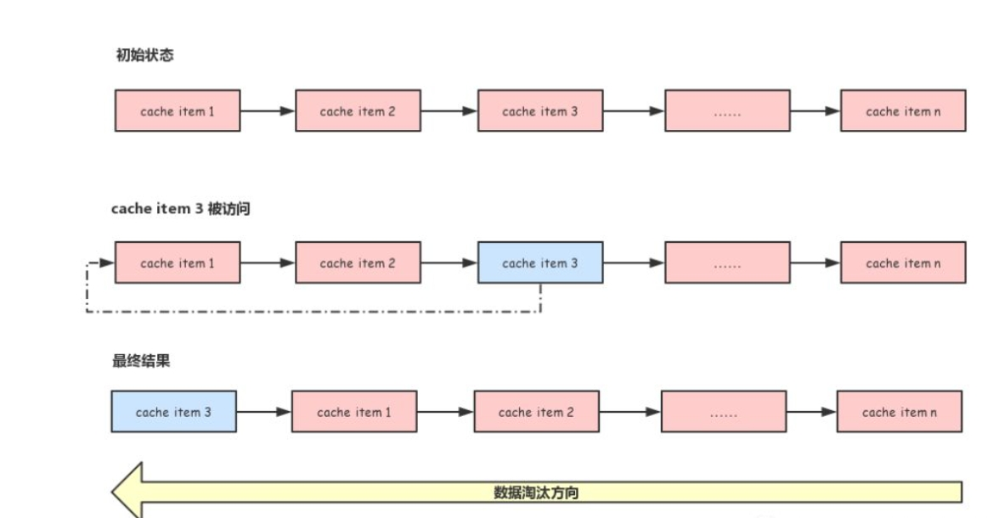
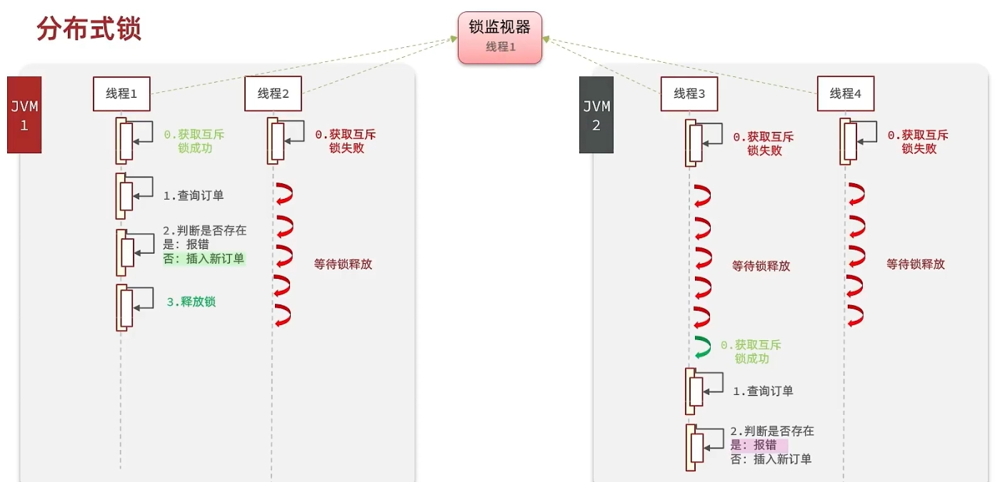
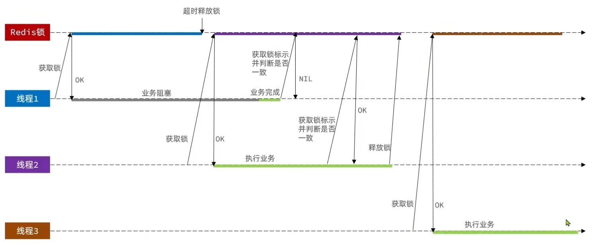
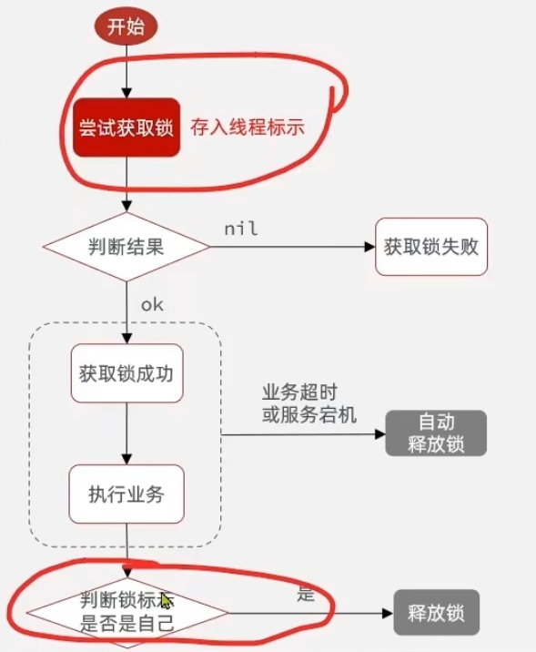

[toc]

# Redis面试题总结1

## 基础

### 什么是Redis？为什么要用redis?

Redis 是一个 Key-Value 类型的内存数据库。

> 使用redis缓存的目的：高性能，高并发

一般情况下，某个后端服务要进行查询数据请求的时候，通常是直接访问数据库。例如mysql数据库。而mysql数据库的数据都是存储在磁盘中的。

如果对磁盘进行访问的话，由于磁盘本身的限制，存取数据的速度只能达到毫秒级别，即每秒2000并发请求左右。因此当你的并发请求超过2000的时候，只使用mysql数据库的话，应用的访问速度就会变慢。

这是你可以把redis数据库放到后端服务和mysql数据库中间，让后端服务访问redis数据库，如果能再redis中找到想要的数据，就直接返回结果。如果找不到再访问mysql数据库。而redis数据库由于数据是存储再缓存上的，因此访问速度能达到微妙级别。即每秒并发8万左右。

这样就出现一个新的问题，redis数据库如何存储mysql数据库中的数据。

### Redis 与其他 key-value 存储有什么不同？

- Redis 提供更为复杂的数据结构。
- Redis 的缓存数据是运行在内存中。
- Redis 的数据还可以持久化到磁盘中。

### Redis的数据类型及其使用场景

String、List、Set、ZSet、hash

> String类型

字符串是Redis中最基本的数据类型，它能够存储任何类型的字符串，包含二进制数据。

一个字符串允许存储的最大容量为512MB。

```
常用命令
1. SET 赋值，用法： SET key value
2. GET 取值，用法： GET key
3. INCR 递增数字，仅仅对数字类型的键有用，相当于Java的i++运算，用法： INCR key
4. INCRBY 增加指定的数字，仅仅对数字类型的键有用，相当于Java的i+=3，用法： INCRBY key increment ，意思是key自增increment，increment可以为负数，表示减
少。
5. DECR 递减数字，仅仅对数字类型的键有用，相当于Java的i–，用法： DECR key
6. DECRBY 减少指定的数字，仅仅对数字类型的键有用，相当于Java的i-=3，用法： DECRBY key decrement ，意思是key自减decrement，decrement可以为正数，表示增
加。
7. INCRBYFLOAT 增加指定浮点数，仅仅对数字类型的键有用，用法： INCRBYFLOAT key increment
8. APPEND 向尾部追加值，相当于Java中的”hello”.append(“ world”)，用法： APPEND key value
9. STRLEN 获取字符串长度，用法： STRLEN key
10. MSET 同时设置多个key的值，用法： MSET key1 value1 [key2 value2 ...]
11. MGET 同时获取多个key的值，用法： MGET key1 [key2 ...]
```

> HASH 类型

是一种键值对的结构，相当于Java中的HashMap。适合存放对象数据。

```
常用命令
1. HSET 赋值，用法： HSET key field value
2. HMSET 一次赋值多个字段，用法： HMSET key field1 value1 [field2 values]
3. HGET 取值，用法： HSET key field
4. HMGET 一次取多个字段的值，用法： HMSET key field1 [field2]
5. HGETALL 一次取所有字段的值，用法： HGETALL key
6. HEXISTS 判断字段是否存在，用法： HEXISTS key field
7. HSETNX 当字段不存在时赋值，用法： HSETNX key field value
8. HINCRBY 增加数字，仅对数字类型的值有用，用法： HINCRBY key field increment
9. HDEL 删除字段，用法： HDEL key field
10. HKEYS 获取所有字段名，用法： HKEYS key
11. HVALS 获取所有字段值，用法： HVALS key
12. HLEN 获取字段数量，用法： HLEN key
```

> List 类型

用于存储有序的字符串列表。列表的底层是双向链表实现的。

列表主要用于存储有序字符串列表数据。例如文章评论列表，聊天记录等。

```
常用命令
1. LPUSH 向列表左端添加元素，用法： LPUSH key value
2. RPUSH 向列表右端添加元素，用法： RPUSH key value
3. LPOP 从列表左端弹出元素，用法： LPOP key
4. RPOP 从列表右端弹出元素，用法： RPOP key
5. LLEN 获取列表中元素个数，用法： LLEN key
6. LRANGE 获取列表中某一片段的元素，用法： LRANGE key start stop ，index从0开始，-1表示最后一个元素
7. LREM 删除列表中指定的值，用法： LREM key count value ，删除列表中前count个值为value的元素，当count>0时从左边开始数，count<0时从右边开始数，count=0
时会删除所有值为value的元素
8. LINDEX 获取指定索引的元素值，用法： LINDEX key index
9. LSET 设置指定索引的元素值，用法： LSET key index value
10. LTRIM 只保留列表指定片段，用法： LTRIM key start stop ，包含start和stop
11. LINSERT 像列表中插入元素，用法： LINSERT key BEFORE|AFTER privot value ，从左边开始寻找值为privot的第一个元素，然后根据第二个参数是BEFORE还是AFTER
决定在该元素的前面还是后面插入value
12. RPOPLPUSH 将元素从一个列表转义到另一个列表，用法： RPOPLPUSH source destination
```

> SET 类型

无序集合，集合中每个元素都是不同的。

```
常用命令
1. SADD 添加元素，用法： SADD key value1 [value2 value3 ...]
2. SREM 删除元素，用法： SREM key value2 [value2 value3 ...]
3. SMEMBERS 获得集合中所有元素，用法： SMEMBERS key
4. SISMEMBER 判断元素是否在集合中，用法： SISMEMBER key value
5. SDIFF 对集合做差集运算，用法： SDIFF key1 key2 [key3 ...] ，先计算key1和key2的差集，然后再用结果与key3做差集
6. SINTER 对集合做交集运算，用法： SINTER key1 key2 [key3 ...]
7. SUNION 对集合做并集运算，用法： SUNION key1 key2 [key3 ...]
8. SCARD 获得集合中元素的个数，用法： SCARD key
9. SDIFFSTORE 对集合做差集并将结果存储，用法： SDIFFSTORE destination key1 key2 [key3 ...]
10. SINTERSTORE 对集合做交集运算并将结果存储，用法： SINTERSTORE destination key1 key2 [key3 ...]
11. SUNIONSTORE 对集合做并集运算并将结果存储，用法： SUNIONSTORE destination key1 key2 [key3 ...]
12. SRANDMEMBER 随机获取集合中的元素，用法： SRANDMEMBER key [count] ，当count>0时，会随机中集合中获取count个不重复的元素，当count<0时，随机中集合中
获取|count|和可能重复的元素。
13. SPOP 从集合中随机弹出一个元素，用法： SPOP key
```

> ZSet 类型（Sort Set类型）

有序集合，集合中每个元素都是不同的。

有序集合是在集合的基础上为每一个元素关联一个分数，这就让有序集合可以有获取分数最高/最低的前N个元素的功能。

有序集合例的使用场景。如各个药店的每日销售额数据，形成一个排行榜。

```
常用命令
1. ZADD 添加元素，用法： ZADD key score1 value1 [score2 value2 score3 value3 ...]
2. ZSCORE 获取元素的分数，用法： ZSCORE key value
3. ZRANGE 获取排名在某个范围的元素，用法： ZRANGE key start stop [WITHSCORE] ，按照元素从小到大的顺序排序，从0开始编号，包含start和stop对应的元素，
WITHSCORE选项表示是否返回元素分数
4. ZREVRANGE 获取排名在某个范围的元素，用法： ZREVRANGE key start stop [WITHSCORE] ，和上一个命令用法一样，只是这个倒序排序的。
5. ZRANGEBYSCORE 获取指定分数范围内的元素，用法： ZRANGEBYSCORE key min max ，包含min和max， (min 表示不包含min， (max 表示不包含max， +inf 表示无穷
大
6. ZINCRBY 增加某个元素的分数，用法： ZINCRBY key increment value
7. ZCARD 获取集合中元素的个数，用法： ZCARD key
8. ZCOUNT 获取指定分数范围内的元素个数，用法： ZCOUNT key min max ，min和max的用法和5中的一样
9. ZREM 删除一个或多个元素，用法： ZREM key value1 [value2 ...]
10. ZREMRANGEBYRANK 按照排名范围删除元素，用法： ZREMRANGEBYRANK key start stop
11. ZREMRANGEBYSCORE 按照分数范围删除元素，用法： ZREMRANGEBYSCORE key min max ，min和max的用法和4中的一样
12. ZRANK 获取正序排序的元素的排名，用法： ZRANK key value
13. ZREVRANK 获取逆序排序的元素的排名，用法： ZREVRANK key value
14. ZINTERSTORE 计算有序集合的交集并存储结果，用法： ZINTERSTORE destination numbers key1 key2 [key3 key4 ...] WEIGHTS weight1 weight2 [weight3
weight4 ...] AGGREGATE SUM | MIN | MAX ，numbers表示参加运算的集合个数，weight表示权重，aggregate表示结果取值
15. ZUNIONSTORE 计算有序几个的并集并存储结果，用法和14一样，不再赘述。
```


### Redis 的持久化机制是什么？各自的优缺点？

Redis是一个支持持久化的内存数据库，通过持久化机制把内存中的数据同步到硬盘文件来保证数据持久化。当Redis重启后通过把硬盘文件重新加载到内存，就能达到恢复数据的目的。

Redis提供两种持久化机制 RDB 和 AOF 机制。 

> RDB（redis database）持久化方式,默认的持久化方式

在某个时间点把redis内存的数据以快照的形式保存到硬盘的二进制文件dump.rdb。当redis重启后，通过把dump.rdb文件重新加载到内存，就能达到恢复数据的目的。

优点：
1. 只有一个文件 dump.rdb，方便持久化。
2. 使用单独子进程来进行持久化，主进程不会进行任何 IO 操作，保证了 redis的高性能。
3. 当redis数据量不大的情况下，RDB持久化的效率比AOF高

缺点：
1. RDB持久化机制由于是间隔一段时间进行持久化。因此当redis发生故障的时候，redis可能有一部分数据没有进行持久化，因此会发生数据丢失。

> AOF（Append-only file）持久化方式

AOF持久化机制是以日志的形式，记录Redis的每次写命令。其默认存储文件为appendonly.aof。当Redis重启时，会把appendonly.aof文件中记录的所有写操作顺序执行一遍，确保数据恢复到最新。

优点：
1. 数据安全，由于指将redis每次的写命令都记录到aof日志中，因此当redis故障的时候，也能够保证数据不会丢失。
2. 通过 append 模式写aof文件，即使中途服务器宕机，可以通过aof工具解决数据一致性问题。

缺点：
1. AOF 文件比 RDB 文件大，且恢复速度慢。
2. 当redis的数据量大的时候，aof比 rdb 效率低。

> RDB+AOF 混合的持久化方式

RDB的方式会导致数据丢失，AOF的方式性能较差。因此在高并发的场景下，推荐使用RDB和AOF混合的情况下进行redis的持久化。

- 混合持久化是在 AOF 持久化的基础上，定期进行 RDB 持久化，以保证数据的快速恢复。
- 混合持久化的实现方式是在 AOF 重写时，将 RDB 文件以二进制压缩格式写入到 AOF 文件的开头，之后的数据再以 AOF 格式追加到文件的末尾。
- 混合持久化的优点是：
    - 可以减少 AOF 文件的大小，节省磁盘空间
    - 可以加快数据恢复的速度，避免执行大量的 AOF 命令
    - 可以避免数据丢失，因为 RDB 文件和 AOF 文件都有最新的数据快照。

### Redis的过期策略

> 为什么会有过期策略

redis中存储的数据都有一个过期时间。当过期时间一到，那么redis就会将该数据从数据库中删除。

由于redis是单线程，删除数据也是会占用线程的处理时间。为了保证redis的高性能，因此必须要有一个过期策略，来决定如何删除过期数据，从而保证redis的高性能。

> redis的过期策略

redis的过期策略采用的是定期删除+惰性删除

① 定期删除的机制

redis会把每个设置了过期时间的key，都会记录到过期字典中。

1. 每隔10s，redis会从过期字典中随机选择20个key。
2. 删除20个key中过期的key。
3. 如果过期key的比例超过1/4，则重复步骤1.

定时删除的机制存在一个问题，就是当大量的key同一时间都过期了。那么会导致redis不断的从过期字典选择并删除key，从而导致redis的卡顿。

解决办法就是不要给大量的key都设置同一个过期时间，过期时间要设置一个随机范围。

② 惰性删除的机制

当用户读取这个key的时候，redis会对这个key的过期时间进行检查，如果过期了，就立即删除，不会返回任何数据。

### redis的数据淘汰策略是什么？

Redis的所有数据都存储在内存中，但是内存是一种有限的资源，所以为了防止Redis无限制的使用内存，在Redis中可以通过配置项 maxmemory 来指定其最大能使用的内存容量。

例如可以通过以下配置来设置Redis最大能使用 1G 内存
```
maxmemory 1G
```

当Redis使用的内存超过配置的 maxmemory 时，便会触发数据淘汰策略。

> 如何配置数据淘汰策略？

在Redis配置文件中通过配置项 maxmemory_policy 来指定要使用的数据淘汰策略。

例如要使用 volatile-lru 策略可以通过以下配置来指定。
```
maxmemory_policy volatile-lru
```

### Redis提供了多种数据淘汰的策略

edis提供了8种数据淘汰的策略。

```
noeviction      -> 默认的数据淘汰策略.不做任何的清理工作，直接在写操作时返回错误。

volatile-lru    -> 从过期时间key中，根据LRU算法删除最久没有使用的key。
volatile-random -> 从过期时间key中，随机删除key。
volatile-lfu    -> 从过期时间key中，删除某段时间之内使用频率最少的key。

allkeys-lru     -> 从所有key中，根据LRU算法删除最久没有使用的key。
allkeys->random -> 从所有key中，随机删除key。
allkeys-lfu     -> 从所有key中，删除某段时间之内使用频率最少的key。

volatile-ttl    -> 从过期时间key中，删除过期时间最早的key。
```

### 什么是 LRU算法？

> 什么是LRU算法？

LRU是 Least Recently Used 的缩写，即最近最少使用算法。很多缓存系统都使用此算法作为淘汰策略。

最简单的实现方式就是把所有缓存通过一个链表连接起来，新创建的缓存添加到链表的头部，如果有缓存被访问了，就把缓存移动到链表的头部。由于被访问的缓存会移动到链表的头部，所以没有被访问的缓存会随着时间的推移移动的链表的尾部，淘汰数据时只需要从链表的尾部开始即可。

下图展示了这个过程： 



> redis的LRU算法是什么？

redis并不是严格采用LRU算法来进行数据淘汰策略的。而是redis使用的是一种近似LRU算法，这个算法跟LRU算法部分相似。

redis的近似LRU算法，是给每个key额外添加一个小字段，这个字段用于记录key的最近使用时间。当redis发现内存超过maxmemory的时候，会执行一次近似LRU算法。

随机采样5个key，然后淘汰最旧使用的key，如果淘汰掉key后，内存还是超出了maxmemory。则继续随机淘汰，直到内存低于maxmemory为止。


### 什么是缓存穿透

缓存穿透是指缓存和数据库中都没有的数据，导致所有的请求都落到数据库上，造成数据库短时间内承受大量请求而崩掉。

> 缓存穿透的解决方案

方案① 缓存空对象。对缓存和数据库都没有的数据。将其缓存为key-null。过期时间设置为30秒。这样第二次从缓存中获取就有值了，而不会继续访问数据库，这种办法最简单粗暴。

方案② 布隆过滤器。 

布隆过滤器：一个判断某个元素是否存在集合中的算法。

布隆过滤器的特点：将所有可能存在的数据哈希到一个足够大的 bitmap 集合中。如果某个元素一定不在集合中，那么算法则可以判断该元素不在集合中。如果某个元素在集合中，则通过算法则有很小的可能判断出不在集合中。即布隆过滤器有一个很小的误判率。

如果redis设置了布隆过滤器，通过布隆过滤器可以判断大量的恶意请求要查询的数据是否存在。如果不存在，直接回结果。从而避免了大量恶意请求直接攻击mysql数据库的情况发生。

### 什么是布隆过滤器

布隆过滤器其实就是一个足够大的 bitmap 集合。每当redis新增一个键值对，就会把键值对的key，经过多次Hash函数运算，得到一个特殊的key值，然后把这个key值保存再bitmap集合中。

当需要从redis中查询数据时，查询请求会先在布隆过滤器中查询，如果查询数据不在布隆过滤器中，那么该数据就肯定不在redis中。如果查询数据在布隆过滤器中，那么该数据大概存在redis中。

通过布隆过滤器，可以预先判断出redis中是否存储查询数据。如果有，那么就直接到redis中查询，如果没有，那么redis中也没有，也没有必要到mysql数据库中查询。从而避免了大量恶意请求直接攻击mysql数据库的情况发生。

### 布隆过滤器的实现思想

布隆过滤器的核心就是Bloom-Filter算法。

Bloom-Filter算法的核心思想就是利用多个不同的Hash函数来解决“冲突”。

Hash存在一个冲突（碰撞）的问题，用同一个Hash得到的两个URL的值有可能相同。为了减少冲突，我们可以多引入几个Hash，如果通过其中的一个Hash值我们得出某元素不在集合中，那么该元素肯定不在集合中。只有在所有的Hash函数告诉我们该元素在集合中时，才能确定该元素存在于集合中。这便是Bloom-Filter的基本思想。

Bloom-Filter一般用于在大数据量的集合中判定某元素是否存在。

### 什么是缓存击穿？

缓存击穿是指某个热点数据，在缓存中过期。这时大量的请求同时读缓存没读到数据，又同时去数据库去取数据，引起数据库压力过大。

> 缓存击穿的解决方案

1. 设置热点数据永远不过期。
2. 加互斥锁，互斥锁缓存预热。

### 什么是缓存雪崩

在一般情况下，redis是用于缓存mysql数据库中的热点数据的。用于处理用户大量的高并发查询请求的，减轻mysql数据库的压力的。

但是当redis宕机了或者redis中的数据大规模过期后，会导致redis暂时失效。从而让高并发请求直接由mysql数据库来处理。

因此redis缓存雪崩的原因有两个：redis宕机或redis中的大量数据过期。

> 解决缓存雪崩的方式

方式1：对于redis宕机，我们可以提前搭建redis主从哨兵模式。即当主redis宕机后，从redis变成主redis来提供服务。

方式2：对于redis中的大量数据过期，我们在插入key的时候，就可以将key的过期时间加上一个随机范围,例如1s-60s。我们可以通过这种方式来防止redis中大量key同时失效。从而导致缓存雪崩。

> 缓存雪崩的事前事中事后的解决方案如下。 

- 事前：redis 高可用，主从+哨兵，redis cluster，避免全盘崩溃。 
- 事中：本地 ehcache 缓存 + hystrix 限流&降级，避免 MySQL 被打死。 
- 事后：redis持久化，一旦重启，自动从磁盘上加载数据，快速恢复缓存数据。

### 什么是缓存预热？

缓存预热就是系统上线后，将相关的缓存数据直接加载到缓存系统。这样就可以避免在用户请求的时候，先查询数据库，然后再将数据缓存的问题！用户直接查询事先被预热的缓存数据。

解决思路：
1. 直接写个缓存刷新功能接口，上线时手工操作下；
2. 数据量不大，可以在项目启动的时候自动进行加载；
3. 定时刷新缓存。

### 什么是热点数据和冷数据?

热点数据分为两种。
- 修改频率不高，读取通常非常高的数据。例如商品详情，用户信息。
- 修改频率很高，读取通常非常高的数据。例如点赞数，收藏数，分享数等是非常典型的热点数据。但是又不断变化，此时就不得不将数据同步保存到Redis缓存，减少数据库压力

冷数据是指：读取非常非常少的数据。

### 什么是bigkey,它会造成什么不好的影响？

bigkey是指key对于value所占用的内存空间比较大。例如一个字符型的value可以占用512M的字符串。一个列表类型的value存储了上万的元素等。

> bigkey的危害？

由于redis是单线程的，如果reids经常读取bigkey的话，由于bigkey的value占用空间大。因此redis获取bigkey的时间就比较长，而频繁获取bigkey不光会导致redis阻塞也会导致网络阻塞。

> 解决方法

对bigkey进行拆分。


## 事务

### 什么是Redis事务？

事务就是一组按照顺序执行的命令，这组命令要么全部被执行，要么全部都不执行。

Redis事务是通过MULTI、EXEC、DISCARD和WATCH 四个命令来实现的

### MULTI，EXEC命令的作用是什么

MULTI 命令用于开启一个事务。当用户执行 MULTI 命令的时候，用户可以继续向服务器发送任意多条命令，这些命令不会立即被执行，而是被放到一个队列中，当EXEC命令被调用时，队列中的所有命令才会按照顺序执行。

MULTI命令代表了事务的开始，EXEC代表了事务的执行与结束。

### WATCH命令的作用是什么？

WATCH 命令是一个乐观锁，可以为 Redis 事务提供CAS行为。 

WATCH 可以监控Redis一个或多个键，一旦其中有一个键被修改，之后的事务就不会执行，监控一直持续到EXEC命令。

UNWATCH命令可以取消WATCH对所有key的监控。


### DISCARD命令的作用是什么？

调用DISCARD命令，可以清空事务队列，并放弃执行事务。并且客户端也会从事务状态中退出。    

### Redis事务的问题有哪些？

如果multi和exec命令之间的事务命令存在语法上的错误，那么redis会发现这种错误，并将事务进行回滚。

但是如果事务命令之中存在运行逻辑上的错误，那么redis事务不会回滚，而是继续执行剩下的命令。

### Redis事务支持隔离性吗？

Redis是单进程程序。因此 Redis的事务是总是带有隔离性的


## 主从

### 如果保证redis高可用和高并发？

可以使用redis主从架构或者哨兵架构来保证redis的高可用和高并发。

例如搭建redis的主从架构。主机负责写命令，从机负责读命令。主从之间进行数据备份。主从模式有个缺点，就是当主机挂掉之后，从机需要手动升级为主机。

或者搭建一个redis的哨兵架构。通过sentinel哨兵来监控主从redis。当主机挂掉之后，哨兵自动将从机升为主机。

### Redis的主从数据同步机制是什么？

1. 主从第一次同步，主机会先生成RDB文件，并将RDB文件发送给从机。在生成RDB文件的过程中，主机执行的写操作命令会保存到缓存中。
2. 从机接收到主机的RDB文件，从机开始执行RDB文件。当从机执行完毕之后，会通知主机将剩余的写操作命令，发送给从机。让从机执行写操作命令。
3. 之后主从机，便会互相通信，主机不断发送写操作命令给从机。从机不断接收写操作命令，并执行。

注意：主机的写操作命令并不是实时发送的，而是缓存中的写操作命令积累到一定大小之后，并开始向从机发送。

## 集群

### Redis 集群如何选择数据库？

Redis 集群目前无法选择数据库，集群中的每个redis节点默认使用 0 号数据库。

### Redis集群模式的工作流程是什么？

Redis 集群是采用hash槽的概念，通过将hash槽均匀的分配到每个节点上，每个节点都会记录哪些槽是自己的，哪些槽是其他节点的。

Redis集群最多有 16384 个哈希槽，集群的每个主节点会负责一部分哈希槽位。

工作流程：
1. redis集群会先对新增key，进行hash/16384运算。判断这个key是属于那个哈希槽位的。
2. redis集群会把新增的key-value,发送到槽位对应的redis节点。
3. 对应的redis节点，会接收新增的key-value。并保存到该节点中。


### redis集群的数据分配机制

Redis 集群是采用hash槽的概念，通过将hash槽均匀分配到每个节点上，每个节点都会记录哪些槽是自己的，哪些槽是其他节点的。

当Redis查询或修改一个数据的时候，首先会查找这个数据对应的槽位是多少，然后查找槽位对应的节点，最后才操作这个数据。

通过Hash槽的机制来把数据均匀的分配到集群中的每一个节点上，从而做到了每一个节点的负载均衡，充分发挥了集群的威力。

## 高级

### 如何保证缓存与数据库的数据一致性？

> 通过 Cache Aside 模式来保证缓存与数据库的数据一致性。 

- 读的时候，先读缓存，缓存没有的话，就读数据库，然后取出数据后放入缓存，同时返回响应。 
- 更新的时候，先更新数据库，然后再删除缓存。

### Redis 为什么是单线程的？

因为Redis是基于内存的操作，CPU不是Redis的瓶颈，Redis的瓶颈最有可能是机器内存的大小或者网络带宽。既然单线程容易实现，而且CPU不会成为瓶颈，那就顺理成章地采用单线程的方案了（毕竟采用多线程会有很多麻烦！）Redis利用队列技术将并发访问变为串行访问

### 单线程的redis为什么这么快?

1. 纯内存操作
2. 单线程模式，避免了频繁的线程状态切换，从而造成的CPU资源的浪费。
3. 采用了非阻塞I/O多路复用机制


### Redis 常见性能问题和解决方案(即Redis的优化方案)

1. 主机最好不要做任何持久化工作，包括RDB快照和AOF日志文件。当进行持久化的时候会对读写操作产生影响。
2. 从机最好开启AOF持久化。策略为每秒同步一次。
3. 为了主从复制的速度和连接的稳定性，Master 和 Slave 最好在同一个局域网
4. 主从结构不要用图状结构，用单向链表结构更为稳定。

### 什么是Cache aside 缓存更新机制？

Cache aside 缓存更新机制是用于保存数据库和缓存的数据一致性的机制。

Cache aside 缓存更新机制：
1. 当应用读取数据的时候，先从缓存中读取数据，若没有得到，则从数据库中读取数据，成功后，存放到缓存中。
2. 当应用对数据进行更新的时候，先在数据库中对数据进行更新。更新成功后，将缓存中的对应数据进行删除。

> Cache aside 缓存更新机制的问题

当读取操作A比更新操作B先开始，若读取操作A比更新操作B完结束的时候。由于读取操作会将旧数据存储到缓存中，而数据库中存储的是新数据。这种情况下会缓存和数据库的数据会产生不一致。

但是由于读操作正常情况下，比写操作快。因此一般情况下，这个问题发生的概率很低。 

> 如何解决上述问题？

通过延迟双删。即当写操作更新了数据库，并且删除了缓存之后，等待2-3s,再次删除缓存。这样就会保证旧数据不会出现在缓存中。

### 什么是Read/Write Through机制？

尽管Cache aside 缓存更新机制和延迟双删的方法能够保证缓存和数据库的一致性。但是仍然有出现问题的可能。

Read/Write Through机制如下
- 读取操作和缓存交互，直接读取缓存结果。
- 写入操作也和缓存交互，直接将写入结果存储到缓存中。
- 最后缓存本身与数据库进行数据同步。

简而言之，在Read/Write Through机制中当缓存启动的时候，自身将从数据库中读取数据，并存入到缓存中。然后应用的读取写入操作都与缓存交互，缓存自身再与数据库进行数据同步。

Read/Write Through机制：应用读写数据操作-》缓存-》数据库

### 为什么senx是redis实现分布式锁的方式？

由于微服务中一个应用服务，可以存在多个节点。例如每个用户服务节点都有注册功能。注册功能会涉及到对redis数据库的读写操作。当多个线程同时执行多个用户服务节点的注册功能的时候，那么就会涉及到redis的多进程下的多线程读写操作。此时redis就需要分布式锁，来保证多线程读写操作的线程安全性。

简而言之：当多个客户端同时对同一个redis服务端执行写操作命令时，为了保证redis服务端上的数据安全，需要采用分布式锁的方式，来保证redis的线程安全性。

setnx 是 SET if Not EXists(如果不存在则SET)的缩写。

setnx命令语法如下：

```bash
SETNX key value
## 如果redis中key没有存在，则插入key成功。并返回1
## 如果redis中key已经存在，则插入key失败。并返回0
```

当多个进程中的多个线程同时执行setnx命令的时候，由于setnx的特性，那么只有一个线程能插入key成功，表示该线程拿到了锁,其他线程没有拿到锁。redis是利用setnx的特性来实现分布式锁机制。

例如，3个线程A，B，C同时`setnx key1 value1`。由于setnx的特性，那么只有一个线程能够执行成功。其他线程执行失败并进入到阻塞等待状态。

当线程A执行`setnx key1 value1`成功后，线程A继续执行自己的业务逻辑。当线程A的业务逻辑执行完后，将`key1 value1`键值对删除。

> 为什么将`key1 value1`键值对删除呢？

这样做的目的是，如果不删除`key1 value1`键值对，那么其他线程BC则无法执行`setnx key1 value1`。也就是说线程BC无法拿到锁，从而线程BC无法执行自己的业务逻辑。

而线程A删除`key1 value1`键值对。相当于线程A释放了锁。

> SETNX 实现分布式锁的总结

1. 当多个进程下的多线程同时执行`setnx key value`命令后，只有一个线程能执行成功，相当于拿到了锁。
2. 然后拿到锁的线程，执行自己的业务逻辑。
3. 当业务逻辑执行完后，线程将key删除。表示线程放弃了锁。从而让其他线程继续执行`setnx key value`命令，即其他线程继续争抢锁。




### setnx实现分布式锁的缺点？

#### 缺点1 ：线程中断怎么办？

由于setnx本质上就是插入键值对。

如果线程A `setnx key1 value1`成功后，然后执行自己业务逻辑的时候。线程A中断了。导致线程A没有把`key1`删除。从而导致其他线程无法`setnx key1 value1`，也就是说其他线程都拿不到锁了，从而无法执行自己的业务逻辑了。

因此当线程A`setnx key1 value1`的时候。必须给键值对加上过期时间。

过期时间可以确保线程中断的时候，线程没有删除键值对。也可以通过过期时间来让键值对失效。从而让其他线程可以执行`setnx key1 value1`。

#### 缺点2：线程执行时间超出键值对的过期时间怎么办？

当线程A的执行时间超过了键值对的过期时间之后。那么会导致线程A还在执行业务逻辑的时候，键值对已经失效了。此时线程B`setnx key1 value1`了，即线程B获取了锁，然后线程B执行业务逻辑。

当线程A执行完业务逻辑后，把线程B设置的键值对`key1`删除了。这种情况就算线程A删除了线程B的锁。

解决方式：每个线程在删除键值对（释放锁）的时候，先检查一些这个锁是不是自己设置的。如果是自己设置的锁，那么就删除。不是自己设置的锁，就不进行删除即可。



> 如何判断键值对（锁）是不是线程自己设置的？

线程在`setnx key1 value1`的时候，key1是业务功能，value1是线程自己的ID。

当线程删除键值对的时候，判断`value1`是不是线程自己的ID即可。




### setnx实现分布式锁的代码实例

加锁代码
```java
private static final String ID_PREFIX = UUID.randomUUID().toString(true) + "-";
public boolean tryLock(long timeoutSec) {
   // 生成线程的唯一标示
   String threadId = ID_PREFIX + Thread.currentThread().getId();
   // 通过setnx获取锁
   Boolean success = stringRedisTemplate.opsForValue()
                .setIfAbsent(KEY_PREFIX + name, threadId, timeoutSec, TimeUnit.SECONDS);
   return Boolean.TRUE.equals(success);
}
```

释放锁代码：
```java
public void unlock() {
    // 获取线程标示
    String threadId = ID_PREFIX + Thread.currentThread().getId();
    // 获取当前锁中的标示
    String id = stringRedisTemplate.opsForValue().get(KEY_PREFIX + name);
    // 判断标示是否一致
    if(threadId.equals(id)) {
        // 一致就释放锁，即删除键值对
        // 不一致，不操作
        stringRedisTemplate.delete(KEY_PREFIX + name);
    }
}

```

业务代码
```java
public Result seckillVoucher(Long voucherId) {
    //执行业务逻辑前的操作

    //调用获取锁的方法
    boolean isLock = tryLock(1200);
    //获取锁失败
    if (!isLock) {
        return Result.fail("获取锁失败");
    }
    //获取锁成功
    try {
        //执行具体的业务逻辑
    } finally {
        //释放锁
        unlock();
    }
}
```