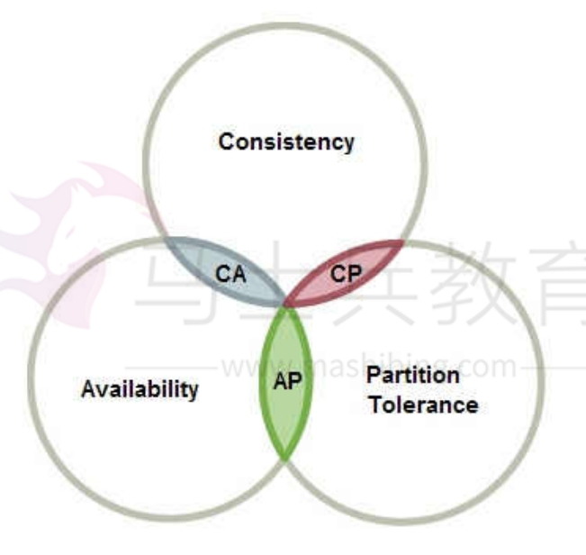
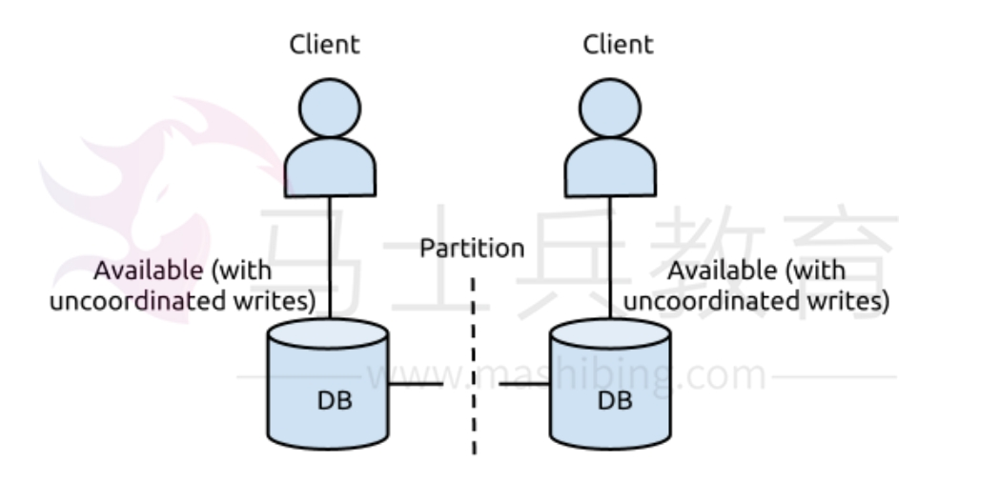
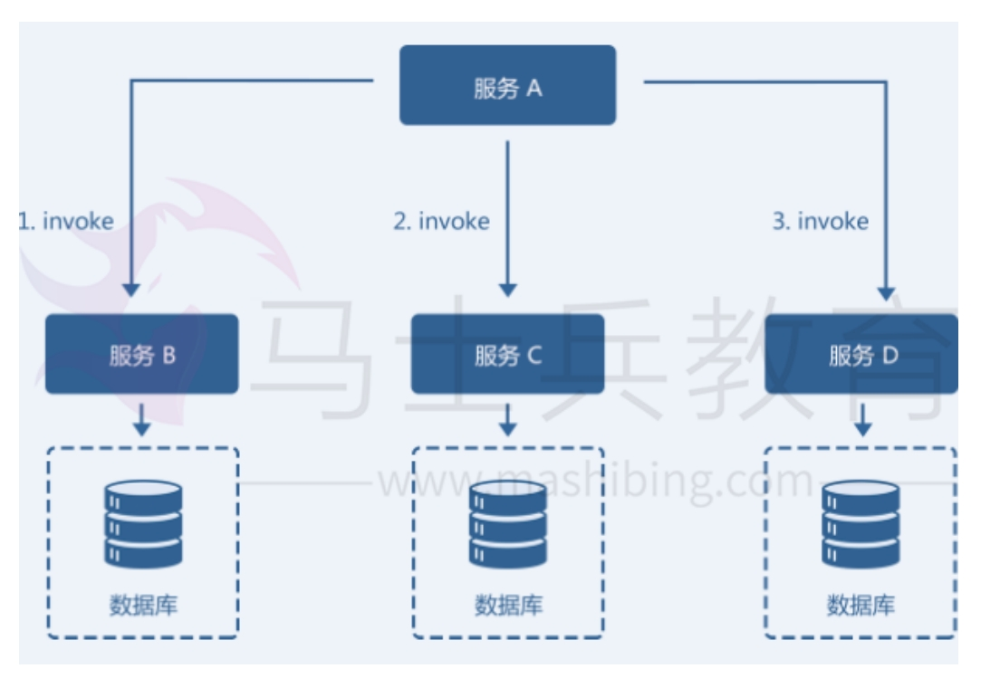

[toc]

# SpringCloud面试题总结

## CAP原则

CAP原则又称CAP理论，指的是在一个分布式系统中， Consistency（一致性）、 Availability（可用性）、Partition tolerance（分区容错性），三者不可兼得。

> 分布式系统中的三个特性如下：
- 一致性（C）：分散在分布式系统中的同一份数据，在同一时刻是否是同样的值。
- 高可用性（A）：集群中一部分节点故障后，集群整体是否还能响应客户端的读写请求。
- 分区容错性（P）：分区相当于对通信的时限要求。系统如果不能在时限内达成数据一致性，就意味着发生了数据分区的情况。特指对网络分区的容错性。

## CAP原则例子

假设一个DB服务搭建在两个机房（北京,广州）。两个DB服务同时提供写入和读取功能。

> 1.假设DB的更新操作是同时写北京和广州的DB都成功才返回成功

在没有出现网络故障的时候，满足CA原则，C 即任何一个写入，更新操作成功并返回客户端完
成后,分布式的所有节点在同一时间的数据完全一致， A 即读写操作都能够成功，但是当出现
网络故障时，不能同时保证CA，即P条件无法满足

> 2.假设DB的更新操作是只写本地机房成功就返回，通过binlog方式同步至其他机房

这种操作保证了在出现网络故障时,双边机房都是可以提供服务的，且读写操作都能成功，意味着它满足了AP ，但是它不满足C，因为更新操作返回成功后，双边机房的DB看到的数据会存在短暂不
一致，且在网络故障时，不一致的时间差会很大（仅能保证最终一致性）。

> 3.假设DB的更新操作是同时写北京和广州的DB都成功才返回成功且网络故障时提供降级服务

降级服务，如停止写入，只提供读取功能，这样能保证数据是一致的，且网络故障时能提供服务，
满足CP原则，但是他无法满足A可用性原则。

## CAP原则的三种取舍策略

CAP三个特性不能同时满足，只能满足其中两个。那么取舍的策略就共有三种。

- CA：如果不要求P（不允许分区），则C（强一致性）和A（可用性）是可以保证的。但放弃P的同时也就意味着放弃了系统的扩展性，也就是分布式节点受限，没办法部署子节点，这是违背分布式系统设计的初衷的。传统的关系型数据库Oracle、MySQL就是CA。

- CP：如果不要求A（可用性），相当于每个请求都需要在服务器之间保持强一致，而P（分
区）会导致同步时间无限延长(也就是等待数据同步完才能正常访问服务)，一旦发生网络故障或者消息丢失等情况，就要牺牲用户的体验，等待所有数据全部一致了之后再让用户访问系统。设计成CP的系统其实不少，最典型的就是分布式数据库，如Redis、HBase等。

- AP：如果不要求C（一致性），一旦分区发生，节点之间可能会失去联系，为了高可用，每个节点只能用本地数据提供服务，而这样会导致全局数据的不一致性。

CAP原则的三种取舍策略，一般根据业务场景来做出选择。

- 对于大多数互联网应用来说，因为机器数量庞大，部署节点分散，网络故障是常态，可用性是必须需要保证的，所以只有舍弃一致性来保证服务的AP。通常吹嘘5个9或6个9服务基本都是放弃C选择AP。

- 对于银行需要确保强一致性的场景。通常会权衡CA和CP模型，CA模型网络故障时完全不可用，CP模型具备部分可用性，实际的选择需要通过业务场景来权衡。

## BASE理论

BASE理论是 Basically Available（基本可用）、Soft state（软状态）和Eventually consistent（最终一致性）三个短语的简写。

BASE理论是对CAP原则中一致性和可用性权衡的结果，是基于CAP定理逐步演化而来的，其核心思想是即使无法做到强一致性（Strong consistency），但每个应用都可以根据自身的业务特点，采用适当的方式来使系统达到最终一致性（Eventual consistency）。

> BASE理论三个特性

- 基本可用(BA): 是指分布式系统在出现故障的时候，允许损失部分可用性来保证核心可用。例如部分业务功能上的损失。
- 软状态(S): 是指允许分布式系统在不同节点的数据副本之间进行数据同步的过程存在延时。
- 最终一致性(E): 是分布式系统中所有的数据副本，在经过一段时间的同步后，最终能够达到一个一致的状态。最终一致性的本质是需要数据最终能够达到一致，而不需要保证数据实时的强一致性。

## 分布式事务解决方案有哪些？

关于分布式事务的解决方案。典型方案包括：
1. 两阶段提交（2PC, Two-phase Commit）方案
2. eBay 事件队列方案
3. TCC 补偿模式
4. 缓存数据最终一致性

### 2PC方案：强一致性

2PC的核心原理是通过将事务进行分阶段提交和记日志的方式来实现分布式事务的。

记录下事务提交所处的阶段状态，在组件宕机重启后，可通过日志恢复事务提交的阶段状态，并在这个状态节点重试

### eBay 事件队列方案: 最终一致性

它的核心思想是将需要分布式处理的任务通过消息或者日志的方式来异步执行，消息或日志可以存到本地文件、数据库或消息队列。

如果系统发生故障，那么可以通过业务规则进行失败重试，它要求各服务的接口是幂等的。

### TCC （Try-Confirm-Cancel）补偿模式: 最终一致性

如图所示由服务 A、服务B、服务C、服务D 共同组成的一个微服务架构系统。服务A 需要依次
调用服务B、服务C 和服务D 共同完成一个操作。当服务A 调用服务D 失败时，若要保证整个系统数据的一致性，就要对服务B 和服务C 的invoke 操作进行回滚，执行反向的revert 操作。回滚成功后，整个微服务系统是数据一致的。

TCC方案的实现关键：
1. 服务调用链必须被记录下来。
2. 每个服务提供者都需要提供一组业务逻辑相反的操作，互为补偿，同时回滚操作要保证幂等。
3. 必须按失败原因执行不同的回滚策略。

### 缓存数据: 最终一致性

如何解决缓存和数据库数据不一致的问题。有以下两种解决方案：
1. 为缓存数据设置过期时间。当缓存中数据过期后，业务系统会从数据库中获取数据，并将新值放入缓存。这个过期时间就是系统可以达到最终一致的容忍时间。
2. 更新数据库数据后同时清除缓存数据。数据库数据更新后，同步删除缓存中数据，使得下次直接从数据库中获取，并同步到缓存。

## 分布式锁的实现方式

分布式锁是控制分布式系统之间同步访问共享资源的一种方式。

> 分布式锁的使用场景如下：

不同服务之间共享了一个或一组资源，那么当多个服务并发访问同一个共享资源的时候，需要通过一定的互斥手段来防止彼此的干扰，以保证数据一致性。

### Redis实现分布式锁

> 方式1：通过SETNX实现分布式锁。

SETNX：当指定键不存在时，向Redis中添加一个键值对。多个Redis客户端并发访问该键值对的时候。SETNX能保证只有一个客户端能够成功访问该键值对。

利用SETNX的原子特性，和Redis的键过期特性，实现了自动过期释放的分布式锁。

## 什么是 Spring Cloud？

Spring cloud 是基于 Spring Boot 的分布式微服务解决方案。

Spring cloud 可以将基于Spring Boot开发的单体微服务整合并管理起来,是一系列框架的集合。

Spring cloud 提供如注册中心、配置中心、API网关、流量监控、断路器、链路追踪等功能。

## SpringBoot和SpringCloud的区别？

SpringBoot专注于开发单个微服务。

SpringCloud是分布式微服务系统解决方案。它将SpringBoot开发的单体微服务整合起来，提供如注册中心、配置中心、API网关、流量监控、断路器、链路追踪等功能。

## 什么是SpringCloudConfig?

在分布式系统中，由于服务数量巨多，为了方便服务配置文件统一管理，实时更新，所以需要分布式配置中心组件。在Spring Cloud中，有分布式配置中心组件spring cloud config ，它支持配置服务放在配置服务的内存中（即本地），也支持放在远程Git仓库中。

在spring cloud config 组件中，分两个角色，一是config server，二是config client。使用：（1）添加pom依赖（2）配置文件添加相关配置（3）启动类添加注解@EnableConfigServer

