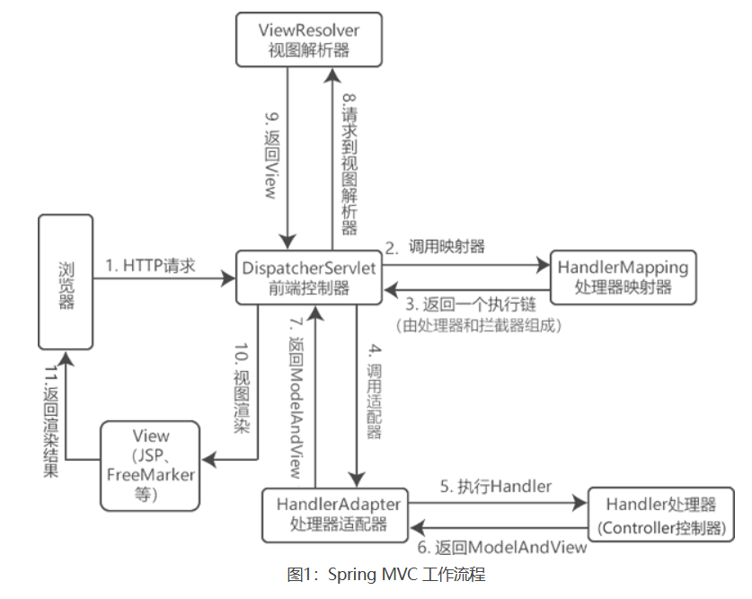

[toc]

# SpringMVC面试题总结

## 什么是 Spring MVC？

Spring MVC是一个实现了MVC设计模式的轻量级 Web框架。Spring MVC 通过把模型-视图-控制器分离，从而达到简化开发web应用程序的目的。

## MVC是什么？

mvc是一种设计模式。模型（model）-视图（view）-控制器（controller）三层架构的 设计模式。

MVC模式用于实现前端页面的展现与后端业务数据处理的分离。

> mvc设计模式的好处

1. 实现了业务系统各个组件之间的解耦，有利于业务系统的可扩展性，可维护性。
2. 有利于系统的并行开发，提升开发效率。

## Spring MVC的主要组件？

- 前端控制器 DispatcherServlet （不需要程序员开发）：用来接收请求并转发。
- 处理器映射器HandlerMapping （不需要程序员开发）：根据请求的URL来查找匹配的Handler处理器。
- 处理器适配器HandlerAdapter：处理器Handler的时候要按照HandlerAdapter要求的规则去编写。这样HandlerAdapter才能执行处理器Handler。
- 处理器Handler （需要程序员开发）: 对请求如何业务处理的部分。
- 视图解析器 ViewResolver （不需要程序员开发）：进行视图的解析，并渲染为视图。
- 视图View （需要程序员开发jsp）：通常指一个jsp或freemarker页面。

## SpringMVC 工作流程？



```
（1）客户端（浏览器）发送请求到 DispatcherServlet前端控制器。
（2）DispatcherServlet 根据请求信息调用 HandlerMapping，解析请求对应的 Handler。
（3）解析到对应的 Handler（也就是我们平常说的 Controller 控制器）后，开始由 HandlerAdapter 适配器处理。
（4）HandlerAdapter 会根据 Handler 来调用真正的处理器开处理请求，并处理相应的业务逻辑。
（5）处理器处理完业务后，会返回一个 ModelAndView 对象，Model 是返回的数据对象，View 是个逻辑上的 View。
（6）ViewResolver 会根据逻辑 View 查找实际的 View。
（7）DispaterServlet 把返回的 Model 传给 View（视图渲染）。
（8）把 View 返回给请求者（浏览器）
```


简化：
1. 客户端向服务端发出请求。
2. 请求被DispatcherServlet前端控制器接收。
3. 前端控制器根据请求路径匹配对应的请求处理器。
4. 请求处理器来处理请求，并返回ModelAndView模型视图对象。
5. 前端控制器将模型视图对象交给视图解析器ViewResolver解析。并返回一个渲染后的视图。
6. 前端控制器将视图响应给客户端。

## Spring MVC常用的注解有哪些？

- @RequestMapping：用于将请求url与类或方法进行绑定。
- @RequestBody：获取http请求中body区域的数据，并赋值给注解标记的参数上。
- @ResponseBody：将方法返回值转换为json对象。并塞入响应的body数据区域中。
- @PathVariable注解 ：用于将请求路径中的变量参数，绑定到方法的参数上。
- @RequestParam注解 : 用于将请求中的请求数据，绑定到方法的参数上。

## @Controller注解的作用

在Spring MVC中，控制器Controller主要负责处理由DispatcherServlet转发的请求。

而@Controller注解用于标记在一个类上，让被标记的类成为一个Spring MVC的 Controller 控制器对象。

## SpringMVC 拦截器怎么实现？

1. 创建一个自定义拦截器类，自定义拦截器类需要实现HandlerInterceptor接口，重写HandlerInterceptor接口中的三个方法。
2. 将自定义拦截器注入到配置类中。

## SpringMVC怎么样设定重定向和转发的？

* 转发：在return返回值前面加"forward:"。例如 return `forward:user.jsp`
* 重定向：在return返回值前面加"redirect:"。例如 `redirect:http://www.baidu.com`

## 如何在方法里面得到Request,或者Session？

直接在方法的形参中声明HttpRequest request参数。Spring MVC就自动把request对象赋值到参数上。
