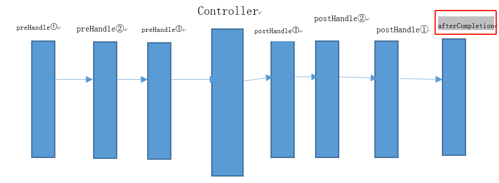

[toc]

## Spring面试题

### 1.什么是 Spring Framework？
Spring 是一个开源应用框架，旨在降低应用程序开发的复杂度。框架由20 个模块组成，它允许用户可以根据应用程序的要求来使用不同的模块搭配。它可以集成其他框架，如 Structs、Hibernate、EJB 等。

具有那些功能：
1. IOC - 控制反转/依赖注入
2. AOP - 面向切面编程可以将应用业务逻辑和系统服务分离。
3. 容器 - Spring 负责创建和管理对象（Bean）的生命周期和配置
4. MVC - 对 web 应用提供了高度可配置性，其他框架的集成也十分方便
5. 事务管理 - 提供了用于事务管理的通用抽象层。


### 2.Spring Framework 中有多少个模块，它们分别是什么？
Spring 核心容器 – 该层基本上是 Spring Framework 的核心。它包含以下模块： Spring Core,Spring Bean,Spring Context.

数据访问/集成 – 该层提供与数据库交互的支持。它包含以下模块：JDBC,ORM,Transaction

Web – 该层提供了创建 Web 应用程序的支持，它包含以下模块：WEB,WEB-servlet,web-socket

支持面向切面编程的模块：AOP

### 3.什么是Spring IOC容器？spring 中有多少种 IOC 容器？
IOC容器负责创建对象，管理对象（通过依赖注入（DI），装配对象，配置对象，并且管理这些对象的整个生命周期。


* BeanFactory容器 - BeanFactory 就像一个包含 bean 集合的工厂类。它会在客户端要求时实例化 bean。
* ApplicationContext容器  - ApplicationContext 接口扩展了 BeanFactory 接口。它在 BeanFactory 基础上提供了一些额外的功能

BeanFactory | ApplicationConte 
------------- |  ------------- |  ------------- 
它使用懒加载 | 它使用即时加载 
它使用语法显式提供资源对象 | 它自己创建和管理资源对象
不支持国际化 | 支持国际化
不支持基于依赖的注解 | 支持基于依赖的注解

**ApplicationConte最大的区别就是支持注解**

### 3.ApplicationContext的实现方式？

ApplicationContext 容器包括 BeanFactory 容器的所有功能，通常不使用BeanFactory容器

ApplicationContext的实现方式：

```java
//1. ClassPathXmlApplicationContext：根据classpath中的xml配置文件来读取配置，并生成上下文对象
ApplicationContext context = new ClassPathXmlApplicationContext("applicationContext.xml");

//2. FileSystemXmlApplicationContext 从文件系统中读取xml配置文件，来生成上下文对象。
ApplicationContext context = new FileSystemXmlApplicationContext("applicationContext.xml");

//3. WebXmlApplicationContext 会从web 应用程序的范围内加载在xml配置文件
```
applicationContext.xml
```xml
<?xml version="1.0" encoding="UTF-8"?>
<beans xmlns="http://www.springframework.org/schema/beans"
    xmlns:xsi="http://www.w3.org/2001/XMLSchema-instance"
    xsi:schemaLocation="http://www.springframework.org/schema/beans
    http://www.springframework.org/schema/beans/spring-beans-3.0.xsd">

   <bean id="helloWorld" class="com.xxx.HelloWorld">
       <property name="message" value="Hello World!"/>
   </bean>
</beans>
```


### 4.什么是依赖注入（IOC）？列举一些IOC的好处？
在依赖注入中，您不必创建对象，但必须描述如何创建它们。您不是直接在代码中将组件和服务连接在一起，而是描述配置文件中哪些组件
需要哪些服务。由 IoC容器将它们装配在一起。

IoC 的一些好处是：它将最小化应用程序中的代码量。它以最小的影响和最少的侵入机制促进松耦合。它将使您的应用程序易于测试，因为它不需要单元测试用例中的任何单例或 JNDI 查找机制。

### 5.spring 提供了哪些配置方式？
1. 基于 xml 配置
bean 所需的依赖项和服务在 XML 格式的配置文件中指定。这些xml配置文件通常包含许多bean定义和配置选项。它们通常以bean标签开头。
例如：
```xml
<bean id="studentbean" class="org.edureka.firstSpring.StudentBean"> 
    <property name="name" value="Edureka"></property>
</bean>
```

2. 基于注解配置
可以通过在相关的类，方法或字段声明上使用注解，将 bean 配置为组件类本身，而不是使用 XML 来描述 bean 装配。**默认情况下Spring 容器中未打开注解装配。因此需要在使用它之前在 Spring 配置文件中启用它。**
例如：开启注解配置
```xml
<beans>
    <context:annotation-config/>
</beans>
```

### 6.Spring bean的作用域有什么区别？
Spring的 bean有5种作用域分别是：singleton、prototype、request、session和globalSession

* singleton 每个 Spring IoC 容器仅有一个单实例
* prototype 每次请求调用产生一个新的实例。
* request 每一次 HTTP 请求都会产生一个新的实例，并且该 bean 仅在当前 HTTP 请求内有效。
* session 每一次 HTTP 请求都会产生一个新的 bean，同时该 bean 仅在当前HTTP session 内有效。
* globalSession 作用和session类似，只是使用portlet的时候使用。 

### 7.spring容器中bean的生命周期是什么样的？
生命周期流程如下
1. Spring 容器从 XML 文件中读取 bean 的定义，并实例化 bean。
2. Spring 根据 bean 的定义填充所有的属性。也就是ioc注入
    1. 如果 bean 实现了 BeanNameAware 接口，Spring 传递 bean 的 ID 到它实现的setBeanName(String beanId)方法。
    2. 如果 Bean 实现了 BeanFactoryAware 接口， Spring 传递beanfactory 给它实现的setBeanFactory()。
    3. 如果 bean 实现 IntializingBean 了，调用它的 afterPropertySet 方法，如果 bean 声明了初始化方法，调用此初始化方法。
4. 当Bean不再需要时，会经过清理阶段，如果Bean实现了DisposableBean接口，当容器关闭时会调用其实现的destroy方法
5. 最后，如果这个Bean的Spring配置中配置了destroy-method属性，会自动调用其配置的销毁方法

<font color="red">注意：以上1,2工作完成以后就可以用这个Bean了，那这个Bean是一个Singleton作用域的</font>


### 8.Spring的自动装配有哪些方式？

* no - 这是默认设置，表示没有自动装配。应使用显式 bean 引用进行装配。
* byName - 它根据 bean 的名称注入对象依赖项。它匹配并装配其属性与 XML文件中由相同名称定义的 bean。
* byType - 它根据类型注入对象依赖项。如果属性的类型与 XML 文件中的一个 bean 名称匹配，则匹配并装配属性。
* 构造函数constructor - 它通过调用类的构造函数来注入依赖项。根据构造器的参数与类型来从容器中找寻匹配的bean加载。
* autodetect - 首先容器尝试通过构造函数使用 autowire 装配，如果不能，则尝试通过 byType 自动装配 

<font color="red">@Autowried注解使用的是byType的自动装配</font>


### 9.@Component, @Controller, @Repository @Service 有何区别？

1. @Component ：这将 java 类标记为 bean。它是任何 Spring 管理组件的通用构造型。spring 的组件扫描机制现在可以将其拾取并将其拉入应用程序环境中。
2. @Controller ：这将一个类标记为 Spring Web MVC 控制器。标有它的Bean 会自动导入到 IoC 容器中。
3. @Service ：此注解是组件注解的特化。它不会对 @Component 注解提供任何其他行为。您可以在服务层类中使用@Service 而不是@Component，因为它以更好的方式指定了意图。
5. @Repository ：这个注解是具有类似用途和功能的 @Component 注解的特化。它为 DAO 提供了额外的好处。它将 DAO 导入 IoC 容器，并使未经检查的异常有资格转换为 Spring DataAccessException。 

### 10.@Required 注解有什么用？@Autowired 注解有什么用？@Qualifier 注解有什么用？

@Required应用于bean中某个属性的setter方法。被此注解修饰的属性，必须在spring的xml配置文件中设置。如果该bean尚未填充受影响的属性，则容器将抛出 eanInitializationException。

```java
public class A {
    private String code;
    private String message;
    public String getCode() {
        return code;
    }
    @Required
    public void setCode(String code) {
        this.code = code;
    }
    public String getMessage() {
        return message;
    }
    @Required
    public void setMessage(String message) {
        this.message = message;
    }
}
```

```xml
<bean id="resultMessage" class="com.aaa.A">
    <property name="code" value="001" /><!--此处只设置了code属性，无message属性-->
</bean>
```

<font color="red">因为@Required修饰了类A的code和message属性，则必须在Spring的配置文件中配置类A的这两个属性的配置。上面代码没有把message属性配置。所以运行容器将抛出 eanInitializationException</font>

---

@Autowired 可以更准确地控制应该在何处以及如何进行自动装配。**此注解用于在 setter 方法，构造函数，具有任意名称或多个参数的属性或方法上自动装配bean。**

```java
public class Employee {
    private String name;

    @Autowired
    public void setName(String name) {
        this.name=name;
    }
    public string getName(){
        return name;
    }
}
```

---

当您创建多个相同类型的 bean 并希望仅使用属性装配其中一个 bean 时，您可以使用@Qualifier 注解和 @Autowired 通过指定应该装配哪
个确切的 bean ,用来消除歧义。

<font color="red">一个接口有多个实现类，@Qualifier指明@Autowired具体注入哪个实现类</font>

例如，这里我们分别有两个类，Employee 和 EmpAccount。在 EmpAccount中，使用@Qualifier 指定了必须装配 id 为 emp1 的 bean。
```java
public class Employee {
    private String name;
    @Autowired
    public void setName(String name) {
        this.name=name;
    }
    public string getName() {
        return name;
    }
}


public class EmpAccount {
    private Employee emp;
    
    @Autowired
    @Qualifier(emp1)
    public void showName() {
        System.out.println(“Employee name : ”+emp.getName);
    }
}

```

### 11.@RequestMapping 注解有什么用？
@RequestMapping 注解用于将特定 HTTP 请求方法映射到将处理相应请求的控制器中的特定类/方法。此注释可应用于两个级别：类级别：映射请求的 URL 方法级别：映射 URL 以及 HTTP 请求方法.

### 12. 什么是 AOP？
AOP(Aspect-Oriented Programming), 即 面向切面编程, 它与OOP( Object-Oriented Programming, 面向对象编程) 相辅相成, 提供了与
OOP 不同的抽象软件结构的视角. 在 OOP 中, 我们以类(class)作为我们的基本单元,而 AOP 中的基本单元是 Aspect切面。

### 13.什么是 Aspect切面？

**使用 @Aspect 注解的类就是Aspect切面。**

### 14.SpringMVC是什么?SpringMVC框架有什么用？
SpringMVC是spring在原有基础上，又提供了web应用的MVC模块，可以简单的把springMVC理解为是spring的一个模块（类似AOP，IOC这样的模块），网络上经常会说springMVC和spring无缝集成，其实springMVC就是spring的一个子模块，所以根本不需要同spring进行整合。

SpringMVC 框架提供模型-视图-控制器架构和随时可用的组件，用于开发灵活且松散耦合的 Web 应用程序。MVC 模式有助于分离应用程序的不同方面，如输入逻辑，业务逻辑和 UI 逻辑，同时在所有这些元素之间提供松散耦合。

### 15.描述一下 DispatcherServlet 的工作流程？

（1）客户端（浏览器）发送请求到 DispatcherServlet前端控制器。

（2）DispatcherServlet 根据请求信息调用 HandlerMapping，解析请求对应的 Handler。

（3）解析到对应的 Handler（也就是我们平常说的 Controller 控制器）后，开始由 HandlerAdapter 适配器处理。

（4）HandlerAdapter 会根据 Handler 来调用真正的处理器开处理请求，并处理相应的业务逻辑。

（5）处理器处理完业务后，会返回一个 ModelAndView 对象，Model 是返回的数据对象，View 是个逻辑上的 View。

（6）ViewResolver 会根据逻辑 View 查找实际的 View。

（7）DispaterServlet 把返回的 Model 传给 View（视图渲染）。

（8）把 View 返回给请求者（浏览器）

### 16.Spring的IOC和AOP机制介绍？

使用Spring框架的过程中，其实就是为了使用IOC（依赖注入），和AOP（面向切面编程）。

IOC:控制反转也叫依赖注入。利用了工厂模式。
* 将对象交给容器管理，你只需要在spring配置文件总配置相应的bean，以及设置相关的属性，让spring容器来生成类的实例对象以及管理对象。在spring容器启动的时候，spring会把你在配置文件中配置的bean都初始化好，然后在你需要调用的时候，就把它已经初始化好的那些bean分配给你需要调用这些bean的类（假设这个类名是A），分配的方法就是调用A的setter方法来注入，而不需要你在A里面new这些bean了。

AOP:面向切面编程。（Aspect-Oriented Programming）
* AOP可以说是对OOP的补充和完善。例如日志功能。日志代码往往水平地散布在所有对象层次中，而与它所散布到的对象的核心功能毫无关系。在OOP设计中，它导致了大量代码的重复，而不利于各个模块的重用。将程序中的交叉业务逻辑（比如安全，日志，事务等），封装成一个切面，然后注入到目标对象（具体业务逻辑）中去。

实现AOP的技术，主要分为两大类：
* 一是采用动态代理技术，利用截取消息的方式，对该消息进行装饰，以取代原有对象行为的执行；
* 二是采用静态织入的方式，引入特定的语法创建“方面”，从而使得编译器可以在编译期间织入有关“方面”的代码.简单点解释，比方说你想在你的biz层所有类中都加上一个打印‘你好’的功能,这时就可以用aop思想来做.你先写个类写个类方法，方法经实现打印‘你好’,然后Ioc这个类 ref＝“biz.*”让每个类都注入即可实现

### 17.Spring中@Autowired和@Resource的区别？
1.共同点
* 两者都可以写在字段和setter方法上。两者如果都写在字段上，那么就不需要再写setter方法。

2.不同点
* @Autowired是按照类型（byType）装配依赖对象。默认情况下它要求依赖对象必须存在，如果允许null值，可以设置它的required属性为false。如果我们想使用按照名称（byName）来装配，可以结合@Qualifier注解一起使用。

* @Resource默认按照ByName自动注入。@Resource有两个重要的属性：name和type，name属性解析为bean的名字，而type属性则解析为bean的类型。**所以如果使用name属性，则使用byName的自动注入策略，而使用type属性时则使用byType自动注入策略。**

```java
public class TestServiceImpl {    
    // 下面两种@Autowired只要使用一种即可@Autowired    
    private UserDao userDao; // 用于字段上    
    @Autowired    
    public void setUserDao(UserDao userDao) 
    {   // 用于属性的方法上        
        this.userDao = userDao;    
    }
}

public class TestServiceImpl {    
    // 下面两种@Resource只要使用一种即可    
    @Resource(name="userDao")    
    private UserDao userDao; // 用于字段上    
    @Resource(name="userDao")    
    public void setUserDao(UserDao userDao) { 
        // 用于属性的setter方法上        
        this.userDao = userDao;    
    }
}

```

### 18.依赖注入的方式有几种，分别是什么?

一、构造器注入
* 将被依赖对象通过构造函数的参数注入给依赖对象，并且在初始化对象的时候注入。
* 优点：对象初始化完成后便可获得可使用的对象。
* 缺点：当需要注入的对象很多时，构造器参数列表将会很长；不够灵活。若有多种注入方式，每种方式只需注入指定几个依赖，那么就需要提供多个重载的构造函数，麻烦。

二、setter方法注入
* IoC Service Provider通过调用成员变量提供的setter函数将被依赖对象注入给依赖类。
* 优点：灵活。可以选择性地注入需要的对象。
* 缺点：依赖对象初始化完成后由于尚未注入被依赖对象，因此还不能使用

三、接口注入
* 依赖类必须要实现指定的接口，然后实现该接口中的一个函数，该函数就是用于依赖注入。该函数的参数就是要注入的对象
* 优点接口注入中，接口的名字、函数的名字都不重要，只要保证函数的参数是要注入的对象类型即可。
* 缺点：侵入行太强，不建议使用。

<font color="red">PS：什么是侵入行？如果类A要使用别人提供的一个功能，若为了使用这功能，需要在自己的类中增加额外的代码，这就是侵入性</font>

### 18-1:注入对象到容器中？

**注入对象到容器中的方式：构造器注入，setter方法注入，接口注入。分别可通过xml或注解的方式进行配置。**

> xml方式的依赖注入 : 在applicationContext.xml配置文件中进行注入bean

applicationContext.xml
```xml
<?xml version="1.0" encoding="UTF-8"?>
<beans xmlns="http://www.springframework.org/schema/beans"
    xmlns:xsi="http://www.w3.org/2001/XMLSchema-instance"
    xsi:schemaLocation="http://www.springframework.org/schema/beans
    http://www.springframework.org/schema/beans/spring-beans-3.0.xsd">

    <bean id="student" class="com.entity.Student">
        <!--构造器注入 ,index="0" ，表示构造函数的第一个参数-->
        <constructor-arg value="xiaohei" index="0" type="java.lang.String"/>
    </bean>
    <bean id="student" class="com.entity.Student">
        <!--setter属性注入-->
        <property name="name" value="xiaobing"></property>
    </bean>
</beans>
```

> 注解的方式进行依赖注入: 注解装配在spring中默认关闭的，需要在spring的配置文件applicationContext.xml中配置注解装配。

```xml
<beans>
<context:annotaion-config/>
</beans>
```

* @Component:  作用：用于当前类存入IOC容器。属性：value: 用于指定bean的id，默认为当前类的名称且首字母小写。
* @Controller : 用于表现层
* @Service: 用于业务层
* @Repository: 用于持久层

<font color="red">这4个注解功能一样，只是名称不一样</font>

### 18-2:注入数据到对象中？

注入数据到对象中，作用和XML配置文件中的bean标签中的`<property>`作用一样。

注入数据到对象中主要是通过@Autowried，@Qualifier，@Resources，@Value来实现。

* @Autowried:  作用：自动按类型注入，只要容器中由唯一的bean对象类型和要注入的变量类型匹配，就可以成功注入。出现位置：可以为成员变量，也可以为方法
* @Qualifier: 作用：再按照类中注入的基础之上再按照名称注入，它在给类成员注入时不能单独使用和Autowired配合使用，但是给方法注入时可以。属性：value：用于指定注入bean的id
* @Resources：作用：直接按照bean的id注入，它可以独立使用。属性：name:用于指定bean的id
* @Value: 作用：用于注入基本类型和String类型数据。属性：value：用于指定数据的值，它可以使用spring中的spEL(也就是spring的el表达式)。SpEl的写法：${表达式}


### 19.SpringMVC怎么样设定重定向和转发的？

* （1）转发：在return返回值前面加"forward:"，譬如"forward:user.do?name=method4
* （2）重定向：在return返回值前面加"redirect:"，譬如"redirect:http://www.baidu.com"

### 20.SpringMVC常用的注解有哪些?

@RequestMapping：用于处理请求 url 映射的注解，可用于类或方法上。用于类上，则表示类中的所有响应请求的方法都是以该地址作为父路径。
@RequestBody：注解实现接收http请求的json数据，将json转换为java对象。
@ResponseBody：注解实现将conreoller方法返回对象转化为json对象响应给客户。

### 21.springmvc的拦截器如何实现？



* 第一种方式是要定义的Interceptor类要实现了Spring的HandlerInterceptor 接口

* 第二种方式是继承 实现了HandlerInterceptor接口的类，比如Spring已经提供实现了HandlerInterceptor接口的抽象类HandlerInterceptorAdapter

之后需要在springmvc的配置文件中配置该拦截器：

```xml
<mvc:interceptors> 
    <mvc:interceptor>
            <!--  
                /**的意思是所有文件夹及里面的子文件夹 
                /*是所有文件夹，不含子文件夹 
                /是web项目的根目录
                --> 
            <mvc:mapping path="/**" /> 
            <!-- 需排除拦截的地址 -->  
            <!--  <mvc:exclude-mapping path="/userController/login"/>  -->
            <bean id="commonInterceptor" class="org.shop.interceptor.CommonInterceptor"></bean> <!--这个类就是我们自定义的Interceptor -->
    </mvc:interceptor> 
    <!-- 当设置多个拦截器时，先按顺序调用preHandle方法，然后逆序调用每个拦截器的postHandle和afterCompletion方法  -->
</mvc:interceptors>
```

HandlerInterceptor 接口中定义了三个方法
1. preHandle() 在业务处理器处理请求之前被调用
2. postHandle()：这个方法在当前请求进行处理之后，也就是Controller 方法调用之后执行
3. afterCompletion()：该方法需要preHandle 方法的返回值为true 时才会执行。主要作用是用于资源清理。

### 22.Spring框架中都用到了哪些设计模式?

* （1）工厂模式：BeanFactory就是简单工厂模式的体现，用来创建对象的实例；
* （2）单例模式：Bean默认为单例模式。
* （3）代理模式：Spring的AOP功能用到了JDK的动态代理和CGLIB字节码生成技术；

### 23.什么是 bean 的自动装配？
bean装配是指在Spring容器中把bean组装到一起。意味着容器不需要和配置，能通过 Bean 工厂自动处理 bean 之间的组装。

有五种自动装配的方式：
* no - 这是默认设置，表示没有自动装配。应使用显式 bean 引用进行装配。
* byName - 它根据 bean 的名称注入对象依赖项。它匹配并装配其属性与 XML文件中由相同名称定义的 bean。
* byType - 它根据类型注入对象依赖项。如果属性的类型与 XML 文件中的一个 bean 名称匹配，则匹配并装配属性。
* 构造函数constructor - 它通过调用类的构造函数来注入依赖项。根据构造器的参数与类型来从容器中找寻匹配的bean加载。
* autodetect - 首先容器尝试通过构造函数使用 autowire 装配，如果不能，则尝试通过 byType 自动装配 


### 24.IOC的好处

IOC就是控制反转(依赖注入)，在Spring容器中，根据配置文件去创建实例和管理各个实例之间的依赖关系，对象与对象之间松散耦合，也利于功能的复用。DI依赖注入，和控制反转是同一个概念的不同角度的描述，即应用程序在运行时依赖IoC容器来动态注入对象需要的外部资源。

org.springframework.beans.factory.BeanFactory是IOC容器的具体实现类，用于包装和管理各种bean。BeanFactory接口是Ioc容器的核心接口。

<font color="red">IOC让对象的创建不用去new了，把对象的创建，初始化，销毁交给spring管理，实现控制反转。使用java的反射机制，根据配置文件在运行时动态的去创建对象以及管理对象，并调用对象的方法</font>

<h4>IOC容器：BeanFactory 容器，ApplicationContext 容器</h4>

ApplicationContext 容器包括 BeanFactory 容器的所有功能，通常不使用BeanFactory容器
ApplicationContext的实现方式：
1. ClassPathXmlApplicationContext：根据classpath中的xml配置文件来读取配置，并生成上下文对象
```java
ApplicationContext context = new ClassPathXmlApplicationContext("applicationContext.xml");
```

2. FileSystemXmlApplicationContext 从文件系统中读取xml配置文件，来生成上下文对象。
```java
ApplicationContext context = new FileSystemXmlApplicationContext("applicationContext.xml");
```

3. WebXmlApplicationContext 会从web 应用程序的范围内加载在xml配置文件

applicationContext.xml
```xml
<?xml version="1.0" encoding="UTF-8"?>
<beans xmlns="http://www.springframework.org/schema/beans"
    xmlns:xsi="http://www.w3.org/2001/XMLSchema-instance"
    xsi:schemaLocation="http://www.springframework.org/schema/beans
    http://www.springframework.org/schema/beans/spring-beans-3.0.xsd">

   <bean id="helloWorld" class="com.xxx.HelloWorld">
       <property name="message" value="Hello World!"/>
   </bean>

</beans>
```

> BeanFactory 和 ApplicationContext 有什么区别？
ApplicationContext是BeanFactory接口的子接口。在BeanFactory的基础上添加了其他功能。1.支持国际化的文本消息，2.统一的资源文件读取方式。3.在监听器中注册Bean的事件

### 25 依赖注入的方式（构造器注入，Setter方式注入，接口注入）

> xml方式的依赖注入

在applicationContext.xml配置文件中进行注入bean
applicationContext.xml
```xml
<?xml version="1.0" encoding="UTF-8"?>
<beans xmlns="http://www.springframework.org/schema/beans"
    xmlns:xsi="http://www.w3.org/2001/XMLSchema-instance"
    xsi:schemaLocation="http://www.springframework.org/schema/beans
    http://www.springframework.org/schema/beans/spring-beans-3.0.xsd">

    <bean id="student" class="com.entity.Student">
        <!--构造器注入 ,index="0" ，表示构造函数的第一个参数-->
        <constructor-arg value="xiaohei" index="0" type="java.lang.String"/>
    </bean>

    <bean id="student" class="com.entity.Student">
        <!--setter属性注入-->
        <property name="name" value="xiaobing"></property>
    </bean>
</beans>
```

> 注解的方式进行依赖注入

注解装配在spring中默认关闭的，需要在spring的配置文件applicationContext.xml中配置注解装配。

```xml
<beans>
<context:annotaion-config/>
</beans>
```

> 注入对象到容器中

* @Component:  作用：用于当前类存入IOC容器。属性：value: 用于指定bean的id，默认为当前类的名称且首字母小写。
* @Controller : 用于表现层
* @Service: 用于业务层
* @Repository: 用于持久层

<font color="red">这4个注解功能一样，只是名称不一样</font>

> 注入数据

作用和XML配置文件中的bean标签中的`<property>`作用一样。
* @Autowried:  作用：自动按类型注入，只要容器中由唯一的bean对象类型和要注入的变量类型匹配，就可以成功注入。出现位置：可以为成员变量，也可以为方法
* @Qualifier: 作用：再按照类中注入的基础之上再按照名称注入，它在给类成员注入时不能单独使用和Autowired配合使用，但是给方法注入时可以。属性：value：用于指定注入bean的id
* @Resources：作用：直接按照bean的id注入，它可以独立使用。属性：name:用于指定bean的id
* @Value: 作用：用于注入基本类型和String类型数据。属性：value：用于指定数据的值，它可以使用spring中的spEL(也就是spring的el表达式)。SpEl的写法：${表达式}

### 25. Spring bean的生命周期是什么？

* 首先IOC容器开始运行。通过构造器或工厂方法创建Bean实例，
* 给bean设置属性值和对其他bean的引用
* 把bean实例传给bean的前置处理器postProcessBeforeInitiallization方法处理
* 调用bean的初始化方法init-method
* 把bean实例传给bean的前置处理器postProcessAfterInitiallization方法处理
* 此时bean可以使用，把bean放到IOC容器中
* 当ioc容器关闭时，会调用bean的销毁方法destory-method


