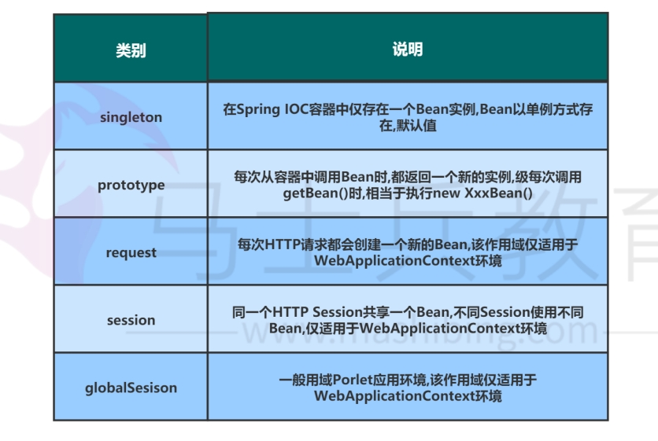
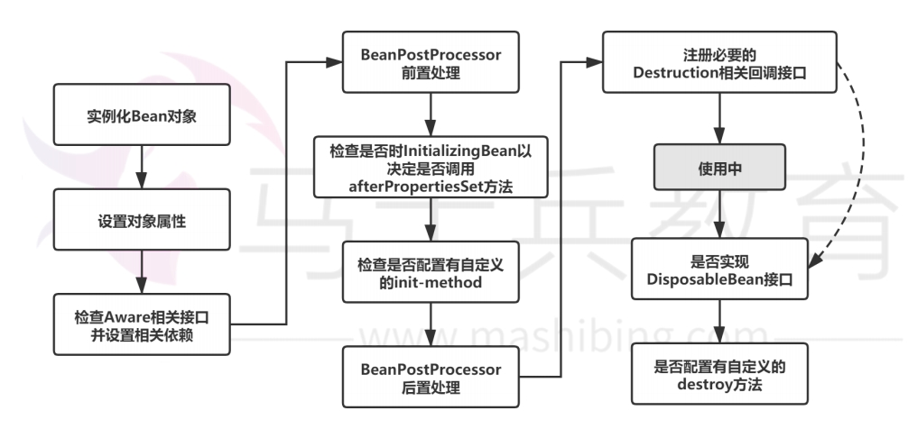
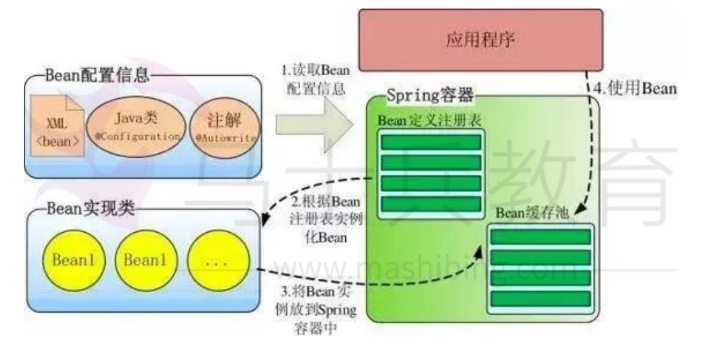
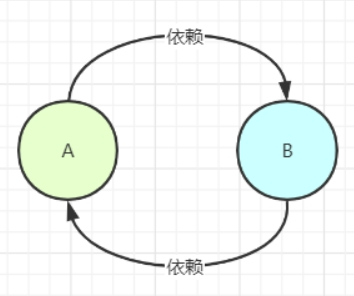
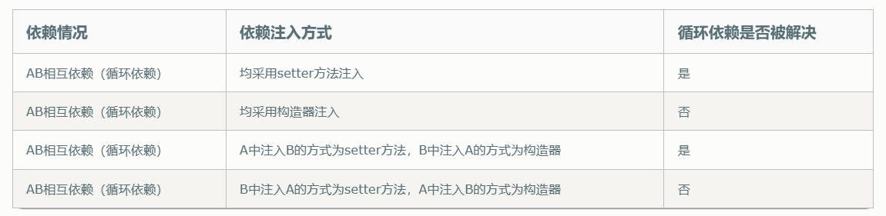
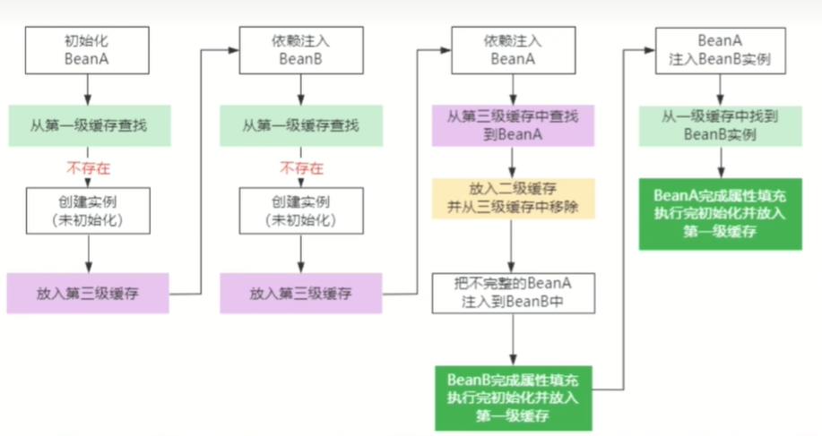
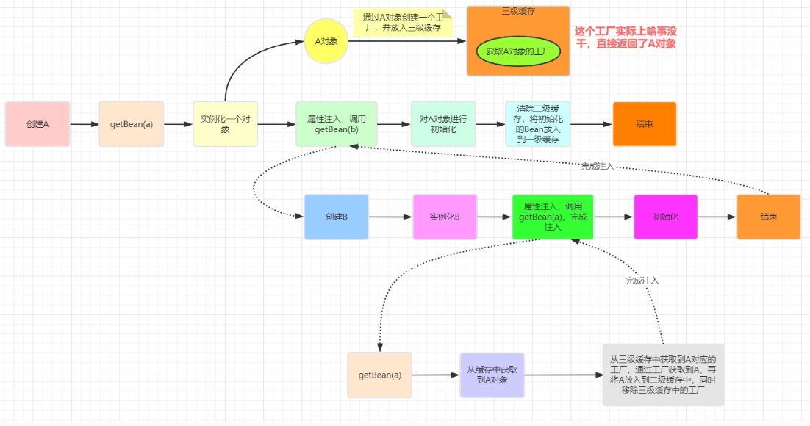
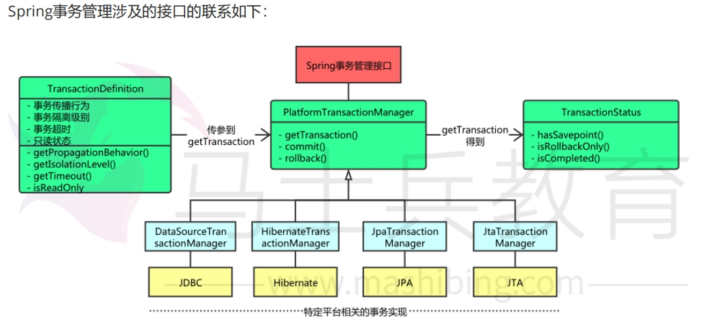

[toc]

# Spring面试题总结1

## 基础部分

### 什么是 Spring Framework？

Spring是一个轻量级Java开发框架。主要用于解决应用开发的业务层和其他各层的耦合问题。从而达到简化java应用开发的目的。

### Spring Framework的常用模块

- Spring Core：提供了框架的基本组成部分，包括控制反转和依赖注入功能。
- Spring beans：提供了BeanFactory，是工厂模式的一个经典实现。
- Spring AOP：提供了面向切面的部分，让你可以自定义切面、切点等。
- Spring Web：提供了针对 Web 开发的部分。

> 使用spring的好处？

- Spring 通过控制反转功能可以实现程序代码的解耦，简化代码的复杂程度。
- Spring 支持面向切面功能，可以把应用业务逻辑和系统服务分开。
- Spring 的IOC容器功能可以管理程序中的对象。

### Spring 提供了哪些配置方式？

1. 基于 xml 配置
bean 所需的依赖项和服务在 XML 格式的配置文件中指定。这些xml配置文件通常包含许多bean定义和配置选项。它们通常以bean标签开头。
例如：
```xml
<bean id="studentbean" class="org.edureka.firstSpring.StudentBean"> 
    <property name="name" value="Edureka"></property>
</bean>
```

2. 基于注解配置
可以通过在相关的类，方法或字段声明上使用注解，将 bean 配置为组件类本身，而不是使用 XML 来描述 bean 装配。**默认情况下Spring 容器中未打开注解装配。因此需要在使用它之前在 Spring 配置文件中启用它。**
例如：开启注解配置
```xml
<beans>
    <context:annotation-config/>
</beans>
```


### Spring中Bean的作用域？

Spring的IOC容器中的bean有5种作用域分别是：singleton（单例）,prototype（原型）,request, session 和 global session。

- singleton 单例模式 : 默认的作用域。IoC容器中只会存在一个共享的Bean实例，无论有多少个 Bean 引用它，始终指向同一对象。该模式在多线程下是不安全的。
- prototype 原型模式：每次通过 IOC 容器获取 bean 时，容器都将创建一个新的 Bean 实例。
- Request : 每一次http请求都会产生一个新的bean实例，并且该 bean实例 仅在当前 HTTP 请求内有效。请求完成后，bean实例就会失效。
- session : 在每一次 Http Session中，容器都会产生一个新的bean实例。该 bean 实例仅在当前 HTTP session内有效。
- global Session 作用和session类似，在一个全局的 Http Session 中，容器会返回该 Bean 的同一个实例。



### Spring中Bean的生命周期？



生命周期流程: 实例化，初始init，接收请求service，销毁destroy；

### Spring框架中的单例bean是线程安全的吗？

Spring中的bean默认是单例模式。单例bean不是线程安全的。

实际上大部分时候 bean 无状态的（比如 dao 类），在某种程度上来说 bean 也是安全的，但如果 bean 有状态的话（比如 view model 对象），那就要开发者自己去保证线程安全了，最简单的就是改变 bean 的作用域。把"singleton"变更为"prototype"，这样请求 bean 相当于 new Bean() 了，所以就可以保证线程安全了。

- 有状态Bean是指保存了数据。
- 无状态Bean就是不会保存数据。

### Spring如何处理线程并发问题？

一般情况下，只有无状态的Bean才是线程安全的。

在Spring中，绝大部分Bean都可以为singleton作用域，因为Spring会对一些Bean中非线程安全状态采用ThreadLocal + 线程同步机制 来进行处理，从而解决有状态的bean的线程安全问题。

> 线程同步机制

线程同步机制采用了“时间换空间”的方式，仅提供一份变量，不同的线程在访问前需要获取锁，没获得锁的线程则需要排队。

> ThreadLocal

ThreadLocal会为每一个线程提供一个独立的变量副本，从而隔离了多个线程对数据的访问冲突。因为每一个线程都拥有自己的变量副本，从而也就没有必要对该变量进行同步了。

### Spring框架中都用到了哪些设计模式?

1. 工厂模式：BeanFactory就是简单工厂模式的体现，用来创建Bean对象的实例；
2. 单例模式：Bean对象的作用域默认为单例模式。
3. 代理模式：Spring的AOP功能用到了JDK的动态代理和CGLIB字节码生成技术；
4. 模板方法：用来解决代码重复的问题。比如RestTemplate, JmsTemplate, JpaTemplate。

## IOC 控制反转

### 什么是IOC

IOC就是控制反转的意思。

以前创建对象的创建和管理是由程序代码把控的，而控制反转就是将对象的创建和管理交给Spring容器来管理。

> IOC的好处

- 通过容器可以实现对象的集中管理。
- 即通过IOC容器让对象与对象之间的依赖关系实现了松耦合。

### IOC的实现方式？

1. Spring 启动时读取配置文件中的Bean对象信息，并在 Spring 容器中生成一份相应的 Bean 配置注册表，
2. 然后根据这张注册表实例化 Bean，装配好 Bean 之间的依赖关系，为上层应用提供准备就绪的运行环境。其中 Bean 缓存池为 HashMap 实现




### 什么是IOC的实现机制？

Spring 中的 IoC 的实现原理就是工厂模式加反射机制。

```java
//接口Fruit
interface Fruit {
    public abstract void eat();
}

//接口实现类Apple
class Apple implements Fruit {
    public void eat(){
        System.out.println("Apple");
    }
}

//接口实现类Orange
class Orange implements Fruit {
    public void eat(){
        System.out.println("Orange");
    }
}
//工厂类
class BeanFactory {
    public static Fruit getInstance(String ClassName) {
        Fruit f=null;
        try {
            //通过类名，反射出某个对象。该对象可以转换为接口Fruit
            f=(Fruit)Class.forName(ClassName).newInstance();
        } catch (Exception e) {
            e.printStackTrace();
        }
        return f;
    }
}
//使用类Test
class Test {
    public static void main(String[] a) {
        //通过工厂模式+反射，来实例化一个对象Fruit
        //此时这个Fruit对象和Test类是松耦合的关系。
        Fruit f=Factory.getInstance("io.github.dunwu.spring.Apple");
        if(f!=null){
            f.eat();
        }
    }
}
```

### 什么是Spring IOC容器？spring 中有多少种 IOC 容器？

IOC容器负责创建对象，管理对象（通过依赖注入（DI），装配对象，配置对象，并且管理这些对象的整个生命周期。

有两种IOC容器，分别是BeanFactory容器和ApplicationContext容器。

* BeanFactory容器 - BeanFactory 就像一个包含 bean 集合的工厂类。它会在客户端要求时实例化 bean。
* ApplicationContext容器  - ApplicationContext 接口扩展了 BeanFactory 接口。它在 BeanFactory 基础上提供了一些额外的功能。例如注解功能。

注意：bean的作用域有singleton(单例)，prototype(普通)，request,session,globalsession。后面3种只有ApplicationContext容器才提供。

### BeanFactory和FactoryBean的区别？

- BeanFactory：Bean工厂，是一个工厂(Factory)，IoC容器的最顶层根接口就是这个BeanFactory，它的作用是管理Bean。比如 ApplicationContext，XmlBeanFactory 等，这些都是指不同的IOC容器。

- FactoryBean 工厂Bean，是一个Bean，作用是产生其他bean实例。FactoryBean只有一个工厂方法，该方法用来返回其他bean实例。

### BeanFactory 和 ApplicationContext 有什么区别？

BeanFactory和ApplicationContext是Spring的两大核心接口。其中ApplicationContext是BeanFactory的子接口

- BeanFactory：可以理解为就是个 HashMap，Key 是 BeanName，
Value 是 Bean 实例。通常只提供注册，获取这两个功能。可以称之为 “低级容器”。
- ApplicationContext 可以称之为 “高级容器”。因为它比 BeanFactory 多了更多的功能。他继承了多个接口。因此具备了更多的功能。

## DI 依赖注入

### 什么是依赖注入(DI)？

依赖注入是用来维护IOC容器中bean与bean之间的依赖关系。

即bean与bean之间的依赖关系由IOC容器来维护，由IOC容器动态地将某种依赖关系的目标对象实例注入到关联的Bean对象之中。

### 依赖注入的方式

依赖注入有4种方式。构造函数注入，setter方法注入，静态工厂注入，实例工厂注入。

> 构造函数注入

通过构造函数，将bean对象注入到另一个bean对象中

```java
public class BookDaoImpl{
    private String message;
    public BookDaoImpl(String message) {
        this.message = message;
    }
}
<bean id="bookDao" class="com.impl.BookDaoImpl">
    <constructor-arg name="message" value="this is a message"/>
</bean>
```

> setter方法注入

通过setter方法，将bean对象注入到另一个bean对象中

```xml
<bean id="bookDao" class="com.xxx.xxxx">
    <property name="username" value="mysql"/>
</bean>
```

### Spring的自动装配有哪些方式？

装配分为手动装配和自动装配。
- 手动装配就是在xml配置文件中，手动显式的将bean与bean装配到一起。例如之前的构造函数注入和setter方法注入。
- 自动装配就是让Spring自动的隐式的将bean与bean装配到一起。

Spring 有五种自动装配的方式。

* no - 默认的方式是不进行自动装配，通过显式设置 ref 属性来进行装配。
* byName - 在配置文件中发现bean的autowire 属性被设置成byname后，spring会装配和该 bean 的成员变量属性具有相同名字的 bean。
* byType - 通过参数类型自动装配，Spring 容器在配置文件中发现 bean 的 autowire 属性被设置成byType，之后容器试图匹配、装配和该bean的属性具有相同类型的bean。如果有多个 bean 符合条件，则抛出错误。
* constructor - 这个方式类似于 byType， 但是要提供给构造器参数，如果没有确定的带参数的构造器参数类型，将会抛出异常。

### Spring 的三级缓存是什么？

Spring将自身的缓存分为一级，二级，三级缓存。

- 一级缓存中存放的是已经实例化好的bean对象，可以被IOC容器直接使用。
- 二级缓存中存放的是原始bean对象，此时的原始bean对象的属性还没有注入到原始bean对象中。
- 三级缓存中存放的是bean对象对应的包装工厂对象，该包装工厂对象是用来创建bean对象的，并将bean对象放到二级缓存中。

总计：三级缓存的设计原则就是把bean的实例化和bean的依赖注入进行分离。通过一级缓存存储完整bean对象，二级缓存存储不完整bean对象，三级缓存存储工厂bean对象。

### Spring 如何如何创建Bean对象？

Spring创建bean对象的步骤如下：例如创建类A的bean对象
1. Spring 先从一级缓存中找出类A的bean对象。如果没有，则先创建类A对应的工厂对象，并放入到三级缓存中。
2. 然后Spring在三级缓存中，通过工厂对象创建出类A的半实例化对象，并放入到二级缓存中。
3. 然后Spring在二级缓存中，对类A的半实例化对象进行依赖注入。依赖注入完成后，形成类A的完整实例化对象，放入到一级缓存中。
4. 然后Spring就可以直接在一级缓存中使用类A的完整实例化对象。

### Spring是如何解决循环依赖问题的？

> 什么是循环依赖？



循环依赖是指类A依赖类B的同时，类B也依赖了类A。

代码层次上的A与B互相依赖。
```java
@Component
public class A {
    // A中注入了B,即A依赖B
	@Autowired
	private B b;
}

@Component
public class B {
    // B中也注入了A,即B依赖A
	@Autowired
	private A a;
}

//--------------
//自身依赖自身，形成循环依赖。
@Component
public class C {
    // C中也注入了C,即C依赖C
	@Autowired
	private C c;
}
```

除此之外，还有其他循环依赖的方式。例如类C依赖类C自身等

> Spring 在什么情况下能解决循环依赖？

Spring解决循环依赖是有前置条件的。
1. 循环依赖中的Bean对象必须是单例模式的。
2. 循环依赖中的Bean对象的依赖注入方式如果全是构造器注入。那么Spring无法解决这种循环依赖。Spring会直接报错。

Spring解决循环依赖的四种情况,如图所示



> Spring 如何解决循环依赖？

Spring主要通过三级缓存的方式来解决循环依赖问题。

网上找到两个类A与类B循环依赖的执行流程图。可参考



大致执行流程如下
1. Spring先从一级，二级，三级缓存中找A的bean对象。都没找到，则创建A的工厂对象到三级缓存中。并通过工厂对象创建A的不完整bean对象。存放到二级缓存中。
2. 然后Spring要对类A的不完整bean对象进行依赖注入。即注入类B的bean对象。
4. 然后Spring在一级，二级，三级缓存中找B的bean对象。都没找到，则创建B的工厂对象到三级缓存中。并通过工厂对象创建B的不完整bean对象。存放到二级缓存中。
5. 然后Spring要对类B的不完整bean对象进入依赖注入，即注入类A的bean对象。
6. 然后Spring在一级，二级，三级缓存中找A的bean对象。结果在二级缓存中找到A的不完整bean对象，将其注入到类B的不完整bean对象中。
7. 此时类B的不完整bean对象完成了依赖注入，并存放到一级缓存中。
8. 最后Spring在一级缓存中找到了类B的完整bean对象。将其注入到类A的不完整bean对象中。
9. 此时类A的不完整bean对象完成了依赖注入，并存放到一级缓存中。


## 注解部分

### @Component,@Repository,@Service,@Controller的区别？

- @Component：用于标注在类上，将类标注为一个普通bean对象。然后IOC容器扫描到该注解后，会将这个bean注入到容器中。
- @Controller：用于标注在类上，将类标注为一个控制层对象,然后注入到IOC容器中。springmvc会扫描使用@Controller注解的类中的方法，并检测方法是被使用了@RequestMapping注解。
- @Service：功能与@Component注解类似。用于标注在service层实现类上，并将类标注为一个service层对象。
- @Repository：功能与@Component注解类似。用于标注在dao层实现类上，并将类标注为一个dao层对象。

### @ResponseBody，@RequestMapping，@PathVariable, @RequestParam，@RequestHeader

@ResponseBody注解
- 用于标注在方法上，用于将方法的返回值转化为json格式，并写入到Response响应对象的body区域中。

@RequestMapping注解
- 标注在类或方法上，用于将请求路径绑定到方法或类上。

@PathVariable注解
- 用于将请求路径中的变量参数，绑定到方法的参数上。

@RequestParam注解
- 用于将请求中的请求数据，绑定到方法的参数上。

@RequestHeader注解
- 将请求header区域的数据绑定到方法的参数上。

### @Autowired和@Resource之间的区别

相同点：
* 两个注解都可以写在属性和setter方法上的。这两个注解都与自动装配有关。

不同点：
* @Autowired是按照类型（byType）装配，来注入依赖对象。如果我们想使用按照名称（byName）来装配，可以结合@Qualifier注解一起使用。
* @Resource默认按照ByName自动注入。如果找不到就按照byType的方式自动注入。

### @Autowired注解自动装配的过程是怎样的？

当IOC容器扫描到@Autowied、@Resource时，就会在IoC容器自动查找需要的bean对象。然后装配给注解所在对象的属性中。

@Autowired注解首先在容器中查询对应类型的bean对象。 
- 如果查询结果刚好为一个，就将该bean装配给@Autowired指定的数据；
- 如果查询的结果不止一个，那么@Autowired会根据名称来查找；
- 如果上述查找的结果为空，那么会抛出异常。

### @Qualifier 注解的作用是什么？

当您创建多个相同类型的 bean 并希望仅使用属性装配其中一个 bean 时，您可以使用 @Qualifier 注解 和 @Autowired 通过指定应该装配哪个确切的 bean 来消除歧义。


## 事务部分

### 什么是事务？

事务是一组逻辑操作，这组操作中的所有命令，要么都执行，要么都不执行。

### 事务的四个特性

事务有四个特性：ACID
- 原子性（Atomicity）：事务的原子性确保事务中的所有命令要么全部完成，要么都不完成。
- 一致性（Consistency）：事务完成前后，业务都处于一致的状态。
- 隔离性（Isolation）：每个事务之间相互独立，相互隔离。
- 持久性（Durability）：一旦事务完成后，事务执行的结果会被持久化。

### Spring的事务实现方式有哪些？

Spring主要支持两种类型的事务管理：
- 编程式事务管理：通过编程的方式管理事务，灵活但是难以维护。
- 声明式事务管理：通过注解和xml配置的方式来管理事务。

> 声明式事务

@Transactional注解标注一个方法。这样的写法相当于在进入方法前，使用BEGIN开启了一个事务，在执行完方法后，使用COMMIT提交事务。

> 编程式事务

在代码中，通过TransactionTemplate工具类来开启事务，提交事务，回滚事务。


### Spring事务的实现方式和实现原理？

Spring并不直接管理事务，而是提供了多种事务管理器。

Spring事务管理器的接口是PlatformTransactionManager根接口，通过这
个接口，Spring为各个平台如JDBC、Hibernate等都提供了对应的事务管理器，但是具体的实现就是各个平台自己的事情了。

因此Spring的事务本质上是调用各个数据持久层框架的事务。




> jdbc事务

如果应用程序中直接使用JDBC来进行持久化,DataSourceTransactionManager会为你处理事务。

实际上，DataSourceTransactionManager 是通过调用java.sql.Connection来管理事务，而后者是通过 DataSource获取到的。通过调用连接的commit()方法来提交事务，同样，事务失败则通过调用 rollback()方法进行回滚。

> Hibernate事务

如果应用程序的持久化是通过Hibernate实习的，那么你需要使用HibernateTransactionManager来进行事务管理。

> Java持久化API事务（JPA）

如果你使用JPA的话，那你需要使用Spring的JpaTransactionManager来处理事务。

> Java原生API事务

如果你没有使用以上所述的事务管理，或者是跨越了多个事务管理源（比如两个或者是多个不同的数据源），你就需要使用JtaTransactionManager

### Spring中事务的传播行为

Spring事务的传播行为（propagation behavior）是指：当一个使用了@Transactional注解的方法调用另一个使用@Transactional注解的方法时，Spring如何对多个事务方法的执行方式进行管理。

Spring定义了七种事务传播行为。

```
PROPAGATION_REQUIRED(默认，必需传播)：存在事务，加入事务；不存在事务，新建事务运行。
PROPAGATION_SUPPORTS(支持传播): 存在事务，加入事务；不存在事务，非事务运行。
PROPAGATION_MANDATORY(强制传播): 存在事务，加入事务，不存在事务，抛出异常。

PROPAGATION_REQUIRES_NEW(新建需求传播): 存在事务，挂起当前事务并创建一个新事务；不存在事务，则新建事务。
PROPAGATION_NOT_SUPPORTED(不支持传播): 总是以非事务方式执行，如果当前存在事务，则挂起事务。
PROPAGATION_NEVER(从不传播): 总是以非事务方式执行，如果当前存在事务，则抛出异常。
PROPAGATION_NESTED(嵌套传播): 存在事务，则嵌套事务;不存在事务，新建事务。

```


#### PROPAGATION_REQUIRED （必需传播）（默认传播行为）

PROPAGATION_REQUIRED ：如果当前没有事务，就创建一个新事务，如果当前存在事务，就加入该事务。

这是Spring默认的事务传播行为。

例子：
```java
//事务属性 PROPAGATION_REQUIRED
public void methodA(){
    methodB();
}
//事务属性 PROPAGATION_REQUIRED
public void methodB(){}
```


> 单独执行方法B

单独执行方法B,那么相当于方法B就变成了一个事务方法。如下代码所示。

```java
public void main(String args[]){
    Connection con=null;
    try{
        con = getConnection();
        con.setAutoCommit(false);
        //方法调用
        methodB();
        //提交事务
        con.commit();
    } Catch(RuntimeException ex) {
        //回滚事务
        con.rollback();
    } finally {
        //释放资源
        closeCon();
    }
}
```

在上面代码中，由于方法B的传播行为是PROPAGATION_REQUIRED，并且之前程序中没有事务的存在。因此Java会单独开启一个事务来管理方法B。


> 如果执行方法A。方法A中又执行了方法B。

执行效果如下

```java
public void main(String args[]){
    Connection con=null;
    try{
        con = getConnection();
        con.setAutoCommit(false);
        //方法调用
        methodA();
        methodB();
        //提交事务
        con.commit();
    } Catch(RuntimeException ex) {
        //回滚事务
        con.rollback();
    } finally {
        //释放资源
        closeCon();
    }
}
```

调用方法A时，此时java环境还没有事务，所以java开启一个新的事务。当在方法A中调用方法B时，java环境中已经有了一个事务，所以方法B就加入当前事务。


#### PROPAGATION_SUPPORTS （支持传播）

PROPAGATION_SUPPORTS：如果当前存在事务，就加入该事务，如果当前不存在事务，就以非事务执行。如果外层的事务回滚，内部事务也要回滚。

例子：
```java
//事务属性 PROPAGATION_REQUIRED
public void methodA(){
    methodB();
}
//事务属性 PROPAGATION_SUPPORTS
public void methodB(){}
```

- 单纯的调用methodB时，由于methodB方法的传播属性是PROPAGATION_SUPPORTS。因此methodB方法是非事务的执行的。
- 当调用methdA时,则methodB加入了methodA的事务中执行。

#### PROPAGATION_MANDATORY （强制传播）

PROPAGATION_MANDATORY ：如果当前存在事务，就加入该事务，如果当前不存在事务，就抛出异常。

例子：
```java
//事务属性 PROPAGATION_REQUIRED
public void methodA(){
    methodB();
}
//事务属性 PROPAGATION_MANDATORY
public void methodB(){}
```

- 单纯的调用methodB时，由于methodB方法的传播属性是PROPAGATION_MANDATORY。因此methodB方法会抛出异常。
- 当调用methodA时,则methodB加入了methodA的事务中执行。

#### PROPAGATION_REQUIRES_NEW （新建需求传播）

PROPAGATION_REQUIRES_NEW ：如果之前不存在事务，则创建一个新事务。如果当前存在一个事务A，则将该事务A暂停。并且新创建一个事务B，当事务B执行完后，再执行事务A。


例子：
```java
//事务属性 PROPAGATION_REQUIRED
public void methodA(){
    methodB();
}
//事务属性 PROPAGATION_REQUIRES_NEW
public void methodB(){}
```

- 单纯的调用methodB时，由于methodB方法的传播属性是PROPAGATION_REQUIRES_NEW。因此java会创建一个新事务来执行methodB。
- 当调用methodA时,java会先创建一个事务A来执行methodA。当调用methodB的时候，会将事务A暂停，然后在事务A中创建另一个事务B，用这个事务B来执行methodB。当事务B执行完后，再执行事务A。

如下所示
```java
public void main(String args[]){
    TransactionManager tm = null;
    try{
        //获得一个JTA事务管理器
        tm = getTransactionManager();
        tm.begin();//开启一个新的事务
        Transaction ts1 = tm.getTransaction();
        doSomeThing();
        tm.suspend();//挂起当前事务
        try{
            tm.begin();//重新开启第二个事务
            Transaction ts2 = tm.getTransaction();
            methodB();
            ts2.commit();//提交第二个事务
        } Catch(RunTimeException ex) {
            ts2.rollback();//回滚第二个事务
        } finally {
            //释放资源
        }
        //methodB执行完后，恢复第一个事务
        tm.resume(ts1);
        doSomeThingB();
        ts1.commit();//提交第一个事务
    } catch(RunTimeException ex) {
        ts1.rollback();//回滚第一个事务
    } finally {
        //释放资源
    }
}

```


#### PROPAGATION_NOT_SUPPORTED (不支持传播)

PROPAGATION_NOT_SUPPORTED : 总是以非事务方式执行操作，如果当前存在事务，就把当前事务挂起。

例子：
```java
//事务属性 PROPAGATION_REQUIRED
public void methodA(){
    methodB();
}
//事务属性 PROPAGATION_NOT_SUPPORTED
public void methodB(){}
```

- 单纯的调用methodB时，methodB方法以非事务的方式运行。
- 当调用methodA时,则methodB会暂停methodA的事务，当methodB执行结束后，methodA的事务继续执行。

#### PROPAGATION_NEVER （从不传播）

PROPAGATION_NEVER ：总是以非事务方式执行，如果当前存在事务，则抛出异常。

例子：
```java
//事务属性 PROPAGATION_REQUIRED
public void methodA(){
    methodB();
}
//事务属性 PROPAGATION_NEVER
public void methodB(){}
```

- 单纯的调用methodB时，methodB方法以非事务的方式运行。
- 当调用methodA时,则methodB会抛出异常。


#### PROPAGATION_NESTED （嵌套传播）

PROPAGATION_NESTED ：如果当前存在事务，则在嵌套事务内执行。如果当前没有事务，则按PROPAGATION_REQUIRED传播属性执行。

嵌套事务：嵌套事务就是事务中的事务。并且外层事务的回滚可以引起内层事务的回滚。而内层事务的异常并不会导致外层事务的回滚，这就是一个嵌套事务。

例子：
```java
//事务属性 PROPAGATION_REQUIRED
public void methodA(){
    methodB();
}
//事务属性 PROPAGATION_NESTED
public void methodB(){}
```

- 单纯的调用methodB时，methodB方法以事务的方式运行。
- 当调用methodA时,则methodB会以一个嵌套事务的方式运行。

### Spring的事务隔离级别？

当多个事务访问相同数据会产生脏写，脏读，幻读，不可重复读等问题。事务的隔离级别就是用于解决这些问题的。

Spring 有五大隔离级别，默认值为 ISOLATION_DEFAULT（使用数据库的设置），其他四个隔离级别和数据库的隔离级别一致。

在spring中通过设置事务的隔离级别，从而可以解决上述问题。

- default 默认隔离级别，是直接使用数据库的事务隔离级别。
- read_uncommited 读未提交隔离级别，最低的隔离级别。用于解决脏写问题。
- read_commited 读已提交隔离级别，用于解决脏写和脏读问题。
- repeatable_read 可重复读隔离级别，用于解决脏写，脏读，不可重复读问题。
- serlalizable 串行化，最高的隔离级别，用于解决脏写，脏读，不可重复度，幻读问题。

注意：隔离级别不是设置的越高越好，隔离级别越高，spring事务执行越复杂，效率越低。

### 不可重复读和幻读的区别

不可重复读的重点是修改。即同样的条件, 你读取过的数据, 再次读取出来发现值不一样了。在一个事务中前后两次读取的结果并不一致，导致了不可重复读。

幻读的重点在于新增或者删除。即同样的条件, 第1次和第2次读出来的记录数不一样。


从总的结果来看, 似乎不可重复读和幻读都表现为两次读取的结果不一致。但如果你从控制的角度来看,两者的区别就比较大。
- 对于不可重复读, 只需要锁住满足条件的记录。
- 对于幻读, 要锁住满足条件及其相近的记录。

### 如何使用编程式事务？

Spring提供两种方式的编程式事务管理。
- 使用TransactionTemplate
- 使用PlatformTransactionManager


## AOP部分

### 什么是 AOP？

AOP是面向切面编程。AOP将代码分为两个部分：核心关注点和横切关注点。

业务相关的代码是核心关注点，与之关系不大的部分代码是横切关注点。横切关注点的一个特点是，它们经常发生在核心关注点的多处。比如权限认证、日志记录，事务处理等。

AOP的作用是将那些与业务无关的公共行为和逻辑，封装为一个可重用的模块。将业务代码和公共代码分离开来，从而降低了代码间的复杂度和耦合度。

### AOP的使用场景有哪些？

AOP 主要使用场景有：
1. Authentication 权限认证
2. Caching 缓存
3. Context passing 内容传递
4. Error handling 错误处理
5. Lazy loading 懒加载
6. Debugging 调试
7. logging 日志记录
8. Performance optimization 性能优化
9. Persistence 持久化
10. Resource pooling 资源池
11. Synchronization 同步
12. Transactions 事务处理

### 什么是Aspect切面？

切面就是与业务无关的公共逻辑代码。例如日志记录代码，权限认证代码等。

### 什么是连接点？

连接点是指被拦截到的点，即就是切面代码需要插入到业务代码的位置。例如某个方法被调用的时候。

在 Spring 中连接点指的就是被拦截到的方法调用的时候。

### 什么是切入点？

切入点代指一个或多个连接点。通常是多个方法名称，或是正则表达式匹配的方法名称来指定这些切入点。

通知将在切入点的位置执行。

### 什么是通知？

通知是指在方法执行前或执行后要做的动作。

### 什么是织入？

织入是把切面应用到目标对象并创建新的代理对象的过程。

代理对象 = 目标对象 + 切面。

### Spirng中的AOP有哪些通知类型？

Spring切面可以应用5种类型的通知：
1. 前置通知（Before）：在目标方法被调用之前调用通知功能；
2. 后置通知（After）：在目标方法完成之后调用通知，此时不会关心方法的输出是什么；
3. 返回通知（After-returning ）：在目标方法成功执行之后调用通知；
4. 异常通知（After-throwing）：在目标方法抛出异常后调用通知；
5. 环绕通知（Around）：通知包裹了被通知的方法，在被通知的方法调用之前和调用之后执行自定义的行为。

### AOP的实现方式是什么？

AOP实现的关键在于代理模式，主要分为静态代理和动态代理。静态代理的代表为AspectJ；动态代理则以Spring AOP为代表。

1. 静态代理，就是AOP框架会在编译阶段生成AOP代理类，它会在编译阶段将AspectJ(切面)织入到Java字节码中，运行的时候就是增强之后的AOP对象。
2. 动态代理，就是说AOP框架不会去修改字节码，而是每次运行时在内存中临时为方法生成一个AOP对象，这个AOP对象包含了目标对象的全部方法，并且在特定的切点做了增强处理，并回调原对象的方法。

动态代理可以理解为AOP会生成一个代理对象，代理对象 = 目标对象 + 增强对象。

### JDK动态代理和CGLIB动态代理的区别？

Spring AOP中的动态代理主要有两种方式，JDK动态代理和CGLIB动态代理。

