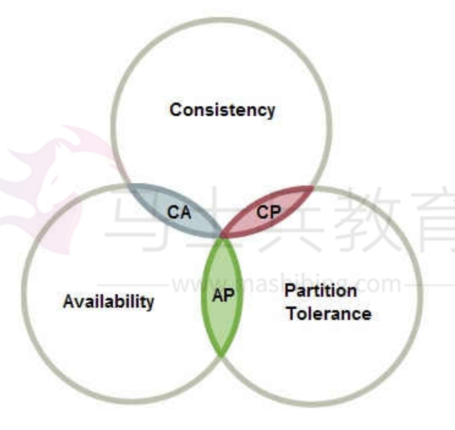

[toc]

# 微服务面试题总结

## 什么是微服务？

微服务架构是一种架构模式或者说是一种架构风格。

微服务提倡将单一应用程序划分为一个个的服务，每个服务运行在其独立的自己的进程中，服务之间相互协调、互相配合，最终实现系统中的功能。

微服务中服务与服务之间采用轻量级的通信机制互相沟通,每个服务都围绕着具体的业务进行构建，并且能够被独立的构建在生产环境、类生产环境等。

## 微服务架构一般都遵循什么原则？

1. 单一职责原则：服务与服务之间互相独立。每个服务只处理自己的业务。做到高内聚，低耦合。
2. 独立性原则：每个服务都能做到独立开发，独立测试，独立部署，独立运行。让服务与其他服务进行解耦。
3. 轻量通信原则：服务与服务之间的通信调用是轻量级的，并且能够跨平台，跨语言的。

## 微服务架构会出现的问题有哪些？

在微服务架构下，系统往往会出现各种问题。例如
- 服务之间如何知晓其他的服务信息？
- 服务的配置如何管理
- 服务之间如何互相调用？
- 当系统中的服务出现了故障，该如何处理？
- 服务与服务之间的分布式事务问题，如何解决？

而为了解决上面的问题，也出现了许多解决方案。例如SpringCloudNetflix,SpringCloudAlibaba等。这些解决方案使用的框架如下。

- 服务的注册与发现：eureka,Nacos
- 服务之间的互相调用：Ribbon,openFeign
- 服务熔断降级组件：Hystrix,Sentinel
- API网关：Zuul,SpringCloudGateway
- 服务的配置中心：SpringCloudConfig
- 链路追踪：skywalking
- 分布式事务：Seata

## 如何设计一个服务注册中心，需要哪些功能？

服务注册本质上就是维护一个注册表。它管理系统内所有服务的信息。当新的服务启动后，它会向注册表提交自己的信息。

如果某个服务需要调用其他服务，那么直接通过查询注册表获取其他服务的信息即可。

服务注册必须要做到以下几点。
- 服务注册接口：把服务注册到注册中心的功能。
- 服务心跳接口：检测注册中心的服务是否有效或者网络是否连通。
- 服务下线接口：把服务从注册中心中下线。
- 服务剔除接口：注册中心将无效的服务，从注册中心表中删除的功能。
- 查询服务接口：给其他服务提供注册中心的注册表的信息。
- 注册表同步接口：当注册中心是集群的时候，提供一个互相之间同步注册表的接口。

## 什么是API网关？

API网关 是一个服务器，也是客户端进入系统的入口节点。

所有来自客户端的请求都要先经过 API网关，然后API网关把客户端请求路由到对应的微服务。

API网关的安全认证方式如下：
1. 基于 Token 的客户端访问控制和安全策略
2. 传输数据和报文加密，到服务端解密。需要客户端有独立的 SDK 代理包
3. 基于 Https 的传输加密，客户端和服务端数字证书支持
4. 基于 OAuth2.0 的服务安全认证（授权码，客户端，密码模式等）

## 什么是服务熔断？

在微服务架构中一个业务功能通常有多个服务的参与。当服务A故障的时候，为了让服务A的故障不影响到整个系统。让服务A熔断，即让服务A返回一个故障结果。直到服务A恢复为之。

## 什么是服务降级？

服务降级是指，当某个服务A的负载过高的时候，为了不让服务A故障。通过给服务A进行限流的方式。从而让这个服务A的负载恢复正常。从而不影响到整个系统。

## CAP定理

分布式系统一般有三个指标：
-  Consistency（一致性）
-  Availability（可用性）
-  Partition tolerance（分区容错性）

CAP定理是指，一个分布式系统中无法同时满足C一致性,A可用性,P分区容错性。

### CAP定理介绍

CAP定理：
-  Consistency（一致性）
-  Availability（可用性）
-  Partition tolerance（分区容错性）

> Consistency（一致性）

一致性是指：分布式系统中的任意节点的数据都是一致的。

例如主从数据备份，当主机数据发生改变的时候，从机数据要及时同步。从而达到数据一致性。

> Availability（可用性）

可用性是指：分布式系统中的任意服务节点都是可用的。也就是没有故障节点。
就算有故障节点，也要及时恢复或屏蔽故障节点。

下图就不满足可用性

> Partition tolerance（分区容错性）

分区是指，当系统中由于网络故障或者其他原因，导致部分节点与其他节点失去连接，从而产生了分区。

容错是指，当系统中产生分区的时候，整个系统也要对外持续提供服务。

如图，node03节点与其他节点失去连接，从而产生了分区。并且由于其他两个节点的数据更新了，也让node03节点的数据与其他节点不一致了。

### CAP原则的三种取舍策略

由于分布式系统中无法同时满足C一致性,A可用性,P分区容错性。那么取舍的策略就共有三种。

- CA：保障C（一致性）和A（可用性），不要求P（不允许分区）。CA相当于放弃了系统的扩展性，也就是分布式节点受限。传统的关系型数据库Oracle、MySQL就是CA。

- CP：保障C（一致性）和P（不允许分区），不要求A（可用性）。CP相当于每个数据都需要在服务器之间保持一致。设计成CP的系统其实不少，最典型的就是分布式数据库，如Redis、HBase等。

- AP：保障A（可用性）和P（不允许分区），不要求C（一致性）。AP相当于为了高可用，每个节点只能用本地数据提供服务，而这样会导致全局数据的不一致性。

CAP原则的三种取舍策略，一般根据业务场景来做出选择。

- 对于大多数互联网应用来说，因为机器数量多，部署节点分散，网络故障是常态，可用性是必须需要保证的，所以只有舍弃一致性来保证服务的AP。通常吹嘘5个9或6个9服务基本都是放弃C选择AP。
- 对于银行需要确保一致性的场景。通常会选择CA和CP模型。CA模型网络故障时完全不可用，CP模型具备部分可用性，实际的选择需要通过业务场景来权衡。

## BASE理论

BASE理论是基于CAP定理逐步演化而来的。其核心思想是即使无法做到强一致性，但可以采用适当的方式来使系统达到最终一致性。

BASE理论包含三个子理论：
- Basically Available（基本可用）
- Soft state（软状态）
- Eventually consistent（最终一致性）

> Basically Available（基本可用）

基本可用是指：分布式系统出现故障的时候，能够保证核心节点可用。

> Soft state（软状态）

软状态是指：允许分布式系统中的节点互相进行数据同步的过程存在延时状态。

> Eventually consistent（最终一致性）

最终一致性是指：无法保证系统的数据是实时一致的。但是可以保证系统在经过一段时间的数据同步后，最终能够达到一个一致的状态。

## 分布式锁的实现方式

分布式锁是控制分布式系统之间同步访问共享资源的一种方式。

分布式锁的实现方式有：
1. 基于数据库的方式（唯一索引）
2. 基于缓存的方式（redis）
3. 基于Zookeeper的方式

### 基于数据库的唯一索引实现分布式锁

利用数据库的唯一索引来实现分布式锁，即唯一索引的互斥性。

例如lock字段是唯一的，不能重复的。

多个线程在执行业务逻辑之前，同时先向数据库插入一条记录。并且多个线程插入的lock是相同的。那么只有一个线程才能成功插入记录，其余线程插入记录失败。

插入记录成功的线程就相当于拿到了锁。插入记录失败的线程就没有拿到锁。

拿到锁的线程，可以继续执行自己的业务逻辑。当线程执行完业务逻辑后，将插入的记录删除即可，这样可以让其他线程来插入记录。

PS: 这个lock字段一般是唯一索引，即没有重复值。lock字段的值可以设置为线程执行的方法名。

### 基于Redis实现分布式锁

一般Redis实现分布式锁，都是利用`SETNX key value`这个命令。即setnx命令的互斥性。

这个命令是指：当redis数据库中key不存在时才会执行成功，如果key已经存在则命令执行失败。

多线程执行相同的setnx命令，只有一个线程会执行成功，相当于拿到了锁。当线程执行完业务逻辑，就把key-value删除，相当于释放了锁。从而让其他线程继续执行setnx命令。

### 基于Zookeeper的方式

Zookeeper实现分布式锁，主要是通过在Zookeeper中创建瞬时节点，利用节点不能重复创建的特性来保证互斥性。

原理与上面两种方式相同。

## 分布式事务解决方案有哪些？

关于分布式事务的解决方案。典型方案包括：
1. 两阶段提交（2PC, Two-phase Commit）方案
2. eBay 事件队列方案
3. TCC 补偿模式
4. 缓存数据最终一致性

### 2PC方案：强一致性

2PC的核心原理是通过将事务进行分阶段提交和记日志的方式来实现分布式事务的。

记录下事务提交所处的阶段状态，在组件宕机重启后，可通过日志恢复事务提交的阶段状态，并在这个状态节点重试

### eBay 事件队列方案: 最终一致性

它的核心思想是将需要分布式处理的任务通过消息或者日志的方式来异步执行，消息或日志可以存到本地文件、数据库或消息队列。

如果系统发生故障，那么可以通过业务规则进行失败重试，它要求各服务的接口是幂等的。

### TCC （Try-Confirm-Cancel）补偿模式: 最终一致性

如图所示由服务 A、服务B、服务C、服务D 共同组成的一个微服务架构系统。服务A 需要依次
调用服务B、服务C 和服务D 共同完成一个操作。当服务A 调用服务D 失败时，若要保证整个系统数据的一致性，就要对服务B 和服务C 的invoke 操作进行回滚，执行反向的revert 操作。回滚成功后，整个微服务系统是数据一致的。

TCC方案的实现关键：
1. 服务调用链必须被记录下来。
2. 每个服务提供者都需要提供一组业务逻辑相反的操作，互为补偿，同时回滚操作要保证幂等。
3. 必须按失败原因执行不同的回滚策略。

### 缓存数据: 最终一致性

如何解决缓存和数据库数据不一致的问题。有以下两种解决方案：
1. 为缓存数据设置过期时间。当缓存中数据过期后，业务系统会从数据库中获取数据，并将新值放入缓存。这个过期时间就是系统可以达到最终一致的容忍时间。
2. 更新数据库数据后同时清除缓存数据。数据库数据更新后，同步删除缓存中数据，使得下次直接从数据库中获取，并同步到缓存。

