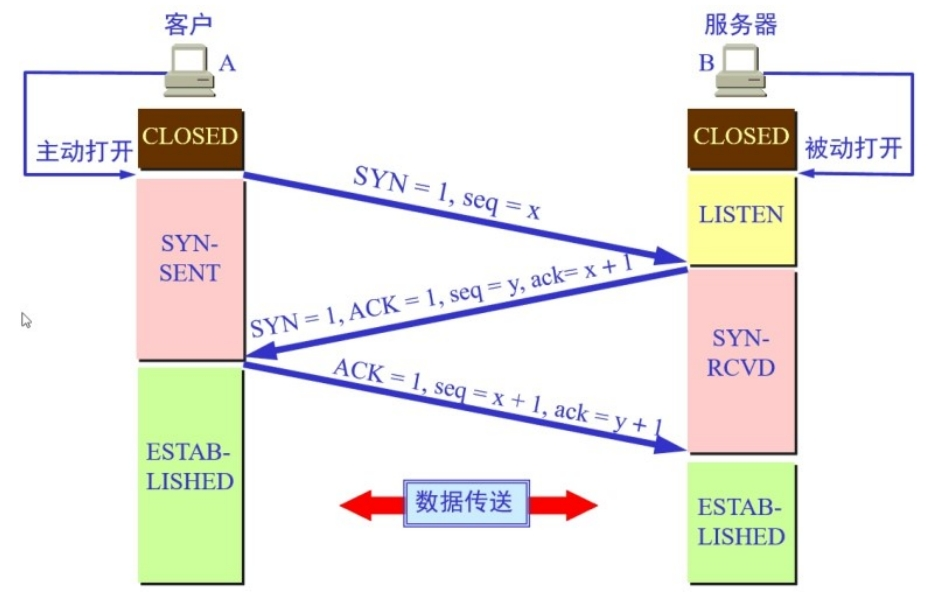

[toc]

# 计算机网络面试题总结

## 为什么要对网络协议分层？

- 易于实现和维护。
- 各层之间相互独立，当其中一层的技术变化时，其他层不受影响。
- 通过对网络协议分层。可以将大问题分割为小问题，简化了网络问题的难度和复杂度。

## 为什么TCP建立连接的时候是3次握手？

TCP连接中3次握手的本质是确认通信双方收发数据的能力。

假设客户端和服务端是进行TCP建立连接的双方。
1. 第一次握手，客户端向服务端发送请求。如果服务端收到了，那么表示服务端知道了客户端的发送和服务端的接收能力是OK的。
2. 第二次握手，服务端向客户端发送请求。如果客户端收到了，那么表示客户端知道了客户端的发送接收和服务端的发送接收能力是OK的。
3. 最后，服务端还不清楚服务端的发送和客户端的接收能力是否OK。因此需要进行第三次握手。客户端向服务端发送请求。如果服务端收到了，那么表示服务知道了服务端的发送接收和客户端的接收能力是OK的。

通过3次握手，让客户端和服务端知道了双方的发送和接收能力都是OK。因此双方就可以正式进行数据传输了。

TCP连接的3次握手图。

## 为什么TCP关闭连接的时候是4次挥手？

因为只有在客户端和服务端都没有数据要发送的时候才能断开TCP连接。

假设客户端和服务端是进行TCP建立连接的双方。
1. 第一次挥手，客户端数据传输完后，发送关闭请求给服务端。
2. 第二次挥手，当服务端接收到客户端的关闭请求后，给客户端发送确认请求。表示知道了。
3. 第三次挥手，服务端会将数据传输完后，开始向客户端发送关闭请求。
4. 第四次挥手，客户端收到服务端的关闭请求后，会向服务端发送确认请求。表示知道了。然后等待2MSL时间后，客户端关闭TCP连接。
5. 当服务端收到客户端发来的确认请求后，服务端关闭TCP连接。

## 为什么客户端发出第四次挥手的确认报文后要等2MSL的时间才能释放TCP连接？

如果第四次挥手的报文丢失，服务端没收到确认报文就会重发第三次挥手的报文，这样报文一去一回长时间就是2MSL，所以需要等2MSL的时间来确认服务端收到了确认报文。

## HTTP 与 HTTPS 的区别是什么?

HTTP 和 HTTPS是一个在服务端和客户端之间传输文字、图片、音频、视频等超文本数据的约定和规范。

HTTP
- 协议：运行在 TCP 之上，明文传输，客户端与服务器端都无法验证对方的身份。
- 端口：80
- 加密：无
- 安全性：弱

HTTPS
- 协议：运行于 SSL 上，SSL 运行于 TCP 之 上， 是添加了加密和认证机制的 HTTP。
- 端口：443
- 加密：共享密钥加密和公开密钥加密并用的混合加密机制
- 安全性：强

## GET和POST区别

- Get是不安全的，因为在传输过程，数据被放在请求的URL中；Post的所有操作对用户来说都是不可见的。
- Get请求提交的url中的数据最多只能是2048字节。Post请求则没有大小限制。
- GET请求会产生一个TCP数据包；POST请求会产生两个TCP数据包。
  - 对于GET方式的请求，浏览器会把http header和data一并发送出去，服务器响应200（返回数据）；
  - 而对于POST，浏览器先发送header，服务器响应100 continue，浏览器再发送data，服务器响应200 ok（返回数据）。

