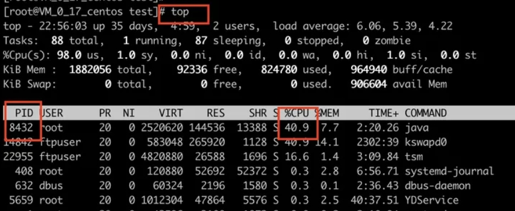

[toc]

# 项目经验面试题总结

## 当发现服务器的CPU占用过高怎么办？

这道面试题主要是部署运维方面的。

问题要点：
1. 如何查询Linux服务器的CPU占比情况？
2. 如何定位到产生问题的Java代码所在线程是什么？
3. 如何判断出当前问题线程到底在执行什么方法?

① 通过`TOP`命令找到占用CPU高的Java进程



② 通过`jps -lv`命令可以查询所有的java进程和所属的java服务。

```shell
jps -lv
```

③ 通过`top -H -p 进程号`命令可以查询进程中线程的使用情况。

```shell
# 可以查询出进程中占用CPU高的线程
top -H -p 8432
```

由于Java是多线程程序。可以通过这个命令，找出CPU占用过高的java线程。


④ 通过`jstack`命令，打印出线程具体信息。

```shell
## 输出线程ID为8432的信息，到info.log文件中
jstack 8432 >> info.log
```

⑤ 打开刚刚生成的日志文件info.log。并在日志文件中，通过16进制的线程ID号。来定位线程正在执行的方法是什么。

```shell
## 先通过下面的命令，将线程ID号转换为16进制。
printf "%x\n" 8432

## 然后打开日志文件。在日志文件中根据16进制的线程ID号，来搜索。
```


